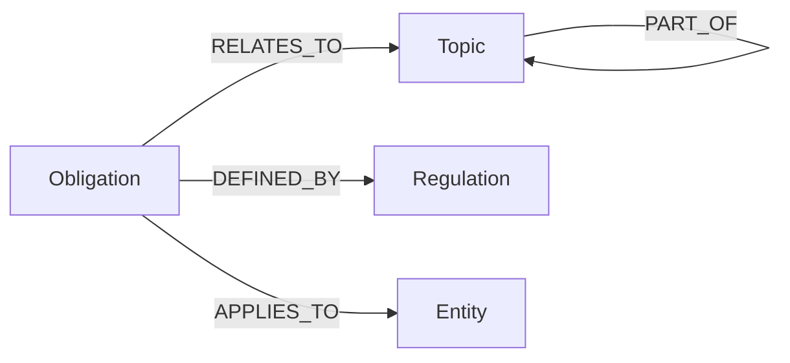
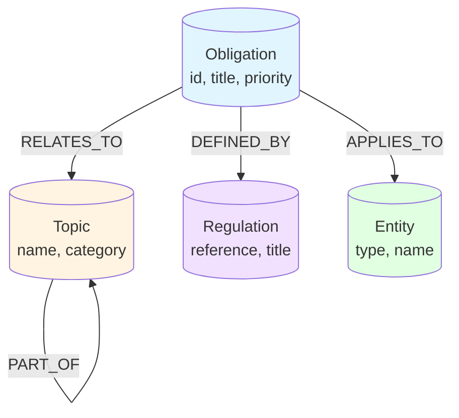

# Neo4j Schema Documenter

## Purpose

Automatically generate comprehensive markdown documentation from Neo4j database schemas including node types, relationships, properties, and visual diagrams. Helps developers understand graph structure and write effective Cypher queries.

## When to Use

- Onboarding new developers
- After schema changes/migrations
- Creating API documentation
- Quarterly documentation updates
- Before major refactoring
- Explaining data model to stakeholders

## Your Neo4j Databases

| Database | MCP Tool Prefix | Purpose |
|----------|----------------|---------|
| **Apex** | `mcp__neo4j-apex__*` | Regulatory Obligations |
| **PSPS** | `mcp__neo4j-psps__*` | LGPS Scheme Rules |
| **CMS Handbook** | `mcp__neo4j-cms-handbook__*` | CMS Guidance |
| **Scheme Docs** | `mcp__neo4j-scheme-docs__*` | Scheme Documentation |

## Documentation Generation Workflow

### Step 1: Extract Schema

```
# Get schema for database
mcp__neo4j-apex__get_neo4j_schema(sample_size=1000)

# Returns:
# - Node labels
# - Relationship types
# - Properties for each node/relationship
# - Indexes
# - Constraints
```

### Step 2: Organize Schema Information

```markdown
## Schema Structure Template

### Node Labels
[List all node types]

### Relationship Types
[List all relationship types]

### Properties
[Properties for each node/relationship]

### Indexes
[Performance indexes]

### Constraints
[Uniqueness constraints]
```

### Step 3: Generate Documentation

**Documentation template**:

````markdown
# [Database Name] Neo4j Schema Documentation

**Generated**: [Date]
**Sample Size**: [N nodes sampled]
**Purpose**: [Database purpose]

## Overview

[Brief description of what this database contains]

**Key Statistics**:
- Node Labels: [Count]
- Relationship Types: [Count]
- Total Properties: [Count]
- Indexes: [Count]
- Constraints: [Count]

## Graph Structure

### Visual Overview



## Node Types

### Obligation

**Purpose**: Represents regulatory obligations that pension schemes must meet

**Properties**:
| Property | Type | Required | Description |
|----------|------|----------|-------------|
| id | String | Yes | Unique identifier |
| title | String | Yes | Obligation title |
| description | String | No | Detailed description |
| deadline_type | String | No | annual, quarterly, event-driven |
| penalty | String | No | Consequences of non-compliance |
| source_regulation | String | Yes | Reference to source regulation |
| priority | Integer | No | 1-5, higher = more critical |

**Example**:
```cypher
(:Obligation {
  id: "obl_001",
  title: "Submit Scheme Return",
  description: "Annual return to TPR within 7 months of scheme year end",
  deadline_type: "annual",
  penalty: "Fine up to £5,000",
  source_regulation: "Pensions Act 2004, s58",
  priority: 5
})
```

**Relationships**:
- `RELATES_TO → Topic`: What area this obligation covers
- `DEFINED_BY → Regulation`: Source regulation
- `APPLIES_TO → Entity`: Who must comply

**Query Examples**:
```cypher
// Find all obligations related to annual reporting
MATCH (o:Obligation)-[:RELATES_TO]->(t:Topic {name: 'Annual Reporting'})
RETURN o.title, o.deadline_type, o.priority
ORDER BY o.priority DESC

// Find obligations with highest priority
MATCH (o:Obligation)
WHERE o.priority = 5
RETURN o.title, o.source_regulation
```

### Topic

**Purpose**: Categorizes obligations by subject area

**Properties**:
| Property | Type | Required | Description |
|----------|------|----------|-------------|
| name | String | Yes | Topic name |
| description | String | No | Topic description |
| category | String | No | High-level category |

**Example**:
```cypher
(:Topic {
  name: "Annual Reporting",
  description: "Requirements for annual scheme reporting",
  category: "Governance"
})
```

**Relationships**:
- `← RELATES_TO - Obligation`: Obligations in this topic
- `PART_OF → Topic`: Hierarchical topics (parent topic)

### Regulation

**Purpose**: Source regulations and legislation

**Properties**:
| Property | Type | Required | Description |
|----------|------|----------|-------------|
| reference | String | Yes | Regulation reference |
| title | String | Yes | Regulation title |
| effective_date | Date | No | When regulation came into force |
| url | String | No | Link to full text |

**Example**:
```cypher
(:Regulation {
  reference: "LGPS Regs 2013, Reg 30",
  title: "Normal pension age",
  effective_date: "2014-04-01",
  url: "https://www.legislation.gov.uk/..."
})
```

### Entity

**Purpose**: Entities that obligations apply to

**Properties**:
| Property | Type | Required | Description |
|----------|------|----------|-------------|
| type | String | Yes | pension scheme, trustee, employer |
| name | String | No | Specific entity name |

**Example**:
```cypher
(:Entity {
  type: "pension scheme",
  name: null
})
```

## Relationship Types

### RELATES_TO

**Direction**: `Obligation → Topic`

**Purpose**: Links obligations to subject areas

**Properties**: None

**Example**:
```cypher
(:Obligation {title: "Submit Scheme Return"})
  -[:RELATES_TO]->
(:Topic {name: "Annual Reporting"})
```

### DEFINED_BY

**Direction**: `Obligation → Regulation`

**Purpose**: Links obligations to source regulations

**Properties**: None

**Example**:
```cypher
(:Obligation {title: "Submit Scheme Return"})
  -[:DEFINED_BY]->
(:Regulation {reference: "Pensions Act 2004, s58"})
```

### APPLIES_TO

**Direction**: `Obligation → Entity`

**Purpose**: Specifies who must comply

**Properties**: None

**Example**:
```cypher
(:Obligation {title: "Submit Scheme Return"})
  -[:APPLIES_TO]->
(:Entity {type: "pension scheme"})
```

### PART_OF

**Direction**: `Topic → Topic`

**Purpose**: Hierarchical topic structure

**Properties**: None

**Example**:
```cypher
(:Topic {name: "Annual Benefit Statements"})
  -[:PART_OF]->
(:Topic {name: "Member Communications"})
```

## Indexes

Performance indexes for common queries:

```cypher
// Index on Obligation.id for fast lookups
CREATE INDEX obligation_id_idx FOR (o:Obligation) ON (o.id);

// Index on Obligation.priority for sorted queries
CREATE INDEX obligation_priority_idx FOR (o:Obligation) ON (o.priority);

// Index on Topic.name for topic searches
CREATE INDEX topic_name_idx FOR (t:Topic) ON (t.name);

// Index on Regulation.reference for regulation lookups
CREATE INDEX regulation_ref_idx FOR (r:Regulation) ON (r.reference);
```

## Constraints

Uniqueness constraints:

```cypher
// Obligation ID must be unique
CREATE CONSTRAINT obligation_id_unique FOR (o:Obligation) REQUIRE o.id IS UNIQUE;

// Topic names must be unique
CREATE CONSTRAINT topic_name_unique FOR (t:Topic) REQUIRE t.name IS UNIQUE;

// Regulation references must be unique
CREATE CONSTRAINT regulation_ref_unique FOR (r:Regulation) REQUIRE r.reference IS UNIQUE;
```

## Common Query Patterns

### Find Obligations by Priority

```cypher
MATCH (o:Obligation)
WHERE o.priority >= 4
RETURN o.title, o.description, o.priority
ORDER BY o.priority DESC
```

### Find All Obligations for a Topic

```cypher
MATCH (o:Obligation)-[:RELATES_TO]->(t:Topic)
WHERE t.name = 'Annual Reporting'
RETURN o.title, o.deadline_type, o.source_regulation
```

### Find Regulatory Source for Obligation

```cypher
MATCH (o:Obligation {title: 'Submit Scheme Return'})-[:DEFINED_BY]->(r:Regulation)
RETURN r.reference, r.title, r.effective_date
```

### Find All Topics Under Category

```cypher
MATCH (child:Topic)-[:PART_OF*]->(parent:Topic {category: 'Governance'})
RETURN child.name, parent.name
```

### Path Between Obligation and Regulation

```cypher
MATCH path = (o:Obligation)-[*1..3]-(r:Regulation)
WHERE o.id = 'obl_001'
RETURN path
```

## Schema Evolution

### Version History

| Version | Date | Changes |
|---------|------|---------|
| 1.0 | 2024-01-15 | Initial schema |
| 1.1 | 2024-03-20 | Added `Obligation.priority` property |
| 1.2 | 2024-06-10 | Added `PART_OF` hierarchical relationship for Topics |

### Planned Changes

- [ ] Add `Deadline` node type for specific deadline instances
- [ ] Add `Person` node type for responsibility assignment
- [ ] Add `Document` node type for supporting documentation

## Best Practices

### Creating Nodes

```cypher
// Always set required properties
CREATE (o:Obligation {
  id: 'obl_' + randomUUID(),  // Generate unique ID
  title: 'Obligation Title',
  source_regulation: 'Regulation Reference',
  priority: 3
})
```

### Creating Relationships

```cypher
// Use MERGE to avoid duplicates
MATCH (o:Obligation {id: 'obl_001'})
MATCH (t:Topic {name: 'Annual Reporting'})
MERGE (o)-[:RELATES_TO]->(t)
```

### Querying

```cypher
// Always use parameterized queries
MATCH (o:Obligation {id: $obligationId})
RETURN o

// Not:
MATCH (o:Obligation {id: 'obl_001'})  // Vulnerable to injection
```

## Performance Tips

1. **Use indexes** for properties used in WHERE clauses
2. **Limit results** in development: `LIMIT 10`
3. **Profile queries** to identify slow operations: `PROFILE ...`
4. **Use parameters** instead of string concatenation
5. **Index relationship types** if querying specific types frequently

## Troubleshooting

### Slow Queries

```cypher
// Use EXPLAIN to see query plan
EXPLAIN
MATCH (o:Obligation)-[:RELATES_TO]->(t:Topic)
WHERE t.name = 'Annual Reporting'
RETURN o.title

// Or PROFILE for execution stats
PROFILE
[same query]
```

### Missing Relationships

```cypher
// Find orphaned nodes (no relationships)
MATCH (o:Obligation)
WHERE NOT (o)-[]-()
RETURN o.title, o.id
```

### Duplicate Nodes

```cypher
// Find duplicate obligation IDs
MATCH (o:Obligation)
WITH o.id AS id, collect(o) AS nodes
WHERE size(nodes) > 1
RETURN id, size(nodes) AS count
```

## References

- **Neo4j Documentation**: https://neo4j.com/docs/
- **Cypher Manual**: https://neo4j.com/docs/cypher-manual/
- **APOC Procedures**: https://neo4j.com/labs/apoc/

---

**Generated by**: Claude Sonnet 4.5 via Neo4j Schema Documenter
**Last Updated**: [Date]
**Database**: [Database name]
````

### Step 4: Generate Relationship Diagram

**Mermaid diagram generator**:

```
# Based on schema, generate mermaid graph
# Include all node types and relationship types

Example output:

```

### Step 5: Write Documentation File

```
# Write to markdown file
Write(
  file_path="[project]/docs/neo4j-schema-[database].md",
  content="[generated documentation]"
)

# Commit to git
Bash(command="
cd [project] &&
git add docs/neo4j-schema-[database].md &&
git commit -m 'docs(neo4j): update [database] schema documentation'
")
```

## Documentation for Each Database

### Apex Database Documentation

Focus on:
- Regulatory obligations structure
- TPR requirements
- Compliance tracking
- Deadline management

### PSPS Database Documentation

Focus on:
- LGPS regulations
- Member benefits
- Calculation rules
- Scheme rules

### CMS Handbook Database Documentation

Focus on:
- Trustee guidance
- Best practices
- Implementation advice
- Practical examples

### Scheme Docs Database Documentation

Focus on:
- Specific scheme documentation
- Policies
- Procedures
- Member communications

## Automation

**Script to update all database docs**:

```bash
#!/bin/bash
# update-neo4j-docs.sh

DATABASES=("apex" "psps" "cms-handbook" "scheme-docs")

for db in "${DATABASES[@]}"; do
  echo "Generating documentation for $db..."

  # Call Neo4j Schema Documenter skill
  # (via Claude Code)

  echo "✓ $db documentation updated"
done

echo "All Neo4j schema documentation updated"
```

**Schedule monthly updates**:

```bash
# Add to crontab
# First day of month at 9am
0 9 1 * * /path/to/update-neo4j-docs.sh
```

## Integration with Other Skills

- **pensions-research**: Reference schema docs when building queries
- **lgps-scheme-amendment-analyzer**: Check schema when analyzing regulations
- **github-workflow**: Commit schema docs to git
- **conventional-commits-uk**: Use proper commit format for doc updates

## Quick Commands

```bash
# Generate schema for specific database
# (via MCP tool)
mcp__neo4j-apex__get_neo4j_schema(sample_size=1000)

# Write to file
# (via Write tool)

# View current schema docs
ls -la docs/neo4j-schema-*.md

# Compare schemas
diff docs/neo4j-schema-apex.md docs/neo4j-schema-psps.md
```

## Summary

This skill provides automated Neo4j schema documentation by:
- Extracting schema from all 4 Neo4j databases
- Generating comprehensive markdown documentation
- Creating visual relationship diagrams
- Including query examples and best practices
- Documenting indexes and constraints
- Providing troubleshooting guides

**Use Sonnet model** - schema documentation is complex but doesn't need Opus.

Helps developers understand graph structure and write effective Cypher queries.

---
> Converted and distributed by [TomeVault](https://tomevault.io/claim/45black) — claim your Tome and manage your conversions.
<!-- tomevault:4.0:skill_md:2026-04-15 -->
