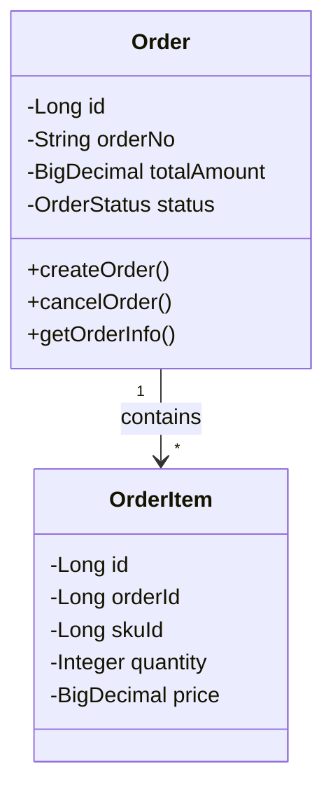
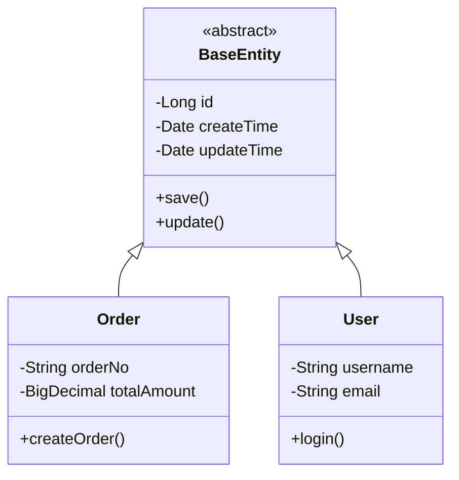
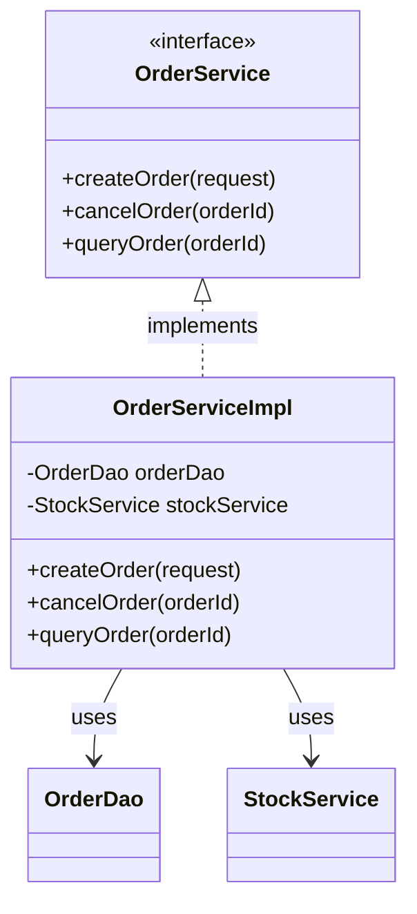
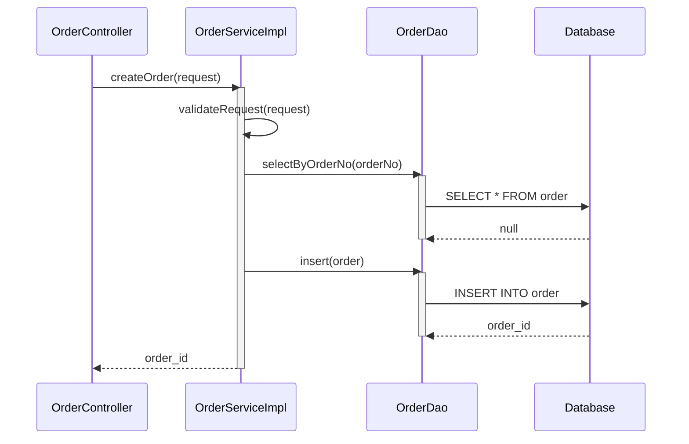
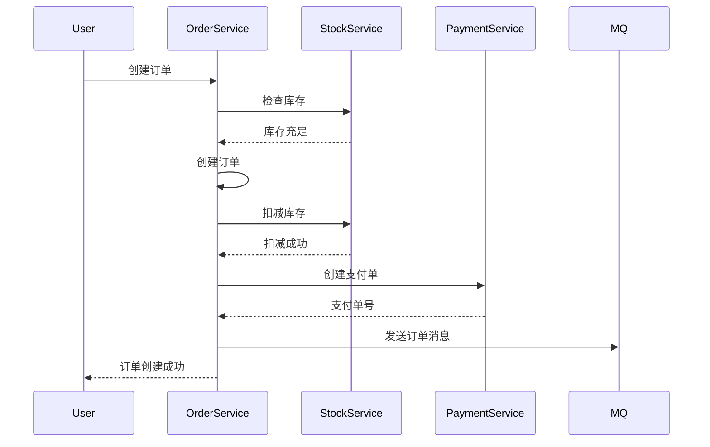
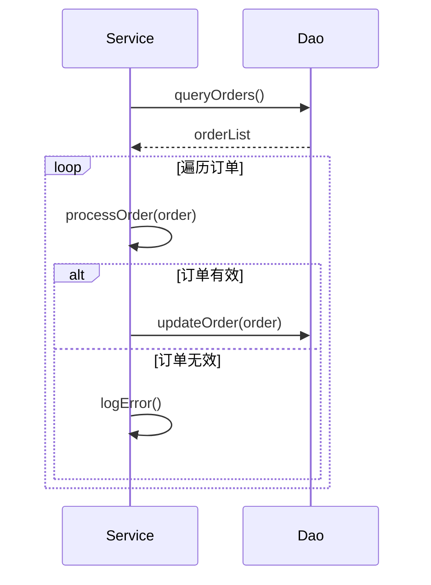
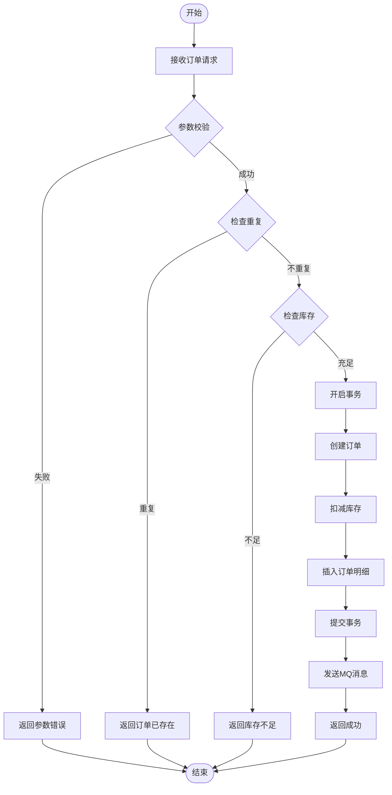
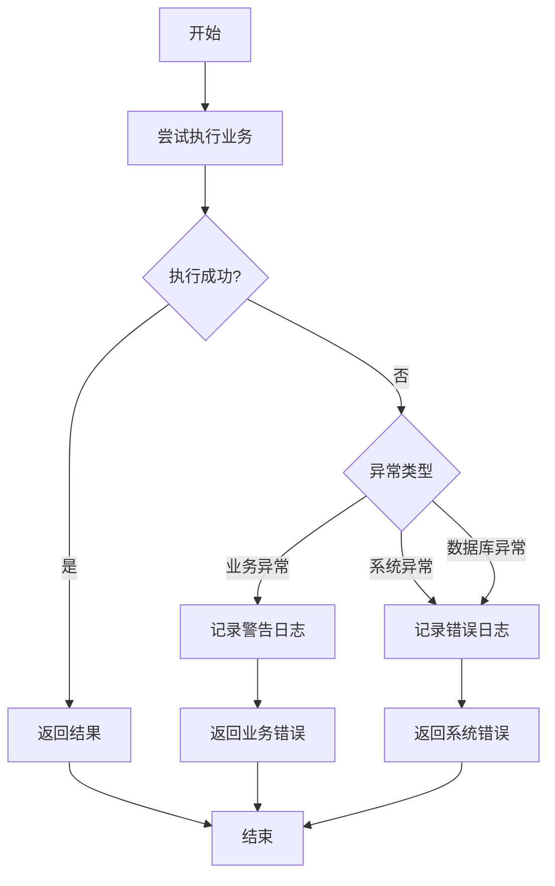
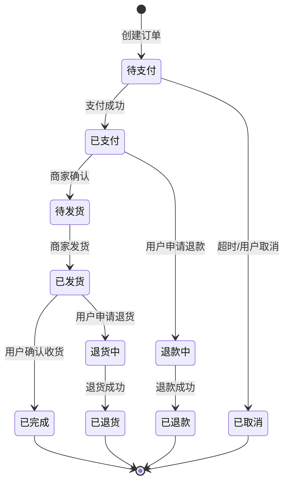
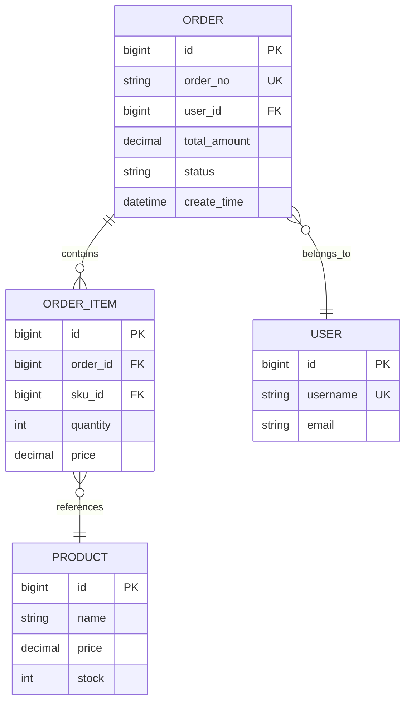

# Java 设计画图专家技能

## 核心能力

根据 Java 代码自动生成：
- **类图**：展示类结构、继承关系、依赖关系
- **时序图**：展示方法调用流程、对象交互
- **流程图**：展示业务逻辑流程
- **ER 图**：展示实体关系（如有数据库实体）

## 1. 类图（Class Diagram）

### 基础类图


### 继承关系


### 接口实现


### 关系符号说明
- `<|--` - 继承（实线三角箭头）
- `<|..` - 实现接口（虚线三角箭头）
- `-->` - 依赖/关联（实线箭头）
- `..>` - 依赖（虚线箭头）
- `--o` - 聚合（空心菱形）
- `--*` - 组合（实心菱形）

### 成员可见性
- `+` - public
- `-` - private
- `#` - protected
- `~` - package

## 2. 时序图（Sequence Diagram）

### 方法调用流程


### 多对象交互


### 条件和循环


## 3. 流程图（Flowchart）

### 业务逻辑流程


### 异常处理流程


## 4. 状态图（State Diagram）

### 订单状态流转


## 5. ER 图（Entity Relationship）

### 实体关系


## 使用场景

### 场景 1：分析现有代码结构
**输入**：Java 类代码
**输出**：类图（展示类结构、继承、依赖关系）

### 场景 2：理解方法调用流程
**输入**：Service 层方法代码
**输出**：时序图（展示方法调用顺序和对象交互）

### 场景 3：梳理业务逻辑
**输入**：业务处理方法
**输出**：流程图（展示业务逻辑分支和异常处理）

### 场景 4：设计数据模型
**输入**：Entity 类代码
**输出**：ER 图（展示实体关系）

### 场景 5：分析状态流转
**输入**：状态枚举和流转逻辑
**输出**：状态图（展示状态变化）

## 绘图原则

### 1. 类图
- 只展示关键属性和方法
- 突出类之间的关系
- 使用正确的可见性符号

### 2. 时序图
- 按时间顺序从上到下
- 使用 activate/deactivate 表示方法执行
- 区分同步调用（实线）和异步调用（虚线）

### 3. 流程图
- 清晰的开始和结束
- 判断节点使用菱形
- 异常流程要完整

### 4. ER 图
- 标注主键（PK）、外键（FK）、唯一键（UK）
- 使用正确的关系符号
- 包含关键字段

## 输出格式

```markdown
## [功能/类名]设计图

### 类图
```mermaid
classDiagram
    [类图代码]
```

### 时序图
```mermaid
sequenceDiagram
    [时序图代码]
```

### 流程图
```mermaid
flowchart TD
    [流程图代码]
```

### 说明
[对图表的关键说明]
```

## 检查清单

- [ ] 图表类型选择正确
- [ ] Mermaid 语法正确
- [ ] 类图包含关键属性和方法
- [ ] 时序图展示完整调用流程
- [ ] 流程图包含异常处理
- [ ] ER 图标注主键外键
- [ ] 图表清晰易懂

## 快速参考

| 需求 | 图表类型 | 关键字 |
|-----|---------|--------|
| 展示类结构 | 类图 | `classDiagram` |
| 展示方法调用 | 时序图 | `sequenceDiagram` |
| 展示业务逻辑 | 流程图 | `flowchart TD` |
| 展示状态变化 | 状态图 | `stateDiagram-v2` |
| 展示实体关系 | ER 图 | `erDiagram` |

---
> Converted and distributed by [TomeVault](https://tomevault.io/claim/a747895159) — claim your Tome and manage your conversions.
<!-- tomevault:4.0:skill_md:2026-04-15 -->
