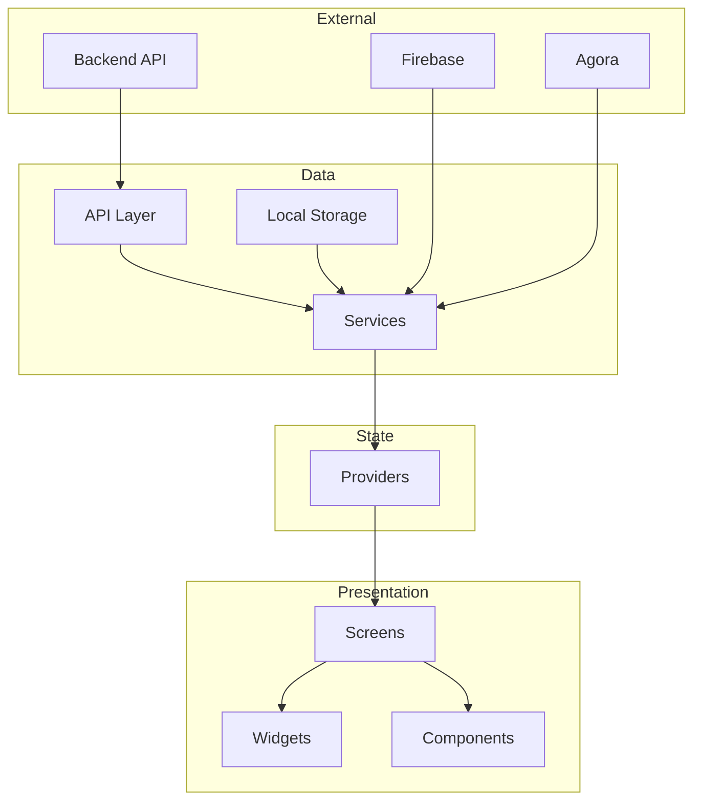
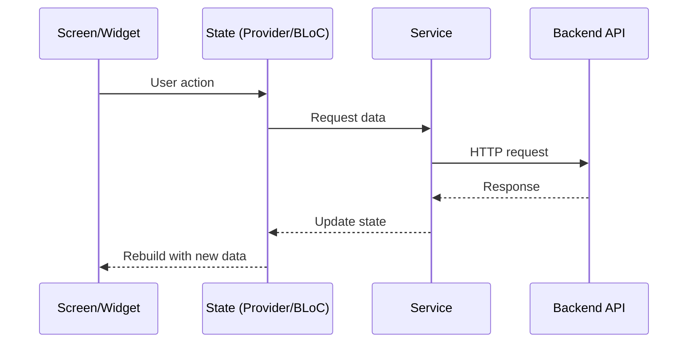
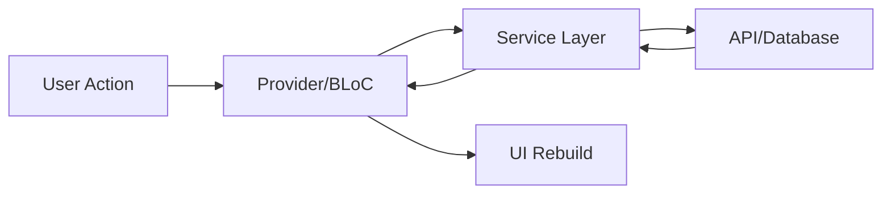
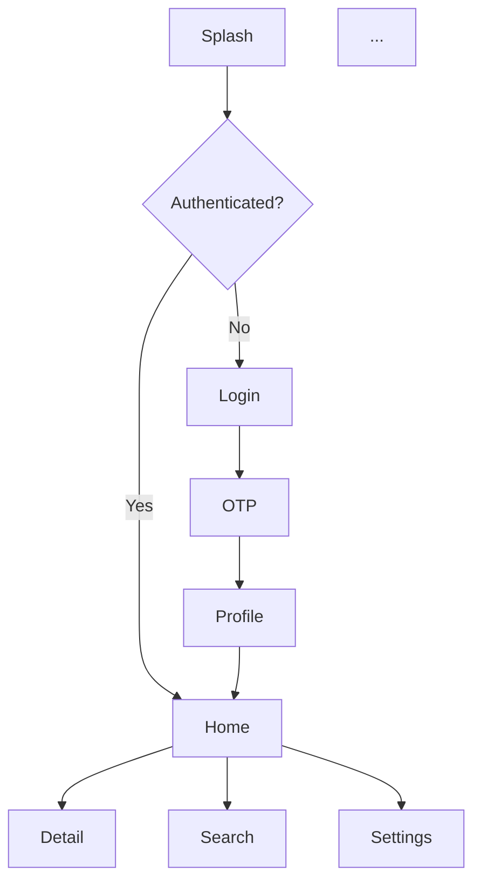
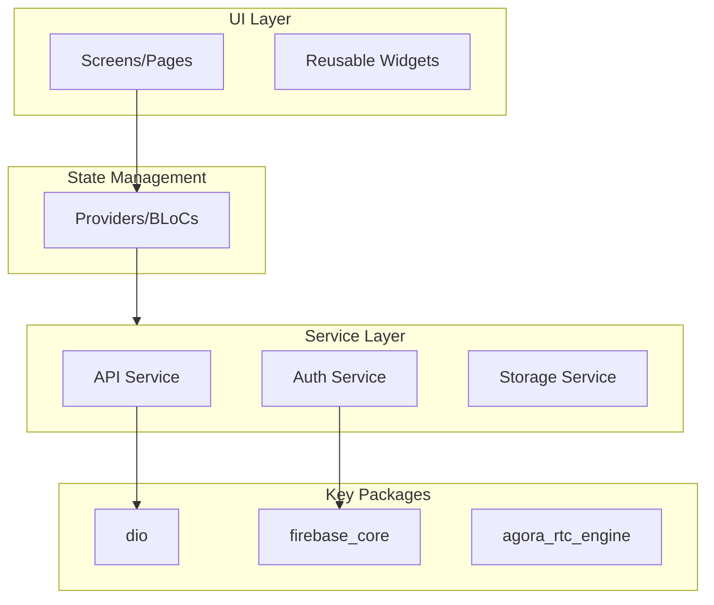
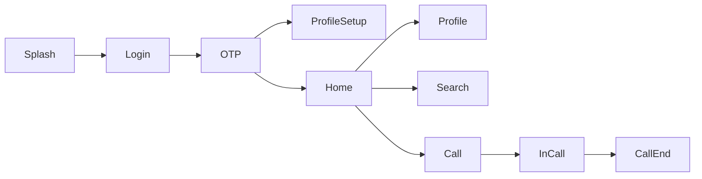
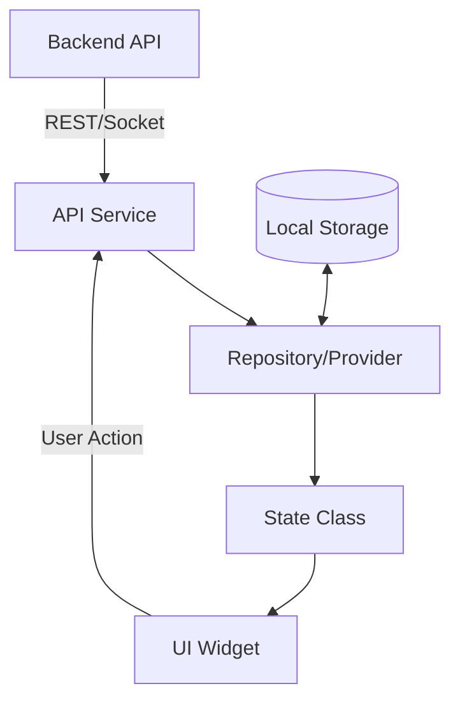
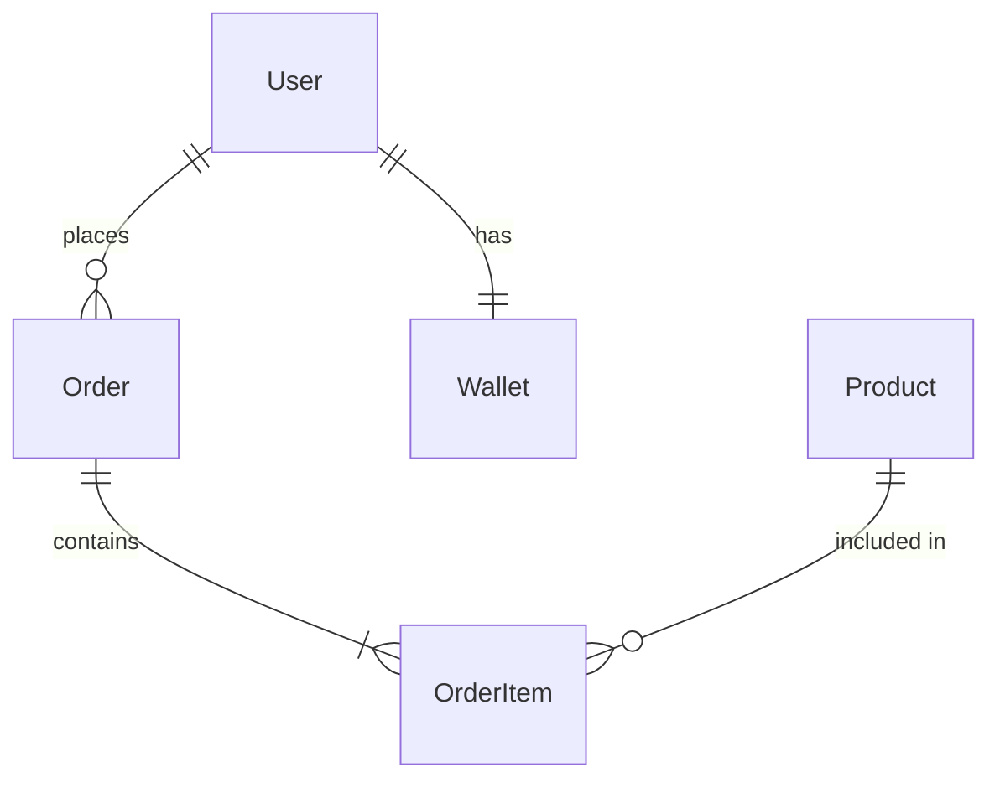

# Flutter Reverse Engineering

**Version: 1.1.0**

Before starting any analysis, run the update check (non-blocking, 3s timeout):
```bash
bash "${SKILL_PATH}/scripts/check-update.sh" "1.1.0"
```
If an update is available, show the user the update message. Then continue with the analysis regardless.

Extract a complete architectural blueprint from any Flutter app. Supports three input modes —
pick the right one based on what the user has.

## Input Modes

### Mode A: Source Code Directory
The user has the Flutter project source code on their machine.

**How to detect:** User provides a directory path, or you're already in a Flutter project
(look for `pubspec.yaml` + `lib/` folder).

**Example user prompts:**
- "Analyze this Flutter project"
- "Reverse engineer the app at D:/projects/myapp"
- "What's the architecture of this codebase?"
- (No path given — check current working directory for pubspec.yaml)

**Action:** Skip straight to [Phase 3: Project Identity](#phase-3-project-identity-source-mode).

---

### Mode B: APK/XAPK File
The user has a `.apk` or `.xapk` file somewhere on their computer — Downloads folder,
Desktop, any path.

**How to detect:** User provides a file path ending in `.apk` or `.xapk`, or says something
like "I have an APK", "analyze this APK", "here's the app file".

**Example user prompts:**
- "Reverse engineer this APK: C:/Users/me/Downloads/app-release.apk"
- "Analyze ~/Desktop/myapp.apk"
- "I downloaded this XAPK from APKPure, here: /tmp/app.xapk"

**Action:** Start at [Phase 1: APK Extraction](#phase-1-apk-extraction).

---

### Mode C: ADB (Device Connected via USB or Wireless)
The user has a phone connected to their computer (USB or wireless ADB) and wants to pull
an app directly from the device.

**How to detect:** User mentions their phone is connected, talks about ADB, wants to pull
an app from device, or mentions USB debugging.

**Example user prompts:**
- "My phone is connected, pull the Feelins app"
- "I have my device connected via USB, analyze com.example.app"
- "Pull the APK from my phone and reverse engineer it"
- "Connected wirelessly to my phone at 192.168.1.5, get the app"

**Action:** Start at [Phase 0: ADB Setup & APK Pull](#phase-0-adb-setup--apk-pull).

---

## Phase 0: ADB Setup & APK Pull
*Only for Mode C (device connected)*

### Step 0.1: Check if ADB is installed

```bash
adb version 2>/dev/null
```

**If ADB is NOT found**, tell the user:

> ADB (Android Debug Bridge) is not installed on your system. I need it to communicate
> with your phone. I can install it automatically — this downloads Android Platform Tools
> from Google (~15MB) and adds `adb` to your path.
>
> **Do you want me to install ADB?** (yes/no)

**Wait for user confirmation before proceeding.** Do not install without asking.

If the user says yes, run the install script:
```bash
bash "${SKILL_PATH}/scripts/install-adb.sh"
```

If the user says no, explain they can:
- Install manually from https://developer.android.com/studio/releases/platform-tools
- Or provide an APK file directly instead (Mode B)

### Step 0.2: Verify device connection

```bash
adb devices -l
```

**If no devices appear:**
- Ask: "Is USB debugging enabled on your phone? Go to Settings → Developer Options → USB Debugging."
- For wireless ADB: "What's your phone's IP? I'll connect with `adb connect <ip>:5555`"
- If device shows as "unauthorized": "Please check your phone — there should be a popup asking to allow USB debugging from this computer. Tap 'Allow'."

**If multiple devices appear:**
- List them and ask: "I see multiple devices. Which one should I use?"
- Then use `adb -s <serial>` for all subsequent commands.

### Step 0.3: Find the target app

If the user gave a package name (e.g., `com.example.app`), verify it exists:
```bash
adb shell pm list packages | grep -i "<search_term>"
```

If the user gave an app name (e.g., "Feelins", "WhatsApp"), search for it:
```bash
# Search by name — list all packages and grep
adb shell pm list packages | grep -i "<name>"

# If not found by name, list all third-party packages
adb shell pm list packages -3
```

If still ambiguous, show the user the matching packages and ask them to pick.

### Step 0.4: Detect if it's a Flutter app

Before pulling the full APK, do a quick check:
```bash
# Check if the app has Flutter's native library
adb shell "run-as <package_name> ls lib/arm64-v8a/ 2>/dev/null || pm path <package_name>"
```

Then pull and check for Flutter markers:
```bash
APK_PATH=$(adb shell pm path <package_name> | head -1 | sed 's/package://')
adb shell "unzip -l $APK_PATH" 2>/dev/null | grep -E "(libflutter\.so|libapp\.so|flutter_assets)"
```

If NO Flutter markers found, tell the user:
> This doesn't appear to be a Flutter app — no `libflutter.so` or `flutter_assets` found.
> It's likely a native Android (Java/Kotlin) or React Native app. Want me to analyze it
> anyway with the general Android reverse engineering approach?

### Step 0.5: Pull the APK

```bash
# Get APK path on device
APK_PATH=$(adb shell pm path <package_name> | head -1 | sed 's/package://')

# Create output directory
mkdir -p ./flutter-re-output

# Pull the APK
adb pull "$APK_PATH" ./flutter-re-output/<package_name>.apk
```

For split APKs (common on Android 10+):
```bash
# Check if multiple APK paths exist
adb shell pm path <package_name>
# If multiple lines, pull all of them
adb shell pm path <package_name> | sed 's/package://' | while read -r path; do
  adb pull "$path" "./flutter-re-output/$(basename "$path")"
done
```

Now proceed to [Phase 1: APK Extraction](#phase-1-apk-extraction) with the pulled APK.

---

## Phase 1: APK Extraction
*For Mode B and Mode C*

### Step 1.1: Validate the file

```bash
file <apk_path>
```
Confirm it's a ZIP archive (APKs are ZIPs). If it's an XAPK, it's a ZIP containing multiple APKs.

### Step 1.2: Create working directory

```bash
WORK_DIR="./flutter-re-output/$(basename <apk_path> .apk)-analysis"
mkdir -p "$WORK_DIR"
```

### Step 1.3: Extract and analyze APK contents

```bash
# Extract APK (it's just a ZIP)
unzip -o <apk_path> -d "$WORK_DIR/extracted"

# For XAPK: extract outer ZIP first, then find and extract the base APK inside
# unzip -o <xapk_path> -d "$WORK_DIR/xapk-contents"
# Then find *.apk files inside and extract the base one
```

### Step 1.4: Verify it's a Flutter app

Check for Flutter-specific files in the extracted APK:

```bash
ls "$WORK_DIR/extracted/assets/flutter_assets/" 2>/dev/null
ls "$WORK_DIR/extracted/lib/arm64-v8a/libflutter.so" 2>/dev/null
ls "$WORK_DIR/extracted/lib/arm64-v8a/libapp.so" 2>/dev/null
```

**Flutter app markers (must have at least 2):**
- `assets/flutter_assets/` — Flutter asset bundle
- `lib/*/libflutter.so` — Flutter engine native library
- `lib/*/libapp.so` — Compiled Dart code (AOT snapshot)
- `assets/flutter_assets/kernel_blob.bin` — Debug mode Dart kernel (rare in release)
- `assets/flutter_assets/AssetManifest.json` — Flutter asset manifest

If confirmed as Flutter, proceed. If not, inform the user.

### Step 1.5: Extract everything useful

Read and document these from the extracted APK:

**AndroidManifest.xml** (may need aapt2 to decode binary XML):
```bash
# Try reading directly (works if plaintext)
cat "$WORK_DIR/extracted/AndroidManifest.xml"

# If binary, use aapt2 or aapt
aapt2 dump xmltree <apk_path> --file AndroidManifest.xml 2>/dev/null || \
aapt dump xmltree <apk_path> AndroidManifest.xml 2>/dev/null
```

Extract from AndroidManifest:
- Package name and version
- All permissions (categorize: network, camera, microphone, location, storage, phone, etc.)
- Activities, Services, BroadcastReceivers, ContentProviders
- Intent filters (deep links, URL schemes)
- Firebase/Google services metadata

**Flutter assets:**
```bash
# Asset manifest — lists all bundled assets
cat "$WORK_DIR/extracted/assets/flutter_assets/AssetManifest.json" 2>/dev/null

# Font manifest — lists all bundled fonts
cat "$WORK_DIR/extracted/assets/flutter_assets/FontManifest.json" 2>/dev/null

# Shorebird config (OTA updates)
cat "$WORK_DIR/extracted/assets/flutter_assets/shorebird.yaml" 2>/dev/null

# Any JSON/config files in flutter_assets
find "$WORK_DIR/extracted/assets/flutter_assets/" -name "*.json" -o -name "*.yaml" -o -name "*.yml"
```

**Native libraries:**
```bash
# List all native libraries and their architectures
find "$WORK_DIR/extracted/lib/" -name "*.so" | sort
```

Document which native libs are present:
- `libflutter.so` — Flutter engine (note: version can sometimes be inferred from size/build)
- `libapp.so` — Compiled Dart code
- Other `.so` files indicate native plugins (e.g., `libagora-rtc-sdk.so`, `libsqlite.so`)

**Resources:**
```bash
# App icon
find "$WORK_DIR/extracted/res/" -name "ic_launcher*" -o -name "ic_notification*" 2>/dev/null

# String resources (may contain API keys, URLs, config)
find "$WORK_DIR/extracted/res/values/" -name "strings.xml" 2>/dev/null
```

### Step 1.6: Extract strings from libapp.so (Dart snapshot analysis)

This is the gold mine for APK analysis. The compiled Dart snapshot in `libapp.so` contains
string literals, class names, and method names that survived AOT compilation.

```bash
# Extract readable strings from the Dart snapshot
strings "$WORK_DIR/extracted/lib/arm64-v8a/libapp.so" > "$WORK_DIR/dart_strings.txt"

# Find API endpoints and URLs
grep -E "https?://" "$WORK_DIR/dart_strings.txt" | sort -u > "$WORK_DIR/api_urls.txt"

# Find package names (pub.dev packages leave traces)
grep -E "package:" "$WORK_DIR/dart_strings.txt" | sort -u > "$WORK_DIR/packages.txt"

# Find class names and method names
grep -E "^[A-Z][a-zA-Z]+[A-Z]" "$WORK_DIR/dart_strings.txt" | sort -u | head -200 > "$WORK_DIR/class_names.txt"

# Find potential API keys, tokens, secrets
grep -iE "(api[_-]?key|secret|token|bearer|authorization|password)" "$WORK_DIR/dart_strings.txt" | sort -u > "$WORK_DIR/potential_secrets.txt"

# Find Firebase/Google config
grep -iE "(firebase|google|fcm|firestore)" "$WORK_DIR/dart_strings.txt" | sort -u > "$WORK_DIR/firebase_strings.txt"

# Find route/screen names
grep -iE "(screen|page|route|view|/)" "$WORK_DIR/dart_strings.txt" | grep -v "http" | sort -u | head -100 > "$WORK_DIR/routes.txt"

# Find error messages (reveal business logic)
grep -iE "(error|exception|failed|invalid|not found|unauthorized)" "$WORK_DIR/dart_strings.txt" | sort -u > "$WORK_DIR/error_messages.txt"

# Find SharedPreferences / storage keys
grep -iE "(prefs|shared|storage|cache|key_)" "$WORK_DIR/dart_strings.txt" | sort -u > "$WORK_DIR/storage_keys.txt"
```

**Important**: Flag any actual API keys or secrets found — do NOT include them in the report.
Tell the user: "Found potential hardcoded secrets — this is a security concern for the app."

Now proceed to [Phase 2: APK Report Generation](#phase-2-apk-report-generation).

---

## Phase 2: APK Report Generation
*For Mode B and Mode C*

Since we can't get full Dart source from a compiled APK, the report structure differs from
source code analysis. Generate a report covering everything we CAN extract:

```markdown
# [App Name] — Flutter APK Reverse Engineering Report

> Source: [APK file path or "pulled from device via ADB"]
> Package: [com.example.app]
> Generated: [date]

## Executive Summary
[What this app appears to do, based on permissions, assets, and extracted strings]

## 1. App Identity
- Package name, version code, version name
- Target SDK, min SDK
- Flutter engine build (inferred from libflutter.so)
- Signing info

## 2. Permissions Analysis
[Table of all permissions with severity and purpose inference]
| Permission | Risk Level | Likely Purpose |
|------------|-----------|----------------|
| INTERNET | Normal | API calls |
| CAMERA | Dangerous | Video calls / profile photo |
| RECORD_AUDIO | Dangerous | Audio calls |
| ... | ... | ... |

## 3. Flutter Assets
- Asset manifest (images, fonts, animations)
- Font manifest (custom fonts used)
- Config files found in flutter_assets
- Shorebird/OTA config if present

## 4. Native Plugin Libraries
[Table of all .so files and what packages they belong to]
| Library | Package | Purpose |
|---------|---------|---------|
| libagora-rtc-sdk.so | agora_rtc_engine | Real-time audio/video |
| libsqlite.so | sqflite | Local database |
| ... | ... | ... |

## 5. API Endpoints Discovered
[All URLs extracted from libapp.so, grouped by domain]

## 6. Inferred Package Dependencies
[Packages identified from string analysis and native libs]

## 7. Screen/Route Map
[Routes and screen names extracted from strings]

## 8. Business Logic Indicators
- Error messages (reveal validation rules, user flows)
- Storage keys (reveal what data is cached/persisted)
- Constants and config values

## 9. Security Observations
- Hardcoded secrets found (flagged, not exposed)
- Certificate pinning (check for network_security_config.xml)
- Obfuscation level (are class names readable?)
- Debug mode indicators

## 10. Component Architecture (Inferred)
[Best guess at architecture based on class names, routes, and patterns found in strings]
```

After the APK report, ask the user:
> "Want me to dig deeper into any specific area? I can analyze the API endpoints further,
> map the permission usage, or try to reconstruct the app's user flow from the data."

**Stop here for Mode B/C** — do NOT proceed to the source code phases unless the user
also provides source code.

---

## Phase 3: Project Identity (Source Mode)
*For Mode A (source code)*

Establish the basics before diving deep.

**Read these files first (in parallel):**
- `pubspec.yaml` — the project's DNA (name, version, dependencies, assets, fonts)
- `pubspec.lock` — actual resolved versions (shows transitive deps)
- `lib/main.dart` — entry point reveals app-level architecture decisions
- `analysis_options.yaml` — lint rules and code quality stance
- `README.md` or `CLAUDE.md` — existing documentation (may save you work)
- `.metadata` or any config files in root — Flutter SDK version, channel

**Extract:**
- Project name, description, version, SDK constraints
- Flutter channel and minimum SDK version
- Total dependency count (direct vs dev)
- Whether it's a single app, monorepo, or package

## Phase 4: Dependency Analysis
*For Mode A (source code)*

Categorize every dependency from `pubspec.yaml`. Consult
`references/package-catalog.md` for the comprehensive package reference.

**Categories to use:**

| Category | What to look for | Common packages |
|----------|-----------------|-----------------|
| State Management | How data flows through the app | provider, flutter_bloc, riverpod, getx, mobx, redux, signals |
| Navigation/Routing | How screens connect | go_router, auto_route, get (routing), beamer, routemaster |
| Networking | How it talks to backends | http, dio, chopper, retrofit, graphql_flutter |
| Local Storage | How it persists data | shared_preferences, hive, sqflite, isar, drift, objectbox |
| Firebase | Google cloud services | firebase_core, cloud_firestore, firebase_auth, firebase_messaging |
| Real-time | Live data channels | web_socket_channel, socket_io_client, stream_channel |
| UI/Design | Visual components | sizer, flutter_screenutil, cached_network_image, shimmer, lottie |
| Media | Audio/video/images | image_picker, camera, video_player, agora_rtc_engine, audioplayers |
| Auth | Authentication | firebase_auth, google_sign_in, flutter_appauth, local_auth |
| Payments | Monetization | razorpay_flutter, flutter_stripe, in_app_purchase |
| Analytics | Tracking | firebase_analytics, mixpanel_flutter, amplitude_flutter, sentry |
| Testing | Test infrastructure | mockito, bloc_test, integration_test, golden_toolkit |
| Code Gen | Build-time generation | json_serializable, freezed, build_runner, auto_route_generator |
| Localization | i18n/l10n | intl, easy_localization, flutter_localizations, get (i18n) |
| Platform | Native integration | url_launcher, share_plus, permission_handler, path_provider |
| Dev Tools | Development aids | flutter_lints, very_good_analysis, custom_lint |

**For each dependency, note:**
- What it does in this project (not just what it *can* do)
- Version constraints — pinned (`1.2.3`) vs range (`^1.2.3`) vs any
- Whether it's in `dependencies` or `dev_dependencies`
- Known deprecation or migration concerns

## Phase 5: Architecture Pattern Detection
*For Mode A (source code)*

Scan `lib/` structure to identify the architectural pattern. Don't guess from folder names
alone — read 2-3 representative files to confirm. Consult
`references/architecture-patterns.md` for the comprehensive detection guide.

**Detection heuristics:**

| Pattern | Folder signals | Code signals |
|---------|---------------|-------------|
| **Clean Architecture** | `domain/`, `data/`, `presentation/`, `core/` | Use cases, entities, repository interfaces |
| **BLoC Pattern** | `blocs/` or `cubits/`, `states/`, `events/` | `Bloc<Event, State>`, `Cubit<State>` |
| **MVVM** | `viewmodels/`, `views/`, `models/` | ViewModel with ChangeNotifier |
| **Provider + Services** | `providers/`, `services/`, `screens/` | ChangeNotifier, `context.read/watch` |
| **Riverpod** | `providers/` (no ChangeNotifier) | `ref.watch`, `@riverpod` |
| **GetX** | `controllers/`, `bindings/`, `views/` | `GetxController`, `Obx()`, `Get.find()` |
| **Feature-first** | `features/login/`, `features/home/` | Self-contained features |
| **Flat/Simple** | Everything in `lib/` | Small project, no formal architecture |

**To confirm, read:**
1. A screen/page file — how does it access state?
2. A state class — ChangeNotifier? Bloc? Cubit? Riverpod provider?
3. A data-fetching file — direct HTTP? Repository pattern? Use case?

## Phase 6: Folder Structure Mapping
*For Mode A (source code)*

Generate the complete `lib/` directory tree with purpose annotations.

**For each top-level directory under `lib/`, document:**
- Purpose (one line)
- Number of files
- Key files worth reading
- How it relates to other directories

**Output format:**
```
lib/
├── main.dart                    # Entry point: [Provider/BLoC/GetX] init, [N] providers
├── screens/                     # [N] screen modules
│   ├── auth/                    # Login, registration, profile setup
│   ├── home/                    # Main feed, discovery
│   └── ...
├── providers/                   # [N] ChangeNotifier providers
├── services/                    # [N] service classes
├── models/                      # Data models ([typed/untyped])
├── components/                  # Reusable widgets
├── constants/                   # Theme, colors, strings, config values
└── utils/                       # Helpers, extensions, formatters
```

## Phase 7: State Management Deep Dive
*For Mode A (source code)*

**Find and document:**
1. **State classes** — what are they, what data do they hold?
2. **Where state is provided** — `main.dart` MultiProvider? Feature-level? Lazy?
3. **How UI consumes state** — `Consumer`, `context.watch`, `BlocBuilder`, `Obx`?
4. **State persistence** — does any state survive app restart? How?
5. **Cross-cutting state** — auth state, theme, locale — how are these shared?

**Count providers/blocs/controllers** — the number tells a story:
- 1-5: Small app or highly consolidated state
- 5-15: Medium complexity, well-organized
- 15-30: Large app, each domain has its own state
- 30+: May indicate over-fragmentation or a very feature-rich app

## Phase 8: Domain Knowledge Extraction
*For Mode A (source code)*

This is the highest-value phase. Extract the *business logic* from the code.

**Find and document:**

1. **Data models** — read `models/` or `entities/` directory
   - If typed: list classes, their fields, relationships
   - If untyped (`Map<String, dynamic>`): note this and find where keys are defined
   - If using code generation (freezed, json_serializable): note the pattern

2. **API contracts** — find the API layer
   - Base URL configuration
   - All endpoint paths (group by domain)
   - Request/response shapes
   - Authentication method (Bearer token, API key, cookies)
   - Error handling pattern

3. **Business entities** — what "things" does the app deal with?
   - Users, products, orders, messages, etc.
   - Entity relationships
   - Business rules (validation, permissions, workflows)

4. **Enums and constants** — these encode business rules
   - Status enums (OrderStatus, UserRole, etc.)
   - Config constants (timeouts, limits, feature flags)
   - String constants (API keys, event names, storage keys)

## Phase 9: Navigation & Routing
*For Mode A (source code)*

**Detect the routing approach:**
- `GoRouter` — `GoRouter(routes: [...])` configuration
- `AutoRoute` — `@MaterialAutoRouter` annotations
- `GetX routing` — `GetPage` definitions or `Get.to()`
- `Navigator 1.0` — `Navigator.push()`, `MaterialPageRoute`
- **Named routes** — `routes:` map in `MaterialApp`

**Document:**
- Route definitions (path to screen mapping)
- Navigation guards (auth checks, role-based access)
- Deep linking support
- Tab/bottom navigation structure

## Phase 10: Service Layer Analysis
*For Mode A (source code)*

**For each service, document:**
- What it does (one line)
- Singleton or instance-based?
- Dependencies (other services, packages)
- Key public methods

## Phase 11: Design Patterns Inventory
*For Mode A (source code)*

| Pattern | How to detect |
|---------|--------------|
| **Singleton** | `static final _instance`, `factory ClassName()` |
| **Repository** | Classes abstracting data sources behind an interface |
| **Factory** | `factory` constructors, `fromJson`/`fromMap` |
| **Observer** | `Stream`, `StreamController`, `ChangeNotifier` |
| **Dependency Injection** | `GetIt`, `injectable`, constructor injection, Provider |
| **Mixin** | `with` keyword, `mixin` declarations |
| **Extension** | `extension on` adding methods to existing types |

## Phase 12: Build & Platform Configuration
*For Mode A (source code)*

**Check these files:**
- `android/app/build.gradle` — minSdk, targetSdk, flavors, signing
- `android/app/src/main/AndroidManifest.xml` — permissions, intent filters
- `ios/Runner/Info.plist` — permissions, URL schemes
- `.github/workflows/` or `codemagic.yaml` — CI/CD
- `shorebird.yaml` — OTA code push
- `l10n.yaml` — localization config

## Phase 13: Code Quality Assessment
*For Mode A (source code)*

**Check for:**
- `analysis_options.yaml` — which lint ruleset? Custom rules?
- `test/` directory — any tests at all?
- Null safety — fully migrated or mixed?
- Typed models vs `Map<String, dynamic>` everywhere
- Error handling consistency
- Dead code or unused imports

## Phase 14: Feature & Screen Mapping
*For Mode A (source code)*

**Build a feature map:**
```
App Features:
├── Authentication
│   ├── Phone OTP Login
│   ├── Profile Setup
│   └── Social Login
├── Home
│   ├── Feed
│   ├── Search
│   └── Notifications
├── Feature X
│   ├── Sub-feature 1
│   └── Sub-feature 2
└── Settings
    ├── Profile Edit
    ├── Privacy
    └── About
```

---

## Source Code Report Format

```markdown
# [Project Name] — Architecture Blueprint

> Auto-generated reverse engineering report
> Generated: [date]
> Flutter SDK: [version] | Dart SDK: [version]
> Total Dart files: [count] | Total lines (approx): [count]

## Executive Summary
[2-3 sentences: what this app does, its architecture, notable choices]

## 1. Project Identity
## 2. Dependency Map
## 3. Architecture Pattern
## 4. Folder Structure
## 5. State Management
## 6. Domain Model
## 7. Navigation & Routing
## 8. Service Layer
## 9. Design Patterns
## 10. Build & Platform Config
## 11. Code Quality
## 12. Feature Map
## 13. Key Observations & Recommendations

## Appendix A: File Index (top 20 largest/most-important files)
## Appendix B: Dependency Version Matrix
```

---

## Phase 20: Documentation Export
*Run after completing all analysis phases (any mode)*

After completing the analysis, generate two documentation artifacts. Ask the user:
> "Want me to generate a full documentation package? I'll create a markdown report and an interactive HTML page with visual architecture diagrams."

**Wait for user confirmation before generating.**

### 20.1: Markdown Report (`ARCHITECTURE_BLUEPRINT.md`)

Generate a single comprehensive markdown file that includes EVERYTHING discovered during analysis. This file should be self-contained — someone reading it should understand the entire project without looking at any code.

#### Save location
- Source mode (Mode A): `[project_root]/ARCHITECTURE_BLUEPRINT.md`
- APK mode (Mode B/C): `[output_dir]/ARCHITECTURE_BLUEPRINT.md`

#### Structure

```markdown
# [App Name] — Architecture Blueprint

> Reverse engineered by flutter-reverse-engineering skill
> Generated: [date] | Source: [source code / APK / ADB device]
> Flutter SDK: [version] | Dart SDK: [version]
> Total files: [count] | Estimated LOC: [count]

---

## Table of Contents
[Auto-generated clickable TOC]

## 1. Executive Summary
[3-5 sentences covering: what the app does, architecture pattern, key tech choices, notable findings]

## 2. Project Identity
[Name, version, SDK, platforms, description]

## 3. Architecture Overview

### Architecture Pattern: [Pattern Name]
[Description with evidence]

### Architecture Diagram


### Data Flow Diagram


## 4. Dependency Map
[Full categorized table]

## 5. Folder Structure
[Complete annotated tree]

## 6. State Management
[Pattern, list of providers/blocs, data flow explanation]

### State Flow Diagram


## 7. Domain Model
[Entities, relationships, business rules]

### Entity Relationship Diagram
```mermaid
erDiagram
    USER ||--o{ ORDER : places
    ORDER ||--|{ LINE-ITEM : contains
    ...
```

## 8. API Contracts
[All endpoints grouped by domain, with methods, paths, auth]

## 9. Navigation Map
[Routes, guards, deep links]

### Screen Flow Diagram


## 10. Service Layer
[Service inventory table]

## 11. Design Patterns
[Pattern inventory with file locations]

## 12. Build & Platform Config
[Platforms, permissions, CI/CD, flavors]

## 13. Code Quality Assessment
[Lint rules, test coverage, quality signals]

## 14. Feature Map
[Complete feature tree]

## 15. Key Observations & Recommendations
[Strengths, tech debt, risks, improvement suggestions]

## Appendix A: File Index
[Top 20-30 important files with sizes and purpose]

## Appendix B: Full Dependency Matrix
[Every package with version, category, notes]

## Appendix C: Glossary
[Project-specific terms, abbreviations, naming conventions discovered]
```

For APK mode, adapt the sections — replace source-code sections with APK findings (permissions, extracted strings, native libs, etc.).

### 20.2: Interactive HTML Report (`architecture_report.html`)

Generate a single self-contained HTML file (no external dependencies except CDN-loaded Mermaid.js and Prism.js) that renders beautifully in any browser. This is the showpiece document.

#### Save location
- Source mode (Mode A): `[project_root]/architecture_report.html`
- APK mode (Mode B/C): `[output_dir]/architecture_report.html`

#### Requirements
- Modern clean design (dark/light mode toggle)
- Sidebar navigation with collapsible sections
- Mermaid.js loaded via CDN for rendering diagrams inline
- All the same content as the markdown report
- Syntax-highlighted code blocks (use Prism.js CDN or inline highlights)
- Collapsible sections for large content (dependency tables, file indexes)
- Search/filter functionality for the dependency table
- Copy-to-clipboard buttons on code blocks
- Print-friendly CSS (`@media print`)
- Responsive design (works on mobile too)
- Sticky header with project name and generation metadata
- Progress indicator showing which section you're viewing

#### HTML template structure

```html
<!DOCTYPE html>
<html lang="en" data-theme="light">
<head>
    <meta charset="UTF-8">
    <meta name="viewport" content="width=device-width, initial-scale=1.0">
    <title>[App Name] — Architecture Blueprint</title>
    <script src="https://cdn.jsdelivr.net/npm/mermaid/dist/mermaid.min.js"></script>
    <style>
        /* ALL CSS INLINE — no external files */
        :root { --bg: #ffffff; --text: #1a1a2e; --accent: #6366f1; --card: #f8fafc; --border: #e2e8f0; }
        [data-theme="dark"] { --bg: #0f172a; --text: #e2e8f0; --accent: #818cf8; --card: #1e293b; --border: #334155; }
        
        * { margin: 0; padding: 0; box-sizing: border-box; }
        body { font-family: 'Inter', -apple-system, system-ui, sans-serif; background: var(--bg); color: var(--text); line-height: 1.6; }
        
        /* Sidebar navigation */
        .sidebar { position: fixed; left: 0; top: 0; bottom: 0; width: 280px; overflow-y: auto; background: var(--card); border-right: 1px solid var(--border); padding: 1.5rem; }
        .main-content { margin-left: 280px; padding: 2rem; max-width: 900px; }
        
        /* Cards for each section */
        .section-card { background: var(--card); border: 1px solid var(--border); border-radius: 12px; padding: 2rem; margin-bottom: 2rem; }
        
        /* Mermaid diagrams */
        .mermaid { background: var(--card); padding: 1rem; border-radius: 8px; text-align: center; }
        
        /* Tables */
        table { width: 100%; border-collapse: collapse; }
        th, td { padding: 0.75rem; border-bottom: 1px solid var(--border); text-align: left; }
        
        /* Collapsible */
        details { margin: 1rem 0; }
        summary { cursor: pointer; font-weight: 600; padding: 0.5rem; }
        
        /* Search */
        .search-input { width: 100%; padding: 0.75rem; border: 1px solid var(--border); border-radius: 8px; background: var(--bg); color: var(--text); }
        
        /* Dark mode toggle */
        .theme-toggle { cursor: pointer; background: none; border: none; font-size: 1.5rem; }
        
        /* Print */
        @media print { .sidebar, .theme-toggle { display: none; } .main-content { margin-left: 0; } }
        
        /* Responsive */
        @media (max-width: 768px) { .sidebar { display: none; } .main-content { margin-left: 0; } }
    </style>
</head>
<body>
    <nav class="sidebar">
        <h2>[App Name]</h2>
        <div class="nav-meta">Generated: [date]</div>
        <button class="theme-toggle" onclick="toggleTheme()">Moon/Sun icon</button>
        <ul class="nav-links">
            <li><a href="#summary">Executive Summary</a></li>
            <li><a href="#architecture">Architecture</a></li>
            <!-- ... all sections ... -->
        </ul>
    </nav>
    
    <main class="main-content">
        <!-- All sections with mermaid diagrams, tables, code blocks -->
        <!-- Each section wrapped in <section class="section-card" id="..."> -->
    </main>
    
    <script>
        mermaid.initialize({ startOnLoad: true, theme: 'default' });
        
        function toggleTheme() {
            const html = document.documentElement;
            html.dataset.theme = html.dataset.theme === 'dark' ? 'light' : 'dark';
            mermaid.initialize({ theme: html.dataset.theme === 'dark' ? 'dark' : 'default' });
        }
        
        // Search functionality for dependency table
        function filterTable(input, tableId) {
            const filter = input.value.toLowerCase();
            const rows = document.querySelectorAll(`#${tableId} tbody tr`);
            rows.forEach(row => {
                row.style.display = row.textContent.toLowerCase().includes(filter) ? '' : 'none';
            });
        }
        
        // Copy to clipboard for code blocks
        document.querySelectorAll('pre code').forEach(block => {
            const btn = document.createElement('button');
            btn.textContent = 'Copy';
            btn.className = 'copy-btn';
            btn.onclick = () => { navigator.clipboard.writeText(block.textContent); btn.textContent = 'Copied!'; setTimeout(() => btn.textContent = 'Copy', 2000); };
            block.parentElement.style.position = 'relative';
            block.parentElement.appendChild(btn);
        });
        
        // Smooth scroll for sidebar links
        document.querySelectorAll('.nav-links a').forEach(link => {
            link.addEventListener('click', e => {
                e.preventDefault();
                document.querySelector(link.getAttribute('href')).scrollIntoView({ behavior: 'smooth' });
            });
        });
        
        // Progress indicator — highlight active section in sidebar
        const sections = document.querySelectorAll('.section-card');
        const navLinks = document.querySelectorAll('.nav-links a');
        window.addEventListener('scroll', () => {
            let current = '';
            sections.forEach(section => {
                if (window.scrollY >= section.offsetTop - 100) current = section.id;
            });
            navLinks.forEach(link => {
                link.classList.toggle('active', link.getAttribute('href') === '#' + current);
            });
        });
    </script>
</body>
</html>
```

**IMPORTANT:** Generate the FULL HTML with ALL content populated — not a template. Every section should have the actual analysis data filled in. The mermaid diagram code blocks should use actual data from the analysis (real class names, real routes, real dependencies).

#### After generating both files, tell the user:
> "Generated two documentation files:
> - `ARCHITECTURE_BLUEPRINT.md` — Full markdown report (works in GitHub, VS Code, any markdown viewer)
> - `architecture_report.html` — Interactive HTML page with diagrams (open in browser)
>
> The HTML report has dark/light mode, sidebar navigation, searchable tables, and live Mermaid diagrams."

---

## Performance Tips

- **Parallelize reads.** Phase 3 and 4 can run simultaneously.
- **Use glob patterns** to discover files: `**/*_provider.dart`, `**/*_service.dart`,
  `**/*_bloc.dart`, `**/*_model.dart`, `**/*_screen.dart`
- **Read strategically.** `pubspec.yaml` + `main.dart` + one file per layer = 80% of the picture.
- **Large projects (500+ files):** Focus on `lib/` only. Skip `build/`, `.dart_tool/`,
  generated files (`*.g.dart`, `*.freezed.dart`).
- **APK mode:** `strings` on `libapp.so` is slow for huge files. Use `head -50000` if needed.

## Edge Cases

- **Monorepo**: Check for `melos.yaml` or multiple `pubspec.yaml` files.
- **No clear architecture**: Document as "flat structure".
- **Split APKs**: Android 10+ often has split APKs — pull all parts.
- **Obfuscated APK**: Class names may be mangled. Focus on string literals and URLs.
- **Debug vs Release APK**: Debug APKs have `kernel_blob.bin` (more data). Release APKs
  have AOT-compiled `libapp.so` (harder but still has strings).
- **Mixed state management**: Document both and where each is used.

## Phase 15: Device Data Extraction
*For Mode C (ADB) only — run after APK pull (Phase 0)*

**IMPORTANT: Always ask user permission before extracting device data.** Say:
> "I can also extract cached data from the app on your device (settings, databases, tokens).
> This requires the app to be debuggable. Want me to try?"

**Wait for user confirmation before proceeding.** Do not extract without asking.

**NOTE:** `run-as` only works on debuggable apps (debug builds or apps with `android:debuggable="true"`).
For release apps, mention these alternatives:
- Rooted device: `adb shell su -c "cat /data/data/<package>/..."`
- ADB backup (older Android): `adb backup -noapk <package>` then extract the backup
- These are limited and may not work on all devices/Android versions.

### Step 15.1: SharedPreferences

```bash
# List all SharedPreferences XML files
adb shell run-as <package> ls shared_prefs/

# Read each preferences file — shows cached tokens, settings, user IDs, feature flags
adb shell run-as <package> cat shared_prefs/<filename>.xml
```

Document all key-value pairs found. Flag anything that looks like:
- Auth tokens or session IDs
- User IDs or profile data
- Feature flags or A/B test assignments
- API endpoint overrides
- Cached settings

### Step 15.2: SQLite Databases

```bash
# List database files
adb shell run-as <package> ls databases/

# Pull a database to local machine for analysis
adb shell run-as <package> cat databases/<dbname> > "$WORK_DIR/<dbname>"

# Dump schema and sample data using sqlite3
sqlite3 "$WORK_DIR/<dbname>" ".schema"
sqlite3 "$WORK_DIR/<dbname>" ".tables"
# For each table:
sqlite3 "$WORK_DIR/<dbname>" "SELECT * FROM <table> LIMIT 5;"
```

Document the database schema: tables, columns, types, relationships.

### Step 15.3: Hive Boxes

```bash
# Check for Hive files in Flutter app directory
adb shell run-as <package> ls app_flutter/

# Look for .hive files
adb shell run-as <package> find app_flutter/ -name "*.hive" 2>/dev/null

# Pull Hive box files for inspection
adb shell run-as <package> cat app_flutter/<boxname>.hive > "$WORK_DIR/<boxname>.hive"
```

Hive files are binary — extract readable strings:
```bash
strings "$WORK_DIR/<boxname>.hive" | head -200
```

### Step 15.4: Firebase Local Cache

```bash
# Check for Firestore local cache
adb shell run-as <package> ls app_flutter/ | grep -i fire

# Common Firebase cache locations
adb shell run-as <package> ls app_flutter/FirebaseFirestore/ 2>/dev/null
adb shell run-as <package> ls app_flutter/.com.google.firebase* 2>/dev/null
```

### Step 15.5: App Logs

```bash
# Get the app's PID
PID=$(adb shell pidof <package>)

# Dump recent logs filtered to this app
adb logcat -d --pid=$PID | tail -500

# Alternative: filter by tag patterns common in Flutter
adb logcat -d | grep -iE "(flutter|dart|<package_short_name>)" | tail -300
```

Look for:
- Debug log messages revealing business logic
- API URLs or request/response patterns
- Error messages with stack traces
- Feature flag evaluations
- Analytics event names

---

## Phase 16: Auto-Generate CLAUDE.md
*Run after completing analysis (any mode)*

After finishing the analysis, offer to generate a CLAUDE.md:
> "Want me to generate a CLAUDE.md from this analysis so Claude Code has full context in future sessions?"

**Wait for user confirmation before generating.**

### For Source Code Mode (Mode A)
Generate `CLAUDE.md` in the project root directory.

### For APK Mode (Mode B/C)
Generate `CLAUDE.md` alongside the analysis output in `$WORK_DIR/`.

### CLAUDE.md Template

The generated CLAUDE.md should follow this format:

```markdown
# CLAUDE.md

## Project Overview
[App name, what it does, target audience, key value proposition — from analysis]

## Architecture
- **Pattern:** [Clean Architecture / BLoC / MVVM / Provider+Services / etc.]
- **State Management:** [Provider / BLoC / Riverpod / GetX — with count of state classes]
- **Navigation:** [GoRouter / AutoRoute / Navigator 1.0 / Named routes]
- **Networking:** [Dio / http / Retrofit — base URL, auth method]
- **Local Storage:** [SharedPreferences / Hive / sqflite / Isar]

## Key Files
[Top 10-15 most important files with one-line descriptions]

## Build & Run Commands
```
flutter pub get
flutter run
flutter build apk --release
flutter analyze
flutter test
```

## Folder Structure
[Annotated lib/ tree from Phase 6]

## Conventions
- [Data model approach: typed classes vs Map<String, dynamic>]
- [Naming conventions observed]
- [Error handling pattern]
- [Any project-specific conventions discovered]

## Data Flow
[Primary data flow: API → Service → State → UI]

## Key Dependencies
[Top 10-15 critical dependencies with version and purpose]

## Domain Model
[Key entities and their relationships]
```

---

## Phase 17: Mermaid Architecture Diagrams
*Run after completing analysis (any mode)*

Generate Mermaid diagrams for visual understanding. Use the Mermaid Chart MCP tool
(`mcp__claude_ai_Mermaid_Chart__validate_and_render_mermaid_diagram`) to render them.
Also include mermaid code blocks in the report so they render in markdown viewers.

### Diagram 1: Dependency Graph

Group packages by category with connections showing which layers depend on what:



### Diagram 2: Screen Flow (Navigation Map)



Map all routes and transitions discovered in Phase 9.

### Diagram 3: Data Flow



### Diagram 4: Entity Relationship



Map data models and their relationships discovered in Phase 8.

**For each diagram:**
1. Generate the Mermaid code based on actual analysis findings
2. Render it using `mcp__claude_ai_Mermaid_Chart__validate_and_render_mermaid_diagram`
3. Include the Mermaid code block in the report for markdown rendering

---

## Phase 18: Multi-App Comparison Mode
*When user provides multiple APKs or package names*

**Trigger phrases:** "compare these apps", "competitive analysis", "compare APKs",
"analyze both apps", "which app is better"

### Step 18.1: Analyze Each App Independently

Run the standard analysis phases (Mode A, B, or C) for each app separately.
Store results in separate work directories:
```bash
mkdir -p ./flutter-re-output/comparison
mkdir -p ./flutter-re-output/<app_a_name>-analysis
mkdir -p ./flutter-re-output/<app_b_name>-analysis
```

### Step 18.2: Generate Comparison Matrix

After analyzing all apps, produce a side-by-side comparison:

```markdown
## Comparison Matrix

| Aspect | App A | App B | App C |
|--------|-------|-------|-------|
| Flutter Engine | v3.19 | v3.16 | v3.22 |
| Packages | 45 | 32 | 67 |
| Permissions | 12 | 8 | 15 |
| API Endpoints | 23 | 15 | 40 |
| Native Libs | 8 | 5 | 12 |
| APK Size | 45MB | 32MB | 58MB |
| State Mgmt | Provider | BLoC | Riverpod |
| Has Firebase | Yes | No | Yes |
| SSL Pinning | No | Yes | No |
| Obfuscated | No | Yes | Partial |
```

### Step 18.3: Feature Comparison

```markdown
## Feature Analysis

### Unique to App A
- [Feature only found in App A]

### Unique to App B
- [Feature only found in App B]

### Shared Features
- [Feature both/all apps have — note implementation differences]

### Competitive Advantages
- App A: [strengths over competitors]
- App B: [strengths over competitors]
```

### Step 18.4: Technical Comparison

Compare on these dimensions:
- **Architecture quality**: Which has cleaner separation of concerns?
- **Dependency health**: Outdated packages, dependency count, known vulnerabilities
- **Security posture**: Obfuscation, certificate pinning, hardcoded secrets
- **Performance indicators**: APK size, native lib count, asset optimization
- **Platform coverage**: Which platforms supported, min SDK versions

---

## Phase 19: App Size Breakdown
*For Mode B and Mode C — run during Phase 1 or Phase 2*

Analyze APK size by component to understand what's taking up space:

```bash
# Total APK size
du -sh <apk_path>

# Extract and measure each major component
du -sh "$WORK_DIR/extracted/lib/"          # Native libraries (Flutter engine + plugins)
du -sh "$WORK_DIR/extracted/assets/"       # Assets (images, fonts, flutter_assets)
du -sh "$WORK_DIR/extracted/res/"          # Android resources (icons, layouts, strings)
du -sh "$WORK_DIR/extracted/classes*.dex"  # Java/Kotlin code (DEX files)

# Flutter-specific sizes
du -sh "$WORK_DIR/extracted/lib/arm64-v8a/libapp.so"      # Compiled Dart code
du -sh "$WORK_DIR/extracted/lib/arm64-v8a/libflutter.so"   # Flutter engine
du -sh "$WORK_DIR/extracted/assets/flutter_assets/"         # Flutter assets bundle

# Measure individual native plugin libraries
find "$WORK_DIR/extracted/lib/arm64-v8a/" -name "*.so" -exec du -sh {} \; | sort -rh

# Measure asset categories
find "$WORK_DIR/extracted/assets/flutter_assets/" -name "*.json" -exec du -ch {} + 2>/dev/null | tail -1
find "$WORK_DIR/extracted/assets/flutter_assets/" -name "*.png" -exec du -ch {} + 2>/dev/null | tail -1
find "$WORK_DIR/extracted/assets/flutter_assets/" -name "*.jpg" -exec du -ch {} + 2>/dev/null | tail -1
find "$WORK_DIR/extracted/assets/flutter_assets/" -name "*.ttf" -exec du -ch {} + 2>/dev/null | tail -1
find "$WORK_DIR/extracted/assets/flutter_assets/" -name "*.otf" -exec du -ch {} + 2>/dev/null | tail -1
```

### Size Report Format

```markdown
## APK Size Breakdown

**Total APK size: XX MB**

| Component | Size | % of Total | Notes |
|-----------|------|-----------|-------|
| Native Libs (`lib/`) | XX MB | XX% | Flutter engine + plugins |
| ├── libflutter.so | XX MB | XX% | Flutter engine |
| ├── libapp.so | XX MB | XX% | Compiled Dart code |
| └── Other .so files | XX MB | XX% | Plugin native code |
| Assets (`assets/`) | XX MB | XX% | Images, fonts, configs |
| ├── Images (PNG/JPG) | XX MB | XX% | |
| ├── Fonts (TTF/OTF) | XX MB | XX% | |
| └── Other assets | XX MB | XX% | JSON, Lottie, etc. |
| Resources (`res/`) | XX MB | XX% | Android resources |
| DEX files | XX MB | XX% | Java/Kotlin code |
| Other | XX MB | XX% | META-INF, etc. |

### Size Observations
- [Largest component and why]
- [Any unusually large assets or libraries]
- [Optimization opportunities: uncompressed images, unused assets, etc.]
```

---

## What NOT to include

- Don't reproduce entire file contents — summarize and reference paths
- Don't include generated code in analysis
- Don't expose secrets, API keys, or credentials — flag them as security concerns
- Don't make value judgments about the team — stick to technical observations

---
> Source: [abhiabby3008/flutter-reverse-engineering-skill](https://github.com/abhiabby3008/flutter-reverse-engineering-skill) — distributed by [TomeVault](https://tomevault.io).
<!-- tomevault:4.0:skill_md:2026-06-16 -->
