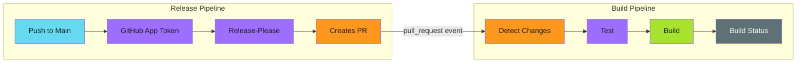

# Modular Release Pipelines

## When to Use This Skill

This guide covers implementing release automation with:

- **Release-please** for version bumping and changelog generation
- **GitHub App authentication** for proper workflow triggering
- **Change detection** to skip unnecessary builds
- **Cascade rebuilds** when shared dependencies change

---

## Prerequisites

Before implementing release pipelines, set up a GitHub App for your organization:

- [GitHub App Setup](../../secure/github-apps/index.md) - Create and configure the App
- [Token Generation](../../patterns/github-actions/actions-integration/token-generation/index.md) - Generate tokens in workflows

---

## Implementation

1. [Set up GitHub App](../../secure/github-apps/index.md) for your organization
2. [Configure release-please](release-please/index.md) with App token
3. [Set up change detection](change-detection.md) for your components
4. [Handle protected branches](protected-branches.md) if applicable

---

## Examples

See [examples.md](examples.md) for code examples.

## Related Patterns

- GitHub App Setup
- Idempotency Patterns
- Three-Stage Design

## References

- [Source Documentation](https://adaptive-enforcement-lab.com/build/release-pipelines/)
- [AEL Build](https://adaptive-enforcement-lab.com/build/)

---
> Converted and distributed by [TomeVault](https://tomevault.io/claim/adaptive-enforcement-lab) — claim your Tome and manage your conversions.
<!-- tomevault:4.0:skill_md:2026-04-15 -->
