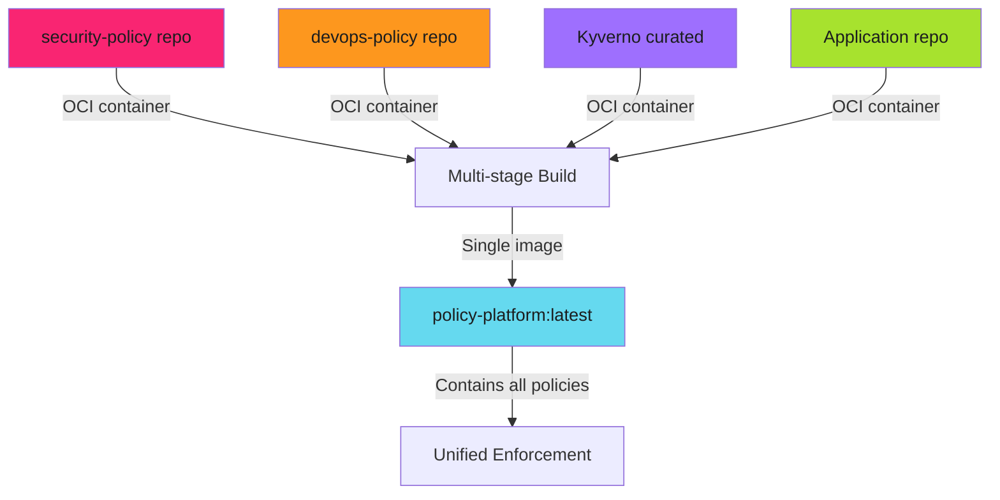

# Multi-Source Policy Aggregation

## When to Use This Skill

Real-world policy management requires aggregating policies from different teams and sources:

> **Policy Repos as OCI Containers**
>
> Each policy repository is **also** an OCI container. Multi-stage Docker builds pull them all automatically. No manual copying or Git submodules.
>

---

## Implementation

See the full implementation guide in the [source documentation](https://adaptive-enforcement-lab.com/enforce/policy-as-code/).

## Examples

See [examples.md](examples.md) for code examples.

## Full Reference

See [reference.md](reference.md) for complete documentation.
## References

- [Source Documentation](https://adaptive-enforcement-lab.com/enforce/policy-as-code/)
- [AEL Enforce](https://adaptive-enforcement-lab.com/enforce/)

---
> Converted and distributed by [TomeVault](https://tomevault.io/claim/adaptive-enforcement-lab) — claim your Tome and manage your conversions.
<!-- tomevault:4.0:skill_md:2026-04-15 -->
