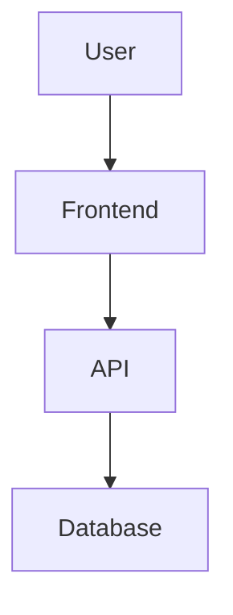

# Architecture Design Skill

Create robust system architectures, technical specifications, and make informed architectural decisions.

## Capabilities

- System architecture design
- Technical specification writing
- Technology stack selection
- Database schema design
- API design
- Microservices vs monolith decisions
- Scalability planning
- Performance optimization strategy

## Architecture Patterns

### For SaaS Applications
```
Frontend (Next.js 14)
  ↓ API Routes
Backend Services
  ↓ Database
PostgreSQL (Supabase)
  + Auth
  + Realtime
  + Storage
```

### For Multi-Agent Systems
```
User Request
  ↓
Supervisor Agent (LangGraph)
  ↓
Specialized Agents (Parallel)
  ↓
State Persistence (Checkpoints)
  ↓
Aggregated Response
```

### For Scraping Projects
```
Input (URLs)
  ↓
Playwright (Browser Automation)
  ↓
Data Extraction
  ↓
Transformation
  ↓
Storage (JSON/Database)
```

## Design Process

### 1. Requirements Analysis
- Understand user needs
- Define success criteria
- Identify constraints (cost, time, tech)
- List non-functional requirements

### 2. Technology Selection
```bash
"Using Deep Research skill:
 Research best options for: {requirement}
 Compare: {option A} vs {option B} vs {option C}
 Consider: performance, cost, DX, community support
 Recommend: Best option with justification"
```

### 3. Architecture Documentation
Create: `docs/ARCHITECTURE.md`

```markdown
# System Architecture

## Overview
[High-level description]

## Tech Stack
- Frontend: {technology} - {reason}
- Backend: {technology} - {reason}
- Database: {technology} - {reason}

## Architecture Diagram


## Key Design Decisions
1. **Decision**: Why we chose X over Y
2. **Decision**: Why we structured Z this way

## Scalability Strategy
- Current: Supports X users
- Future: Can scale to Y users via Z approach

## Security Considerations
- Auth: {approach}
- Data: {encryption, RLS}
- API: {rate limiting, validation}
```

### 4. Database Schema Design
```sql
-- Core entities
CREATE TABLE users (...);
CREATE TABLE main_entity (...);

-- Relationships
CREATE TABLE user_entity_mapping (...);

-- Always enable RLS
ALTER TABLE main_entity ENABLE ROW LEVEL SECURITY;
```

## Architecture Review Checklist

Before finalizing architecture:
- [ ] Meets all functional requirements
- [ ] Scalable to expected user load
- [ ] Cost-effective for current stage
- [ ] Security best practices followed
- [ ] Developer experience is good
- [ ] Deployment strategy defined
- [ ] Monitoring/observability planned
- [ ] Backup/disaster recovery considered

## Common Architecture Decisions

### Monolith vs Microservices
**Use Monolith** (95% of projects):
- Faster development
- Simpler deployment
- Lower overhead
- Better for MVP/early stage

**Use Microservices**:
- Team >50 engineers
- Clear domain boundaries
- Need independent scaling
- Proven product-market fit

### Database Choice
**Supabase** (PostgreSQL + extras):
- Auth built-in
- RLS for security
- Realtime subscriptions
- Good free tier

**Plain PostgreSQL**:
- More control
- Lower cost at scale
- Custom infrastructure

**MongoDB**:
- Document-based data
- Flexible schema
- Horizontal scaling

---

**Remember**: Perfect is the enemy of good. Start simple, scale when needed!

---
> Converted and distributed by [TomeVault](https://tomevault.io/claim/agentpoet) — claim your Tome and manage your conversions.
<!-- tomevault:4.0:skill_md:2026-04-14 -->
