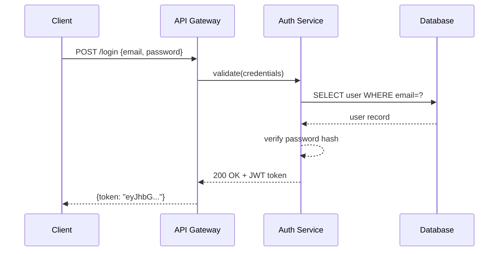
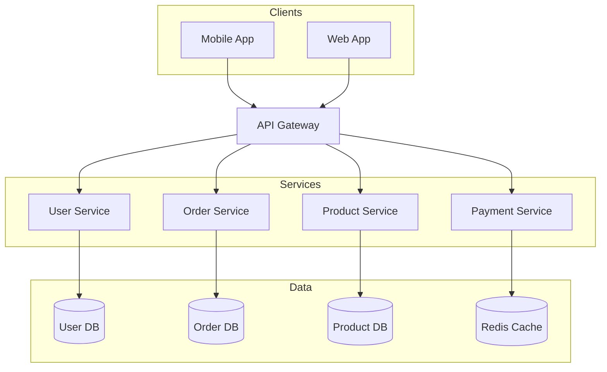
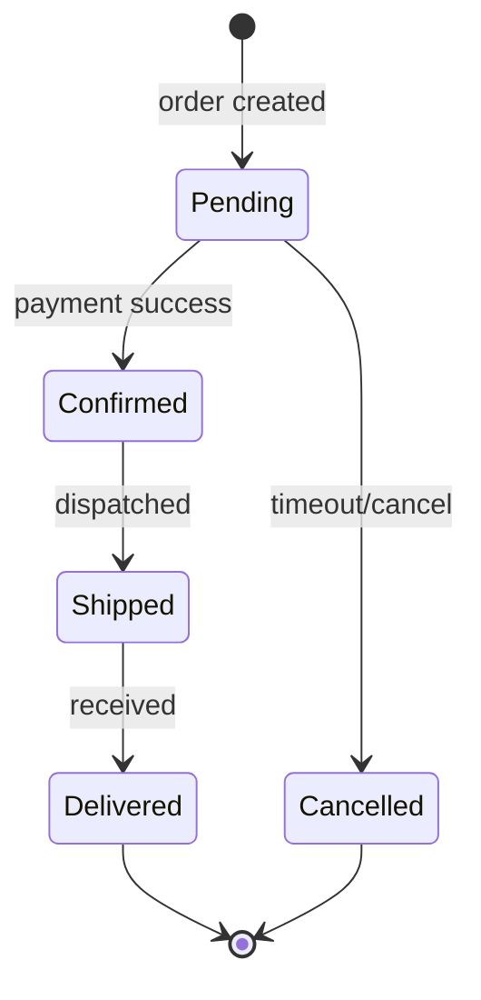

# Mermaid Diagrams

Generate `.mmd` text files and export to PNG/SVG/PDF using `mmdc` (local) or Kroki API (no install).

**Key advantage:** Text-based syntax with **fully automatic layout** — no x/y coordinates needed.

## When to use / when NOT to use

**Use this skill for:** diagrams-as-code with automatic layout (flowchart, sequence, class, state, ER, gantt, mindmap) — text source that lives in git and embeds in Markdown.

**Do NOT use it — route elsewhere — for:**
- Pixel-precise placement, custom layout, branded icons, or heavy styling → **drawio**.
- A hand-drawn / sketchy aesthetic → **excalidraw** or **tldraw**.
- A freeform whiteboard or freehand strokes → **tldraw**.
- Strict, conventional UML notation → **plantuml**.

## Prerequisites

**Option A: Local (mmdc)** — also needs a headless Chrome (mmdc renders via Puppeteer)
```bash
npm install -g @mermaid-js/mermaid-cli
npx puppeteer browsers install chrome-headless-shell   # required — mmdc has no bundled browser
mmdc --version
```
> `mmdc --version` succeeds even with **no** Chrome installed, but every export then fails with `Could not find Chrome`. Install the browser above (or set `PUPPETEER_EXECUTABLE_PATH` to a system Chrome). If you can't, use Kroki (Option B) — it needs no browser.

**Option B: Kroki API (no install)**
```bash
curl --version  # Just need curl
```

## Workflow

1. **Check deps** — `mmdc --version` **and** confirm a headless Chrome is installed (a bare `--version` pass does NOT mean export works); fall back to Kroki if either is missing
2. **Pick diagram type** — choose from table below
3. **Generate** — write `.mmd` file to disk
4. **Validate** — run validation (REQUIRED before export)
5. **Export** — use `mmdc` or Kroki API to produce PNG/SVG/PDF
6. **Self-check (vision)** — read the exported PNG and fix readability/layout defects that automatic layout can't prevent (clipped labels, cramped density, wrong orientation), then re-validate + re-export. Max 2 rounds; skip if no vision. See **Self-Check (vision)** below.
7. **Review loop** — show the image to the user, apply the minimal `.mmd` edit per request, re-export until approved (5-round safety valve). See **Review Loop** below.
8. **Report** — tell user the output file paths

## Validation (Required)

**NEVER export a diagram without validating first.**

```bash
# Validate with mmdc (local)
mmdc -i diagram.mmd -o /tmp/test.png 2>&1

# Validate with Kroki (if mmdc unavailable)
curl -s -X POST -H "Content-Type: text/plain" --data-binary @diagram.mmd https://kroki.io/mermaid/svg -o /tmp/test.svg && echo "Valid" || echo "Invalid"

# If error, fix the .mmd file and validate again
# Only proceed to export after validation passes
```

Common validation errors:
- Missing quotes around labels with special characters
- Wrong arrow syntax (use `->>` for sequence, `-->` for flowchart)
- Undeclared participants in sequence diagrams

> A `Could not find Chrome` (or puppeteer) error from `mmdc` is a **setup** problem, not a diagram error — the `.mmd` may be perfectly valid. Install the browser (see Prerequisites) or validate via Kroki instead of "fixing" correct syntax.

## Self-Check (vision)

Validation (above) only proves the syntax is legal — it says nothing about whether the **rendered** diagram is readable. After exporting, use the agent's vision capability to read the PNG and catch what automatic layout can't prevent. Mermaid positions everything itself, so the failures here are about content and readability, **not** overlaps:

| Check | What to look for | Fix |
|---|---|---|
| Label truncation | Node / edge text clipped or cut off | Shorten the label, or wrap it with `<br/>` |
| Cramped, unreadable density | Too many nodes crammed together; tangled lines | Flip direction (`TD`↔`LR`), split into `subgraph`s, or reduce nodes |
| Wrong orientation / aspect | Diagram far too wide or too tall to read | Change `flowchart TD`↔`LR` (or set `direction` in class/state) |
| Edge spaghetti | Many edges crossing, hard to follow | Reorder node declarations so connected nodes sit adjacent; group with `subgraph` |
| Wrong diagram type | Type doesn't suit the content (e.g. flowchart for a timeline) | Switch type (`gantt`, `sequenceDiagram`, `stateDiagram-v2`, …) |
| Low contrast | Text blends into the node fill | Adjust `classDef` / theme so text contrasts the fill |

- Max **2 self-check rounds** — if issues remain after 2 fixes, show the user anyway.
- **Re-validate (syntax) and re-export after every fix.**
- If vision is unavailable, skip self-check and show the PNG directly.

## Review Loop

After self-check, show the exported image and collect feedback. Apply the **minimal `.mmd` edit** for each request, then re-validate and re-export:

| User request | Edit action |
|---|---|
| Change a label | Edit the node / edge text in the `.mmd` |
| Add / remove a node or edge | Add or delete the matching line |
| Change a color | Add / adjust a `classDef` and `class <node> <className>` |
| Change layout direction | Swap `TD`↔`LR` (flowchart) or set `direction` (class / state) |
| Restructure / group | Wrap related nodes in a `subgraph`, or regenerate |

- Overwrite the same `diagram.mmd` / `diagram.png` each round — don't create `v1`, `v2`, …
- **Safety valve:** after 5 rounds, suggest the user fine-tune at [mermaid.live](https://mermaid.live).

## Diagram Types

| Type | Keyword | Use for |
|------|---------|---------|
| Flowchart | `flowchart TD/LR` | processes, pipelines, decisions |
| Sequence | `sequenceDiagram` | API calls, message passing |
| Class | `classDiagram` | OOP models, data structures |
| ER | `erDiagram` | database schemas |
| State | `stateDiagram-v2` | state machines, lifecycle |
| Gantt | `gantt` | project timelines |
| Pie | `pie` | proportions |
| Git Graph | `gitGraph` | branch strategies |
| C4 Context | `C4Context` | high-level architecture |
| Mind Map | `mindmap` | topic breakdowns |
| User Journey | `journey` | user-experience flows |

## Syntax Reference

**Flowchart**: See [reference/FLOWCHART.md](reference/FLOWCHART.md)
**Sequence**: See [reference/SEQUENCE.md](reference/SEQUENCE.md)
**Class & ER**: See [reference/CLASS-ER.md](reference/CLASS-ER.md)
**Other types**: See [reference/OTHER-TYPES.md](reference/OTHER-TYPES.md)

## Examples

### Example 1: API Authentication Flow

**User prompt:**
> Create a sequence diagram for JWT authentication

**Generated `.mmd`:**


**Output files:** `auth-flow.mmd` + `auth-flow.png`

---

### Example 2: Microservices Architecture

**User prompt:**
> Draw an e-commerce microservices architecture

**Generated `.mmd`:**


**Output files:** `ecommerce-arch.mmd` + `ecommerce-arch.png`

---

### Example 3: Order State Machine

**User prompt:**
> Show order lifecycle states

**Generated `.mmd`:**


**Output files:** `order-states.mmd` + `order-states.png`

## Export Commands

### Option 1: Local Export (mmdc)

Requires `mmdc` installed locally. Best for offline use.

```bash
# PNG (recommended: 2048px wide, white background)
mmdc -i diagram.mmd -o diagram.png -w 2048 --backgroundColor white

# PNG with theme — valid -t values: default | dark | neutral | forest
# (`base` is NOT a valid -t value; it only works inside a %%{init: {'theme':'base'}}%% directive)
mmdc -i diagram.mmd -o diagram.png -w 2048 --backgroundColor white --theme neutral

# SVG
mmdc -i diagram.mmd -o diagram.svg

# PDF
mmdc -i diagram.mmd -o diagram.pdf
```

### Option 2: Kroki API (No Install Required)

Use [Kroki](https://kroki.io) when `mmdc` is not available. No local dependencies needed.

```bash
# SVG via Kroki
curl -X POST -H "Content-Type: text/plain" --data-binary @diagram.mmd https://kroki.io/mermaid/svg -o diagram.svg

# PNG via Kroki
curl -X POST -H "Content-Type: text/plain" --data-binary @diagram.mmd https://kroki.io/mermaid/png -o diagram.png

# PDF is NOT supported by Kroki for Mermaid — POSTing to /mermaid/pdf returns
# HTTP 400 ("Unsupported output format: pdf for mermaid. Must be one of png or svg").
# For PDF, use the local mmdc path instead:  mmdc -i diagram.mmd -o diagram.pdf
```

**Kroki advantages:**
- No local installation required
- Works on any system with `curl`
- Supports 20+ diagram types (PlantUML, GraphViz, D2, etc.)

**When to use Kroki:**
- `mmdc` installation fails
- Quick one-off diagrams
- CI/CD pipelines without Node.js

## Common Mistakes

| Mistake | Fix |
|---------|-----|
| `mmdc` not found | `npm install -g @mermaid-js/mermaid-cli` |
| `mmdc` error `Could not find Chrome` | Install the headless browser: `npx puppeteer browsers install chrome-headless-shell` (or use Kroki) |
| Kroki PDF fails with HTTP 400 | Kroki does PNG/SVG only for Mermaid; use local `mmdc` for PDF |
| Valid diagram reported "invalid" by `mmdc` | The error is a Chrome/puppeteer setup failure, not a syntax error — don't rewrite correct `.mmd`; fix the browser or validate via Kroki |
| Wrong arrow in sequence | Use `->>` for request, `-->>` for response |
| Special chars in label | Wrap in quotes: `A["Label: value"]` |
| Blank/small output | Add `-w 2048` flag |
| Participant order wrong | Declare `participant` explicitly at top |
| Subgraph name with spaces | Wrap in quotes: `subgraph "My Layer"` |

---
> Source: [Agents365-ai/mermaid-skill](https://github.com/Agents365-ai/mermaid-skill) — distributed by [TomeVault](https://tomevault.io).
<!-- tomevault:4.0:skill_md:2026-06-17 -->
