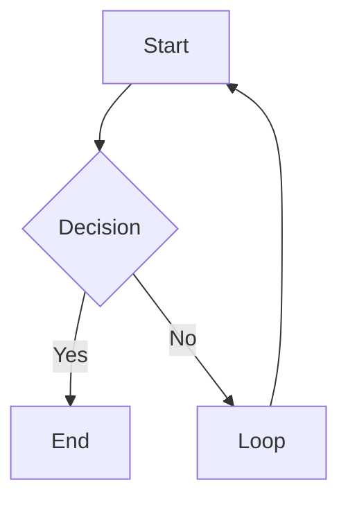

# obsidian-markdown: Obsidian Flavored Markdown

Reference this skill when writing any wiki page. Obsidian extends standard Markdown with wikilinks, embeds, callouts, and properties. Getting syntax wrong causes broken links, invisible callouts, or malformed frontmatter.

**Substrate preference (v1.7+)**: This skill is a self-contained fallback. **Prefer `kepano/obsidian-skills`** (by Steph Ango, Obsidian CEO) as the authoritative substrate — its `obsidian-markdown` skill is the canonical Obsidian syntax reference for any Agent-Skills runtime. If you see an `obsidian-markdown` skill available without the `claude-obsidian:` namespace, that is kepano's version: use it. The reference below is provided so the plugin remains functional when kepano's marketplace is not installed. Install: `claude plugin marketplace add kepano/obsidian-skills`. Repo: [github.com/kepano/obsidian-skills](https://github.com/kepano/obsidian-skills).

---

## Wikilinks

Internal links use double brackets. The filename without extension.

| Syntax | What it does |
|---|---|
| `[[Note Name]]` | Basic link |
| `[[Note Name\|Display Text]]` | Aliased link (shows "Display Text") |
| `[[Note Name#Heading]]` | Link to a specific heading |
| `[[Note Name#^block-id]]` | Link to a specific block |

Rules:
- Case-sensitive on some systems. Match the exact filename.
- No path needed: Obsidian resolves by filename uniqueness.
- If two files have the same name, use `[[Folder/Note Name]]` to disambiguate.

---

## Embeds

Embeds use `!` before the wikilink. They display the content inline.

| Syntax | What it does |
|---|---|
| `![[Note Name]]` | Embed a full note |
| `![[Note Name#Heading]]` | Embed a section |
| `![[image.png]]` | Embed an image |
| `![[image.png\|300]]` | Embed image with width 300px |
| `![[document.pdf]]` | Embed a PDF (Obsidian renders natively) |
| `![[audio.mp3]]` | Embed audio |

---

## Callouts

Callouts are blockquotes with a type keyword. They render as styled alert boxes.

```markdown
> [!note]
> Default informational callout.

> [!note] Custom Title
> Callout with a custom title.

> [!note]- Collapsible (closed by default)
> Click to expand.

> [!note]+ Collapsible (open by default)
> Click to collapse.
```

### All callout types

| Type | Aliases | Use for |
|------|---------|---------|
| `note` |: | General notes |
| `abstract` | `summary`, `tldr` | Summaries |
| `info` |: | Information |
| `todo` |: | Action items |
| `tip` | `hint`, `important` | Tips and highlights |
| `success` | `check`, `done` | Positive outcomes |
| `question` | `help`, `faq` | Open questions |
| `warning` | `caution`, `attention` | Warnings |
| `failure` | `fail`, `missing` | Errors or failures |
| `danger` | `error` | Critical issues |
| `bug` |: | Known bugs |
| `example` |: | Examples |
| `quote` | `cite` | Quotations |
| `contradiction` |: | Conflicting information (wiki convention) |

---

## Properties (Frontmatter)

Obsidian renders YAML frontmatter as a Properties panel. Rules:

```yaml
---
type: concept                    # plain string
title: "Note Title"              # quoted if it contains special chars
created: 2026-04-08              # date as YYYY-MM-DD (not ISO datetime)
updated: 2026-04-08
tags:
  - tag-one                      # list items use - format
  - tag-two
status: developing
related:
  - "[[Other Note]]"             # wikilinks must be quoted in YAML
sources:
  - "[[source-page]]"
---
```

Rules:
- Flat YAML only. Never nest objects.
- Dates as `YYYY-MM-DD`, not `2026-04-08T00:00:00`.
- Lists as `- item`, not inline `[a, b, c]`.
- Wikilinks in YAML must be quoted: `"[[Page]]"`.
- `tags` field: Obsidian reads this as the tag list, searchable in vault.

---

## Tags

Two valid forms:

```markdown
#tag-name             : inline tag anywhere in the body
#parent/child-tag     : nested tag (shows hierarchy in tag pane)
```

In frontmatter:
```yaml
tags:
  - research
  - ai/obsidian
```

Do not use `#` inside frontmatter tag lists. Just the tag name.

---

## Text Formatting

Standard Markdown plus Obsidian extensions:

| Syntax | Result |
|---|---|
| `**bold**` | Bold |
| `*italic*` | Italic |
| `~~strikethrough~~` | Strikethrough |
| `==highlight==` | Highlighted text (yellow in Obsidian) |
| `` `inline code` `` | Inline code |

---

## Math

Obsidian uses MathJax/KaTeX:

Inline math:
```markdown
$E = mc^2$
```

Block math:
```markdown
$$
\int_0^\infty e^{-x} dx = 1
$$
```

---

## Code Blocks

Standard fenced code blocks. Obsidian highlights all common languages:

````markdown
```python
def hello():
    return "world"
```
````

---

## Tables

Standard Markdown tables:

```markdown
| Column A | Column B | Column C |
|----------|----------|----------|
| Value    | Value    | Value    |
| Value    | Value    | Value    |
```

Obsidian renders tables natively. No plugin needed.

---

## Mermaid Diagrams

Obsidian renders Mermaid natively:

````markdown

````

Supported: `graph`, `sequenceDiagram`, `gantt`, `classDiagram`, `pie`, `flowchart`.

---

## Footnotes

```markdown
This sentence has a footnote.[^1]

[^1]: The footnote text goes here.
```

---

## What NOT to Do

- Do not use `[link text](path/to/note.md)` for internal links: use `[[Note Name]]` instead.
- Do not use HTML inside callouts: stick to Markdown.
- Do not use `##` inside a callout body: headings don't render inside callouts.
- Do not write `tags: [a, b, c]` inline in frontmatter: Obsidian prefers the list format.
- Do not write ISO datetimes in frontmatter (`2026-04-08T00:00:00Z`): use `2026-04-08`.

---

## How to think (10-principle mapping)

When working on this skill, apply the 10-principle loop. See [`skills/think/SKILL.md`](../think/SKILL.md) for the canonical framework.

| # | Principle | Application here |
|---|-----------|-------------------|
| 1 | OBSERVE (ext) | Which syntax does the user need? (Wikilinks? Callouts? Embeds? Math? Mermaid?) |
| 2 | OBSERVE (int) | Am I documenting Obsidian Flavored Markdown as I remember it or as it currently is? Check the spec. |
| 3 | LISTEN | The user's source-of-confusion — what specific syntax did they get wrong? |
| 4 | THINK | Minimal correct examples. "What NOT to do" is often as valuable as "what to do." |
| 5 | CONNECT (lat) | How does OFM differ from CommonMark and GFM? The deltas are where users get confused. |
| 6 | CONNECT (sys) | Substrate-defer to kepano/obsidian-skills when present — single source of truth, less drift. |
| 7 | FEEL | A cheat sheet that's scannable in 30 seconds, not a wall of text. |
| 8 | ACCEPT | Not every wikilink needs an alias; some syntax is genuinely optional. Don't over-prescribe. |
| 9 | CREATE | Syntax reference, current to Obsidian X.Y. Include the gotchas section. |
| 10 | GROW | As OFM evolves (newer Mermaid types, callout types, cssclasses, etc.), refresh. |

---
> Source: [AgriciDaniel/claude-obsidian](https://github.com/AgriciDaniel/claude-obsidian) — distributed by [TomeVault](https://tomevault.io).
<!-- tomevault:4.0:skill_md:2026-06-24 -->
