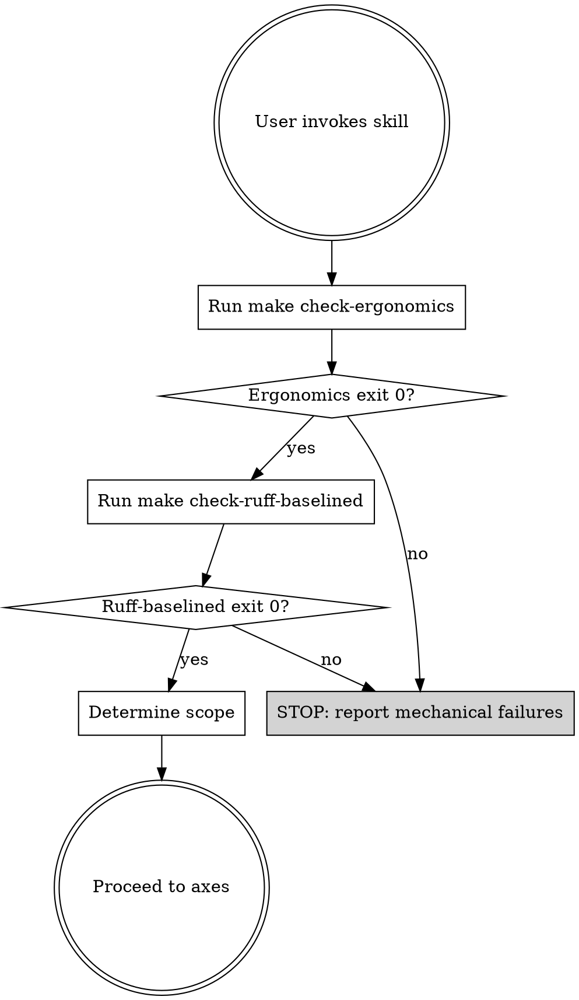

# AIPerf LLM-Ergonomics Review

## Overview

AIPerf enforces mechanical LLM-ergonomics rules via two tools:

- **`tools/check_ergonomics.py`** — 9 custom AST checks: file-size, function-size, nesting-depth, keyword-only-args, module-state, duplicate-classes, pydantic-fields, stdlib-json, exception-message.
- **`tools/ruff_baselined.py`** — 9 ruff rules via a grandfathered baseline: PLR0915, PLR0912, C901, TID251, BLE001, S110, S112, ANN201, D103.

That's **18 mechanical checks** in total (one overlap: `stdlib-json` in the custom tool ≈ `TID251` in ruff, kept for belt-and-suspenders). Those are the FLOOR — they catch tokens-wasted-on-boilerplate and missing-structure.

The CEILING is semantic quality. An exception message can be >3 words and still useless (`"Validation failed: bad input"`). A docstring can exist and still be a restatement of the name. A name can be unique AND hide a synonym conflict. **This skill exists to review the non-mechanical axes with the same rigor that the tools apply to the mechanical ones.**

### Research grounding

Every axis in this skill maps to a specific, citable finding from 2026 research and practitioner writing on agent-friendly codebases — not to local opinion. Primary sources (see References at the bottom for the full list):

- **arxiv 2604.07502** *Beyond Human-Readable* — the "compression paradox" (abbreviated labels cost more tokens than verbose messages because the model must reconstruct meaning); the CODEMAP.md proposal; commit-message density; "strengthen, don't weaken, naming conventions."
- **arxiv 2504.09246** *Type-Constrained Code Generation* — type constraints reduce LLM compilation errors by **>50%**; types act as "compressed documentation" the model interprets semantically.
- **Marmelab 2026** *Agent Experience* — docstring examples with sample I/O; synonyms in comments; search-before-create; gold-standard reference files.
- **Stack Overflow 2026** *Coding guidelines for AI agents* — agents need *explicit* guidelines, not tacit convention; reference files showing correct AND incorrect implementations.
- **Missing Semester MIT 2026** & **Honeycomb (Charity Majors)** — `llms.txt` / `AGENTS.md` / single-source topology docs for session bootstrap.
- **Anthropic** *Effective Context Engineering* — compaction, tool design, subagents; semantic density over token minimization.

Axes below label **research principle** (universal) vs **AIPerf-specific implementation** (local enforcement mechanism) so a reviewer can tell what's grounded in research from what's project housekeeping.

**Core principle:** Every finding must cite a specific file:line, quote the current text, and propose a concrete rewrite. "This could be better" is not acceptable output.

**The 7 judgment axes (with research basis):**

1. Error-message informativeness — *compression paradox* (arxiv 2604.07502)
2. Type-hint descriptiveness — *type constraints reduce errors >50%* (arxiv 2504.09246)
3. Docstring example usefulness — *agents mimic examples verbatim* (Marmelab 2026)
4. Naming disambiguation / synonym discoverability — *synonyms-in-comments* (Marmelab 2026)
5. Comment semantic density — *ratio of meaningful tokens* (arxiv 2604.07502)
6. Convention explicitness — *agents don't absorb tacit conventions* (Stack Overflow 2026)
7. Reference-file exemplariness — *gold-standard implementations* (Stack Overflow 2026, Marmelab 2026)

## When to invoke

Use this skill when:

- A branch/PR is nearly ready to ship and mechanical checks pass.
- The user asks for "an ergonomics review" / "an LLM readability review" / "review for agent-friendliness."
- A refactor touches public API surface (exceptions, public functions, CLAUDE.md, docs/dev/patterns.md).
- A new service, plugin category, or message type is added.

Do NOT use this skill for:

- Mechanical rule violations — those exit via `make check-*`.
- General correctness review — use `aiperf-code-review`.
- Style disputes (quotes, spacing, line length) — that's ruff-format.
- Personal preferences — only flag ambiguity or misleadingness.
- Tiny changes (≤5 lines) — overhead exceeds signal.

## Before starting (non-negotiable preflight)



**Mandatory commands, in order:**

```bash
make check-ergonomics        # expect: "ergonomics: OK (<N> total, <N> baselined, 0 new)"
make check-ruff-baselined    # expect: "ruff-baselined: OK (<N> total, <N> baselined, 0 new)"
git rev-parse --abbrev-ref HEAD
git diff --stat origin/main...HEAD
git diff --name-only origin/main...HEAD | wc -l   # total changed-file count
git diff --name-only origin/main...HEAD           # full list — don't truncate; this is the review scope
```

If either mechanical check exits non-zero: **stop, report the failures, instruct the user to fix them first.** Most of this skill's axes assume the floor is clean — e.g., there's no point reviewing docstring *quality* on functions that are missing docstrings entirely (D103 would have caught that).

## Scope

**Default:** all files modified on the current branch vs. `origin/main`. This intentionally includes agent-facing files (`AGENTS.md`, `CLAUDE.md`, `.github/copilot-instructions.md`, `.cursor/rules/python.mdc`, `docs/dev/patterns.md`) so Axes 6 and 7 have something to review when a branch touches them.

**Per-axis applicability:**

- Axes 1-5 apply to `src/aiperf/**.py` (and any other Python under review).
- Axis 6 applies to the agent-facing convention files listed above.
- Axis 7 applies to `docs/dev/patterns.md` plus any reference files it cites.

If a given axis has no in-scope files on this branch, record "no in-scope files" under that axis in the report — do not skip it silently.

**Override (the user may specify):**

- `aiperf-llm-ergonomics-review <path>` → scope to a file or subdirectory
- `aiperf-llm-ergonomics-review PR <number>` → pull the PR diff via `gh pr diff <n>`
- `aiperf-llm-ergonomics-review full` → all of `src/aiperf/` plus the agent-facing files, not just changed files

Inside the scope, only review code **added or modified on this branch**. Pre-existing issues are not in scope unless the edit touched the line.

## The 7 axes — checklist (create as TaskCreate tasks)

Create one TaskCreate task per axis (7 tasks total). Work them in order. Do not batch findings across axes — keep each axis's output isolated so the final report is scannable.

### Axis 1 — Error-message informativeness (R10 quality)

**Research basis:** arxiv 2604.07502 *Beyond Human-Readable* §"compression paradox" — abbreviated error labels (e.g., `|E|PS|pf|`) cost agents MORE tokens than the verbose form (`"Payment failed for order #4521: insufficient funds"`) because the model must reconstruct the meaning. Mechanical checks only enforce a minimum word count; this axis enforces information content.

For every `raise <Cls>(...)` site added or modified:

**Required checks:**

- [ ] Does the message name the OPERATION that failed? (`"failed to parse dataset 'hellaswag'"` — not `"parse failed"`).
- [ ] Does it name the SPECIFIC INPUT / identifier? (`"dataset 'hellaswag'"` — not `"dataset"`).
- [ ] Does it suggest a NEXT STEP or LIKELY CAUSE when non-obvious? (`"add answer_key to config.yaml or set skip_validation=true"` — not just `"missing field"`).
- [ ] If f-string: are interpolated values meaningful? (`f"config: {config}"` where `config` stringifies to `<Config object at 0x...>` is worse than a plain literal).
- [ ] If re-raising from stdlib: is the original context preserved AND translated? (`raise ConfigurationError(...) from e`).

**Red flags to flag as HIGH severity:**

- Message is only a class name or ≤3-word label (the mechanical tool catches <3 words; >=3 words with no context is still bad).
- Interpolation drops the useful part (`f"error: {type(e).__name__}"` — you just threw away `str(e)`).
- Wraps an exception without re-raising via `from` clause.
- Context-free strings: `"bad input"`, `"invalid"`, `"failed"`, `"error"`, `"unexpected"`, `"oops"`.

**For each finding, record:** file:line, current text, suggested rewrite (verbatim).

### Axis 2 — Type-hint descriptiveness (R11 quality)

**Research basis:** arxiv 2504.09246 *Type-Constrained Code Generation with Language Models* — type constraints reduce LLM compilation errors by **>50%**. arxiv 2604.07502 frames types as "high-information tokens" and "compressed documentation the model interprets semantically." Mechanical ANN201 only enforces "a return type exists"; this axis enforces descriptiveness.

For every public function signature added or modified (skip private `_helpers`):

**Required checks:**

- [ ] Is `Any` used where a concrete `TypedDict` / `Protocol` / `dataclass` would fit?
- [ ] Are `str` parameters that constrain to a fixed set still plain `str`? Should be `Literal[...]`.
- [ ] Are container types specific? `list[ResultBundle]`, not `list`. `dict[str, int]`, not `dict`.
- [ ] Is `X | None` used (project convention) instead of `Optional[X]` / `Union[X, None]`?
- [ ] Do `Callable` types specify arg and return types? `Callable[[AIPerfJobCR], Awaitable[None]]`, not `Callable[..., Any]`.
- [ ] Are `**kwargs: Any` / `*args: Any` used when the contract is actually narrower?

**Red flags (HIGH):**

- Return type `-> Any` on a non-passthrough function.
- `-> dict` or `-> list` with no parameterization.
- `str` for something that is genuinely enum-like.
- Stringly-typed sentinels (`status: str = "pending"` where `status` has ≤6 valid values).

**For each finding, record:** file:line, current signature, suggested signature (verbatim).

### Axis 3 — Docstring example usefulness (R13 quality)

**Research basis:** Marmelab 2026 *Agent Experience* — "Include working usage examples in function docstrings with sample input/output." Agents are mimics: a docstring example is copied verbatim when they invoke the function. An example with real-looking identifiers beats prose every time. Mechanical D103 only enforces "docstring exists"; this axis enforces that the docstring teaches.

For every public function / class / service added or modified **that has a docstring**:

**Required checks:**

- [ ] Is there a runnable example? (`>>>` doctest-style, `Example:` section, or `Usage:` block).
- [ ] Does the example match the current signature (not stale)?
- [ ] Is the example realistic — does it use meaningful names (`job_id="aiperf-bench-7f2a"`), not `foo` / `bar` / `x`?
- [ ] If the function has side-effects (publishes a message, writes a file, mutates state), does the docstring say what?
- [ ] Does a class docstring name the invariants that hold across methods?

**Red flags (MEDIUM):**

- Docstring is a 1-line restatement of the function name in English ("Parses the config." for `def parse_config`).
- Example values are placeholders (`foo = bar`).
- Docstring lists `Args:` but not what they mean (`x: the x parameter`).
- No `Raises:` section on a function that raises project-specific exceptions.

**Calibration:** do not require examples for every trivial method. Flag cases where an agent would likely misuse the API without one.

**Note:** `D103` (in the ruff baseline) catches missing docstrings on public **functions**. It does NOT catch missing docstrings on modules (`D100`), classes (`D101`), methods (`D102`), or `__init__` (`D107`) — those rules are not enabled. So for public *classes* and *methods*, the absence of a docstring is also an Axis 3 finding (a method silently has no docstring and the mechanical tools didn't warn).

### Axis 4 — Naming disambiguation / synonym discoverability (R7 + R17)

**Research basis:** Marmelab 2026 *Agent Experience* recommends incorporating domain synonyms in comments ("mention 'Client' and 'User' alongside 'Customer'") and instructing agents to "search for existing similar code before creating new methods." arxiv 2604.07502 explicitly argues for *strengthening*, not weakening, naming conventions — meaningful names are "compressed documentation the model interprets semantically." The mechanical duplicate-class-name check catches exact collisions; this axis catches the near-misses that cause agents to miss-find existing code and re-create it.

For every new class, public function, module path, or constant:

**Required checks:**

- [ ] Grep for the name across the repo — is there an existing similar concept with a synonym? AIPerf near-collisions to check: `Client` / `User` / `Customer` / `Session`; `Metric` / `Record` / `Result` / `Sample`; `Worker` / `Service` / `Component` / `Process`; `Credit` / `Request` / `Turn` / `Conversation`.
- [ ] If a synonym exists, is it mentioned in the docstring or a comment? (`"""A Credit is the internal name for what external docs call a 'work unit'."""`)
- [ ] Does the name describe the BEHAVIOR (verb phrase) or the IDENTITY (noun)? Prefer verbs for functions, nouns with specific roles for classes (`HistogramStatsComputer` > `StatsHelper`).
- [ ] Does the name collide ambiguously with a stdlib/framework name? (`Request`, `Response`, `Task`).

**Red flags (MEDIUM):**

- Class name ends in `-Helper`, `-Manager`, `-Utility`, `-Handler` without context (`StatsHandler` is a shrug; `StatsFlushHandler` is specific).
- Name is technically unique but is a plural where the singular exists elsewhere (`Workers` the class vs `Worker` the class — agents will grep wrong).
- Acronym usage without first-use expansion in a docstring (`CR`, `CRD`, `PPT`, `OSL`).

**Cross-reference:** the duplicate-class-name check in `check_ergonomics.py` catches exact collisions. This axis catches the near-misses.

### Axis 5 — Comment semantic density (R9 direct)

**Research basis:** arxiv 2604.07502 *Beyond Human-Readable* defines semantic density as "the ratio of meaningful information to total tokens" — the optimization target for agentic code is not token minimization but density. Restating-the-obvious comments carry near-zero information; comments that document a non-local constraint or a past bug carry high information. Project caveat: AIPerf's CLAUDE.md follows this principle (`"Comments only for 'why?' not 'what'"`) — the research and the local convention align here, not conflict.

For every comment added or modified:

**Required checks:**

- [ ] Does it explain WHY, not WHAT? (WHAT is already in the code.)
- [ ] Is it specific? (`"cache bypassed here because upstream is eventually-consistent"` > `"cache hack"`.)
- [ ] Is it current? Does it reference code that still exists and line numbers that haven't drifted?
- [ ] Could the comment be eliminated by a better name? (Rename > comment.)

**Red flags (LOW-MEDIUM):**

- `# TODO` / `# HACK` / `# FIXME` with no issue link, author, or date.
- Restating the code in English (`# increment counter` above `counter += 1`).
- Dead-code comment (`# was: old_logic()`) — delete it; git log is authoritative.
- Copy-pasted comment from another file that doesn't fit here.

**Important:** comments are genuinely optional in AIPerf (CLAUDE.md rule). A clean diff with zero comment findings is a GOOD outcome for this axis. Resist the urge to manufacture findings.

### Axis 6 — Convention explicitness (R15 quality)

**Research basis:** Stack Overflow 2026 *Building shared coding guidelines for AI* — "Coding guidelines for agents need to be more explicit, demonstrative of patterns, and obvious." Addy Osmani 2026 and Missing Semester MIT 2026 both recommend a canonical `CLAUDE.md` / `AGENTS.md` / `llms.txt` file that agents load on session start, because agents do NOT absorb tacit conventions from surrounding code reliably. Anthropic's *Effective Context Engineering* reinforces this: explicit documented conventions collapse session-bootstrap cost.

**Research principle (universal, across all projects):** when a branch introduces a new pattern that an agent will need to follow (a new service type, a new plugin category, a new message-handler style, a new exception hierarchy, a new invariant at call sites), there MUST be an explicit one-line statement of that pattern in the project's agent-facing convention file(s). Don't rely on "the agent will pick it up from the code" — that's the tacit-absorption failure mode the research warns against.

For every new pattern introduced on this branch:

- [ ] Is the pattern documented in at least one of the project's agent-facing files? (AIPerf: `AGENTS.md`, `CLAUDE.md`, `.github/copilot-instructions.md`, `.cursor/rules/python.mdc`, or `docs/dev/patterns.md`.)
- [ ] If the pattern has an invariant ("always call X after Y"; "never raise in an @on_message handler"), is the invariant documented somewhere an agent will find it (not just at one call site)?
- [ ] If this pattern replaces an older one, is the replacement noted (and the old one either deleted or marked deprecated in the convention file)?

**AIPerf-specific implementation — four-file sync:** AGENTS.md explicitly mandates that `AGENTS.md`, `CLAUDE.md`, `.github/copilot-instructions.md`, and `.cursor/rules/python.mdc` contain identical content (only headers/frontmatter differ). This is AIPerf's LOCAL mechanism for ensuring the research principle holds across the four major agent surfaces (Codex, Claude Code, Copilot, Cursor). When one file is updated, verify the other three were updated to match.

**Red flags (HIGH if the pattern is load-bearing, MEDIUM otherwise):**

- New pattern used in 2+ places on this branch with zero documentation in any convention file (research violation).
- One of `AGENTS.md`, `CLAUDE.md`, `.github/copilot-instructions.md`, or `.cursor/rules/python.mdc` updated without the other three (AIPerf-specific four-file-sync violation).
- Deprecated pattern still referenced as current in docs (research violation — agents will model after the stale doc).

### Axis 7 — Reference-file exemplariness (R16 quality)

**Research basis:** Stack Overflow 2026 — "Provide explicit examples of both correct and incorrect implementations and a reference file showing code that follows all guidelines." Marmelab 2026 — "Store technical documentation for external APIs/libraries alongside the codebase rather than relying on external resources." Agents grep for existing patterns before writing new code; if the file they find violates the rule it's supposed to teach, the agent copies the violation.

`docs/dev/patterns.md` is AIPerf's canonical catalog of code patterns (CLI Command, Service, Model, Message, Plugin, Error Handling, Logging, etc.). Its code blocks are labeled with source file paths in leading comments — e.g., a block starting with `# aiperf/cli.py — register with lazy import strings` or `# cli_commands/kube/cancel.py` identifies the file as the reference implementation for that pattern slice. (Note: path prefixes are inconsistent — some include `aiperf/`, others start at `cli_commands/`; don't over-constrain the grep.)

**Required checks:**

- [ ] Extract the referenced paths with a permissive grep, e.g. `grep -nE '^# [a-z_/.]+\.py' docs/dev/patterns.md`. Manually strip the comment prefix to get file paths; resolve each against the repo root (try both `<path>` and `src/<path>`).
- [ ] For each referenced path that is **also modified on this branch**:
  - [ ] Does the modified file still exemplify the pattern as shown in `patterns.md`?
  - [ ] Has the branch introduced a change that would make the example in `patterns.md` misleading or stale (e.g., renamed a function the snippet shows, removed a decorator it demonstrates, changed the import path)?
- [ ] Is a new reference candidate missing from `patterns.md`? If this branch adds a genuinely exemplary implementation of a pattern (or the first instance of a new pattern), flag that `patterns.md` should be extended.

**Red flags (HIGH):**

- `patterns.md` shows `aiperf/foo.py` demonstrating a pattern but this branch changed `foo.py` in a way that breaks the shown example.
- Reference file now has entries in `tools/ruff_baseline.json` or `tools/ergonomics_baseline.json` (it's grandfathering violations of rules it's supposed to teach) — grep the baselines for the file path.
- A narrow `# noqa: <RULE>` in the reference file is acceptable if accompanied by a comment explaining why (e.g., `# noqa: BLE001 - fault-tolerant telemetry`). An unexplained `# noqa` in a gold-standard file is a finding.

## Running the axes

1. `TaskCreate` one task per axis (7 tasks total).
2. Mark the current axis `in_progress` BEFORE inspecting code. This prevents batching.
3. For each axis, produce a findings list *in memory first*, then format into the report.
4. After each axis, mark it `completed` and move to the next.
5. Do NOT skip an axis because "there's nothing to find" — every axis gets a section in the report (even if the section says "no findings on this axis").

## Output

**File:** `artifacts/code-review-YYYY-MM-DD/llm-ergonomics-<branch-slug>.md`

(Create the date dir if it doesn't exist. `branch-slug` is the current branch with `/` replaced by `-`.)

Use a readable PR-comment style. Avoid wide finding tables; they are hard to
read in GitHub comments. Keep the counts compact, then give one section per
finding.

**Structure:**

````markdown
# LLM-Ergonomics Review — <branch> @ YYYY-MM-DD

I reviewed <N> changed `src/aiperf/` files on <branch-or-commit>.

Model used: <specific model/version and settings, e.g. "GPT-5.5 xhigh" or "Claude Opus 4.7 (1M context) max">

## Preflight

- `make check-ergonomics`: exit 0
- `make check-ruff-baselined`: exit 0
- Scope: <N> files changed vs origin/main (listed below)

## Summary

I found <N> LLM-ergonomics issues:

- High: <h>
- Medium: <m>
- Low: <l>

Top issue: <one sentence naming the highest-priority finding and why it matters>.

## Findings

### <Severity> - <Short Finding Title>

Axis: <axis number and name>

File: `<path>:<line>`

Current code/text:

```python
<quote the current code or text>
```

Why this matters:

<Explain the semantic risk in 1-3 sentences.>

Suggested rewrite:

```python
<verbatim concrete rewrite>
```

<details>
<summary>Prompt for AI Agents</summary>

```
Verify each finding against the current code and only fix it if needed.

In `@<path>` around lines <line-start> - <line-end>, re-open the current code
and confirm <finding-specific condition> still applies before making changes.
Inspect <related symbols, call sites, tests, docs, or generated files>. If
confirmed, make the smallest change that <finding-specific semantic fix>, while
preserving <relevant AIPerf pattern or local convention>. Treat the suggested
rewrite as guidance, not a patch to apply blindly. Update the specific affected
tests, docs, or generated files. Do not perform unrelated refactors while
addressing this finding.
```

</details>

Repeat one section per finding, ordered by severity, then by file.

## Axes With No Findings

- Error messages: <brief note or omit if this axis has findings>
- Type hints: <brief note or omit if this axis has findings>
- Docstring examples: <brief note or omit if this axis has findings>
- Naming: <brief note or omit if this axis has findings>
- Comments: <brief note or omit if this axis has findings>
- Conventions: <brief note or omit if this axis has findings>
- Reference files: <brief note or omit if this axis has findings>

## Prioritized action list

HIGH-severity items first, grouped by file to minimize context switches for the fixer:

1. `<path>:<line>` — <highest-priority action>.
2. ...

## What Looks Good

- <High-signal positive observation, especially where an axis is clean.>
````

## Anti-patterns (self-check before submitting)

| If you find yourself... | Stop because... |
|---|---|
| ...skimming rather than reading each raise site | This skill exists because skimming misses what matters. Slow down. |
| ...saying "most of these are fine" | Run the checklist literally. Quote the current text; propose a rewrite. |
| ...flagging things the mechanical tools already catch | Those are not in scope. If you're duplicating BLE001 findings, you're in the wrong document. |
| ...writing "this could be clearer" | Insufficient. Give the exact rewrite or don't flag it. |
| ...batching findings across axes | Per-axis isolation is what makes the report scannable for the fixer. |
| ...editing code | This is REVIEW only. Do not fix during the pass. Findings go to the report; fixes are the user's call. |
| ...claiming done without writing the report | The deliverable is the markdown file. No report = not done. |

## Finishing the task

Before claiming complete:

- [ ] Report written to `artifacts/code-review-YYYY-MM-DD/llm-ergonomics-<branch-slug>.md`
- [ ] All 7 axes are accounted for by a finding or the "Axes With No Findings" section
- [ ] Every finding ends with a collapsed `Prompt for AI Agents` block with a fenced prompt after the suggested rewrite
- [ ] Every HIGH-severity finding has a verbatim suggested rewrite
- [ ] Summary at top has accurate High / Medium / Low counts
- [ ] Prioritized action list at bottom groups by file
- [ ] User is told the exact path to the report
- [ ] Code is unchanged (this is review, not fix)

Report concisely to the user:

```text
LLM-ergonomics review complete: <N> findings (H: <h>, M: <m>, L: <l>)
Report: artifacts/code-review-YYYY-MM-DD/llm-ergonomics-<branch-slug>.md
Highest-priority: <one-line summary of the top HIGH finding>
```

## References

### Mechanical tooling (AIPerf-local)

- The 18 mechanical checks and their baselines: `tools/check_ergonomics.py`, `tools/ruff_baselined.py`, `tools/ergonomics_baseline.json`, `tools/ruff_baseline.json`.
- Sibling skill: `aiperf-code-review` for correctness review (different goal — use both sequentially on important PRs).

### Primary research sources for the 7 axes

The axes above are not local opinion — each maps to a specific finding in this body of 2026 research and practitioner writing:

- [**arxiv 2604.07502** — *Beyond Human-Readable: Rethinking Software Engineering Conventions for the Agentic Development Era*](https://arxiv.org/html/2604.07502) — semantic density, compression paradox, CODEMAP.md, commit message density, strengthening (not weakening) naming conventions. Axes 1, 2, 4, 5.
- [**arxiv 2504.09246** — *Type-Constrained Code Generation with Language Models*](https://arxiv.org/pdf/2504.09246) — types reduce LLM compile errors >50%. Axis 2.
- [**Marmelab — Agent Experience: Best Practices for Coding Agent Productivity (2026)**](https://marmelab.com/blog/2026/01/21/agent-experience.html) — docstring examples, synonyms in comments, search-before-create, reference files, API defaults. Axes 3, 4, 7.
- [**Stack Overflow — Building shared coding guidelines for AI (and people too) (2026)**](https://stackoverflow.blog/2026/03/26/coding-guidelines-for-ai-agents-and-people-too/) — explicit-not-tacit conventions, gold-standard examples. Axes 6, 7.
- [**Missing Semester MIT — Agentic Coding (2026)**](https://missing.csail.mit.edu/2026/agentic-coding/) — `llms.txt` / `AGENTS.md` for session bootstrap. Axis 6.
- [**Honeycomb — How I Code With LLMs These Days**](https://www.honeycomb.io/blog/how-i-code-with-llms-these-days) — `llms.txt`, incrementalism, consistency. Axis 6.
- [**Addy Osmani — My LLM coding workflow going into 2026**](https://addyosmani.com/blog/ai-coding-workflow/) — `CLAUDE.md` process rules, granular commits. Axis 6.
- [**Anthropic — Effective Context Engineering for AI Agents**](https://www.anthropic.com/engineering/effective-context-engineering-for-ai-agents) — compaction, tool design, subagents, semantic density over minimization. Underlies the skill's structure.

---
> Source: [ai-dynamo/aiperf](https://github.com/ai-dynamo/aiperf) — distributed by [TomeVault](https://tomevault.io).
<!-- tomevault:4.0:skill_md:2026-06-30 -->
