# Mermaid Skill

Use this skill to design, write, and validate Mermaid diagrams. Covers design principles for clear visual explanation, a decision guide for choosing diagram types, and a syntax reference for all 18 Mermaid diagram types. Validation uses the official Mermaid CLI.

## Arguments

When this skill is invoked, the user may provide a **file path and name** as an argument:

```
@skills/mermaid/skill.md <filename.mmd>
```

Examples: `vue-architecture.mmd`, `docs/auth-flow.mmd`, `db-schema.mmd`

- If a filename is provided, use it exactly as given.
- If **no filename** is provided, derive a descriptive kebab-case name from the diagram's subject (e.g. `user-auth-flow.mmd`, `payment-sequence.mmd`, `order-er-diagram.mmd`). Place it in the **project root**.
- **Never** reuse a generic name like `diagram.mmd`. Every diagram gets its own descriptively named file.

## Prerequisites

- Node.js + npm (for `npx`).
- First run downloads a headless Chromium via Puppeteer. If Chromium is missing, set `PUPPETEER_EXECUTABLE_PATH`.

## Tool

### Validate a diagram

The validate script lives **inside the skill directory**. Use the path relative to the skill, not the working directory:

```bash
skills/mermaid/tools/validate.sh <filename.mmd> [output.svg]
```

- Parses and renders the Mermaid source.
- Non-zero exit = invalid Mermaid syntax.
- Prints an ASCII preview using `beautiful-mermaid` (best-effort; not all diagram types are supported).
- If `output.svg` is omitted, the SVG is rendered to a temp file and discarded.

## Workflow (short)

1. Choose a **descriptive filename** for the diagram (from the argument or derived from the subject). Use kebab-case with `.mmd` extension.
2. Write the Mermaid source to that file in the project root (or the path given).
3. Run `skills/mermaid/tools/validate.sh <filename.mmd>`.
4. Fix any errors shown by the CLI.
5. **Always show the ASCII preview output to the user.** The tool prints an ASCII rendering of the diagram — display it in your response so the user can see the result without opening another tool.
6. **Quality check before finishing.** Review the diagram against this checklist:
   - Title or header present (e.g. `title`, `---\ntitle:`, or a top-level label)
   - 5–15 nodes. If more, split into separate diagrams.
   - Every edge has a label (what flows, what triggers, what relationship)
   - Labels are concrete and specific — no vague "data", "process", or "info"
   - Colors/styles encode meaning or are absent — no decorative styling
   - Diagram type matches the question being answered (see *Choosing the Right Diagram Type* below)
7. Once it validates and passes the quality check, if the diagram will live in Markdown, copy the Mermaid block into the target Markdown file.

---

## Design Principles

### Scope and Focus

- **One concept per diagram.** A diagram should answer one question. "How does auth work?" is one diagram. "How does the whole system work?" is five diagrams.
- **5–15 nodes is the sweet spot.** Fewer than 5 and you probably don't need a diagram. More than 15 and readers get lost — split it up.
- **Title everything.** Every diagram needs a title or prominent top-level label. Without one, readers have to reverse-engineer what they're looking at.
- **Scope to your audience.** A diagram for a new teammate shows different detail than one for a principal engineer. Match the abstraction level to who's reading it.

### Labels and Naming

- **Be concrete and specific.** "User submits order" beats "data". "POST /api/orders" beats "request". If a label could apply to anything, it's too vague.
- **Verb-first edge labels.** Edges describe actions or relationships: "sends auth token", "triggers rebuild", "contains". Noun-only labels ("data", "response") leave the reader guessing.
- **No orphan abbreviations.** If you use an abbreviation, define it in the node text: `DB["PostgreSQL Database"]`, not just `DB`.
- **Meaningful node IDs.** Use IDs that read naturally in the source: `authService`, `orderDB`, not `A`, `B`, `C`. This also makes the `.mmd` file self-documenting.

### Visual Clarity

- **Maximize the data-ink ratio.** Every visual element should convey information. If a color, line, or shape doesn't encode meaning, remove it.
- **Relationships matter more than node decoration.** Spend effort on edge labels and flow direction, not on styling individual boxes.
- **Direction encodes meaning.** Top-down (`TD`) implies hierarchy or time flow. Left-right (`LR`) implies a pipeline or data flow. Choose direction intentionally.
- **Use subgraphs to reduce clutter.** Group related nodes into named subgraphs. This creates visual hierarchy and lets readers zoom in mentally.
- **Show dynamics, not just structure.** Where possible, show what triggers transitions, what messages flow, what changes state — not just which boxes connect.

### Common Mistakes to Avoid

- **The mega-diagram.** Cramming an entire system into one diagram. If you need to scroll, you need to split.
- **The decoration trap.** Adding colors, thick borders, and gradients "to make it look nice." If the colors don't encode meaning (like status or category), they're noise.
- **The abstraction mismatch.** Mixing high-level architecture with implementation details. Don't show "Kubernetes Pod" next to "User clicks button" in the same diagram.
- **Unlabeled edges.** An arrow without a label says "these are related somehow." That's almost never enough information.

---

## Choosing the Right Diagram Type

| Question you're answering | Diagram type |
|---|---|
| How does this process work? | Flowchart |
| What messages pass between services? | Sequence Diagram |
| What are the parts and relationships? | Class / ER Diagram |
| What states can this be in? | State Diagram |
| What's the system architecture? | Architecture / Block |
| When did things happen? | Timeline / Gantt |
| How do quantities flow or distribute? | Sankey / Pie |
| How do options compare on two axes? | Quadrant Chart |
| What's the branching strategy? | Git Graph |
| What tasks are in what stage? | Kanban |

**Rule of thumb:** Flowcharts and sequence diagrams cover 80% of needs. Start there unless the question clearly calls for something else.

---

## Syntax Reference

Detailed syntax for every Mermaid diagram type. See *Design Principles* above for guidance on what makes a diagram effective, and *Choosing the Right Diagram Type* to pick the right one.

### General Syntax Tips

**Multi-line labels:** `\n` does **not** work in Mermaid. Use markdown strings with backticks and real newlines:

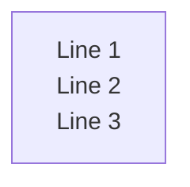

Markdown strings also support **bold** (`**text**`) and *italic* (`*text*`) formatting inside the backticks.

### 1. Flowchart

**Use for:** Process flows, decision trees, workflows, algorithms.

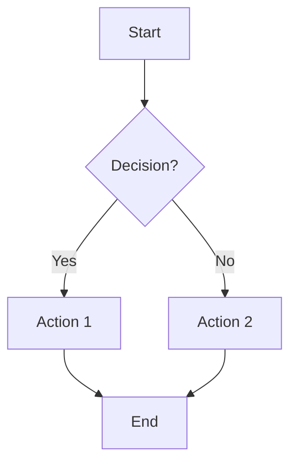

**Directions:** `TB`/`TD` (top-down), `BT`, `LR`, `RL`

**Node shapes:** `A[rect]` `A(rounded)` `A([stadium])` `A[[subroutine]]` `A[(cylinder)]` `A((circle))` `A{diamond}` `A{{hexagon}}` `A[/parallelogram/]` `A[/trapezoid\]` `A(((double circle)))`

**Links:** `-->` arrow, `---` open, `-.->` dotted, `==>` thick, `~~~` invisible, `<-->` bidirectional. Add text: `-->|text|` or `-- text -->`

**Subgraphs:** `subgraph id[title] ... end`

**Styling:** `style A fill:#f9f,stroke:#333` or `classDef cls fill:#f9f; A:::cls`

### 2. Sequence Diagram

**Use for:** API calls, service interactions, request/response flows, protocol sequences.

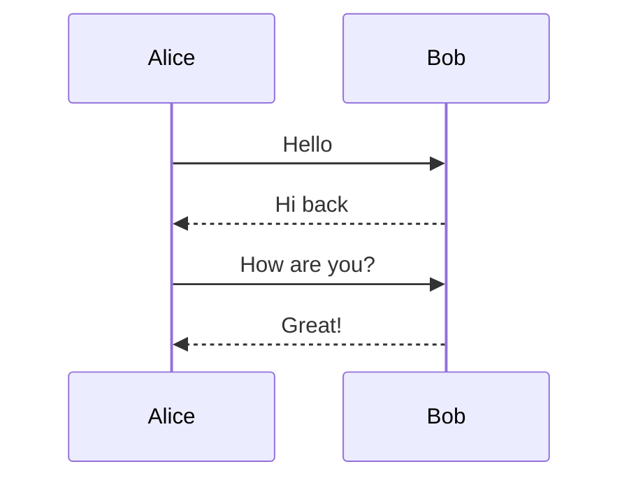

**Participants:** `participant`, `actor`. Stereotypes (JSON config): `boundary`, `control`, `entity`, `database`, `collections`, `queue`

**Arrows:** `->>` solid+arrowhead, `-->>` dotted+arrowhead, `-x` cross end, `-)` async open arrow, `<<->>` bidirectional

**Activations:** `activate A` / `deactivate A` or shorthand `A->>+B: msg` / `B-->>-A: reply`

**Notes:** `Note right of A: text` or `Note over A,B: text`

**Control flow:**
- `loop text ... end`
- `alt text ... else ... end`
- `opt text ... end`
- `par [Action 1] ... and [Action 2] ... end`
- `critical [text] ... option [text] ... end`
- `break [text] ... end`

**Grouping:** `box color Title ... end`

**Background highlight:** `rect rgb(0,255,0) ... end`

### 3. Class Diagram

**Use for:** OOP class structures, inheritance hierarchies, domain models.

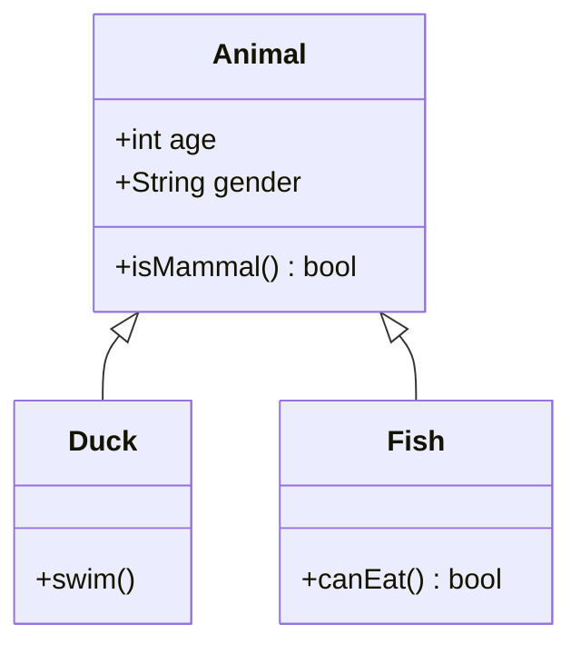

**Members:** Bracket syntax `Class { +method() returnType; -field type }`. Visibility: `+` public, `-` private, `#` protected, `~` internal. Classifiers: `*` abstract, `$` static.

**Relationships:** `<|--` inheritance, `*--` composition, `o--` aggregation, `-->` association, `..>` dependency, `..|>` realization

**Cardinality:** `ClassA "1" --> "*" ClassB`

**Annotations:** `<<Interface>>`, `<<Abstract>>`, `<<Enumeration>>`, `<<Service>>`

**Generics:** `List~int~`

**Namespaces:** `namespace Name { class A { } }`

**Notes:** `note "text"` or `note for ClassName "text"`

### 4. State Diagram

**Use for:** Finite state machines, lifecycle states, object state transitions.

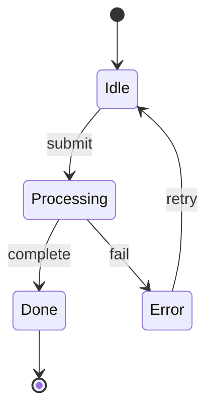

**States:** `stateName`, `stateName : Description`, `state "Description" as s1`

**Start/End:** `[*] --> First`, `Last --> [*]`

**Composite:** `state CompositeState { InnerA --> InnerB }`

**Choice:** `state decision <<choice>>`

**Fork/Join:** `state fork <<fork>>`, `state join <<join>>`

**Notes:** `note right of State : text ... end note`

**Concurrency:** `state Parallel { A --> B -- C --> D }` (use `--` separator)

**Direction:** `direction LR` (or `RL`, `TB`, `BT`)

### 5. Entity Relationship Diagram

**Use for:** Database schemas, data models, table relationships.

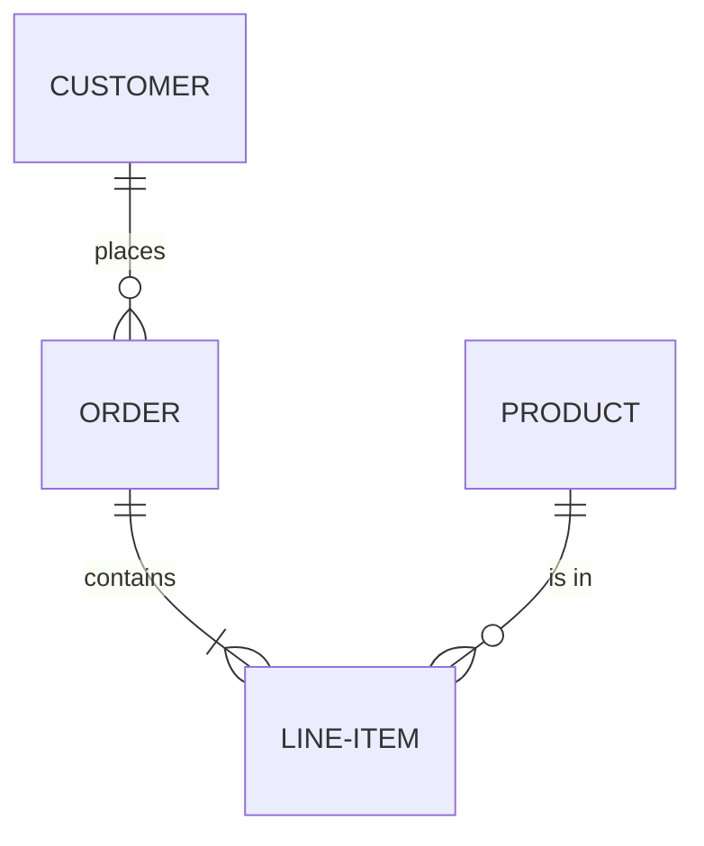

**Cardinality:** `||` exactly one, `o|` zero or one, `}|` one or more, `o{` zero or more

**Line style:** `--` identifying (solid), `..` non-identifying (dashed)

**Attributes:**
```
ENTITY {
    string name PK
    int age
    string email UK "user email"
}
```
Key types: `PK`, `FK`, `UK`

### 6. Gantt Chart

**Use for:** Project schedules, task timelines, sprint planning.

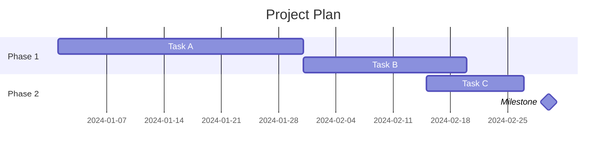

**Task format:** `Task name :tags, id, start, end/duration`. Tags: `done`, `active`, `crit`, `milestone`

**Dependencies:** `after taskId`, `until taskId`

**Date config:** `dateFormat YYYY-MM-DD`, `axisFormat %Y-%m-%d`

**Excludes:** `excludes weekends` or specific dates

### 7. Pie Chart

**Use for:** Proportions, distributions, market share.

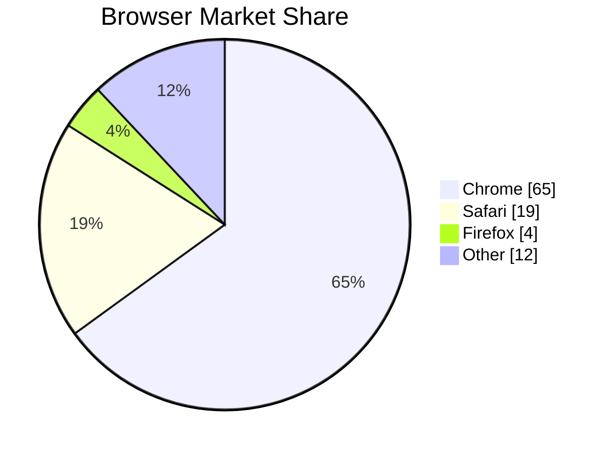

**Syntax:** `pie [showData] [title text]` then `"label" : value` per line. Values must be positive numbers.

### 8. Git Graph

**Use for:** Branch strategies, release flows, git workflows.

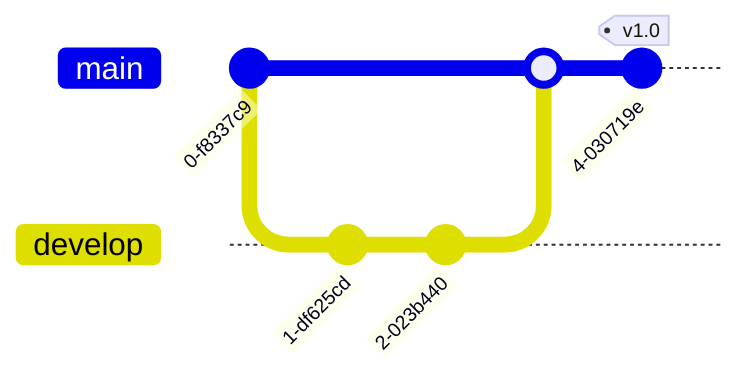

**Commands:** `commit`, `branch name`, `checkout name`, `merge name`, `cherry-pick id:"commitId"`

**Commit options:** `id: "abc"`, `tag: "v1.0"`, `type: NORMAL|REVERSE|HIGHLIGHT`

### 9. Mindmap

**Use for:** Brainstorming, topic hierarchies, concept maps.

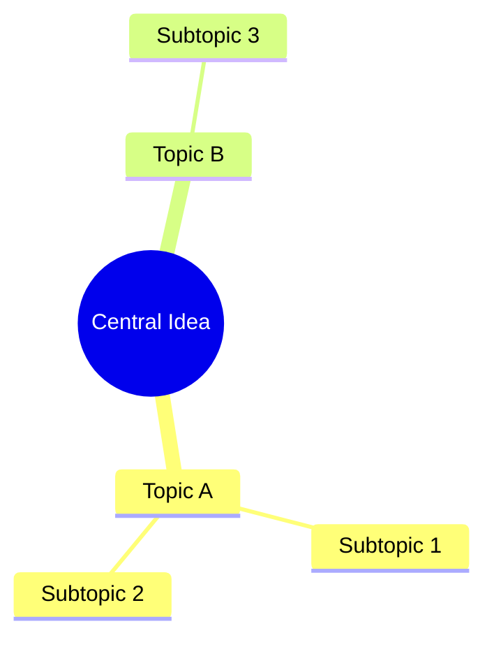

**Hierarchy:** Indentation defines parent-child relationships.

**Shapes:** `[square]`, `(rounded)`, `((circle))`, `)cloud(`, `{{hexagon}}`, `))bang((` or plain text.

**Icons:** `::icon(fa fa-book)` after node text.

**Classes:** `:::className` after node text.

### 10. Timeline

**Use for:** Historical events, release histories, roadmaps.

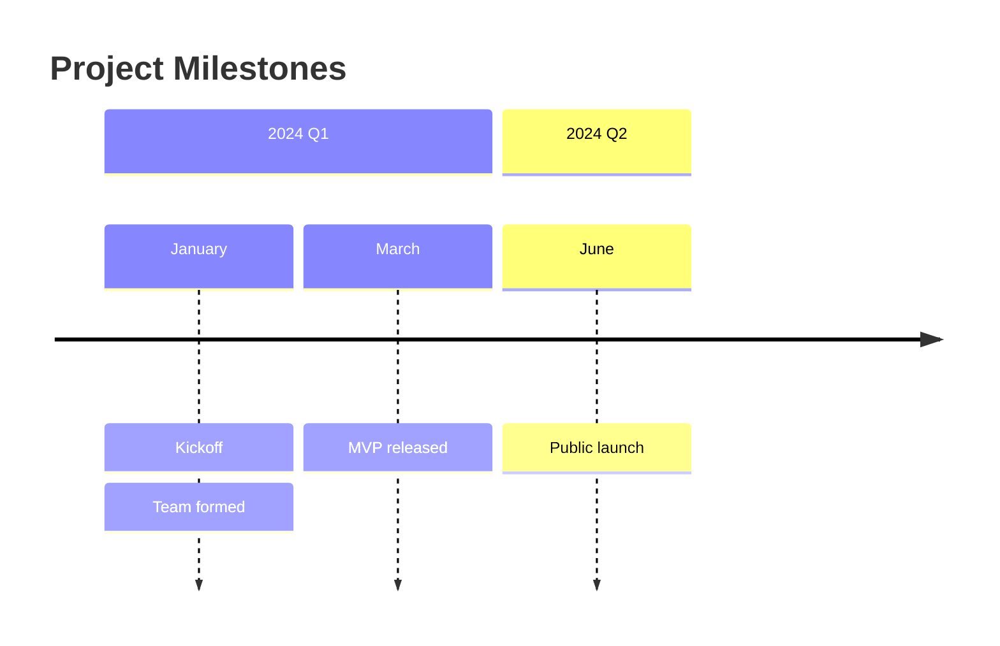

**Syntax:** `time period : event1 : event2` or stack events on separate lines with `: event`.

**Sections:** `section Title` groups subsequent entries.

### 11. User Journey

**Use for:** UX flows, customer experience mapping, satisfaction scoring.

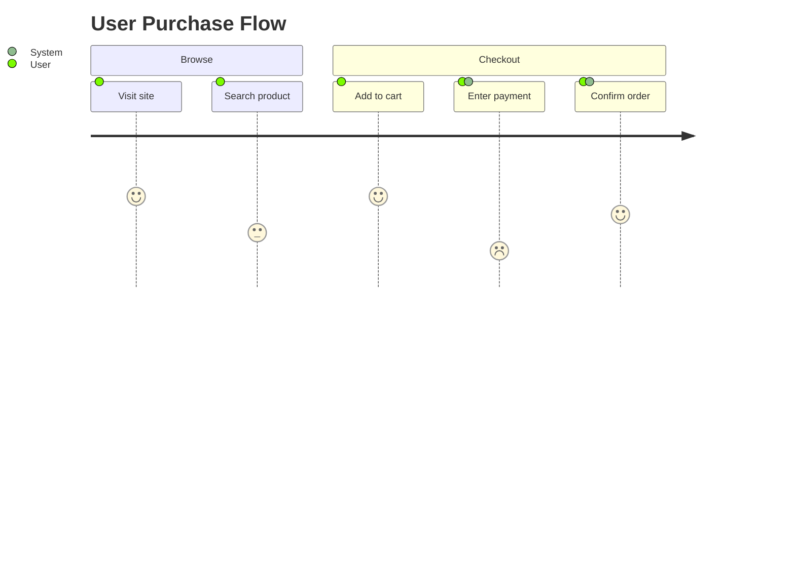

**Syntax:** `Task name: score: actor1, actor2`. Score is 1-5 (1=bad, 5=great).

**Sections:** Group tasks into phases.

### 12. Quadrant Chart

**Use for:** Priority matrices, competitive analysis, effort-vs-impact plots.

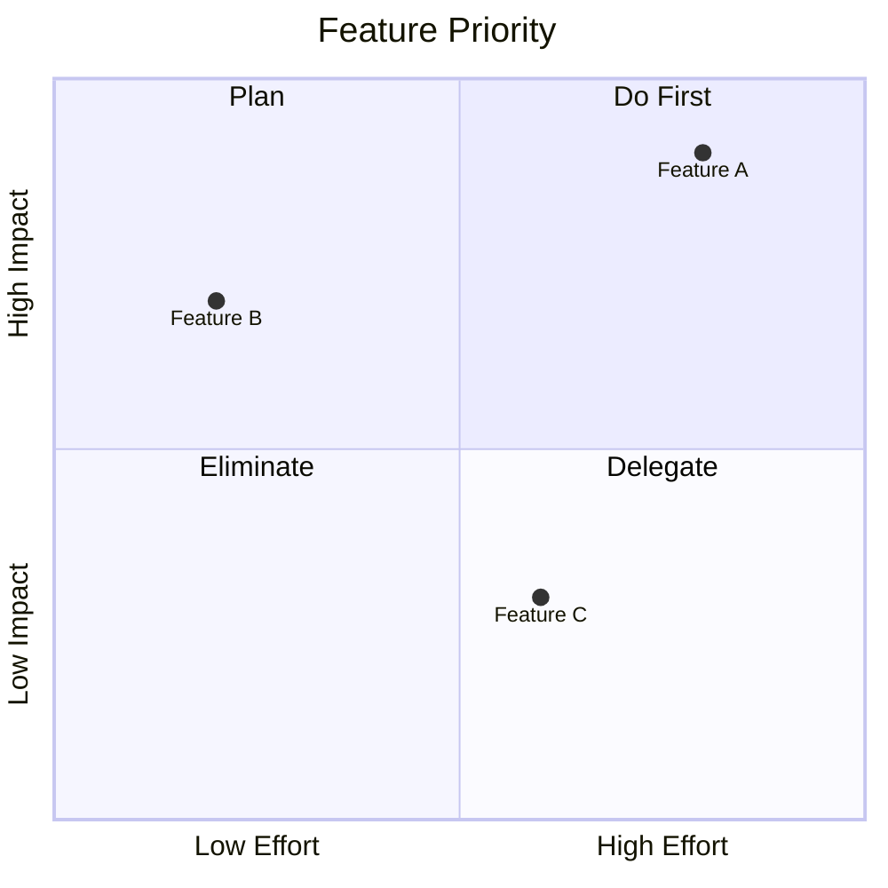

**Points:** `Label: [x, y]` where x,y are 0-1. Optional: `radius: 12`, `color: #ff3300`

### 13. Sankey Diagram

**Use for:** Flow quantities, energy/resource distribution, budget allocation.

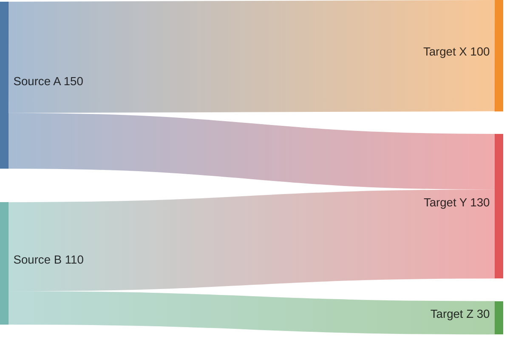

**Syntax:** CSV format `source,target,value`. Wrap commas in quotes: `"A, Inc",B,100`

**Config:** `linkColor: source|target|gradient|#hex`, `nodeAlignment: justify|center|left|right`

### 14. XY Chart (Bar/Line)

**Use for:** Data trends, comparisons, statistics.

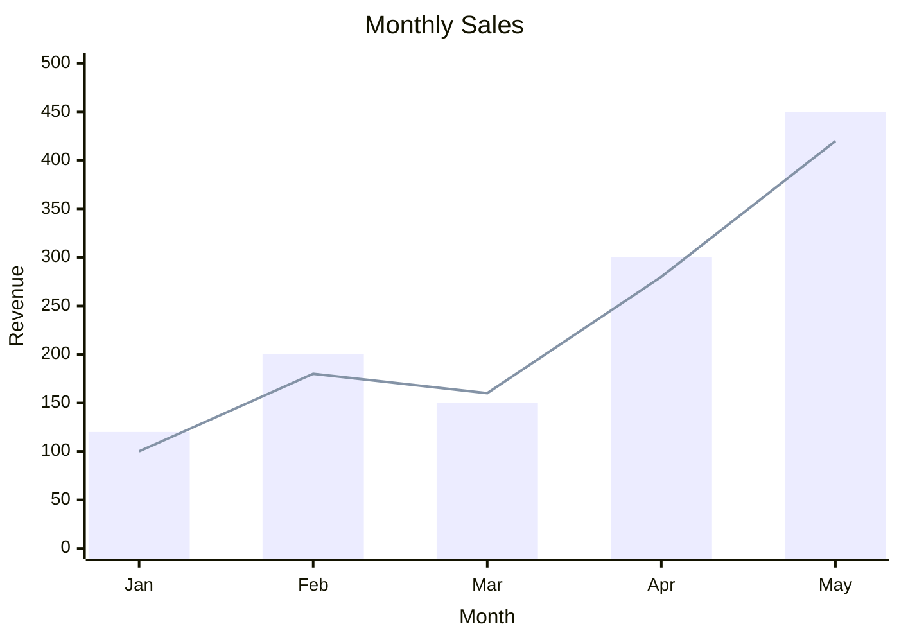

**Orientation:** `xychart horizontal` for horizontal layout.

**X-axis:** categorical `["a", "b"]` or numeric `min --> max`. **Y-axis:** numeric only.

**Data:** `bar [values]` and/or `line [values]`.

### 15. Block Diagram

**Use for:** System architecture layouts, infrastructure diagrams, component arrangements.

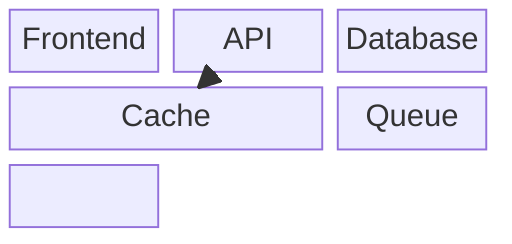

**Columns:** `columns N` sets grid width. Blocks span columns with `:N`.

**Shapes:** Same as flowchart: `[rect]`, `(rounded)`, `((circle))`, `{diamond}`, `[(cylinder)]`, etc.

**Links:** `-->`, `---` with optional text.

**Nesting:** Blocks can contain other blocks for composite layouts.

**Space:** Use `space` or `space:N` to insert empty cells.

### 16. Packet Diagram

**Use for:** Network protocol headers, binary data formats, memory layouts.

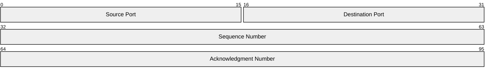

**Syntax:** `start-end: "Field name"` for ranges, or `+N: "Field name"` for N-bit auto-positioned fields.

### 17. Architecture Diagram

**Use for:** Cloud infrastructure, CI/CD pipelines, service topology.

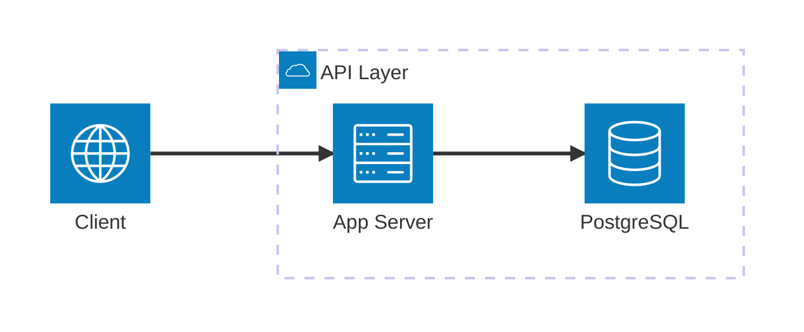

**Groups:** `group id(icon)[Title]` — containers for services. Nest with `in parentId`.

**Services:** `service id(icon)[Title]` — individual nodes. Nest with `in groupId`.

**Edges:** `serviceA:direction --> direction:serviceB`. Directions: `T`, `B`, `L`, `R`.

**Junctions:** `junction id` — four-way connection points.

**Icons:** Built-in: `cloud`, `database`, `disk`, `internet`, `server`. Custom via iconify: `"logos:aws"`

### 18. Kanban Board

**Use for:** Task boards, workflow stages, agile boards.

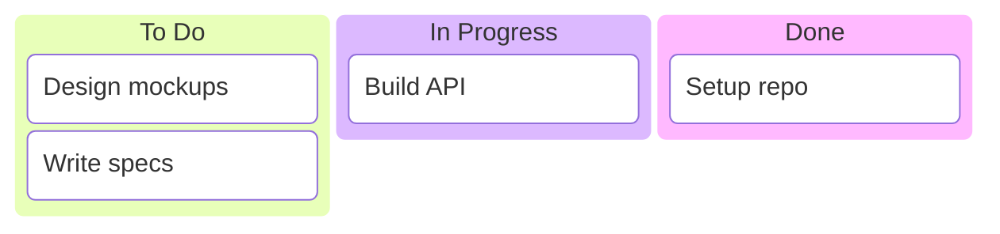

**Columns:** `id[Title]` at root level.

**Tasks:** `id[Description]` indented under a column.

**Metadata:** `@{ assigned: "Alice", ticket: "PROJ-123", priority: "High" }` after task.

**Config:** `ticketBaseUrl` in YAML frontmatter creates clickable ticket links.

---
> Converted and distributed by [TomeVault](https://tomevault.io/claim/alexanderop) — claim your Tome and manage your conversions.
<!-- tomevault:4.0:skill_md:2026-04-15 -->
