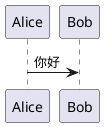

# qxw-markdown

| 子命令 | 用途 |
|--------|------|
| `wx` | Markdown 中的 PlantUML 围栏 → 本地图片，并生成可粘公众号的 `_wx.md` |
| `cover` | 调 ZenMux Gemini 3 Pro Image Preview 为 Markdown 生成封面 PNG |
| `summary` | 为目录生成 `SUMMARY.md` / `INDEX.md`（Gitbook 风格） |

## wx：PlantUML 渲染 + 公众号适配

### 依赖

`wx` 走本地 `plantuml.jar` 渲染（subprocess `java -jar ...`），Python 只负责协调 / 中文字体注入 / 格式转换。

1. Java 8+（`java -version` 能输出版本即可）
2. 下载 [plantuml.jar](https://plantuml.com/download)，放到 `~/.config/qxw/plantuml.jar`，或环境变量 `PLANTUML_JAR=...`，或命令行 `--plantuml-jar`
3. SVG / PNG / JPG 后处理依赖 Pillow + cairosvg（已随 `pip install qxw` 默认装）

### 基本用法

```bash
qxw-markdown wx docs/foo.md                          # 默认白底 PNG，2× 缩放
qxw-markdown wx docs/foo.md -f svg -b transparent    # 透明底 SVG
qxw-markdown wx docs/foo.md -f jpg -b black -q 95    # 黑底高质 JPG
```

### 参数

| 参数 | 缩写 | 默认 | 说明 |
|------|------|------|------|
| `<markdown_file>` | - | 必填 | 源 Markdown |
| `--format` | `-f` | `png` | `png` / `svg` / `jpg` |
| `--background` | `-b` | `white` | `white` / `black` / `transparent` |
| `--output` | `-o` | `<源>_wx.md` | 输出 Markdown 路径（图片始终生成在源同目录） |
| `--plantuml-jar` | - | `$PLANTUML_JAR` 或 `~/.config/qxw/plantuml.jar` | jar 路径 |
| `--java` | - | `java` | java 可执行文件 |
| `--scale` | `-s` | 2.0 | PNG / JPG 缩放比例（SVG 忽略） |
| `--font-family` | - | 跨平台 CJK 字体栈 | 覆盖 SVG 的 `font-family`；传 `""` 禁用注入 |
| `--plantuml-font` | - | `PingFang SC` | 注入到 `skinparam defaultFontName` |
| `--quality` | `-q` | 92 | JPG 压缩质量（仅 `--format jpg`） |

### 识别的代码围栏

下列三种语言标识都会被识别（按出现顺序作为图片序号）：

````markdown


```puml
...
```

```uml
...
```
````

> 裸的 `@startuml ... @enduml`（不在代码围栏内）**不会**被处理，避免误伤正文中的 PlantUML 代码示例。

### 输出文件命名

源 `docs/foo.md` 默认产出：

```
docs/foo_wx.md      # 新 Markdown，围栏 → 
docs/foo_1.png      # 第 1 段渲染结果
docs/foo_2.png      # 第 2 段
```

`--format` 切到 `svg` / `jpg` 时图片扩展名同步变化。

### 中文字体（双保险）

为避免中文变方块，wx 同时做两件事：

1. **PlantUML 源码注入** `skinparam defaultFontName <name>`（默认 `PingFang SC`，可 `--plantuml-font` 覆盖）—— 给 Java 端一个优先字体名
2. **SVG 输出注入 CSS**：`<text> / <tspan> / <textPath>` 的 `font-family` 强制覆盖为跨平台 CJK 字体栈（PingFang / YaHei / Noto / Source Han / WenQuanYi 兜底）

三种目标格式（SVG / PNG / JPG）都会先经 SVG 中间态做字体注入，所以**不依赖 Java 端 fontconfig 是否能解析到 CJK 字体**。

### 背景色行为

- `white`：注入 `skinparam backgroundColor white`；SVG 额外加全尺寸白色 `<rect>` 兜底
- `black`：注入 `skinparam backgroundColor black`。**注意 PlantUML 默认 skin 文字 / 箭头是深色，黑底基本看不见**，请在源码里搭配 `!theme cyborg` 等深色主题
- `transparent`：注入 `skinparam backgroundColor transparent`；PNG 保留透明通道；JPG 因格式限制会落成白底，并在日志告警

## cover：用 Gemini 给 Markdown 生封面

读 Markdown 正文 → 拼装风格 prompt → 通过 [ZenMux](https://zenmux.ai/) 调 Google **Gemini 3 Pro Image Preview（Nano Banana Pro）** 出 PNG。默认走"技术白皮书 / 系统架构图"风格（浅绿网格底、青蓝结构、橙绿数据流、LaTeX 公式）。

### API Key（三级回退，优先级从高到低）

1. 命令行 `--api-key sk-zm-xxx`
2. 环境变量 `ZENMUX_API_KEY=sk-zm-xxx`
3. `~/.config/qxw/setting.json` 的 `zenmux_api_key` 字段

### 基本用法

```bash
qxw-markdown cover docs/foo.md                          # → docs/foo_cover.png
qxw-markdown cover docs/foo.md -o out/my-cover.png      # 自定义输出
qxw-markdown cover docs/foo.md --extra-prompt "突出网络拓扑与时序"     # 在默认风格基础上加要求
qxw-markdown cover docs/foo.md --style-prompt "minimalistic flat isometric, soft pastel"  # 整段替换主风格
```

### 参数

| 参数 | 缩写 | 默认 | 说明 |
|------|------|------|------|
| `<markdown_file>` | - | 必填 | 源 Markdown |
| `--output` | `-o` | `<同目录>/<stem>_cover.png` | 输出 PNG |
| `--api-key` | - | env / setting.json | ZenMux Key |
| `--model` | `-m` | `google/gemini-3-pro-image-preview` | 覆盖模型名 |
| `--base-url` | - | `https://zenmux.ai/api/vertex-ai` | 覆盖代理地址 |
| `--style-prompt` | - | 内置白皮书风格 | 完全替换主风格 |
| `--extra-prompt` | - | 空 | 追加到主 prompt 末尾 |
| `--truncate` | - | 65536 | Markdown 正文截断长度（字符）；`<=0` 不截断 |

### 输出与错误

- 成功：落盘指定路径，打印最终路径 / prompt 字符数 / 模型名
- 模型若附带文字说明会回显（`💬 模型附带说明: ...`）
- 模型未返回图片（安全策略 / 配额 / 模型名不可用）→ `QxwError`，退出码 1
- 缺 `google-genai` 依赖 / 未配置 Key → 中文修复指引退出

### 常见问题

- **API Key 放哪最方便**：长期用写到 `~/.config/qxw/setting.json` 的 `zenmux_api_key`；偶尔用 `export ZENMUX_API_KEY=...`
- **正文太长报错 / 图抓不到重点**：降低 `--truncate`（如 8000 / 3000）只喂前半部分；或用 `--extra-prompt` 把核心关键词喂进去
- **想换风格**：`--style-prompt` 整段替换；默认风格硬编码在 `qxw/library/services/cover_service.py::DEFAULT_COVER_STYLE_PROMPT`

## summary：生成 Gitbook 目录树

为每个含 `README.md` 的目录生成两份目录文件：

- **SUMMARY.md**：标题 + 目录结构（Gitbook 经典形态）
- **INDEX.md**：`README.md` 原始内容 + 目录结构（适合作目录首页）

```bash
qxw-markdown summary                    # 当前目录
qxw-markdown summary -d docs/
qxw-markdown summary -d docs/ --depth 5
```

| 参数 | 缩写 | 默认 | 说明 |
|------|------|------|------|
| `--dir` | `-d` | `.` | 文档根（必须含 `README.md`） |
| `--depth` | - | 5 | 目录层级深度 |

### 扫描规则

- 文件按数字前缀排序（`1.intro.md` / `2.setup.md`）
- 目录按同样规则排序，**只有含 `README.md` 的子目录**才会被列入目录
- 标题中含 `(todo)` 的文件 / 目录跳过
- 目录下存在 `SUMMARY.md.skip` 文件时整棵子树跳过

---
> Source: [analpay/qxw](https://github.com/analpay/qxw) — distributed by [TomeVault](https://tomevault.io).
<!-- tomevault:4.0:skill_md:2026-06-16 -->
