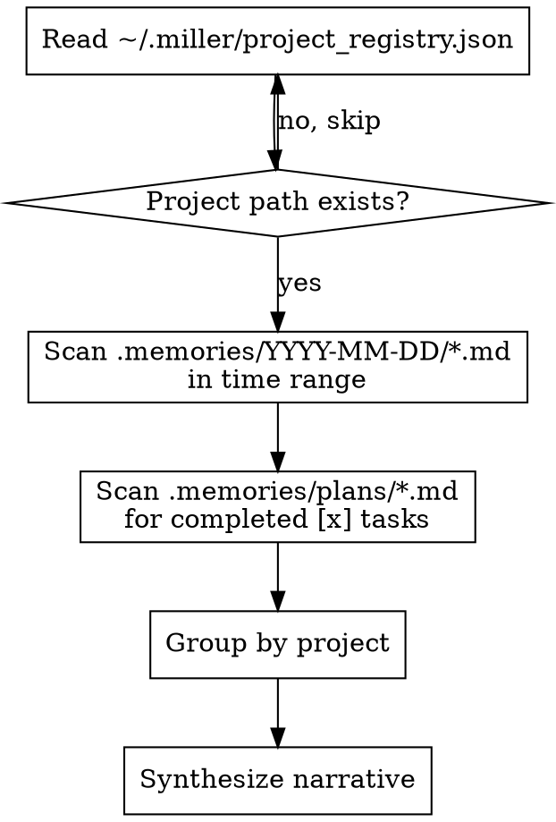

# Standup Summary

Generate narrative standup summaries from development memories across all registered projects.

## Arguments

- No argument: Yesterday (all day) + today so far
- `3d`, `7d`: Last N days through now
- `2025-01-20`: Since specific date through now

## Process



## Implementation

### 1. Read Project Registry

```python
import json
from pathlib import Path

registry_path = Path.home() / ".miller" / "project_registry.json"
if registry_path.exists():
    data = json.loads(registry_path.read_text())
    projects = data.get("projects", {}).values()
```

### 2. Calculate Time Range

```python
from datetime import datetime, timedelta

def parse_time_range(arg: str | None) -> datetime:
    """Return start datetime for the range."""
    now = datetime.now()

    if arg is None:
        # Yesterday 00:00
        yesterday = now.date() - timedelta(days=1)
        return datetime.combine(yesterday, datetime.min.time())

    if arg.endswith("d"):
        days = int(arg[:-1])
        start_date = now.date() - timedelta(days=days)
        return datetime.combine(start_date, datetime.min.time())

    # Parse as date: 2025-01-20
    return datetime.strptime(arg, "%Y-%m-%d")
```

### 3. Gather Memories

For each project, scan `.memories/` for:

**Checkpoints** (in date directories):
```python
memories_dir = Path(project["path"]) / ".memories"
for date_dir in memories_dir.iterdir():
    if date_dir.is_dir() and date_in_range(date_dir.name):
        for md_file in date_dir.glob("*.md"):
            # Parse YAML frontmatter + content
```

**Completed plan tasks**:
```python
plans_dir = memories_dir / "plans"
for plan_file in plans_dir.glob("*.md"):
    content = plan_file.read_text()
    completed = re.findall(r'- \[x\] (.+)', content, re.IGNORECASE)
```

### 4. Summarize

Format findings by project, then synthesize into 2-4 paragraph narrative:
- Lead with significant accomplishments
- Group related work
- Use past tense ("Fixed", "Implemented")
- Keep concise - this is for standups, not documentation

## Output Example

> **Yesterday and today I focused on two main areas:**
>
> In the Miller project, I designed and implemented a cross-project standup feature. This involved creating a user-level project registry at ~/.miller/ that auto-registers projects on startup, and a /standup skill that aggregates memories across all projects.
>
> In the webapp project, I fixed the authentication token refresh race condition that was causing intermittent 401 errors.

## Edge Cases

- **Project path gone**: Skip silently, project may have been deleted
- **No .memories/ directory**: Skip, project just doesn't use memories
- **No activity found**: Report "No development activity found for this period"
- **Registry doesn't exist**: Report "No projects registered yet. Projects auto-register when opened with Miller."

---
> Converted and distributed by [TomeVault](https://tomevault.io/claim/anortham) — claim your Tome and manage your conversions.
<!-- tomevault:4.0:skill_md:2026-04-13 -->
