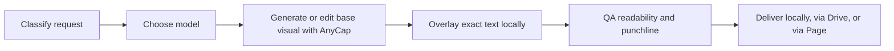

# AnyCap Social Meme Workflows

Use this skill when the output needs to feel like a meme, captioned social post, or reaction visual, but still has to be reproducible.

**Do not rely on image generation alone for exact caption text.**
Use AnyCap to create or edit the base visual, then render the final caption locally so the text is exact.

## Read First

Read these files before acting:

1. This file for the workflow
2. [references/workflows.md](references/workflows.md) for pattern selection, prompt formulas, and article mapping

For detailed CLI syntax, authentication, and capability reference, use the `anycap-cli` skill.

## Best Fit

Use this skill for:

- meme-style hero images with exact top or bottom text
- funny meme drawings with doodle-style internet humor
- captioned photos for blog posts or social posts
- reaction visuals from an existing screenshot or photo
- short meme-video concepts where the still or base frame comes first
- use-case demos that need both generated media and a repeatable workflow

Do not use this skill for:

- large meme-template databases
- highly specific internet meme lore pages
- exact brand or copyrighted character recreation requests
- production subtitle pipelines with timing-heavy caption editing

## Core Rule

Split the task into two layers:

1. **Base visual layer** with AnyCap
2. **Exact text layer** with deterministic local rendering

Why:

- image models are good at style, composition, and fast variation
- image models are not dependable for long exact caption text
- deterministic overlay keeps the final meme readable and repeatable

## Workflow



### 1. Classify the request

Choose one workflow first:

- **Text-first meme**: the joke or caption exists; the visual supports it
- **Funny meme drawing**: the humor mostly lives in the drawing style, pose, or absurd scene
- **Reaction remix**: user supplies an image and wants meme treatment
- **Captioned photo**: exact line of text on top of an image
- **Meme-video concept**: still image, caption, then optional short video

For funny meme drawings, default to one of these repeatable presets:

- **Classic doodle**: the strongest default for blob characters, stick-figure-adjacent humor, and easy-to-draw meme pages
- **Bad drawing**: useful when the joke works because the art is awkward or deliberately clumsy
- **Rage-comic-adjacent**: only when you want old-web comic energy without relying on canonical rage faces or meme-lore cloning

### 2. Choose the model

Default mapping:

- **Seedream 5** for stronger first-pass visuals
- **Nano Banana Pro** when editing an existing image or screenshot
- **Nano Banana 2** when you need many variants fast, especially for funny meme drawings

Always inspect the model list or schema if the workflow is unclear:

```bash
anycap image models
anycap image models nano-banana-2 schema
```

### 3. Generate or edit the base visual

Text-to-image example:

```bash
anycap image generate \
  --model seedream-5 \
  --prompt "reaction-image style visual, exaggerated expression, blank top and bottom safe space for meme caption, high contrast, clean composition" \
  --param aspect_ratio=1:1 \
  --param resolution=2k \
  -o meme-base.png
```

Image-to-image example:

```bash
anycap image generate \
  --model nano-banana-pro \
  --mode image-to-image \
  --prompt "turn this into a sharper reaction meme image, preserve the subject, simplify background, leave clear safe space for top and bottom caption" \
  --param images=./source.png \
  --param aspect_ratio=1:1 \
  --param resolution=2k \
  -o meme-remix-base.png
```

Prompt for negative space explicitly. Ask for "blank caption-safe area", "clean top band", or "empty bottom margin" instead of asking the model to write the exact meme text.

Funny meme drawings example with Nano Banana 2:

```bash
anycap image generate \
  --model nano-banana-2 \
  --prompt "funny meme drawing, crude but charming internet doodle style, exhausted office goblin melting into an office chair while holding a tiny coffee cup, absurd tiny-problem energy, wildly exaggerated defeated expression, messy desk chaos without readable screens, thick sketch lines, off-white paper texture, muted green accents, obvious blank space for optional caption, no words, no letters, no watermark" \
  --param aspect_ratio=4:3 \
  --param resolution=2k \
  -o funny-meme-drawing.png
```

For funny meme drawings, the caption is optional. If the humor already lands through the drawing alone, you can deliver the image as-is. If the joke needs exact wording, add the caption locally afterward.

### 4. Overlay exact text locally

Preferred order:

1. existing local image toolchain already used by the repo or operator
2. simple SVG or HTML/CSS card rendered locally
3. ImageMagick if installed

If no local renderer is available, create a simple SVG with:

- bold uppercase title text
- stroke or shadow for contrast
- controlled padding and line breaks

### 5. QA the output

Check:

- exact caption text matches the requested copy
- line breaks read well on mobile
- subject and caption do not compete visually
- punchline is legible in a thumbnail
- the output still looks intentional without knowing the prompt

If needed, use AnyCap image reading to inspect the result:

```bash
anycap actions image-read \
  --file ./final-meme.png \
  --instruction "Read the visible text and describe whether the caption is easy to read at small size."
```

### 6. Deliver

- return the local file path when the human is in the same workspace
- upload to Drive when they need a share link
- publish a simple Page when the deliverable is a gallery or mini use-case report

## Use-Case Article Angle

This skill supports workflow-led articles better than template-library articles.

Good article angles:

- how to make memes online with an AI agent
- funny meme drawings with an AI agent
- easy memes to draw with an AI agent
- how to add text to a photo with an AI agent
- how to make a meme video with an AI agent
- how to create memes on Instagram without switching tools

Bad article angles:

- obscure meme-name pages
- "blank template" databases
- trend-chasing pages that need constant pop-culture maintenance

## Output Expectations

A good run should usually produce:

- 1 to 4 base visual variants
- 1 exact-text final image
- optional share link or published page
- a short note explaining model choice and workflow

## Guardrails

- Avoid copyrighted characters or branded logos unless the user provides a clear right to use them.
- Do not promise exact text rendering from the model itself.
- Prefer exact text overlay locally when the copy matters.
- Avoid adult or hateful meme requests.
- Treat meme style as a delivery format, not an excuse for sloppy output.

---
> Source: [anycap-ai/anycap](https://github.com/anycap-ai/anycap) — distributed by [TomeVault](https://tomevault.io).
<!-- tomevault:4.0:skill_md:2026-06-17 -->
