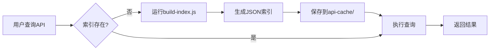

# AutoPaddle API Explorer

AutoPaddle API接口智能探索器，帮助快速查找和理解项目中的API接口。

## 快速开始

此skill使用预处理索引策略，首次使用时需要生成索引：

```bash
# 生成索引（只需运行一次）
node .claude/skills/autopaddle-api-explorer/scripts/build-index.js
```

索引文件会保存到skill内部的 `cache/` 目录，后续查询直接使用缓存，无需重新生成。

## 三种查询模式

### 1. 分类浏览 📂

按功能模块浏览API接口，了解整体结构。

**适用场景**：用户想了解某个功能领域有哪些接口

**示例**：
- "项目中都有哪些设备相关的API？"
- "报告管理模块有哪些接口？"

**Agent操作**：
1. 读取 `cache/category-index.json`
2. 筛选相关的分类
3. 返回分类列表和接口数量

### 2. 关键词搜索 🔍

根据中文/英文关键词搜索相关接口。

**适用场景**：用户想查找特定功能的接口

**示例**：
- "搜索创建设备的接口"
- "查找设备类型查询的API"
- "POST方法的设备管理接口"

**Agent操作**：
```bash
node .claude/skills/autopaddle-api-explorer/scripts/search.js "设备 创建"
node .claude/skills/autopaddle-api-explorer/scripts/search.js "查询" --method GET
node .claude/skills/autopaddle-api-explorer/scripts/search.js "设备" --tag "管理后台 - 设备类型"
```

### 3. 智能意图匹配 🤖

理解自然语言描述，推荐最相关的接口。

**适用场景**：用户用自然语言描述需求，需要找到对应的接口

**示例**：
- "我想创建一个新的设备类型"
- "查看所有设备的列表"
- "修改设备的配置信息"

**Agent操作**：
```bash
node .claude/skills/autopaddle-api-explorer/scripts/matcher.js "我想创建一个新的设备类型"
```

## 工作流程

### 首次使用



### 常规查询

1. **判断查询类型**
   - 分类浏览 → 读取 `category-index.json`
   - 关键词搜索 → 运行 `search.js`
   - 智能匹配 → 运行 `matcher.js`

2. **格式化输出**
   - 展示匹配的接口列表
   - 显示接口参数和返回值
   - 生成调用示例（cURL、JavaScript、Python）

## 输出格式

### 搜索结果

```
🔍 搜索结果: "设备 创建"
找到 5 个相关接口

1. POST /admin-api/device/type/create - 创建设备类型
   📊 相关度: 95% [██████████]
   🏷️  标签: 管理后台 - 设备类型
   📥 参数: name(必需), type(必需), sorted(可选), remark(可选)

2. POST /admin-api/device/group/create - 创建设备分组
   📊 相关度: 88% [████████░░]
   🏷️  标签: 管理后台 - 设备分组
   📥 参数: name(必需), parentId(可选), remark(可选)
```

### 智能匹配结果

```
🤖 智能匹配结果
================

📝 用户输入: "我想创建一个新的设备类型"

🎯 识别意图: create (POST)
🔑 关键词: 创建, 新, 设备类型
📍 路径提示: device/type

✅ 找到 3 个相关接口

🌟 最佳匹配 (98%)
   POST /admin-api/device/type/create - 创建设备类型

📋 其他相关接口
1. POST /admin-api/device/group/create - 创建设备分组 (75%)
2. POST /admin-api/device/domain/create - 创建设备域 (70%)

📄 最佳匹配详情
...

### POST /admin-api/device/type/create

**功能**: 创建设备类型
**标签**: 管理后台 - 设备类型
**服务器**: https://gateway.autopaddle.com
**认证**: Authorization header required

#### 请求参数

| 参数名 | 位置 | 类型 | 必需 | 说明 |
|--------|------|------|------|------|
| name | query | string | ✅ | 类型名称 |
| type | query | string | ✅ | 分类 1设备直采 2OCR 3文件 |
| sorted | query | string | ❌ | 排序 |
| remark | query | string | ❌ | 备注 |

#### 返回结果

状态码: 200 OK

```json
{
  "code": 0,
  "msg": "操作成功",
  "data": true
}
```

#### 示例请求

```bash
curl -X POST "https://gateway.autopaddle.com/admin-api/device/type/create" \
  -d "name=新类型" \
  -d "type=1" \
  -H "Authorization: Bearer YOUR_TOKEN"
```
```

## 索引文件结构

### api-index.json (主索引)

包含所有接口的完整信息：

```json
{
  "version": "1.0.0",
  "generatedAt": "2026-01-30T10:00:00Z",
  "server": {
    "url": "https://gateway.autopaddle.com",
    "authType": "Authorization"
  },
  "totalEndpoints": 324,
  "endpoints": {
    "PUT_/admin-api/device/type/update": {
      "path": "/admin-api/device/type/update",
      "method": "PUT",
      "summary": "更新设备类型",
      "tags": ["管理后台 - 设备类型"],
      "parameters": [...],
      "keywords": ["设备", "类型", "更新", "修改"]
    }
  }
}
```

### keyword-index.json (关键词倒排索引)

支持快速关键词搜索：

```json
{
  "设备": {
    "endpoints": [
      "PUT_/admin-api/device/type/update",
      "POST_/admin-api/device/type/create"
    ],
    "count": 156
  },
  "创建": {
    "endpoints": [
      "POST_/admin-api/device/type/create"
    ],
    "count": 45
  }
}
```

### category-index.json (分类索引)

按功能模块分组：

```json
{
  "管理后台 - 设备类型": {
    "name": "管理后台 - 设备类型",
    "endpoints": [
      "POST_/admin-api/device/type/create",
      "GET_/admin-api/device/type/page"
    ],
    "count": 5
  }
}
```

## API文档来源

此skill解析以下OpenAPI 3.0.1文档：

1. **设备管理API**
   - 路径: `assets/docs/devices.json`
   - 内容: 设备类型、设备分组、设备域、设备告警等

2. **报告管理API**
   - 路径: `assets/docs/report.json`
   - 内容: 班次配置、数据查询、报表等

3. **Broker自身API** (可选)
   - 路径: `src/api/routes/*.js`
   - 内容: 应用管理、健康检查、系统统计

## 最佳实践

### 1. 选择合适的查询模式

- **了解整体结构** → 使用分类浏览
- **查找特定功能** → 使用关键词搜索
- **不明确具体接口** → 使用智能匹配

### 2. 提高搜索准确性

- 使用精准的关键词（如"设备类型"而非"设备"）
- 结合HTTP方法过滤（如"POST 设备"）
- 使用具体的标签过滤

### 3. 理解相关度分数

- **95-100%**: 高度匹配，几乎可以确定是你要找的接口
- **80-94%**: 较好匹配，很可能是相关接口
- **60-79%**: 中等匹配，可能相关但需要人工确认
- **<60%**: 低匹配，仅供参考

## 扩展功能

### 生成API调用代码

基于找到的接口，可以自动生成调用示例：

```javascript
// JavaScript fetch示例
fetch('https://gateway.autopaddle.com/admin-api/device/type/create', {
  method: 'POST',
  headers: {
    'Authorization': 'Bearer YOUR_TOKEN',
    'Content-Type': 'application/x-www-form-urlencoded'
  },
  body: new URLSearchParams({
    name: '新类型',
    type: '1'
  })
})
.then(response => response.json())
.then(data => console.log(data));
```

### Mock数据生成

根据接口的parameters schema，生成测试数据：

```json
{
  "name": "测试设备类型",
  "type": "1",
  "sorted": "1",
  "remark": "这是一个测试数据"
}
```

## 故障排查

### 问题1: 索引文件不存在

**错误信息**: `❌ Index files not found! Please run build-index.js first.`

**解决方法**:
```bash
node .claude/skills/autopaddle-api-explorer/scripts/build-index.js
```

### 问题2: OpenAPI文档未找到

**错误信息**: `⚠️ Document not found: assets/docs/...`

**解决方法**:
- 确认skill目录结构正确
- 检查OpenAPI文档路径是否存在于assets/docs目录

### 问题3: 搜索结果为空

**可能原因**:
- 关键词不匹配
- 过滤条件过于严格

**解决方法**:
- 使用更通用的关键词
- 减少过滤条件
- 尝试智能匹配模式

## 性能说明

- **索引生成**: 首次解析OpenAPI文档，约1-2秒
- **关键词搜索**: 毫秒级，基于预处理的倒排索引
- **智能匹配**: 毫秒级，基于内存中的索引数据

索引文件大小（参考）：
- api-index.json: ~500KB
- keyword-index.json: ~100KB
- category-index.json: ~50KB

## 维护指南

### 更新索引

当OpenAPI文档更新后，重新运行：

```bash
node .claude/skills/autopaddle-api-explorer/scripts/build-index.js
```

### 添加新的API文档源

编辑 `scripts/build-index.js`，在 `CONFIG.docs` 中添加新的文档路径：

```javascript
docs: [
  'assets/docs/devices.json',
  'assets/docs/report.json',
  'assets/docs/new-api-doc.json'  // 新增
]
```

### 自定义意图识别

编辑 `scripts/matcher.js`，在 `INTENT_PATTERNS` 中添加新的模式：

```javascript
const INTENT_PATTERNS = {
  create: { ... },
  export: {  // 新增导出意图
    patterns: [/导出|下载|输出/],
    method: 'GET',
    pathSuffix: ['export', 'download']
  }
};
```

## 参考资料

- [OpenAPI 3.0.1 规范](https://swagger.io/specification/)
- [API索引结构说明](references/api-structure.md)
- [快速开始指南](references/quick-start.md)

---
> Converted and distributed by [TomeVault](https://tomevault.io/claim/apm29) — claim your Tome and manage your conversions.
<!-- tomevault:4.0:skill_md:2026-04-14 -->
