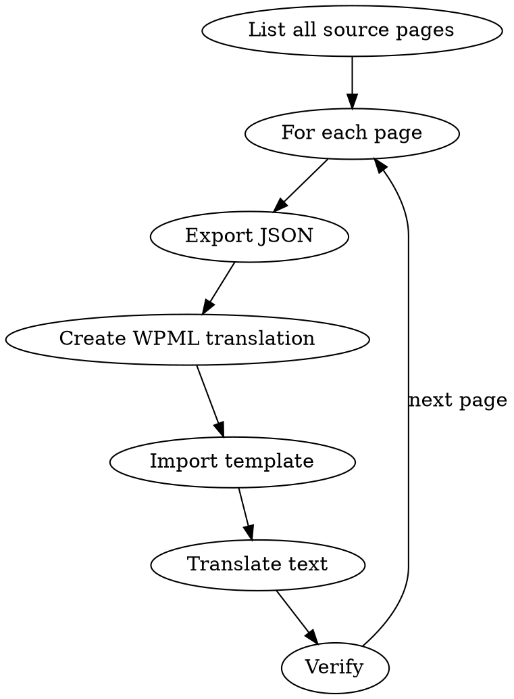

# Multilingual Marketing with WPML + Elementor

## Overview

Translate and localize WordPress marketing pages using WPML and Elementor MCP tools. Export a source page, create the translation via WPML, import the structure, then batch-update all text content to the target language. Each translated page gets its own URL (`/es/`, `/pt/`, `/fr/`, etc.) with proper hreflang SEO.

## When to Use

- Translating existing marketing pages to new languages
- Setting up a multilingual WordPress site with WPML
- Batch-translating multiple pages to the same language
- Optimizing multilingual SEO (hreflang, translated meta, localized URLs)

## Architecture

```
Source Page (EN) → export-page → JSON structure
                                      ↓
WPML creates /es/ page → import-template (paste JSON) → batch-update text → Translated Page (ES)
```

Each translation is a real WordPress page linked to the source via WPML. Changing the source doesn't auto-change translations — they're independent after creation.

## Translation Workflow

### Step 1: Export Source Page

```
1. get-page-structure (source post_id) → note all element IDs and text content
2. export-page (source post_id) → save the full JSON structure
```

Save the exported JSON — you'll import it into the translated page.

### Step 2: Create Translation Page in WPML

This step must be done in WP Admin (not via MCP):

1. Go to **WP Admin → Pages**
2. Find the source page — the WPML language column shows flags
3. Click the **"+"** icon under the target language flag (e.g., Spanish)
4. WPML creates a blank translated page linked to the source
5. Note the new page's post ID (visible in the URL bar)

If WPML is not installed, create a regular page manually with the `/es/` slug prefix.

### Step 3: Import Structure

```
1. import-template (new post_id, template_json=exported JSON)
2. get-page-structure (new post_id) → verify all elements imported with proper IDs
```

The translated page now has the exact same layout and design as the source — but still in the source language.

### Step 4: Translate Content

Use `find-element` and `batch-update` to translate all text:

```
1. find-element (post_id, search by widgetType or text) → get element IDs
2. For each text element:
   - update-widget (element_id, {title: "Translated text"})    # for headings
   - update-widget (element_id, {editor: "Translated HTML"})   # for text-editor widgets
   - update-widget (element_id, {text: "Translated text"})     # for buttons
3. Or use batch-update to change multiple elements in one call
```

**Translation order (most visible first):**
1. H1 heading and hero subtitle
2. Navigation-visible text (page title)
3. Section headings (H2s)
4. Body text and descriptions
5. Button text and CTAs
6. Image alt text
7. FAQ questions and answers
8. Footer/legal text

### Step 5: Translate SEO Meta

Update the page's SEO metadata for the target language:

- **Page title** — translate via your SEO plugin (Yoast/RankMath) or `update-page-settings`
- **Meta description** — translate via SEO plugin settings
- **Slug** — update to translated slug (e.g., `/es/precios` instead of `/es/pricing`)
- **Open Graph** — translate OG title and description if set

### Step 6: Verify

```
1. get-page-structure (translated post_id) → confirm all text is translated
2. Check the live page in browser — verify layout matches source
3. Verify hreflang tags in page source (WPML adds these automatically)
4. Test language switcher navigation
```

## Batch Translation (Multiple Pages)

When translating many pages to the same language:



**Recommended order:**
1. Homepage (highest traffic)
2. Pricing page (highest conversion intent)
3. Product/feature pages
4. Legal pages (terms, privacy)
5. Blog posts (lowest priority, highest volume)

## Multilingual SEO Checklist

- [ ] Each translated page has a unique, translated title tag
- [ ] Meta descriptions are translated (not just copied)
- [ ] URL slugs are translated (e.g., `/es/precios` not `/es/pricing`)
- [ ] hreflang tags link source and all translations (WPML handles this)
- [ ] `<html lang="es">` attribute is set correctly (WPML handles this)
- [ ] Translated pages are in the XML sitemap
- [ ] Google Search Console has both language versions verified
- [ ] Internal links within translated pages point to other translated pages (not back to English)
- [ ] CTAs link to localized signup/trial if available
- [ ] Currency and pricing are localized if applicable

## Supported Languages

WPML supports 65+ languages. Common marketing translations:

| Code | Language | URL prefix |
|------|----------|------------|
| `es` | Spanish | `/es/` |
| `pt-br` | Portuguese (Brazil) | `/pt-br/` |
| `fr` | French | `/fr/` |
| `de` | German | `/de/` |
| `it` | Italian | `/it/` |
| `ja` | Japanese | `/ja/` |
| `ar` | Arabic (RTL) | `/ar/` |

**RTL languages** (Arabic, Hebrew): Verify that Elementor's RTL support is enabled in the translated page settings.

## Common Mistakes

| Mistake | Fix |
|---------|-----|
| Translated page has broken layout | Used `create-page` instead of `import-template` — re-import the JSON |
| hreflang tags missing | WPML not linking source and translation — check WPML Translation Management |
| Internal links go to English | Update all internal links in translated pages to point to `/es/` versions |
| SEO title still in English | Translate via SEO plugin, not just the visible heading |
| Duplicate content warning | Ensure hreflang is set — tells Google these are translations, not duplicates |
| Images have English text | Replace with localized versions or use text overlays instead of baked-in text |
| Language switcher missing | Add WPML Language Switcher widget to header/footer |

## Prerequisites

- WordPress with WPML ($39/yr for Blog, $99/yr for CMS)
- Elementor (free or Pro)
- Elementor MCP tools configured
- SEO plugin (Yoast or RankMath) for meta translation

---
> Source: [appeardev/marketing-skills-that-build](https://github.com/appeardev/marketing-skills-that-build) — distributed by [TomeVault](https://tomevault.io).
<!-- tomevault:4.0:skill_md:2026-06-16 -->
