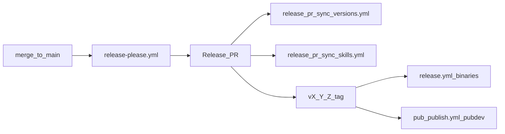

<!-- @FMT_MODE_PRELUDE -->

# flutter-mcp-toolkit repo maintainer

Golden path for **this repository** (not end-user Flutter apps). Prefer
release-please on `main`; use manual steps only when the Release PR path is blocked.

## When to use

- Cutting a release or promoting `## [Unreleased]` in CHANGELOG.md
- Adding/editing contributor docs, AI agent install docs, or plugin skills
- Verifying version sync or skill asset drift before merge
- Troubleshooting release-please, `release.yml` binaries, or `install.sh` version pins

## Version touchpoints (must match root `VERSION`)

| File                                                                                                                                                                           | Field                                                                                                                                                 |
| ------------------------------------------------------------------------------------------------------------------------------------------------------------------------------ | ----------------------------------------------------------------------------------------------------------------------------------------------------- |
| [VERSION](https://github.com/Arenukvern/mcp_flutter/blob/main/VERSION)                                                                                                         | repo pin                                                                                                                                              |
| [plugin/EXPECTED_SERVER_VERSION](https://github.com/Arenukvern/mcp_flutter/blob/main/plugin/EXPECTED_SERVER_VERSION)                                                           | installer pin                                                                                                                                         |
| [packages/core/lib/src/runtime_version.dart](https://github.com/Arenukvern/mcp_flutter/blob/main/packages/core/lib/src/runtime_version.dart)                                   | `kFlutterMcpVersion` (`x-release-please-version`)                                                                                                     |
| [packages/server_capability_core/lib/src/fmt_capability.dart](https://github.com/Arenukvern/mcp_flutter/blob/main/packages/server_capability_core/lib/src/fmt_capability.dart) | `version` getter                                                                                                                                      |
| [mcp_server_dart/pubspec.yaml](https://github.com/Arenukvern/mcp_flutter/blob/main/mcp_server_dart/pubspec.yaml)                                                               | `version:`                                                                                                                                            |
| [mcp_toolkit/pubspec.yaml](https://github.com/Arenukvern/mcp_flutter/blob/main/mcp_toolkit/pubspec.yaml)                                                                       | `version:`                                                                                                                                            |
| [packages/core/pubspec.yaml](https://github.com/Arenukvern/mcp_flutter/blob/main/packages/core/pubspec.yaml)                                                                   | `version:`                                                                                                                                            |
| [packages/server_capability_kernel/pubspec.yaml](https://github.com/Arenukvern/mcp_flutter/blob/main/packages/server_capability_kernel/pubspec.yaml)                           | `version:` + same-train dependency constraints                                                                                                        |
| [packages/server_capability_core/pubspec.yaml](https://github.com/Arenukvern/mcp_flutter/blob/main/packages/server_capability_core/pubspec.yaml)                               | `version:` + same-train dependency constraints                                                                                                        |
| [plugin/.cursor-plugin/plugin.json](https://github.com/Arenukvern/mcp_flutter/blob/main/plugin/.cursor-plugin/plugin.json)                                                     | `version`                                                                                                                                             |
| [plugin/.codex-plugin/plugin.json](https://github.com/Arenukvern/mcp_flutter/blob/main/plugin/.codex-plugin/plugin.json)                                                       | `version`                                                                                                                                             |
| [plugin/.claude-plugin/plugin.json](https://github.com/Arenukvern/mcp_flutter/blob/main/plugin/.claude-plugin/plugin.json)                                                     | `version`                                                                                                                                             |
| [.claude-plugin/marketplace.json](https://github.com/Arenukvern/mcp_flutter/blob/main/.claude-plugin/marketplace.json)                                                         | `plugins[0].version`                                                                                                                                  |
| [.release-please-manifest.json](https://github.com/Arenukvern/mcp_flutter/blob/main/.release-please-manifest.json)                                                             | `"."` key                                                                                                                                             |
| [mcp_server_dart/lib/src/skill_assets.g.dart](https://github.com/Arenukvern/mcp_flutter/blob/main/mcp_server_dart/lib/src/skill_assets.g.dart)                                 | **generated** — embeds `plugin/.cursor-plugin/plugin.json`, `plugin/.codex-plugin/plugin.json`, `plugin/mcp.json`, and all `plugin/skills/*/SKILL.md` |

After any version bump: run `make sync-version`, then `make sync-skills`, then `make check-contracts` (includes `check_version_sync.sh` and `check_skill_assets_drift.sh`). `tool/release/sync_version.sh` derives all version touchpoints from root `VERSION`.

**Harness / video (separate repos):** [flutter_harness](https://github.com/Arenukvern/flutter_harness), [flutter_mcp_video](https://github.com/Arenukvern/flutter_mcp_video) — not maintained in this plugin tree. Three-repo layout: [flutter_harness/docs/RELATED_REPOS.md](https://github.com/Arenukvern/flutter_harness/blob/main/docs/RELATED_REPOS.md).

## Changelog workflow

1. Add user-facing notes under `## [Unreleased]` in [CHANGELOG.md](https://github.com/Arenukvern/mcp_flutter/blob/main/CHANGELOG.md) (Keep a Changelog sections: Added, Changed, Fixed, Documentation).
2. Use conventional commit titles on `main` (`feat:`, `fix:`, `docs:`) so release-please can aggregate.
3. Do **not** edit the plan file in `.cursor/plans/`.

### Markdown lint (MD052)

Keep a Changelog **requires** version headings like `## [3.0.1]`. Linters treat `[3.0.1]` as an undefined **reference link** (MD052: "No link definition found").

- **Do not remove** the file-top `<!-- markdownlint-disable MD052 -->` in CHANGELOG.md (release-please must keep it when prepending sections).
- In bullet text, use **backticks** for code identifiers: `` `AgentCallEntry` ``, not `[AgentCallEntry]`.
- Before merge: `bash tool/contracts/check_changelog_markdown.sh` (also in `make check-contracts`).

## Automated release (preferred)

1. Merge PRs to `main` with conventional commits.
2. Wait for **Release PR** from [release-please.yml](https://github.com/Arenukvern/mcp_flutter/blob/main/.github/workflows/release-please.yml).
3. **version train:** [release_pr_sync_versions.yml](https://github.com/Arenukvern/mcp_flutter/blob/main/.github/workflows/release_pr_sync_versions.yml) runs `tool/release/sync_version.sh` on Release PRs and commits any drift from root `VERSION`.
4. **skill assets:** [release_pr_sync_skills.yml](https://github.com/Arenukvern/mcp_flutter/blob/main/.github/workflows/release_pr_sync_skills.yml) auto-commits `skill_assets.g.dart` on Release PRs when drift is detected; posts a checklist comment on PR open. If **skill-assets-drift** still fails, run `make sync-skills` locally and push.
5. Review VERSION, CHANGELOG, pubspecs, plugin pins in that PR → merge.
6. release-please creates `vX.Y.Z` + GitHub release notes.
7. [release.yml](https://github.com/Arenukvern/mcp_flutter/blob/main/.github/workflows/release.yml) asserts tag == `VERSION`, then attaches `flutter_mcp_*` tarballs (does not overwrite release body).
8. [pub_publish.yml](https://github.com/Arenukvern/mcp_flutter/blob/main/.github/workflows/pub_publish.yml) publishes pub.dev packages in dependency order through OIDC: `flutter_mcp_toolkit_core` → `flutter_mcp_toolkit_capability_kernel` → `flutter_mcp_toolkit_capability_core` → `mcp_toolkit`.

Before automated pub.dev publishing can run, each package must already have a first manual publish and pub.dev Admin must enable GitHub Actions publishing for this repository with tag pattern `v{{version}}`. Use GitHub environment `pub.dev` with required reviewers.

Config: [release-please-config.json](https://github.com/Arenukvern/mcp_flutter/blob/main/release-please-config.json).

## Manual release (fallback)

Use when release-please is unavailable or you must ship from a branch:

1. Move `## [Unreleased]` bullets into `## [X.Y.Z]` (add date), leave empty `## [Unreleased]`.
2. Update `VERSION` to `X.Y.Z`.
3. `make sync-version` to derive all version touchpoints and `.release-please-manifest.json`.
4. `make sync-skills` (required whenever plugin manifests or skills change).
5. `make check-contracts`
6. Commit: `chore: release X.Y.Z`
7. Optional pub.dev preflight: `make publish-pub-dry-run`.
8. Tag: `git tag vX.Y.Z` and push tag (triggers binary and pub.dev workflows).

Build artifacts locally: `make release-artifacts` or `bash tool/release/build_release_artifacts.sh --version X.Y.Z`.
Publish pub.dev packages locally only as a fallback: `make publish-pub`.

## Docs map (single sources of truth)

| Topic                    | Canonical doc                                                                                                                                                    |
| ------------------------ | ---------------------------------------------------------------------------------------------------------------------------------------------------------------- |
| End-user agent install   | [docs/ai_agents/overview.mdx](https://github.com/Arenukvern/mcp_flutter/blob/main/docs/ai_agents/overview.mdx)                                                   |
| `npx skills` + lockfile  | overview § Install via `npx skills`; [.skills.json.example](https://github.com/Arenukvern/mcp_flutter/blob/main/.skills.json.example)                            |
| Contributor / releases   | [docs/contributing/contribution_guide.mdx](https://github.com/Arenukvern/mcp_flutter/blob/main/docs/contributing/contribution_guide.mdx)                         |
| Plugin layout            | [plugin/README.md](https://github.com/Arenukvern/mcp_flutter/blob/main/plugin/README.md)                                                                         |
| Marketplace copy SSOT    | [docs/ai_agents/marketplace_copy.yaml](https://github.com/Arenukvern/mcp_flutter/blob/main/docs/ai_agents/marketplace_copy.yaml)                                 |
| Distribution / stores    | [docs/ai_agents/marketplace_distribution.mdx](https://github.com/Arenukvern/mcp_flutter/blob/main/docs/ai_agents/marketplace_distribution.mdx)                   |
| Store submission runbook | [docs/contributing/marketplace_submission_runbook.mdx](https://github.com/Arenukvern/mcp_flutter/blob/main/docs/contributing/marketplace_submission_runbook.mdx) |
| Skill bodies             | `plugin/skills/<id>/SKILL.md` → `make sync-skills`                                                                                                               |

Avoid duplicating install tables in README — link to overview.

## Skills maintenance

- Canonical skills: `plugin/skills/` (repo root `skills/` → symlink for `npx skills`).
- New bundled skill: add `plugin/skills/<id>/SKILL.md`, append `id` to `expectedSkillIds` in [build_skill_assets.dart](https://github.com/Arenukvern/mcp_flutter/blob/main/mcp_server_dart/tool/build_skill_assets.dart), run `make sync-skills`.
- Local Cursor copy: `.cursor/skills/<id>/` may symlink to `plugin/skills/<id>/`.
- Platform dogfood skills: `flutter-mcp-toolkit-maintain-web`, `flutter-mcp-toolkit-maintain-macos`, `flutter-mcp-toolkit-dogfood-iterations`.

### HyperFrames promo (flutter_mcp_video repo)

Video skill and projects live in **[flutter_mcp_video](https://github.com/Arenukvern/flutter_mcp_video)** (`skills/hyperframes-video/`, `projects/video-projects/<id>/`). Not bundled in toolkit `make sync-skills`.

When shipping a promo there: edit the video repo; run `bash tool/check_doc_paths.sh` in that repo before merge. Toolkit repo only hosts shared brand assets under `plugin/assets/` (symlink targets for v7-weaver).

## intentcall Phase 6 (pre-extract) maintainer gate

When closing Phase 6 on `feat/intentcall-phase1-3`:

1. Append `flutter-mcp-toolkit-intentcall-migration` to `expectedSkillIds` in `build_skill_assets.dart` if not already present.
2. `make sync-skills` — commit `skill_assets.g.dart` with skill edits.
3. `bash tool/contracts/check_intentcall_skills_grep.sh` — no legacy call-entry symbol outside migration skill.
4. `cd mcp_server_dart && dart test test/contract/`
5. `flutter-mcp-toolkit migrate agent-entries --check flutter_test_app/lib` (expect exit 0)
6. Tracker: `program.status: complete_in_repo_product`; `integration_hardening_complete: true`; closures under `docs/superpowers/closure/`; forward work `docs/superpowers/WHATS_NEXT.md` and `docs/superpowers/plans/2026-05-27-intentcall-phase7-extract.md`

## Pre-merge checklist

- [ ] `make check-contracts`
- [ ] `make sync-skills` if `plugin/skills/` or `plugin/*-plugin/plugin.json` changed
- [ ] CHANGELOG `[Unreleased]` updated for user-visible changes
- [ ] No secrets in committed configs

---
> Source: [Arenukvern/mcp_flutter](https://github.com/Arenukvern/mcp_flutter) — distributed by [TomeVault](https://tomevault.io).
<!-- tomevault:4.0:skill_md:2026-06-15 -->
