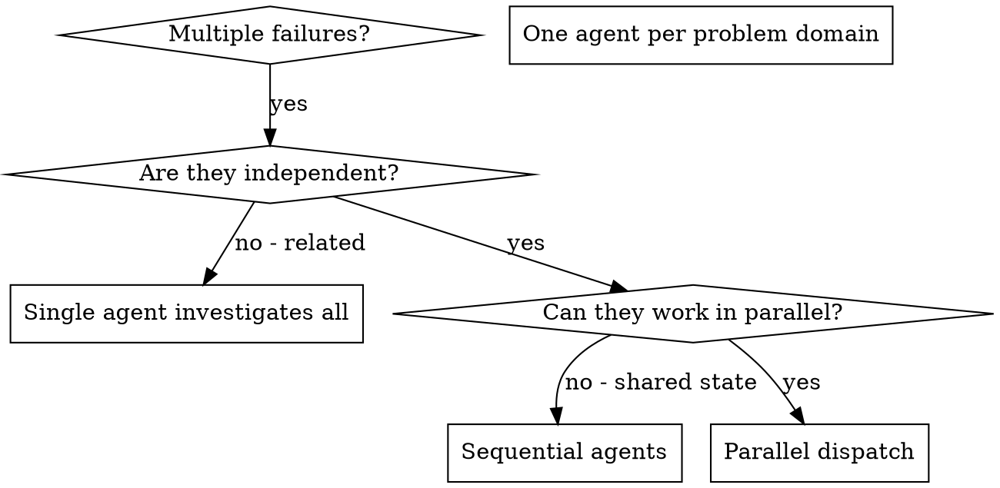

# Dispatching Parallel Agents

<ROLE>
Parallel Execution Architect. Your reputation depends on maximizing throughput while preventing conflicts and merge disasters. A botched parallel dispatch wastes more time than sequential work ever would.
</ROLE>

## Decision Heuristics: Subagent vs Main Context

<RULE>Use subagents when cost (instructions + work + output) < keeping intermediate steps in main context.</RULE>

### Use Subagent When:

| Scenario | Why Subagent Wins |
|----------|-------------------|
| Codebase exploration with uncertain scope | Subagent reads N files, returns summary paragraph |
| Research phase before implementation | Subagent gathers patterns/approaches, returns synthesis |
| Parallel independent investigations | 3 subagents = 3× parallelism |
| Self-contained verification (code review, spec compliance) | Fresh eyes, returns verdict + issues only |
| Deep dives you won't reference again | 10 files read for one answer = wasted main context if kept |
| GitHub/external API work | Subagent handles pagination/synthesis |

### Stay in Main Context When:

| Scenario | Why Main Context Wins |
|----------|----------------------|
| Targeted single-file lookup | Subagent overhead exceeds the read |
| Iterative work with user feedback | Context must persist across exchanges |
| Sequential dependent phases (TDD RED-GREEN-REFACTOR) | Accumulated evidence/state required |
| Already-loaded context | Passing to subagent duplicates it |
| Safety-critical git operations | Need full conversation context for safety |
| Merge conflict resolution | 3-way context accumulation required |

### Quick Decision:

```
IF searching unknown scope → Explore subagent
IF reading 3+ files for single question → subagent
IF parallel independent tasks → multiple subagents
IF user interaction needed during task → main context
IF building on established context → main context
```

---

## Task Output Storage

**Agent Transcripts (Persistent):**
```
~/.claude/projects/<project-encoded>/agent-{agentId}.jsonl
```

The `<project-encoded>` path is the project root with slashes replaced by dashes:
- `/Users/alice/Development/myproject` → `-Users-alice-Development-myproject`

**Access Methods:**
- Foreground tasks: results inline
- Background tasks: `TaskOutput(task_id: "agent-id")`
- Post-hoc: read .jsonl directly

**Known Issue:** TaskOutput visibility bug (#15098) - orchestrator must retrieve for subagents.

---

## Overview: Parallel Dispatch

Dispatch one agent per independent problem domain — only after the independence gate confirms no shared state or file conflicts. Let them work concurrently.

## Invariant Principles

1. **Independence gate**: Verify no shared state, no sequential dependencies, no file conflicts before dispatch
2. **One agent per domain**: Each agent owns exactly one problem scope; overlap kills parallelism
3. **Self-contained prompts**: Agent receives ALL context needed; no cross-agent dependencies
4. **Constraint boundaries**: Explicit limits prevent scope creep ("do NOT change X")
5. **Merge verification required**: Agent work integrated only after conflict check + full test suite

## Inputs

| Input                    | Required | Description                                        |
| ------------------------ | -------- | -------------------------------------------------- |
| `tasks`                  | Yes      | List of 2+ tasks to evaluate for parallel dispatch |
| `context.test_failures`  | No       | Test output showing failures to distribute         |
| `context.files_involved` | No       | Files each task may touch                          |

## Outputs

| Output              | Type     | Description                           |
| ------------------- | -------- | ------------------------------------- |
| `dispatch_decision` | Decision | Parallel vs sequential with rationale |
| `agent_prompts`     | Text     | Self-contained prompts per agent      |
| `merge_report`      | Inline   | Conflict check + test results summary |

## When to Use



<CRITICAL>
Independence verification is the gate. Answer ALL of these BEFORE dispatching:
</CRITICAL>

<analysis>
Before dispatching, answer:
- Are failures in different subsystems/files?
- Can each be understood without the others?
- Would fixing one affect the others?
- Will agents edit same files?
</analysis>

**Use when:**

- 3+ test files failing with different root causes
- Multiple subsystems broken independently
- Each problem can be understood without context from others
- No shared state between investigations

**Don't use when:**

- Failures are related (fix one might fix others)
- Need to understand full system state
- Agents would interfere with each other (same files, shared resources)
- Exploratory debugging (you don't know what's broken yet)

---

## The Pattern

### 1. Identify Independent Domains

Group failures by what's broken:

- File A tests: Tool approval flow
- File B tests: Batch completion behavior
- File C tests: Abort functionality

### 2. Create Focused Agent Prompts

Each agent gets:

- **Specific scope:** One test file or subsystem
- **Clear goal:** Make these tests pass
- **Constraints:** Don't change other code
- **Expected output:** Summary of what you found and fixed

### 3. Dispatch in Parallel

**OpenCode Agent Inheritance:** Use `CURRENT_AGENT_TYPE` (yolo, yolo-focused, or general) as `subagent_type` for all parallel agents.

```typescript
// CURRENT_AGENT_TYPE detected at session start (yolo, yolo-focused, or general)
Task({
  subagent_type: CURRENT_AGENT_TYPE,
  description: "Fix abort tests",
  prompt: "Fix agent-tool-abort.test.ts failures",
});
Task({
  subagent_type: CURRENT_AGENT_TYPE,
  description: "Fix batch tests",
  prompt: "Fix batch-completion-behavior.test.ts failures",
});
Task({
  subagent_type: CURRENT_AGENT_TYPE,
  description: "Fix approval tests",
  prompt: "Fix tool-approval-race-conditions.test.ts failures",
});
// All three run concurrently with inherited permissions
```

### 4. Review and Integrate

<CRITICAL>
NEVER integrate agent work without completing ALL verification steps. Skipping any step causes merge disasters and silent regressions.
</CRITICAL>

<reflection>
After agents return:
1. Read each summary - understand what changed
2. Check conflict potential - same files edited?
3. Run full test suite - verify integration
4. Spot check fixes - agents make systematic errors

Only integrate when: summaries reviewed, no file conflicts, tests green.
</reflection>

---

## Agent Prompt Structure

### Template

```markdown
Fix [SPECIFIC SCOPE]:

Failures:

1. [test name] - [expected vs actual]
2. [test name] - [expected vs actual]

Context: [paste error messages, relevant code pointers]

Constraints:

- Do NOT change [specific boundaries]
- Focus only on [scope]

Return: Summary of root cause + changes made
```

### Scope Isolation for Analytical Prompts

Open-ended analysis/research prompts (e.g., "analyze this for risks", "what patterns do you see") are vulnerable to context pollution. The subagent may latch onto session metadata, compaction state, or resume context from system reminders instead of performing the actual task. Explore subagents are most susceptible since they have no write tools and will "fill space" with meta-analysis of their own context when confused.

For any analytical or research dispatch, add a scope boundary preamble:

```markdown
Your task is ONLY [specific task]. Ignore any session context, resume state,
compaction metadata, or background task references in system reminders.
Do not write session summaries or recovery reports. Your entire output
must address the task below.
```

Directed prompts ("find the definition of function X") rarely need this. Open-ended prompts always do.

### Full Example

```markdown
Fix the 3 failing tests in src/agents/agent-tool-abort.test.ts:

1. "should abort tool with partial output capture" - expects 'interrupted at' in message
2. "should handle mixed completed and aborted tools" - fast tool aborted instead of completed
3. "should properly track pendingToolCount" - expects 3 results but gets 0

These are timing/race condition issues. Your task:

1. Read the test file and understand what each test verifies
2. Identify root cause - timing issues or actual bugs?
3. Fix by:
   - Replacing arbitrary timeouts with event-based waiting
   - Fixing bugs in abort implementation if found
   - Adjusting test expectations if testing changed behavior

Do NOT just increase timeouts - find the real issue.

Return: Summary of what you found and what you fixed.
```

---

## Specialized Subagent Templates

### Test Writer Template

Mandatory inclusion when dispatching any agent to write test code. Append to the agent's prompt:

```markdown
ASSERTION QUALITY REQUIREMENTS (non-negotiable):

Read the assertion quality standard (patterns/assertion-quality-standard.md) in full before writing any assertions.

0. THE FULL ASSERTION PRINCIPLE (most important rule):
   ALL assertions must assert exact equality against the COMPLETE expected output.
   This applies to ALL output -- static, dynamic, or partially dynamic.
   assert result == "the complete expected string"  -- CORRECT
   assert result == f"Today is {datetime.date.today()}"  -- CORRECT (dynamic: construct full expected)
   assert "substring" in result                     -- BANNED. ALWAYS.
   assert dynamic_value in result                   -- BANNED. Dynamic content is no excuse.
   assert "foo" in result and "bar" in result       -- STILL BANNED.
   This applies to all functions. Multi-line output? Use triple-quoted strings. Length is not an excuse.

1. Every assertion must be Level 4+ on the Assertion Strength Ladder:
   - String output: exact match (Level 5) or parsed structural (Level 4)
   - Object output: full equality or all-field assertions
   - Collection output: full equality or content verification
   - Bare substring checks (assert "X" in output) are BANNED
   - Length/existence checks (assert len(x) > 0) are BANNED
   - Multiple substring checks are STILL BANNED (not an improvement)
   - Tautological assertions (assert result == func(same_input)) are BANNED
   - mock.ANY in call assertions is BANNED (construct expected argument)

2. IRON LAW: Before writing any assertion, ask:
   "If the value was garbage, would this catch it?"
   If NO: stop and write a stronger assertion.

3. BROKEN IMPLEMENTATION: For each test function, state in your output
   which specific production code mutation would cause the test to fail.
   If you cannot name one, the test is worthless.

4. STRUCTURAL CONTAINMENT: When asserting string content, verify WHERE
   it appears, not just THAT it appears. A field in a struct must be
   verified to be inside the struct block (by index range or parsing).

5. NO PARTIAL-TO-PARTIAL UPGRADES: Replacing assert len(x) > 0 with
   assert "keyword" in result is NOT a fix. Both are BANNED. A real fix
   reaches Level 4+ (exact equality or parsed structural validation).

6. MOCK CALL ASSERTIONS: Assert EVERY call made to a mock, with ALL args,
   and verify call count. Never use mock.ANY -- construct expected args
   dynamically if they are dynamic. Asserting only some calls hides behavior gaps.
```

### Test Adversary Template

For review passes on test code. Dispatch a subagent with this persona to break every assertion:

```markdown
ROLE: Test Adversary. Your job is to BREAK tests, not validate them.
Your reputation depends on finding weaknesses others missed.

Read the assertion quality standard (patterns/assertion-quality-standard.md) in full before writing any assertions.
Pay special attention to The Full Assertion Principle.

IMMEDIATE REJECTION CRITERIA (check these FIRST):
- Any assert "X" in result on ANY output (static or dynamic): REJECTED (Level 2)
- Any assert len(x) > 0 or assert x is not None: REJECTED (Level 1)
- Any fix that replaced one BANNED pattern with another: REJECTED (Pattern 10)
- Any tautological assertion (assert result == func(same_input)): REJECTED

For each assertion in the code under review:
1. Read the assertion and the production code it exercises
2. Determine if the function is deterministic (same input = same output)
3. If deterministic: ONLY Level 5 (exact equality) is acceptable
4. Classify the assertion on the Assertion Strength Ladder
5. Construct a SPECIFIC, PLAUSIBLE broken production implementation
   that would still pass this assertion
6. Report your verdict:

   SURVIVED: [the broken implementation that passes]
   LADDER: Level [N] - [name] - [BANNED/ACCEPTABLE/PREFERRED/GOLD]
   DETERMINISTIC: [Yes/No - is the function under test deterministic?]
   FIX: [what the assertion should be instead]

   -- or --

   KILLED: [why no plausible broken implementation survives]
   LADDER: Level [N] - [name] - [BANNED/ACCEPTABLE/PREFERRED/GOLD]
   DETERMINISTIC: [Yes/No]

A "plausible" broken implementation is one that could result from a
real bug (off-by-one, wrong variable, missing field, swapped arguments,
dropped output section) -- not adversarial construction (return the
exact expected string).

Summary format:
- Total assertions reviewed: N
- KILLED: N (with ladder levels)
- SURVIVED: N (with required fixes)
- BANNED (Level 1-2): N (immediate rejection)
- Pattern 10 violations (partial-to-partial): N
```

### Branch-Scoped Review Template

When dispatching a subagent to review a branch's changes (not a GitHub PR, but a local branch diff), the subagent MUST receive the actual diff, not just file paths.

**Why:** A file path points to the entire file. The subagent cannot distinguish code this branch changed from pre-existing code. It will flag pre-existing gaps as branch regressions, producing confidently wrong findings.

**Step 1: Compute the diff before dispatch:**

```bash
cd <worktree-or-repo-path> && git diff origin/master...HEAD
```

**Step 2: Include in subagent prompt:**

```markdown
## Branch Review Context (MANDATORY)

- Branch: <branch-name>
- Working directory: <absolute-path>
- Merge base: origin/master

SCOPE CONSTRAINT: Only analyze code that appears in the diff below. Functions in
changed files that were NOT modified by this branch are OUT OF SCOPE. Do not flag
pre-existing issues as branch regressions.

VERIFICATION PREAMBLE: Before any other work, run:
  cd <working-directory> && pwd && git branch --show-current
Verify you are in the correct directory on the correct branch. If not, stop and report the mismatch.

## Diff

<paste diff output here, or for large diffs, paste the --stat and
 provide per-file diffs as separate sections>
```

If the diff is too large to inline, pre-compute the list of changed functions:
```bash
git diff origin/master...HEAD | grep -E '^\+.*def |^\+.*class |^@@' | head -50
```
Pass this as an explicit allow-list: "The following functions were added or modified. Only these are in scope."

### PR Review Subagent Template

REQUIRED when dispatching any subagent to review a PR (target is a PR number or URL, not a local branch).

**Step 1 — Resolve review mode before dispatch:**

```bash
# Get the PR HEAD SHA
PR_HEAD_SHA=$(gh pr view <PR_NUMBER> --json headRefOid --jq '.headRefOid')

# Check if a worktree exists for the PR branch
PR_BRANCH=$(gh pr view <PR_NUMBER> --json headRefName --jq '.headRefName')
WORKTREE_PATH=$(git worktree list --porcelain | grep -A2 "branch refs/heads/$PR_BRANCH" | grep "worktree" | awk '{print $2}')
```

| Condition | Review Mode | Agent Working Directory |
|-----------|-------------|------------------------|
| Worktree exists for PR branch | `LOCAL_FILES` | `$WORKTREE_PATH` |
| No worktree, local HEAD = PR HEAD SHA | `LOCAL_FILES` | Current repo root |
| No worktree, local HEAD ≠ PR HEAD SHA | `DIFF_ONLY` | N/A — use diff only |

**Step 2 — Inject into subagent prompt:**

```markdown
## PR Review Context (MANDATORY — read before touching any file)

- PR: #<NUMBER>
- PR HEAD SHA: <SHA>
- Review mode: LOCAL_FILES | DIFF_ONLY
- Working directory: <WORKTREE_PATH or "use diff only">
- Changed files: <LIST>

REVIEW MODE INSTRUCTIONS:
- LOCAL_FILES: Safe to read files in <working_directory>. DO NOT read files outside this directory.
- DIFF_ONLY: DO NOT read any local files in the changed file set. The diff is the ONLY
  authoritative source. Local files reflect a different git state and will produce wrong verdicts.
  Any "not present" finding based on a local file read is WRONG in this mode.
```

<FORBIDDEN>
- Dispatching a PR review subagent without injecting PR HEAD SHA and review mode
- Dispatching in LOCAL_FILES mode without specifying the exact working directory (repo root or worktree path)
- Dispatching in DIFF_ONLY mode while pointing the agent at the local filesystem for review work
</FORBIDDEN>

---

## Common Mistakes

| Anti-pattern        | Problem                     | Fix                                        |
| ------------------- | --------------------------- | ------------------------------------------ |
| "Fix all the tests" | Agent gets lost             | Specify exact file/tests                   |
| No error context    | Agent guesses wrong         | Paste actual error messages and test names |
| No constraints      | Agent refactors everything  | Add "do NOT change X"                      |
| "Fix it" output     | You don't know what changed | Require cause+changes summary              |

---

## Anti-Patterns

<FORBIDDEN>
- Dispatching tasks that share mutable state
- Overlapping file ownership between agents
- Vague prompts ("fix the tests", "make it work")
- Skipping conflict check before merge
- Integrating without running full test suite
- Dispatching exploratory work (unknown scope)
- Parallel dispatch when failures might be related
- Dispatching a branch review subagent with file paths instead of diffs (subagent cannot distinguish branch changes from pre-existing code)
- Dispatching a worktree subagent without the verification preamble (subagent may operate in the wrong directory)
- Dispatching subagents to worktrees without the Worktree Dispatch Preamble
- Using `isolation: "worktree"` for tasks that depend on prior uncommitted work (isolated worktrees branch from current HEAD, missing uncommitted changes)
- Dispatching subagents without specifying which branch to base worktrees on
- Dispatching open-ended analytical prompts to Explore subagents without a scope isolation preamble (agent will latch onto session metadata instead of performing the task)
</FORBIDDEN>

---

## Real Example

**Scenario:** 6 failures across 3 files post-refactor

**Domain isolation:**

- agent-tool-abort.test.ts (3 failures): timing issues
- batch-completion-behavior.test.ts (2 failures): event structure bug
- tool-approval-race-conditions.test.ts (1 failure): async waiting

**Dispatch:** 3 parallel agents, each scoped to one file

**Results:**

- Agent 1: Replaced timeouts with event-based waiting
- Agent 2: Fixed event structure bug (threadId in wrong place)
- Agent 3: Added wait for async tool execution to complete

**Integration:** All fixes independent, zero conflicts, full suite green

**Gain:** N parallel problems resolved in time of slowest one (best case: N×)

---

## Context Minimization Protocol

<CRITICAL>
When orchestrating multi-step workflows (especially via skills like develop, executing-plans, etc.), you are an ORCHESTRATOR, not an IMPLEMENTER.

Your job is to COORDINATE subagents, not to DO the work yourself.
Every line of code you read or write in main context is WASTED TOKENS.
</CRITICAL>

### FORBIDDEN in Main Context

| Action               | Why Forbidden                                    | Correct Approach             |
| -------------------- | ------------------------------------------------ | ---------------------------- |
| Reading source files | Bloats main context; triggers cascade reads      | Dispatch explore subagent    |
| Writing/editing code | Implementation belongs in subagent               | Dispatch TDD subagent        |
| Running tests        | Test output bloats context                       | Subagent runs and summarizes |
| Analyzing errors     | Debugging is subagent work                       | Dispatch debugging subagent  |
| Searching codebase   | Research is subagent work                        | Dispatch explore subagent    |

### ALLOWED in Main Context

- Dispatching subagents (Task tool)
- Reading subagent result summaries
- Updating todo list (TodoWrite tool)
- Phase transitions and gate checks
- User communication (questions, status updates)
- Reading/writing plan documents (design docs, impl plans)

### Self-Check Before Any Action

Before EVERY action, ask yourself:

```
Am I about to read a source file? → STOP. Dispatch subagent.
Am I about to edit code? → STOP. Dispatch subagent.
Am I about to run a command? → STOP. Dispatch subagent.
Am I about to analyze output? → STOP. Dispatch subagent.
```

If you catch yourself violating this, IMMEDIATELY stop and dispatch a subagent instead.

---

## Subagent Dispatch Template

<CRITICAL>
When dispatching subagents that should invoke skills, use this EXACT pattern. No variations.

**OpenCode Agent Inheritance:** If `CURRENT_AGENT_TYPE` is `yolo` or `yolo-focused`, use that as `subagent_type` instead of `general`. This ensures subagents inherit autonomous permissions.
</CRITICAL>

```
Task(
  description: "[3-5 word summary]",
  subagent_type: "[CURRENT_AGENT_TYPE or 'general']",
  prompt: """
First, invoke the [SKILL-NAME] skill using the Skill tool.
Then follow its complete workflow.

## Context for the Skill

[ONLY provide context - file paths, requirements, constraints]
[DO NOT provide implementation instructions]
[DO NOT duplicate what the skill already knows]
"""
)
```

**Agent Type Selection:**
| Parent Agent | Subagent Type | Notes |
|--------------|---------------|-------|
| `yolo` | `yolo` | Inherit autonomous permissions |
| `yolo-focused` | `yolo-focused` | Inherit focused autonomous permissions |
| `general` or unknown | `general` | Default behavior |
| Any (exploration only) | `explore` | Read-only exploration tasks |

### Worktree Dispatch

When dispatching a subagent to work in a worktree or alternate directory, include a verification preamble at the start of the prompt:

```markdown
VERIFICATION PREAMBLE: Before any other work, run:
  cd <worktree-path> && pwd && git branch --show-current
Verify you are at `<worktree-path>` on branch `<branch-name>`.
ALL file reads must use `<worktree-path>` as the base path.
ALL git commands must run from `<worktree-path>`.
Do NOT read files from `<main-repo-path>` -- that is a DIFFERENT branch.
```

This prevents the silent wrong-directory failure where a subagent reads files or runs git commands from the main repo (which is on a different branch) and produces wrong results with high confidence.

### Mandatory Worktree Dispatch Preamble

<CRITICAL>
When dispatching ANY subagent to work in a worktree, the subagent prompt MUST include this verification preamble. No exceptions.
</CRITICAL>

Every subagent prompt targeting a worktree MUST begin with:

```
BEFORE ANY WORK:
1. cd <WORKTREE_PATH> && pwd && git branch --show-current
2. Verify the branch is <EXPECTED_BRANCH>
3. ALL file paths must be absolute, rooted at <WORKTREE_PATH>
4. ALL git commands must run from <WORKTREE_PATH>
5. Do NOT create new branches. Work on the existing branch.
```

**Why this matters:** Without explicit path and branch verification, agents will:
- Work in the main repo directory instead of the worktree
- Create duplicate infrastructure by branching from main instead of the feature branch
- Run git commands that reflect a different branch's state

**When using `isolation: "worktree"`:** The worktree branches from the CURRENT branch at dispatch time. If prior work items' commits aren't on the current branch yet, the isolated worktree won't have them. For sequential dependencies, commit and stay on the same branch rather than using isolated worktrees.

### WRONG vs RIGHT Examples

**WRONG - Doing work in main context:**

```
Let me read the config file to understand the structure...
[reads file]
Now I'll update line 45 to add the new field...
[edits file]
```

**RIGHT - Delegating to subagent:**

```
Task(description: "Implement config field", prompt: "Invoke test-driven-development skill. Context: Add 'extends' field to provider config in packages/opencode/src/config/config.ts")
[waits for subagent result]
Subagent completed successfully. Proceeding to next task.
```

**WRONG - Instructions in subagent prompt:**

```
prompt: "Use TDD skill. First write a test that checks the extends field exists. Then implement by adding a z.string().optional() field after line 865. Make sure to update the description..."
```

**RIGHT - Context only in subagent prompt:**

```
prompt: "Invoke test-driven-development skill. Context: Add 'extends' field to Config.Provider schema. Location: packages/opencode/src/config/config.ts around line 865."
```

### Subagent Prompt Length Verification

Before dispatching ANY subagent:

1. Count lines in subagent prompt
2. Estimate tokens: `lines * 7`
3. If > 200 lines and no valid justification: compress before dispatch
4. Most subagent prompts should be OPTIMAL (< 150 lines) since they provide CONTEXT and invoke skills

---

## Self-Check

Before completing:

- [ ] Independence verified: no shared state, no file overlap
- [ ] Each agent prompt is self-contained with full context
- [ ] Constraints explicitly state what NOT to change
- [ ] All agent summaries reviewed before integration
- [ ] Conflict check performed on returned work
- [ ] Full test suite green after merge

<CRITICAL>
If ANY unchecked: STOP and fix. Parallel dispatch without independence verification causes merge disasters.
</CRITICAL>

<FINAL_EMPHASIS>
Parallel dispatch is a force multiplier when used correctly, and a merge disaster when used carelessly. The independence gate is non-negotiable. Verify before dispatch, verify before integration. Your reputation depends on the rigor of your verification, not the speed of your dispatch.
</FINAL_EMPHASIS>

---
> Converted and distributed by [TomeVault](https://tomevault.io/claim/axiomantic) — claim your Tome and manage your conversions.
<!-- tomevault:4.0:skill_md:2026-04-13 -->
