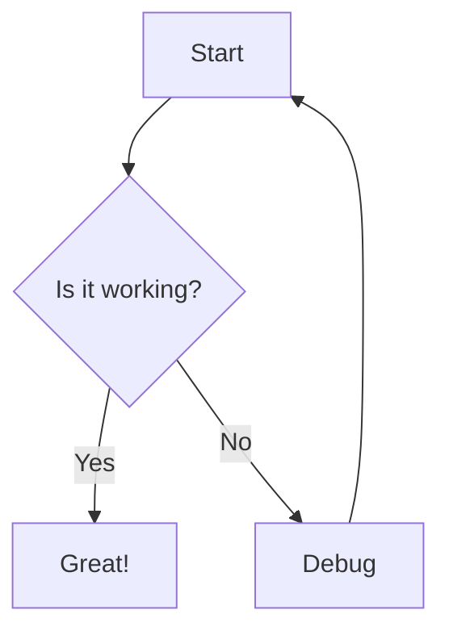
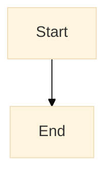
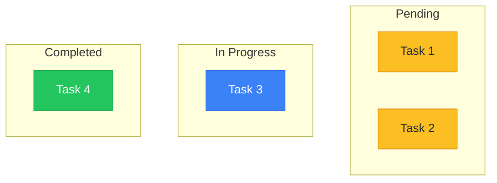

# Mermaid Collaboration Tool

This skill helps you create, edit, and collaborate on Mermaid diagrams and UI designs using the claude-mermaid-collab server.

## What This Tool Provides

- **Real-time Diagram Editor**: Live preview with pan, zoom, and auto-save for Mermaid diagrams
- **Real-time Document Editor**: Markdown document collaboration with live preview
- **Design Editor**: Figma-compatible vector design tool for GUI mockups and visual layouts
- **Team Collaboration**: Real-time updates across all connected clients via WebSocket
- **File-Based Storage**: Simple `.mmd` and `.md` files for version control
- **Unified Dashboard**: Browse and manage both diagrams and documents in one place
- **MCP Integration**: Create and manage diagrams and documents directly from Claude Code

## Running the Server

The server can be run from any directory. Use `STORAGE_DIR` to specify where diagrams and documents are stored.

**Run from the claude-mermaid-collab repository:**
```bash
# Store diagrams/docs in a specific project directory
STORAGE_DIR=/path/to/your/project bun run src/server.ts

# Or store in current directory (default)
bun run dev
```

The server starts on `http://localhost:3737`. The `PUBLIC_DIR` (HTML/CSS/JS) is always resolved relative to the server installation, so static files work regardless of where you run it from.

## When to Use This Skill

Use this skill when you need to create visual artifacts or collaborative documents.

### Mermaid Diagrams — logic, structure, relationships

Use `create_diagram()` when the **relationships between things** matter more than pixel-perfect appearance:
- Flowcharts, decision trees, process flows
- Sequence diagrams (API calls, message passing)
- State diagrams, lifecycle transitions
- Architecture diagrams (system components and connections)
- Class/ER diagrams, data models
- Gantt charts, timelines
- Mind maps, git graphs

### Design Editor — visual layouts, GUIs, mockups

Use `create_design()` + `add_design_node()` / `batch_design_operations()` when **precise visual appearance** matters:
- GUI mockups (screens, dialogs, forms, navigation)
- UI component prototypes (buttons, cards, inputs)
- Page layouts, content arrangement, spacing
- Marketing/presentation visuals
- Design system explorations (color, typography, spacing)

### Documents — written specs and notes

Use `create_document()` for:
- Design specifications and requirements
- Technical documentation
- Meeting notes, decision logs
- Any long-form collaborative writing

## MCP Tools Available

The server provides these MCP tools through Claude Code:

### Diagrams
- `list_diagrams()` - List all diagrams with metadata
- `get_diagram(id)` - Read diagram content
- `create_diagram(name, content)` - Create new diagram (auto-validates)
- `update_diagram(id, content)` - Replace full diagram content (auto-validates)
- `patch_diagram(id, old_string, new_string)` - **Preferred for small edits** - efficient search-replace
- `validate_diagram(content)` - Check syntax without saving
- `preview_diagram(id)` - Get browser URL for diagram

### Documents
Documents are markdown files (`.md`) for collaborative writing - specs, documentation, meeting notes, etc.

- `list_documents()` - List all markdown documents with metadata
- `get_document(id)` - Read full document content and metadata
- `create_document(name, content)` - Create new markdown document (returns ID and preview URL)
- `update_document(id, content)` - Replace full document content with real-time sync
- `patch_document(id, old_string, new_string)` - **Preferred for small edits** - efficient search-replace
- `preview_document(id)` - Get browser URL for document viewer

### Patch vs Update

**Prefer `patch_document`/`patch_diagram`** for targeted changes:
- Changing a status field
- Updating a single value
- Adding text at a specific location

**Use `update_document`/`update_diagram`** for:
- Adding entirely new sections
- Restructuring large portions
- When patch fails (old_string not found or matches multiple locations)

**Note**: There is no delete_document MCP tool yet. Use the dashboard delete button or REST API for deletion.

## Creating Standard Mermaid Diagrams

### Flowchart Example


### Direction Toggle
Use the direction toggle button (⤡) in the editor to switch between:
- **LR** (Left to Right) - Horizontal layout
- **TD** (Top Down) - Vertical layout

Supported directions: TD, TB, BT, RL, LR

## Diagram Theming

Diagrams automatically adapt to the app's light/dark theme. Understanding how theming works helps create diagrams that look good in both modes.

### Default Behavior (Recommended)

Diagrams without custom `%%{init}%%` directives automatically follow the app theme:
- **Light mode**: Uses Mermaid's `default` theme
- **Dark mode**: Uses Mermaid's `dark` theme

This is the recommended approach for most diagrams - they "just work" in both modes.

### Custom Theming with `%%{init}%%`

When you add an `%%{init}%%` directive, the diagram takes **full control** of its own theming. The app's theme setting is ignored.



Available themes: `default`, `dark`, `forest`, `neutral`, `base`

### Custom Status Colors

For diagrams with status indicators (pending/in-progress/completed), use `classDef` and `class` instead of hardcoded styles:



**Why this works**: `classDef`/`class` applies colors to specific nodes without affecting the overall theme, so subgraphs and backgrounds still adapt to light/dark mode.

### What NOT to Do

Don't hardcode dark colors in `themeVariables` if you want diagrams to work in both modes:

```mermaid
%% BAD - This will look wrong in light mode
%%{init: {'theme': 'base', 'themeVariables': {'background': '#1e293b', 'primaryColor': '#334155'}}}%%
```

Don't use inline `style` directives for status colors:

```mermaid
%% BAD - Harder to maintain, doesn't scale
style T1 fill:#fbbf24
style T2 fill:#fbbf24
```

### Theming Best Practices

1. **Let most diagrams follow app theme** - Don't add `%%{init}%%` unless you need custom styling
2. **Use `classDef` for status colors** - Keeps nodes styled while letting backgrounds adapt
3. **Test in both modes** - Toggle dark mode to verify your diagram looks good
4. **Keep subgraphs unstyled** - Let them inherit theme colors for proper backgrounds

## Creating UI Designs

The design editor is a Figma-compatible vector design tool. Create and manipulate designs using MCP tools.

### Quick Start

```
# Create a design
create_design(project, session, "my-design", { rootId: "...", nodes: [...] })

# Add nodes with high-level tools
add_design_node(project, session, designId, type="RECTANGLE", x=100, y=100, width=200, height=100, fill="#3B82F6", cornerRadius=8)
add_design_node(project, session, designId, type="TEXT", x=100, y=50, text="Hello", fontSize=24, fontWeight=700)
add_design_node(project, session, designId, type="FRAME", name="Card", width=300, height=200, fill="#FFFFFF", layoutMode="VERTICAL", itemSpacing=12, padding=16)

# Batch operations for complex layouts
batch_design_operations(project, session, designId, operations=[...])
```

### Available Tools
- `add_design_node` - Add shapes, text, frames with auto-layout
- `update_design_node` - Change node properties (position, fill, text, etc.)
- `remove_design_node` - Delete nodes and children
- `batch_design_operations` - Multiple add/update/remove in one call

### Supported Node Types
- `FRAME` - Container with optional auto-layout
- `RECTANGLE` - Rectangle shape
- `ELLIPSE` - Ellipse/circle
- `TEXT` - Text with font properties
- `LINE` - Line segment
- `GROUP` - Transparent group container

See the `using-design-editor` skill for full documentation, scene graph structure, and patterns.

## Collaborating on Markdown Documents

The document collaboration feature allows teams to write and edit markdown documents with real-time updates, just like diagrams.

### What Documents Are For

Documents are markdown (`.md`) files for:
- **Technical Specifications**: API docs, requirements, design specs
- **Meeting Notes**: Collaborative note-taking during meetings
- **Project Documentation**: README files, wikis, guides
- **Architecture Decisions**: ADRs, technical decision records
- **User Stories**: Feature descriptions, acceptance criteria
- **Team Knowledge**: How-tos, troubleshooting guides, onboarding docs

### Creating Documents

```
create_document("api-spec", """
# Payment API Specification

## Overview
This document describes the payment API endpoints.

## Authentication
All requests require Bearer token authentication.

## Endpoints

### POST /api/payments
Create a new payment transaction.

**Request Body:**
```json
{
  "amount": 100.00,
  "currency": "USD",
  "customer_id": "cust_123"
}
\```

**Response:**
```json
{
  "id": "pay_456",
  "status": "pending",
  "created_at": "2024-01-13T10:00:00Z"
}
\```

## Error Codes
- `400` - Invalid request
- `401` - Unauthorized
- `500` - Server error
""")
```

### Document Editor Features

The document editor (`/document.html?id=<id>`) provides:
- **Split-pane view**: Markdown source on left, rendered preview on right
- **Live preview**: See formatted output as you type
- **Auto-save**: Saves automatically 500ms after you stop typing
- **Undo/Redo**: Full history with Ctrl+Z / Ctrl+Shift+Z
- **Syntax highlighting**: Code blocks with language support
- **Real-time collaboration**: See updates from other users instantly
- **Resizable panes**: Drag the separator to adjust layout
- **Clean content API**: Get sanitized HTML for safe rendering
- **Review workflow**: Comment, propose, approve, and reject content

### Review Workflow

The document editor includes a review workflow for collaborative editing with visual status indicators:

**Toolbar Buttons:**
- **💬 Comment** - Add comments to selections or at cursor
- **◇ Propose** (cyan) - Mark content as proposed/suggested
- **✓ Approve** (green) - Mark content as approved
- **✗ Reject** (red) - Mark content as rejected with reason
- **⊘ Clear** - Remove any status markers

**Status Types:**

| Status | Color | Section Marker | Inline Marker |
|--------|-------|----------------|---------------|
| Proposed | Cyan | `<!-- status: proposed: label -->` | `<!-- propose-start: label -->...<!-- propose-end -->` |
| Approved | Green | `<!-- status: approved -->` | `<!-- approve-start -->...<!-- approve-end -->` |
| Rejected | Red | `<!-- status: rejected: reason -->` | `<!-- reject-start: reason -->...<!-- reject-end -->` |
| Comment | Yellow | `<!-- comment: text -->` | `<!-- comment-start: text -->...<!-- comment-end -->` |

**How It Works:**
- **Select text** then click a button → wraps selection with inline markers
- **Cursor on list item** then click → wraps the list item content
- **Cursor under heading** then click → adds section-level status after heading
- **Toggle between states** → clicking Approve on proposed content switches it to approved
- Markers are HTML comments, so they're invisible in standard markdown renderers

**Example Usage:**
```markdown
## Feature Proposal
<!-- status: proposed: new authentication flow -->

This section describes the new login system.

We should use <!-- propose-start: needs discussion -->OAuth 2.0<!-- propose-end --> for authentication.

- <!-- approve-start -->Email/password login<!-- approve-end -->
- <!-- reject-start: too complex for MVP -->Biometric auth<!-- reject-end -->
```

### Markdown Features Supported

The editor supports full GitHub-Flavored Markdown:
- **Headings**: `# H1` through `###### H6`
- **Bold**: `**bold**` or `__bold__`
- **Italic**: `*italic*` or `_italic_`
- **Links**: `[text](url)`
- **Images**: ``
- **Code blocks**: \```language ... \```
- **Inline code**: \`code\`
- **Lists**: Unordered (`-`, `*`, `+`) and ordered (`1.`, `2.`)
- **Blockquotes**: `> quote`
- **Tables**: Pipe-separated tables
- **Task lists**: `- [ ]` unchecked, `- [x]` checked
- **Horizontal rules**: `---`, `***`, or `___`

### Document Workflow Example

```
# 1. Create a spec document
result = create_document("feature-spec", """
# User Authentication Feature

## Problem Statement
Users need a secure way to log into the application.

## Proposed Solution
Implement JWT-based authentication with refresh tokens.

## Requirements
1. Email/password login
2. JWT tokens with 15-minute expiry
3. Refresh token rotation
4. Password reset flow

## API Endpoints
- POST /auth/login
- POST /auth/refresh
- POST /auth/logout
- POST /auth/reset-password

## Security Considerations
- Passwords hashed with bcrypt
- Tokens stored in httpOnly cookies
- Rate limiting on login attempts
""")

# 2. Share preview URL with team
preview_document("feature-spec")

# 3. Team reviews and adds comments/updates in real-time

# 4. Update based on feedback
update_document("feature-spec", """
# User Authentication Feature

## Problem Statement
Users need a secure way to log into the application.

## Proposed Solution
Implement JWT-based authentication with refresh tokens and optional 2FA.

## Requirements
1. Email/password login
2. JWT tokens with 15-minute expiry
3. Refresh token rotation
4. Password reset flow
5. **NEW**: Optional TOTP 2FA

## API Endpoints
- POST /auth/login
- POST /auth/refresh
- POST /auth/logout
- POST /auth/reset-password
- **NEW**: POST /auth/2fa/enable
- **NEW**: POST /auth/2fa/verify

## Security Considerations
- Passwords hashed with bcrypt (cost factor 12)
- Tokens stored in httpOnly, secure cookies
- Rate limiting: 5 attempts per 15 minutes
- 2FA backup codes generated on enable
""")
```

### Document Best Practices

1. **Use descriptive names**: `api-architecture` not `doc1`
2. **Structure with headings**: Use H1 for title, H2 for sections
3. **Keep it focused**: One document per topic/feature
4. **Link related docs**: Use markdown links to connect documents
5. **Version in git**: Documents are `.md` files - commit them
6. **Add timestamps**: Include "Last updated" dates for living docs
7. **Use code blocks**: Properly format code examples with language tags
8. **Create templates**: Standardize document structure for consistency

### Dashboard Features

The unified dashboard shows both diagrams and documents:
- **Type badges**: Blue "Diagram" and purple "Document" badges
- **Type filter**: Filter by "All Items", "Diagrams Only", or "Documents Only"
- **Search**: Search across both diagrams and documents
- **Preview**: Documents show first heading or first 100 characters
- **Thumbnails**: Diagrams show rendered preview, documents show text excerpt
- **Sort by date**: Newest items first
- **Delete all**: Remove all diagrams and documents at once

## Best Practices

### Diagram Naming
- Use descriptive names: `user-login-flow` not `diagram1`
- Use hyphens, not spaces: `api-architecture` not `api architecture`
- Keep names lowercase for consistency

### Collaboration Workflow
1. Create diagram: `create_diagram("feature-flow", content)`
2. Share the preview URL with team members
3. Team members can view real-time updates in their browsers
4. Everyone sees changes instantly via WebSocket

### Design Tips
1. **Start with screens**: Define your main screens first
2. **Use containers**: Group related elements in `col` and `row`
3. **Add padding**: Use `padding=16` on containers for spacing
4. **Flexible layouts**: Use `flex` for responsive elements
5. **Toggle direction**: Try both LR and TD to see what works best

### Version Control
All diagrams are stored as `.mmd` files in the `diagrams/` folder:
- Easy to commit to git
- Plain text, easy to diff
- Can edit externally with any text editor
- Auto-reloads in the web interface

## Editor Features

### Keyboard Shortcuts
- **Undo**: Ctrl+Z (managed by editor)
- **Redo**: Ctrl+Shift+Z (managed by editor)
- **Auto-save**: 500ms after typing stops

### Pan & Zoom Controls
- **Mouse wheel**: Zoom in/out
- **Drag**: Pan around diagram
- **⊡ Fit**: Fit entire diagram to viewport
- **↔ Fit Width**: Fit diagram width
- **↕ Fit Height**: Fit diagram height
- **↻ Reset**: Reset zoom to 100%
- **+ / −**: Zoom in/out buttons

### Resizable Panes
- **Drag the separator** between code and preview
- Customize your preferred layout
- Setting persists across sessions

## Common Patterns

### Card Layout
```
batch_design_operations(designId, operations=[
  { op: "add", type: "FRAME", nodeId: "card", properties: { name: "Card", width: 320, height: 200, fill: "#FFFFFF", cornerRadius: 12, layoutMode: "VERTICAL", padding: 16, itemSpacing: 8 } },
  { op: "add", type: "TEXT", parentId: "card", properties: { text: "Title", fontSize: 18, fontWeight: 600 } },
  { op: "add", type: "TEXT", parentId: "card", properties: { text: "Description", fontSize: 14, fill: "#6B7280" } },
])
```

### Dashboard Grid
```
batch_design_operations(designId, operations=[
  { op: "add", type: "FRAME", nodeId: "row", properties: { name: "Stats Row", layoutMode: "HORIZONTAL", itemSpacing: 16 } },
  { op: "add", type: "FRAME", nodeId: "stat1", parentId: "row", properties: { name: "Users", width: 200, height: 100, fill: "#EFF6FF", cornerRadius: 8, layoutMode: "VERTICAL", padding: 16, itemSpacing: 4 } },
  { op: "add", type: "TEXT", parentId: "stat1", properties: { text: "Total Users", fontSize: 12, fill: "#6B7280" } },
  { op: "add", type: "TEXT", parentId: "stat1", properties: { text: "1,234", fontSize: 24, fontWeight: 700 } },
])
```

## Troubleshooting

### Diagram Not Rendering
- Check syntax with `validate_diagram(content)` first
- Look at error banner in editor for line-specific errors
- Make sure Mermaid syntax is valid

### Design Not Showing
- Verify the design has a valid scene graph `{ rootId, nodes[] }`
- Check that node IDs in `childIds` reference existing nodes
- Ensure CanvasKit WASM loaded (check browser console)

### Real-time Updates Not Working
- Check WebSocket connection status (top-right indicator)
- Click the status indicator to reconnect if disconnected
- Make sure you're subscribed to the correct diagram

## Pro Tips

1. **Use validate before save**: Call `validate_diagram()` to catch errors early
2. **Preview URL sharing**: Use `preview_diagram(id)` to get sharable links
3. **Direction matters**: Horizontal (LR) works better for wide diagrams, vertical (TD) for tall ones
4. **Prototype fast**: Use `batch_design_operations` to build UIs quickly
5. **Version everything**: Design history is tracked automatically
6. **Use auto-layout**: Set `layoutMode` on frames for responsive designs
7. **Use badges**: Dashboard shows diagram vs document badges for easy identification

## Example Workflow

```
# 1. Create a design
create_design(project, session, "checkout-flow", { rootId: "root", nodes: [] })

# 2. Add UI elements using batch operations
batch_design_operations(project, session, "checkout-flow", operations=[
  { op: "add", type: "FRAME", nodeId: "page", properties: { name: "Cart", width: 375, height: 812, fill: "#FFFFFF", layoutMode: "VERTICAL" } },
  { op: "add", type: "FRAME", nodeId: "header", parentId: "page", properties: { name: "Header", width: 375, height: 56, fill: "#3B82F6", layoutMode: "HORIZONTAL", padding: 16 } },
  { op: "add", type: "TEXT", parentId: "header", properties: { text: "Shopping Cart", fontSize: 18, fontWeight: 600, fill: "#FFFFFF" } },
  { op: "add", type: "FRAME", nodeId: "items", parentId: "page", properties: { layoutMode: "VERTICAL", itemSpacing: 8, padding: 16 } },
  { op: "add", type: "TEXT", parentId: "items", properties: { text: "Item 1 - $29.99", fontSize: 14 } },
  { op: "add", type: "TEXT", parentId: "items", properties: { text: "Item 2 - $39.99", fontSize: 14 } },
  { op: "add", type: "FRAME", nodeId: "btn", parentId: "page", properties: { name: "Checkout Button", width: 343, height: 44, fill: "#3B82F6", cornerRadius: 8 } },
])

# 3. Design appears live in browser, iterate with update_design_node
```

## Resources

- **Web Dashboard**: http://localhost:3737/
- **Editor**: http://localhost:3737/diagram.html?id=<diagram-id>
- **Mermaid Docs**: https://mermaid.js.org/
- **Project README**: See `/README.md` for full documentation
- **Design Editor**: See `skills/using-design-editor/SKILL.md` for full design tool documentation

---

**Remember**: This is a collaboration tool - diagrams update in real-time for all connected users. Perfect for pair programming, design reviews, and team brainstorming sessions!

---
> Converted and distributed by [TomeVault](https://tomevault.io/claim/ben-mad-jlp) — claim your Tome and manage your conversions.
<!-- tomevault:4.0:skill_md:2026-04-13 -->
