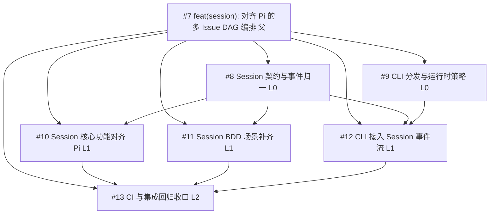

# Multi-Issue DAG Authoring

用于“需求较大、需要并行但有依赖”的 issue 设计与创建。

## 适用场景

- 需求跨多个模块，单 issue 难以追踪
- 存在明确先后关系（依赖链）
- 需要并行开发但要控制冲突风险

## 默认模式

- 默认：`Sub-Issue` 模式（父 issue + 子 issue）
- 子 issue body 使用：
  - `parent: #<parent_issue_number>`
  - 可选 `depends-on: #<issue1>, #<issue2>`
- 多 Issue DAG 编排入口标签使用 `bot:orchestrate`（由 control 接管后自动流转）

## 标签触发规则（与 control 对齐）

1. **只给子 issue 打标签，父 issue 不打**。父 issue 是纯 tracker（目标、边界、验收总标准），不触发 niuma 流程。如果给父 issue 也打了 `bot:orchestrate`，niuma 会把父 issue 当作独立任务来跑，导致重复执行。
2. 多 Issue DAG：对**每个子 issue** 添加 `bot:orchestrate` 进入编排队列。control 会根据 `depends-on` 自动排队。
3. control 自动流转：`bot:orchestrate` → `bot:queued` → `bot:fix`（依赖满足后触发单 issue 流程）。
4. 单 Issue 直跑：可直接添加 `bot:fix`，不经过 DAG 编排。
5. `bot:*` 属于受控状态标签，统一通过 `niuma state-label` 迁移；禁止直接 `gh issue edit --add-label/--remove-label bot:*`。
6. **首次打标签**：新创建的 issue 没有 `bot:*` 标签，使用 `niuma state-label set --to bot:orchestrate` 时**省略 `--from`**。`--from` 仅用于已有 bot 标签的状态迁移（CAS 语义）。

## 标题规范（必须）

1. 父 issue：`feat(<scope>): <description>`。
2. 子 issue：`sub(#<parent>): <description>`（推荐，便于按父 issue 检索）。
3. 子 issue 的标题不重复写依赖；依赖只写在 body 的 `depends-on`。

## 写作原则（仅 issue 设计，不含运行时合并策略）

1. 父 issue 只定义目标、边界、验收总标准。
2. 子 issue 只放“单一可交付单元”，避免一条里混多个模块。
3. 每个子 issue 必须写测试场景（输入/预期/边界）。
4. 每个子 issue 建议写 `affected_files`，用于降低并行冲突。
5. 每个子 issue 建议写 `risk_and_rollback`，明确失败时回退路径。

## 降冲突拆分规则

1. 先按“文件/模块边界”切分，再按阶段切分。
2. 高重叠文件的任务不要同层并行，改为显式依赖。
3. 公共接口变更放前置节点，业务改动依赖该节点。
4. 纯文档/测试任务可并行放在末层。

## DAG 编排建议（实操）

1. L0 放“契约与骨架”：接口定义、数据结构、迁移脚手架。
2. L1 放“模块实现”：各子模块并行，但避免共享文件。
3. L2 放“集成与回归”：联调、兼容、跨模块用例。
4. L3 放“发布收尾”：文档、发布说明、清理任务。

## 父 Issue 模板

```markdown
## 背景
...

## 目标
...

## 非目标
...

## DAG 结构（概要）
- L0: #A #B
- L1: #C(depends-on A), #D(depends-on B)
- L2: #E(depends-on C,D)

## 关键路径（Critical Path）
- #A -> #C -> #E

## Sub-Issues
- [ ] #<sub1>
- [ ] #<sub2>
- [ ] #<sub3>

## 总体验收标准
- [ ] 所有 sub issue 完成并关闭
- [ ] 关键链路测试通过
- [ ] 无未决阻塞依赖
```

## 子 Issue 模板

```markdown
## 背景
...

## 任务定义
...

## 依赖
parent: #<parent>
depends-on: #<optional_dep_1>, #<optional_dep_2>

## 影响范围
- affected_files:
  - `path/a`
  - `path/b`

## 风险与回滚
- risk_and_rollback:
  - 风险: ...
  - 回滚: ...

## 测试场景
1. 输入: ...
   预期: ...
2. 边界: ...
   预期: ...

## 验收标准
- [ ] 功能完成
- [ ] 测试通过
```

## Mermaid DAG 图（必须）

创建完所有 issue 后，在父 issue 添加一条评论，用 Mermaid 画出完整 DAG 依赖图。GitHub 会自动渲染。

### 格式规范

- 节点 ID 用 `I` + issue 编号：`I30`、`I31`
- 节点标签包含：`#编号 简短描述 层级`
- 父 issue 连接所有子 issue
- 子 issue 之间标注 depends-on 依赖
- 底部附跳转链接列表

### 示例

````markdown
DAG 图（Mermaid）如下：



连接（点击跳转）：
- #7: https://github.com/<owner>/<repo>/issues/7
- #8: https://github.com/<owner>/<repo>/issues/8
- #9: https://github.com/<owner>/<repo>/issues/9
````

## 创建步骤（gh CLI）

1. 先创建父 issue，记录编号 `P`。
2. 逐个创建子 issue，body 中写 `parent: #P` 与可选 `depends-on`。
3. 回填父 issue 的 task list：`- [ ] #<sub>`。
4. 在父 issue 添加评论，用 Mermaid 画 DAG 依赖图（见上方格式规范）。
5. 检查 DAG 无环（无循环 depends-on），关键路径可闭合。
6. 若走多 Issue DAG，给**每个子 issue**（不含父 issue）打 `bot:orchestrate`；若走单 Issue 直跑，打 `bot:fix`。

## 快速命令示例

```bash
# 创建父 issue
gh issue create --title "feat(<scope>): <parent-title>" --body-file /tmp/parent.md --label enhancement

# 创建子 issue（示例）
gh issue create --title "sub(#<parent>): <task-title>" --body-file /tmp/sub1.md --label enhancement

# ============================================================
# 触发标签（重要：只给子 issue 打，不给父 issue 打）
# ============================================================

# 多 issue DAG 编排：给每个子 issue 打 bot:orchestrate
# 注意：新 issue 首次打标签时省略 --from（因为没有前置 bot 状态）
niuma state-label set --repo <owner/repo> --issue <子issue编号> --to bot:orchestrate

# 单 issue 直跑：给目标 issue 打 bot:fix（同样省略 --from）
niuma state-label set --repo <owner/repo> --issue <issue编号> --to bot:fix

# 已有 bot 标签的状态迁移：用 --from 做 CAS 约束
niuma state-label set --repo <owner/repo> --issue <issue编号> --from bot:pr-needs-fix --to bot:iterating
```

## Control 编排命令（必会）

当你已经给子 issue 打了 `bot:orchestrate`，但看起来“没开始”时，先用 control 命令确认系统状态：

```bash
# 1) 看全局 DAG 与 task 状态
niuma control status --repo <owner/repo> --repo-dir <repo_dir>

# 2) 检查某个 issue 是否进入编排队列
niuma control check --repo <owner/repo> --issue <issue编号> --repo-dir <repo_dir>

# 3) 手动跑一轮协调循环（最常用）
niuma control run --repo <owner/repo> --repo-dir <repo_dir>
```

### `control run` 的期望行为

1. 先 hydrate `bot:orchestrate/bot:queued` 的 issue 为本地 tasks。
2. 按 `depends-on` 拓扑，只把 ready 的子 issue 从 `bot:queued` 推进到 `bot:fix`。
3. 未满足依赖的 issue 继续保持 `bot:queued`（这是正确行为，不是卡死）。

### 常见“没开始”误判

1. **4 个子 issue 同时是 `bot:queued`，只看到 1 个变成 `bot:fix`**：正常。DAG 按关键路径逐个推进。
2. **父 issue 也被打了 `bot:orchestrate`**：会被当独立任务，造成干扰。清理父 issue 的 `bot:*`。
3. **工作流并发取消导致只处理到最后一个事件**：手动执行一次 `niuma control run` 可补偿推进。
4. **有标签但无 token**：本地命令报 `GITHUB_TOKEN environment variable not set`，需要先注入 token。

```bash
export GITHUB_TOKEN="$(gh auth token)"
niuma control run --repo <owner/repo> --repo-dir <repo_dir>
```

## 常见错误

1. **给父 issue 打了 `bot:orchestrate`**：父 issue 会被 niuma 当作独立任务来跑，与子 issue 重复执行。父 issue 只做 tracker，不打 bot 标签。
2. **首次打标签时加了 `--from`**：新 issue 没有 bot 状态，`--from` 会导致 CAS 校验失败（mismatch）。首次打标签省略 `--from`。
3. **直接用 `gh issue edit --add-label bot:*`**：绕过了状态机校验和并发保护，可能导致多状态冲突。必须用 `niuma state-label set`。

---
> Converted and distributed by [TomeVault](https://tomevault.io/claim/biantaishabi2) — claim your Tome and manage your conversions.
<!-- tomevault:4.0:skill_md:2026-04-11 -->
