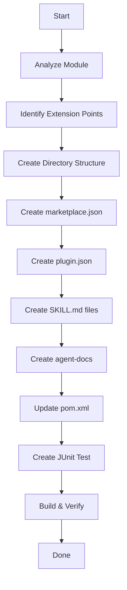

# Add Module Skills

Step-by-step guide to add Claude skill packages and agent-docs to any JUDO Runtime Core module, making it a self-contained package with embedded documentation.

## Overview

This skill guides you through adding:
- `claude/` directory with marketplace, plugins, and skills
- `agent-docs/` directory with module documentation
- Maven configuration for version substitution
- JUnit tests to validate JAR structure

## Naming Convention

**IMPORTANT**: All JUDO Runtime Core skills MUST use the `judo-runtime:` prefix to avoid collisions with other modules and ecosystems:

| Pattern | Example |
|---------|---------|
| Plugin name | `judo-runtime:<module>` |
| Skill command | `/judo-runtime:<module>:<skill>` |
| SKILL.md name field | `judo-runtime:<module>-<skill>` |

Examples:
- `/judo-runtime:dispatcher:create-interceptor`
- `/judo-runtime:dao-rdbms:custom-queries`
- `/judo-runtime:expression:custom-functions`

## Process Flow



## Step 1: Analyze the Module

Before creating skills, understand what the module provides:

1. **Read the module's main interfaces and classes**
2. **Identify extension points** (interfaces users can implement)
3. **Find common use cases** (what do users typically need help with?)
4. **Check for existing documentation** in Javadoc or README

Questions to answer:
- What problem does this module solve?
- What can users extend or customize?
- What are common mistakes or debugging scenarios?

## Step 2: Create Directory Structure

```bash
# Replace <module> with actual module name (e.g., dispatcher, dao-rdbms)
MODULE_DIR="judo-runtime-core-<module>/src/main/resources"

mkdir -p "$MODULE_DIR/claude/plugins/judo-runtime-<short-name>/.claude-plugin"
mkdir -p "$MODULE_DIR/claude/plugins/judo-runtime-<short-name>/skills"
mkdir -p "$MODULE_DIR/agent-docs/examples"
```

Final structure:
```
src/main/resources/
├── claude/
│   ├── marketplace.json
│   ├── INSTALL.md
│   └── plugins/
│       └── judo-runtime-<short-name>/
│           ├── .claude-plugin/
│           │   └── plugin.json
│           └── skills/
│               ├── <skill-1>/
│               │   └── SKILL.md
│               └── <skill-2>/
│                   └── SKILL.md
└── agent-docs/
    ├── README.md
    ├── architecture.md
    ├── extension-points.md
    └── examples/
        └── example.java
```

## Step 3: Create marketplace.json

File: `src/main/resources/claude/marketplace.json`

```json
{
  "name": "judo-runtime-core-<module>",
  "version": "${project.version}",
  "description": "<Module description - what it does>",
  "groupId": "hu.blackbelt.judo.runtime",
  "artifactId": "judo-runtime-core-<module>",
  "repository": "https://github.com/BlackBeltTechnology/judo-runtime-core",
  "plugins": [
    {
      "name": "judo-runtime:<short-name>",
      "path": "./plugins/judo-runtime-<short-name>",
      "description": "Skills for working with JUDO <Module Name>"
    }
  ],
  "agentDocs": "./agent-docs"
}
```

## Step 4: Create INSTALL.md

File: `src/main/resources/claude/INSTALL.md`

```markdown
# Installing JUDO <Module Name> Skills

## Module Information
- **GroupId**: hu.blackbelt.judo.runtime
- **ArtifactId**: judo-runtime-core-<module>
- **Version**: ${project.version}

## Installation

### Extract from Maven cache

\`\`\`bash
JAR=~/.m2/repository/hu/blackbelt/judo/runtime/judo-runtime-core-<module>/${project.version}/judo-runtime-core-<module>-${project.version}.jar
unzip -o "$JAR" "claude/*" "agent-docs/*" -d .
\`\`\`

## Available Skills

| Skill | Command | Description |
|-------|---------|-------------|
| <Skill 1> | `/judo-runtime:<short-name>:<skill-1>` | <Description> |
| <Skill 2> | `/judo-runtime:<short-name>:<skill-2>` | <Description> |
```

## Step 5: Create plugin.json

File: `src/main/resources/claude/plugins/judo-runtime-<short-name>/.claude-plugin/plugin.json`

```json
{
  "name": "judo-runtime:<short-name>",
  "version": "${project.version}",
  "description": "Skills for JUDO <Module Name> - <brief description>",
  "homepage": "https://github.com/BlackBeltTechnology/judo-runtime-core/tree/develop/judo-runtime-core-<module>",
  "skills": [
    {
      "name": "judo-runtime:<short-name>-<skill-1>",
      "path": "./skills/<skill-1>",
      "description": "<What the skill does>"
    }
  ]
}
```

## Step 6: Create SKILL.md Files

Each skill needs a SKILL.md following the [Agent Skills standard](https://agentskills.io/specification):

File: `src/main/resources/claude/plugins/judo-runtime-<short-name>/skills/<skill-name>/SKILL.md`

```markdown
---
name: judo-runtime:<short-name>-<skill-name>
description: <What the skill does AND when to use it. Include keywords for discovery. Max 1024 chars.>
metadata:
  author: BlackBelt Technology
  version: "${project.version}"
---

# <Skill Title>

<Brief introduction>

## <Section with mermaid diagram>

\`\`\`mermaid
sequenceDiagram
    participant A
    participant B
    A->>B: Action
    B-->>A: Response
\`\`\`

## Extension Point Interface

\`\`\`java
// Show the interface users need to implement
public interface MyExtension {
    // methods...
}
\`\`\`

## Example Implementation

\`\`\`java
// Complete working example
public class MyExtensionImpl implements MyExtension {
    // implementation...
}
\`\`\`

## Registration

Show how to register with Guice:

\`\`\`java
Multibinder<MyExtension> binder = 
    Multibinder.newSetBinder(binder(), MyExtension.class);
binder.addBinding().to(MyExtensionImpl.class);
\`\`\`

## See Also

- \`agent-docs/extension-points.md\` - All extension interfaces
- \`agent-docs/examples/\` - More examples
```

### Frontmatter Requirements

| Field | Required | Description |
|-------|----------|-------------|
| `name` | Yes | Use `judo-runtime:<module>-<skill>` format (max 64 chars) |
| `description` | Yes | What AND when to use (max 1024 chars) |
| `metadata` | No | Custom key-value pairs |
| `metadata.version` | Recommended | Use `"${project.version}"` for substitution |
| `metadata.author` | Recommended | `BlackBelt Technology` |

### Naming Examples

| Module | Skill | SKILL.md name field |
|--------|-------|---------------------|
| dispatcher | create-interceptor | `judo-runtime:dispatcher-create-interceptor` |
| dao-rdbms | custom-queries | `judo-runtime:dao-rdbms-custom-queries` |
| expression | custom-functions | `judo-runtime:expression-custom-functions` |
| validator | custom-validators | `judo-runtime:validator-custom-validators` |

## Step 7: Create agent-docs

### README.md

File: `src/main/resources/agent-docs/README.md`

```markdown
# JUDO Runtime Core - <Module Name>

## Overview

<What the module does, 2-3 sentences>

## Key Concepts

- **<Concept 1>**: <Brief explanation>
- **<Concept 2>**: <Brief explanation>

## Extension Points

| Interface | Purpose |
|-----------|---------|
| `<Interface1>` | <What it does> |
| `<Interface2>` | <What it does> |

## Quick Start

\`\`\`java
// Minimal example to get started
\`\`\`
```

### architecture.md

Include mermaid diagrams showing:
- Component relationships
- Request/response flows
- Key abstractions

### extension-points.md

Document each extension interface with:
- Purpose
- Methods and their signatures
- Example implementation
- Registration instructions

## Step 8: Update pom.xml

Add resource filtering to the module's `pom.xml`:

```xml
<build>
    <resources>
        <!-- Standard resources without filtering -->
        <resource>
            <directory>src/main/resources</directory>
            <filtering>false</filtering>
            <excludes>
                <exclude>claude/marketplace.json</exclude>
                <exclude>claude/plugins/*/.claude-plugin/plugin.json</exclude>
                <exclude>claude/plugins/*/skills/*/SKILL.md</exclude>
            </excludes>
        </resource>
        <!-- Files with version substitution -->
        <resource>
            <directory>src/main/resources</directory>
            <filtering>true</filtering>
            <includes>
                <include>claude/marketplace.json</include>
                <include>claude/plugins/*/.claude-plugin/plugin.json</include>
                <include>claude/plugins/*/skills/*/SKILL.md</include>
            </includes>
        </resource>
    </resources>
    <!-- existing plugins... -->
</build>
```

## Step 9: Create JUnit Test

File: `src/test/java/hu/blackbelt/judo/runtime/core/<module>/JarSkillPackageTest.java`

```java
package hu.blackbelt.judo.runtime.core.<module>;

import org.junit.jupiter.api.Test;
import java.io.*;
import java.nio.charset.StandardCharsets;
import java.util.stream.Collectors;
import static org.hamcrest.MatcherAssert.assertThat;
import static org.hamcrest.Matchers.*;

class JarSkillPackageTest {

    @Test
    void marketplaceJsonShouldBeAccessibleViaClasspath() {
        InputStream is = getClass().getResourceAsStream("/claude/marketplace.json");
        assertThat("marketplace.json should be accessible", is, notNullValue());
    }

    @Test
    void marketplaceJsonShouldHaveVersionSubstituted() {
        String content = readResource("/claude/marketplace.json");
        assertThat(content, not(containsString("${project.version}")));
        assertThat(content, containsString("judo-runtime-core-<module>"));
    }

    @Test
    void pluginJsonShouldBeAccessible() {
        InputStream is = getClass().getResourceAsStream(
            "/claude/plugins/judo-runtime-<short-name>/.claude-plugin/plugin.json");
        assertThat("plugin.json should be accessible", is, notNullValue());
    }

    @Test
    void skillsShouldBeAccessible() {
        String[] skills = {
            "/claude/plugins/judo-runtime-<short-name>/skills/<skill-1>/SKILL.md",
            "/claude/plugins/judo-runtime-<short-name>/skills/<skill-2>/SKILL.md"
        };
        for (String skill : skills) {
            assertThat(skill + " should be accessible",
                getClass().getResourceAsStream(skill), notNullValue());
        }
    }

    @Test
    void agentDocsShouldBeAccessible() {
        String[] docs = {
            "/agent-docs/README.md",
            "/agent-docs/architecture.md",
            "/agent-docs/extension-points.md"
        };
        for (String doc : docs) {
            assertThat(doc + " should be accessible",
                getClass().getResourceAsStream(doc), notNullValue());
        }
    }

    private String readResource(String path) {
        try (InputStream is = getClass().getResourceAsStream(path);
             BufferedReader reader = new BufferedReader(
                 new InputStreamReader(is, StandardCharsets.UTF_8))) {
            return reader.lines().collect(Collectors.joining("\n"));
        } catch (Exception e) {
            throw new RuntimeException("Failed to read: " + path, e);
        }
    }
}
```

## Step 10: Build and Verify

```bash
# Build the module
mvn clean package -pl judo-runtime-core-<module> -DskipTests

# Verify JAR structure
jar tf target/judo-runtime-core-<module>-*.jar | grep -E "(claude|agent-docs)"

# Run tests
mvn test -pl judo-runtime-core-<module> -Dtest=JarSkillPackageTest

# Verify version substitution
unzip -p target/judo-runtime-core-<module>-*.jar claude/marketplace.json | head -5
```

Expected output:
```
claude/INSTALL.md
claude/marketplace.json
claude/plugins/judo-runtime-<short-name>/.claude-plugin/plugin.json
claude/plugins/judo-runtime-<short-name>/skills/<skill-1>/SKILL.md
agent-docs/README.md
agent-docs/architecture.md
...
```

## Module-Specific Skill Recommendations

| Module | Recommended Skills | Command Examples |
|--------|-------------------|------------------|
| `dispatcher` | create-interceptor, architecture, debug-operations | `/judo-runtime:dispatcher:create-interceptor` |
| `dao-rdbms` | custom-queries, query-debugging, dialect-extension | `/judo-runtime:dao-rdbms:custom-queries` |
| `expression` | expression-syntax, custom-functions | `/judo-runtime:expression:custom-functions` |
| `validator` | custom-validators, validation-rules | `/judo-runtime:validator:custom-validators` |
| `guice` | module-setup, dependency-injection | `/judo-runtime:guice:module-setup` |
| `security` | authentication-flow, custom-auth | `/judo-runtime:security:authentication-flow` |
| `guice-testkit` | test-setup, interceptor-testing | `/judo-runtime:testkit:interceptor-testing` |

## Reference Implementation

See `judo-runtime-core-dispatcher` for a complete example:
- `src/main/resources/claude/` - Full skill package
- `src/main/resources/agent-docs/` - Module documentation
- `pom.xml` - Resource filtering configuration
- `src/test/java/.../JarSkillPackageTest.java` - Validation tests

## Checklist

- [ ] Analyzed module for extension points
- [ ] Created `claude/` directory structure with `judo-runtime-` prefix
- [ ] Created `marketplace.json` with version placeholder
- [ ] Created `INSTALL.md` with extraction instructions
- [ ] Created `plugin.json` with `judo-runtime:` prefixed skill names
- [ ] Created SKILL.md files with `judo-runtime:<module>-<skill>` name format
- [ ] Created `agent-docs/README.md`
- [ ] Created `agent-docs/architecture.md` with mermaid diagrams
- [ ] Created `agent-docs/extension-points.md`
- [ ] Added example code in `agent-docs/examples/`
- [ ] Updated `pom.xml` with resource filtering
- [ ] Created `JarSkillPackageTest.java`
- [ ] Verified build produces correct JAR structure
- [ ] Verified version substitution works
- [ ] All tests pass

---
> Converted and distributed by [TomeVault](https://tomevault.io/claim/blackbelttechnology) — claim your Tome and manage your conversions.
<!-- tomevault:4.0:skill_md:2026-04-15 -->
