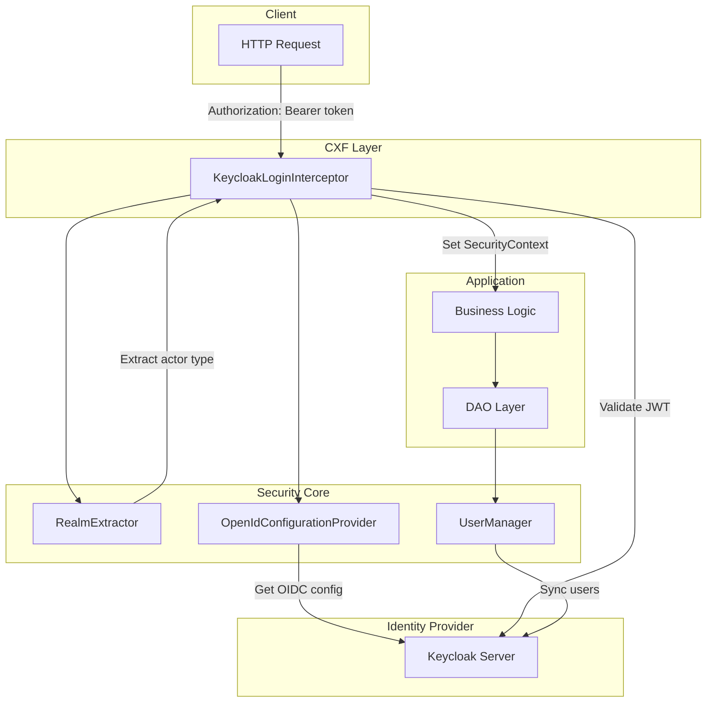
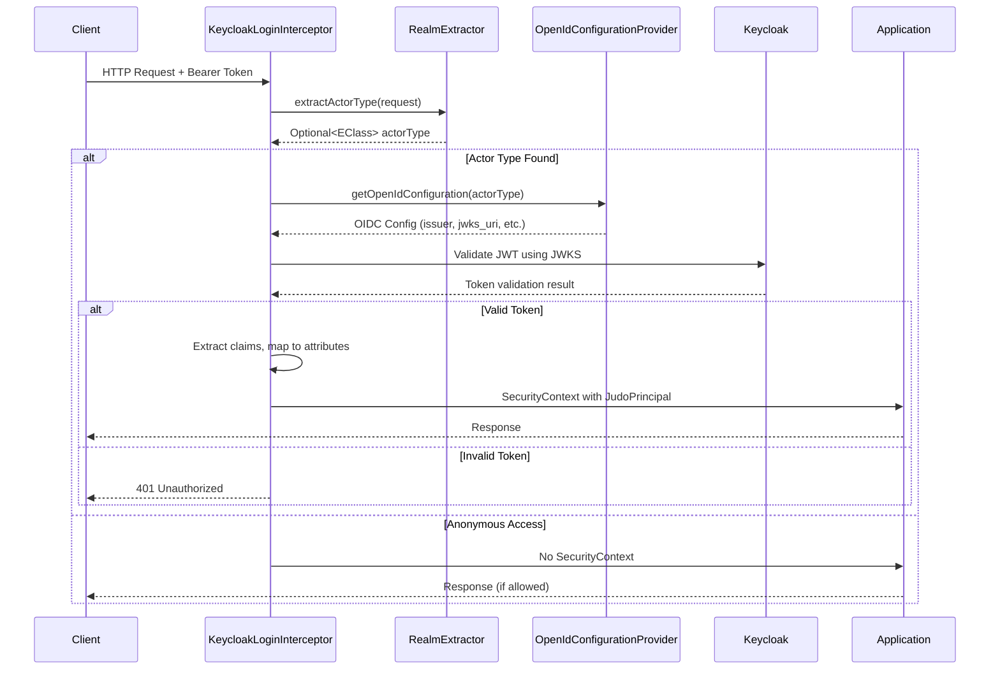
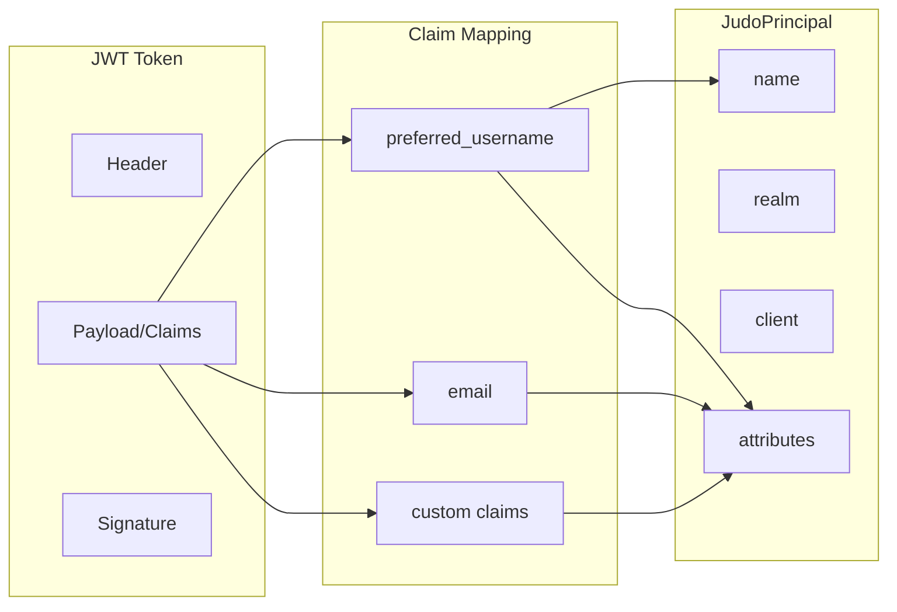
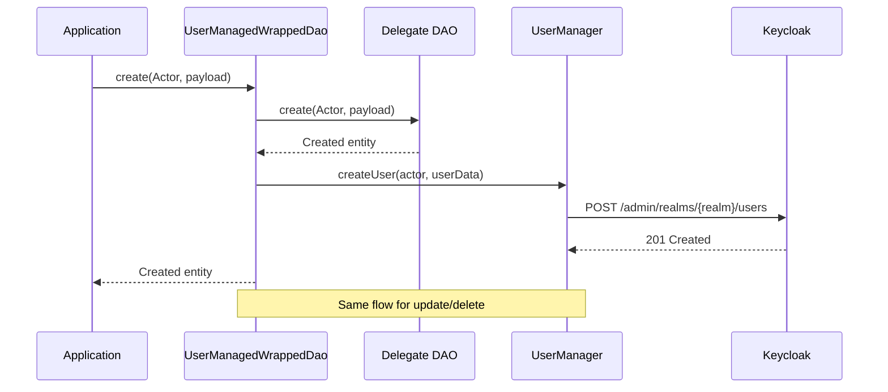

# JUDO Authentication Flow

Complete guide to understanding the authentication pipeline in JUDO Runtime Core.

## Overview

JUDO Security provides a multi-layer authentication system supporting:
- OAuth2 / OpenID Connect (OIDC) authentication
- JWT token validation and claims extraction
- Multi-tenant / multi-realm support
- Actor-based access control
- User lifecycle management

## Architecture



## Authentication Sequence



## Core Interfaces

### OpenIdConfigurationProvider

Provides OpenID Connect configuration for each actor type:

```java
public interface OpenIdConfigurationProvider {
    
    // Get the .well-known/openid-configuration URL for an actor type
    String getOpenIdConfigurationUrl(EClass actorType);
    
    // Get parsed OIDC configuration (cached)
    Map<String, Object> getOpenIdConfiguration(EClass actorType);
    
    // Get the identity provider server URL
    String getServerUrl();
    
    // Get OAuth2 client ID for an actor type
    String getClientId(EClass actorType);
    
    // Health check for identity provider
    void ping();
}
```

### RealmExtractor

Extracts actor type from HTTP requests:

```java
public interface RealmExtractor {
    
    // Extract actor type from request (typically from URL path)
    Optional<EClass> extractActorType(HttpServletRequest request);
}
```

**Default Implementation: PathInfoRealmExtractor**

Extracts actor from URL path:
- Request: `POST /api/Model/Actor/operation`
- Extracted: `Model.Actor` actor type

### UserManager

Manages users in the identity provider:

```java
public interface UserManager<ID> {
    
    // Get user by username
    Optional<Map<String, Object>> getUser(EClass actor, ID username);
    
    // Get all users for an actor type
    List<Map<String, Object>> getAllUsers(EClass actor);
    
    // Create a new user
    void createUser(EClass actor, Map<String, Object> user);
    
    // Update existing user
    void updateUser(EClass actor, ID username, Map<String, Object> user);
    
    // Delete user
    void deleteUser(EClass actor, ID username);
    
    // Get managed actor for a principal type
    Optional<EClass> getManagedActorOfPrincipal(EClass principalType);
    
    // Get attribute mapping between principal and Keycloak
    Map<String, String> getPrincipalAttributeMapping(EClass principalType);
    
    // Extract username from user data
    Optional<ID> getUsername(EClass principalType, Map<String, Object> user);
}
```

### PasswordPolicy

Defines password generation rules:

```java
public interface PasswordPolicy<ID> extends Function<Map<String, Object>, Optional<ID>> {
    // Apply policy: user data -> optional generated password
}
```

**Implementations:**
- `NoPasswordPolicy` - No automatic password generation
- `SameUsernamePasswordPolicy` - Password equals username
- `SameEmailPasswordPolicy` - Password equals email

## Token Flow



## User Synchronization

The `UserManagedWrappedDao` automatically syncs users with the identity provider:



## Configuration

### Keycloak Module Configuration (Guice)

```java
JudoKeycloakModuleConfiguration.builder()
    .keycloakServerUrl("http://localhost:8080/auth")
    .keycloakExternalUrl("https://auth.example.com")
    .keycloakAdminUser("admin")
    .keycloakAdminPassword("admin")
    .keycloakClientSecret(null)  // Optional for confidential clients
    .keycloakUserManagerEnabled(true)
    .keycloakUpdateExistingUsers(false)
    .keycloakAsyncServiceCall(true)  // Async user management calls
    .keycloakRetryMaxAttempts(1000)
    .keycloakRetryWaitDuration(1000L)
    .keycloakRetryExponentialBackoff(true)
    .build();
```

### Actor Type Annotations

Actor types require these annotations in the ASM model:

```
@actorType(managed=true)  // Enable user management
@realm("my-realm")        // Keycloak realm name
@claim("USERNAME")        // Attribute mapped to Keycloak username
@claim("EMAIL")           // Attribute mapped to Keycloak email
```

## Acceptable Clients Whitelist

By default, the JWT token's `azp` (authorized party) claim must match an actor type FQN in the ASM model.
The `acceptableClients` parameter allows additional Keycloak client IDs to authenticate against specific actor types.

### Configuration

**Format**: `ActorTypeFQN=client1,client2;OtherActorFQN=client3`

Client IDs can use either dashes or dots — dashes are automatically converted to dots to match the internal `convertClientToActorName()` normalization.

**Platform (OSGi)**:
```
JUDO_PLATFORM_ACCEPTABLE_CLIENTS=MyModel.UserActor=frontend-app,mobile-app;MyModel.AdminActor=admin-tool
```

**Spring Boot** (`application.properties`):
```properties
judo.actorResolver.acceptableClients=MyModel.UserActor=frontend-app,mobile-app;MyModel.AdminActor=admin-tool
```

**Guice** (`JudoDefaultModuleConfiguration`):
```java
JudoDefaultModuleConfiguration.builder()
    .actorResolverAcceptableClients("MyModel.UserActor=frontend-app,mobile-app")
    .build();
```

### How It Works

```
1. Token arrives with azp = "frontend-app"
2. KeycloakLoginInterceptor converts to "frontend.app" (dashes → dots)
3. DefaultActorResolver.authenticateByPrincipal() tries:
   a. asmUtils.resolve("frontend.app") → empty (not an actor FQN)
   b. Look up "frontend.app" in acceptableClients map → found under "MyModel.UserActor"
   c. asmUtils.resolve("MyModel.UserActor") → EClass ✓
   d. Proceed with MyModel.UserActor as the actor type
```

### Security Constraints

- Token verification (signature, expiry, audience) is **unchanged** — always validated by Keycloak first
- Each client is mapped to **exactly one** actor type — prevents privilege escalation
- Duplicate client across actor types is **rejected at startup** with `IllegalArgumentException`
- Empty configuration = existing behavior unchanged (backward compatible)

## Security Context

After successful authentication, `JudoPrincipal` is available:

```java
// In CXF resource
@Context
SecurityContext securityContext;

public Response myOperation() {
    JudoPrincipal principal = (JudoPrincipal) securityContext.getUserPrincipal();
    
    String username = principal.getName();
    String realm = principal.getRealm();
    String client = principal.getClient();  // Actor FQN
    Map<String, Object> claims = principal.getAttributes();
    
    // Use principal for authorization
}
```

## Error Handling

| Error | HTTP Status | Description |
|-------|-------------|-------------|
| Missing token | Depends on endpoint | Anonymous access (may be allowed) |
| Expired token | 401 | `ACCESS_TOKEN_EXPIRED` error code |
| Invalid signature | 401 | Token verification failed |
| Unknown realm | N/A | Request processed as anonymous |

## Debugging

### Enable Debug Logging

```xml
<logger name="hu.blackbelt.judo.runtime.core.security" level="DEBUG"/>
<logger name="org.keycloak" level="DEBUG"/>
```

### Common Issues

1. **Token validation fails**
   - Check Keycloak server URL matches issuer in token
   - Verify JWKS endpoint is accessible
   - Check clock skew between servers

2. **User not created in Keycloak**
   - Verify `keycloakUserManagerEnabled=true`
   - Check actor type has `@actorType(managed=true)`
   - Review Keycloak admin credentials

3. **Claims not mapped**
   - Verify `@claim` annotations on actor attributes
   - Check `AttributeBinding` in Keycloak model
   - Enable DEBUG logging to see token contents

## See Also

- `judo-runtime-core-security-keycloak` - Keycloak implementation
- `judo-runtime-core-security-keycloak-cxf` - CXF interceptors
- `judo-runtime-core-guice-keycloak` - Guice configuration
- `judo-runtime-core-accessmanager-api` - Authorization APIs

---
> Converted and distributed by [TomeVault](https://tomevault.io/claim/blackbelttechnology) — claim your Tome and manage your conversions.
<!-- tomevault:4.0:skill_md:2026-04-15 -->
