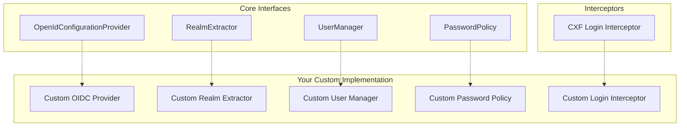

# Implement Custom Authentication Providers

Guide for creating custom authentication providers and extending the JUDO security framework.

## When to Customize

Create custom authentication providers when you need to:
- Integrate with non-Keycloak identity providers
- Implement custom SSO (Single Sign-On) solutions
- Add multi-factor authentication (MFA)
- Support legacy authentication systems
- Implement custom token validation logic
- Create specialized realm extraction logic

## Extension Points



## Custom OpenIdConfigurationProvider

Implement when using a non-Keycloak identity provider:

```java
package com.example.security;

import hu.blackbelt.judo.runtime.core.security.OpenIdConfigurationProvider;
import org.eclipse.emf.ecore.EClass;

import java.util.Map;
import java.util.concurrent.ConcurrentHashMap;

public class CustomOidcProvider implements OpenIdConfigurationProvider {
    
    private final String serverUrl;
    private final Map<EClass, Map<String, Object>> configCache = new ConcurrentHashMap<>();
    
    public CustomOidcProvider(String serverUrl) {
        this.serverUrl = serverUrl;
    }
    
    @Override
    public String getOpenIdConfigurationUrl(EClass actorType) {
        String realm = extractRealm(actorType);
        return serverUrl + "/realms/" + realm + "/.well-known/openid-configuration";
    }
    
    @Override
    public Map<String, Object> getOpenIdConfiguration(EClass actorType) {
        return configCache.computeIfAbsent(actorType, actor -> {
            // Fetch and parse OIDC discovery document
            return fetchOidcConfig(getOpenIdConfigurationUrl(actor));
        });
    }
    
    @Override
    public String getServerUrl() {
        return serverUrl;
    }
    
    @Override
    public String getClientId(EClass actorType) {
        // Convert actor FQN to client ID format
        return AsmUtils.getClassifierFQName(actorType).replace(".", "-");
    }
    
    @Override
    public void ping() {
        // Verify identity provider is reachable
        HttpClient.newHttpClient()
            .send(HttpRequest.newBuilder(URI.create(serverUrl + "/health")).build(),
                  HttpResponse.BodyHandlers.discarding());
    }
    
    private String extractRealm(EClass actorType) {
        return AsmUtils.getExtensionAnnotationValue(actorType, "realm", false)
            .orElseThrow(() -> new IllegalStateException("No realm defined for actor"));
    }
    
    private Map<String, Object> fetchOidcConfig(String url) {
        // HTTP fetch and JSON parse
        return new ObjectMapper().readValue(
            HttpClient.newHttpClient()
                .send(HttpRequest.newBuilder(URI.create(url)).build(),
                      HttpResponse.BodyHandlers.ofString())
                .body(),
            Map.class);
    }
}
```

## Custom RealmExtractor

Implement for custom request-to-actor mapping:

```java
package com.example.security;

import hu.blackbelt.judo.meta.asm.runtime.AsmModel;
import hu.blackbelt.judo.meta.asm.runtime.AsmUtils;
import hu.blackbelt.judo.runtime.core.security.RealmExtractor;
import org.eclipse.emf.ecore.EClass;

import javax.servlet.http.HttpServletRequest;
import java.util.List;
import java.util.Optional;

public class HeaderBasedRealmExtractor implements RealmExtractor {
    
    private static final String REALM_HEADER = "X-Realm";
    private final List<EClass> actors;
    
    public HeaderBasedRealmExtractor(AsmModel asmModel) {
        AsmUtils asmUtils = new AsmUtils(asmModel.getResourceSet());
        this.actors = asmUtils.getAllActorTypes();
    }
    
    @Override
    public Optional<EClass> extractActorType(HttpServletRequest request) {
        String realmHeader = request.getHeader(REALM_HEADER);
        
        if (realmHeader == null || realmHeader.isBlank()) {
            return Optional.empty();
        }
        
        return actors.stream()
            .filter(actor -> AsmUtils.getExtensionAnnotationValue(actor, "realm", false)
                .map(realm -> realm.equals(realmHeader))
                .orElse(false))
            .findFirst();
    }
}
```

### Multi-tenant Realm Extractor

Extract tenant from subdomain:

```java
public class SubdomainRealmExtractor implements RealmExtractor {
    
    private final Map<String, EClass> tenantActorMap;
    
    @Override
    public Optional<EClass> extractActorType(HttpServletRequest request) {
        String host = request.getServerName();
        String subdomain = extractSubdomain(host);
        
        return Optional.ofNullable(tenantActorMap.get(subdomain));
    }
    
    private String extractSubdomain(String host) {
        String[] parts = host.split("\\.");
        return parts.length > 2 ? parts[0] : null;
    }
}
```

## Custom UserManager

Implement for non-Keycloak user stores:

```java
package com.example.security;

import hu.blackbelt.judo.runtime.core.security.UserManager;
import org.eclipse.emf.ecore.EClass;

import java.util.*;

public class LdapUserManager implements UserManager<String> {
    
    private final LdapTemplate ldapTemplate;
    private final Map<EClass, String> actorBaseDnMap;
    
    public LdapUserManager(LdapTemplate ldapTemplate, AsmModel asmModel) {
        this.ldapTemplate = ldapTemplate;
        this.actorBaseDnMap = buildActorDnMap(asmModel);
    }
    
    @Override
    public Optional<Map<String, Object>> getUser(EClass actor, String username) {
        String baseDn = actorBaseDnMap.get(actor);
        if (baseDn == null) return Optional.empty();
        
        return ldapTemplate.search(
            baseDn,
            "(uid=" + username + ")",
            this::mapLdapEntry
        ).stream().findFirst();
    }
    
    @Override
    public List<Map<String, Object>> getAllUsers(EClass actor) {
        String baseDn = actorBaseDnMap.get(actor);
        if (baseDn == null) return Collections.emptyList();
        
        return ldapTemplate.search(
            baseDn,
            "(objectClass=person)",
            this::mapLdapEntry
        );
    }
    
    @Override
    public void createUser(EClass actor, Map<String, Object> user) {
        String baseDn = actorBaseDnMap.get(actor);
        String username = (String) user.get("username");
        
        DirContextOperations context = new DirContextAdapter();
        context.setAttributeValues("objectClass", new String[]{"person", "inetOrgPerson"});
        context.setAttributeValue("uid", username);
        context.setAttributeValue("cn", user.get("name"));
        context.setAttributeValue("mail", user.get("email"));
        
        ldapTemplate.bind("uid=" + username + "," + baseDn, context, null);
    }
    
    @Override
    public void updateUser(EClass actor, String username, Map<String, Object> user) {
        String baseDn = actorBaseDnMap.get(actor);
        String dn = "uid=" + username + "," + baseDn;
        
        DirContextOperations context = ldapTemplate.lookupContext(dn);
        context.setAttributeValue("cn", user.get("name"));
        context.setAttributeValue("mail", user.get("email"));
        
        ldapTemplate.modifyAttributes(context);
    }
    
    @Override
    public void deleteUser(EClass actor, String username) {
        String baseDn = actorBaseDnMap.get(actor);
        ldapTemplate.unbind("uid=" + username + "," + baseDn);
    }
    
    @Override
    public Optional<EClass> getManagedActorOfPrincipal(EClass principalType) {
        // Map principal types to managed actors
        return Optional.ofNullable(principalActorMap.get(principalType));
    }
    
    @Override
    public Map<String, String> getPrincipalAttributeMapping(EClass principalType) {
        // Map principal attributes to LDAP attributes
        return Map.of(
            "username", "uid",
            "email", "mail",
            "fullName", "cn"
        );
    }
    
    @Override
    public Optional<String> getUsername(EClass principalType, Map<String, Object> user) {
        return Optional.ofNullable((String) user.get("username"));
    }
    
    private Map<String, Object> mapLdapEntry(Attributes attrs) {
        Map<String, Object> user = new HashMap<>();
        user.put("username", getAttribute(attrs, "uid"));
        user.put("email", getAttribute(attrs, "mail"));
        user.put("name", getAttribute(attrs, "cn"));
        return user;
    }
}
```

## Custom PasswordPolicy

Implement for custom password generation:

```java
package com.example.security;

import hu.blackbelt.judo.runtime.core.security.PasswordPolicy;

import java.security.SecureRandom;
import java.util.Map;
import java.util.Optional;

public class SecureRandomPasswordPolicy implements PasswordPolicy<String> {
    
    private static final String CHARS = "ABCDEFGHIJKLMNOPQRSTUVWXYZabcdefghijklmnopqrstuvwxyz0123456789!@#$%";
    private static final int LENGTH = 16;
    private final SecureRandom random = new SecureRandom();
    
    @Override
    public Optional<String> apply(Map<String, Object> userData) {
        StringBuilder password = new StringBuilder(LENGTH);
        for (int i = 0; i < LENGTH; i++) {
            password.append(CHARS.charAt(random.nextInt(CHARS.length())));
        }
        return Optional.of(password.toString());
    }
}
```

### Email-based Temporary Password

```java
public class EmailTempPasswordPolicy implements PasswordPolicy<String> {
    
    private final EmailService emailService;
    
    @Override
    public Optional<String> apply(Map<String, Object> userData) {
        String email = (String) userData.get("email");
        String tempPassword = generateTempPassword();
        
        // Send email with temp password
        emailService.send(email, "Your temporary password", 
            "Your temporary password is: " + tempPassword);
        
        return Optional.of(tempPassword);
    }
}
```

## Custom Login Interceptor

Implement for custom authentication logic:

```java
package com.example.security;

import hu.blackbelt.judo.dispatcher.api.JudoPrincipal;
import hu.blackbelt.judo.runtime.core.security.RealmExtractor;
import org.apache.cxf.interceptor.Fault;
import org.apache.cxf.message.Message;
import org.apache.cxf.phase.AbstractPhaseInterceptor;
import org.apache.cxf.phase.Phase;
import org.apache.cxf.security.SecurityContext;
import org.eclipse.emf.ecore.EClass;

import javax.servlet.http.HttpServletRequest;
import java.util.Map;
import java.util.Optional;

public class ApiKeyLoginInterceptor extends AbstractPhaseInterceptor<Message> {
    
    private static final String API_KEY_HEADER = "X-API-Key";
    
    private final RealmExtractor realmExtractor;
    private final ApiKeyValidator apiKeyValidator;
    
    public ApiKeyLoginInterceptor(RealmExtractor realmExtractor, 
                                   ApiKeyValidator apiKeyValidator) {
        super(Phase.UNMARSHAL);
        this.realmExtractor = realmExtractor;
        this.apiKeyValidator = apiKeyValidator;
    }
    
    @Override
    public void handleMessage(Message message) throws Fault {
        HttpServletRequest request = (HttpServletRequest) message.get("HTTP.REQUEST");
        
        String apiKey = request.getHeader(API_KEY_HEADER);
        if (apiKey == null || apiKey.isBlank()) {
            return; // Allow anonymous or let other interceptors handle
        }
        
        Optional<EClass> actorType = realmExtractor.extractActorType(request);
        if (actorType.isEmpty()) {
            return;
        }
        
        // Validate API key and get associated user
        Optional<ApiKeyInfo> keyInfo = apiKeyValidator.validate(apiKey);
        if (keyInfo.isEmpty()) {
            throw new Fault(new SecurityException("Invalid API key"));
        }
        
        // Set security context
        message.put(SecurityContext.class, new SimpleSecurityContext(
            JudoPrincipal.builder()
                .name(keyInfo.get().getUsername())
                .realm(extractRealm(actorType.get()))
                .client(AsmUtils.getClassifierFQName(actorType.get()))
                .attributes(keyInfo.get().getAttributes())
                .build()
        ));
    }
}
```

## Registration with Guice

```java
public class CustomSecurityModule extends AbstractModule {
    
    @Override
    protected void configure() {
        // Bind custom implementations
        bind(OpenIdConfigurationProvider.class).to(CustomOidcProvider.class);
        bind(RealmExtractor.class).to(HeaderBasedRealmExtractor.class);
        bind(UserManager.class).to(LdapUserManager.class);
        bind(PasswordPolicy.class).to(SecureRandomPasswordPolicy.class);
    }
    
    @Provides
    @Singleton
    CustomOidcProvider provideOidcProvider(@Named("oidc.server.url") String serverUrl) {
        return new CustomOidcProvider(serverUrl);
    }
    
    @Provides
    @Singleton
    HeaderBasedRealmExtractor provideRealmExtractor(AsmModel asmModel) {
        return new HeaderBasedRealmExtractor(asmModel);
    }
}
```

## Registration with Spring

```java
@Configuration
public class CustomSecurityConfig {
    
    @Bean
    public OpenIdConfigurationProvider openIdConfigurationProvider(
            @Value("${oidc.server.url}") String serverUrl) {
        return new CustomOidcProvider(serverUrl);
    }
    
    @Bean
    public RealmExtractor realmExtractor(AsmModel asmModel) {
        return new HeaderBasedRealmExtractor(asmModel);
    }
    
    @Bean
    public UserManager<String> userManager(LdapTemplate ldapTemplate, AsmModel asmModel) {
        return new LdapUserManager(ldapTemplate, asmModel);
    }
    
    @Bean
    public PasswordPolicy<String> passwordPolicy() {
        return new SecureRandomPasswordPolicy();
    }
}
```

## Testing Custom Providers

```java
class CustomOidcProviderTest {
    
    private CustomOidcProvider provider;
    private AsmModel asmModel;
    
    @BeforeEach
    void setup() {
        asmModel = createTestAsmModel();
        provider = new CustomOidcProvider("http://localhost:8080");
    }
    
    @Test
    void shouldReturnOidcConfigUrl() {
        EClass actorType = getActorType(asmModel, "TestActor");
        
        String url = provider.getOpenIdConfigurationUrl(actorType);
        
        assertThat(url).isEqualTo(
            "http://localhost:8080/realms/test-realm/.well-known/openid-configuration"
        );
    }
    
    @Test
    void shouldCacheOidcConfig() {
        EClass actorType = getActorType(asmModel, "TestActor");
        
        Map<String, Object> config1 = provider.getOpenIdConfiguration(actorType);
        Map<String, Object> config2 = provider.getOpenIdConfiguration(actorType);
        
        assertThat(config1).isSameAs(config2); // Same cached instance
    }
}
```

## Common Patterns

### Fallback Authentication

```java
public class FallbackLoginInterceptor extends AbstractPhaseInterceptor<Message> {
    
    private final List<AuthenticationProvider> providers;
    
    @Override
    public void handleMessage(Message message) throws Fault {
        HttpServletRequest request = (HttpServletRequest) message.get("HTTP.REQUEST");
        
        for (AuthenticationProvider provider : providers) {
            Optional<JudoPrincipal> principal = provider.authenticate(request);
            if (principal.isPresent()) {
                message.put(SecurityContext.class, 
                    new SimpleSecurityContext(principal.get()));
                return;
            }
        }
        // No authentication - proceed as anonymous
    }
}
```

### MFA Support

```java
public class MfaLoginInterceptor extends AbstractPhaseInterceptor<Message> {
    
    @Override
    public void handleMessage(Message message) throws Fault {
        // First factor: JWT token
        JudoPrincipal principal = validateJwtToken(message);
        
        // Second factor: TOTP code
        String totpCode = extractTotpCode(message);
        if (!totpValidator.validate(principal.getName(), totpCode)) {
            throw new Fault(new SecurityException("Invalid TOTP code"));
        }
        
        // Both factors valid
        message.put(SecurityContext.class, new SimpleSecurityContext(principal));
    }
}
```

## See Also

- `judo-runtime:authentication-flow` - Understanding the auth pipeline
- `judo-runtime-core-security-keycloak` - Reference implementation
- `judo-runtime-core-guice-keycloak` - Guice bindings example

---
> Converted and distributed by [TomeVault](https://tomevault.io/claim/blackbelttechnology) — claim your Tome and manage your conversions.
<!-- tomevault:4.0:skill_md:2026-04-15 -->
