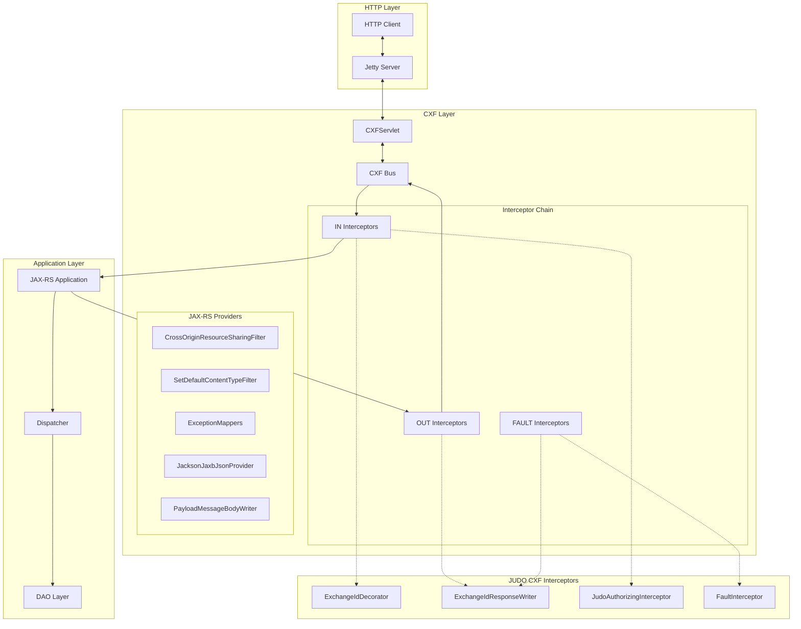
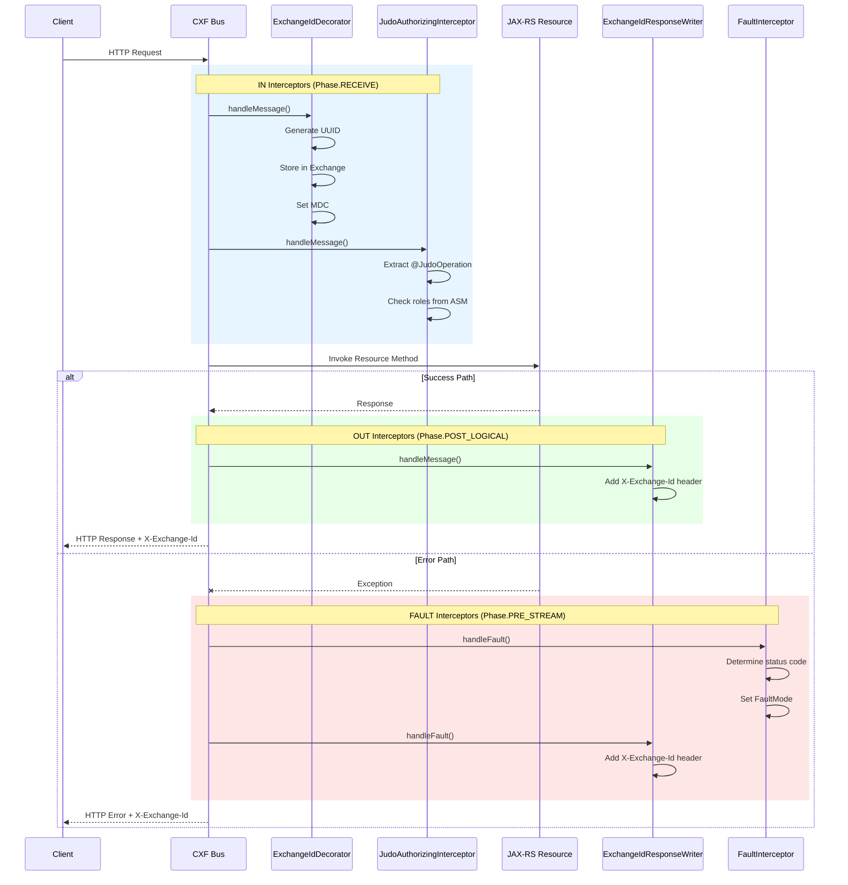
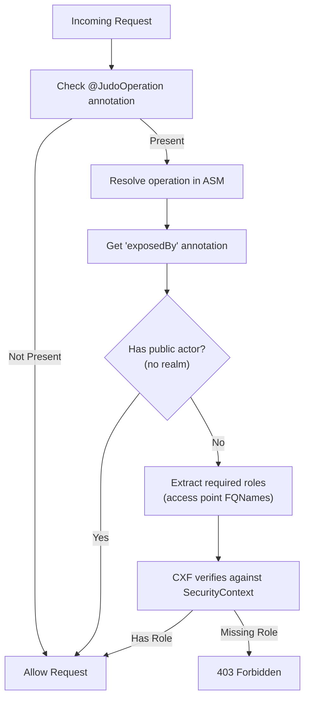
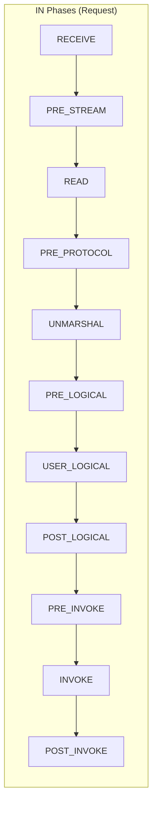
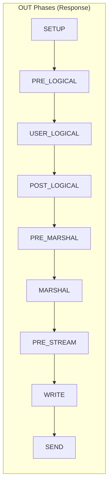

# Apache CXF Integration for JAX-RS

Comprehensive guide to the JUDO CXF integration layer that provides interceptors, fault handling, exchange ID tracking, and role-based authorization for JAX-RS REST endpoints.

## Overview

The `judo-runtime-core-jaxrs-cxf` module bridges Apache CXF with JUDO's runtime to provide:
- Request/response interceptors for cross-cutting concerns
- Fault handling and exception mapping
- Exchange ID generation and propagation for request tracing
- Role-based authorization using ASM model metadata

## Architecture



## Interceptor Pipeline



## Key Components

### ExchangeIdDecorator

Generates and tracks unique exchange IDs for request tracing.

**Package**: `hu.blackbelt.judo.runtime.core.jaxrs.cxf.interceptors`

**Phase**: `Phase.RECEIVE` (earliest in pipeline)

**Responsibilities**:
- Generate UUID for each request
- Store exchange ID in CXF Exchange object
- Set MDC (Mapped Diagnostic Context) for logging correlation

```java
// Exchange ID is accessible via:
String exchangeId = (String) message.getExchange().get("exchangeId");

// MDC key for logging:
// "RequestExchangeId"
```

**Response Header**: `X-Exchange-Id`

### ExchangeIdResponseWriter

Writes the exchange ID to response headers for client-side correlation.

**Package**: `hu.blackbelt.judo.runtime.core.jaxrs.cxf.interceptors`

**Phase**: `Phase.POST_LOGICAL`

**Behavior**:
- Adds `X-Exchange-Id` header to all responses
- Works for both success and fault responses

### JudoAuthorizingInterceptor

Role-based authorization using JUDO ASM model metadata.

**Package**: `hu.blackbelt.judo.runtime.core.jaxrs.cxf.interceptors`

**How It Works**:



**Configuration**:

```java
JudoAuthorizingInterceptor.builder()
    .asmModel(asmModel)  // Required: ASM model for operation resolution
    .build();
```

### FaultInterceptor

Handles exceptions and sets appropriate HTTP status codes.

**Package**: `hu.blackbelt.judo.runtime.core.jaxrs.cxf.interceptors`

**Phase**: `Phase.PRE_STREAM`

**Status Code Mapping**:

| Exception Type | Status Code | FaultMode |
|---------------|-------------|-----------|
| `InternalServerErrorException` + Jackson cause | 400 Bad Request | CHECKED_APPLICATION_FAULT |
| `InternalServerErrorException` + RuntimeException | 500 Internal Server Error | RUNTIME_FAULT |
| `InternalServerErrorException` + Checked Exception | 400 Bad Request | UNCHECKED_APPLICATION_FAULT |
| `ClientException` | Custom (from exception) | CHECKED_APPLICATION_FAULT |
| `RuntimeException` | 500 Internal Server Error | RUNTIME_FAULT |
| Other Checked Exceptions | 400 Bad Request | CHECKED_APPLICATION_FAULT |

**Configuration**:

```java
FaultInterceptor interceptor = new FaultInterceptor();
interceptor.setLogException(true);  // Enable detailed exception logging
```

## Guice Integration

The `judo-runtime-core-guice-cxf` module provides Guice bindings for all components.

### JudoCxfModule Configuration

```java
JudoCxfModule.builder()
    // Server configuration
    .cxfJaxRsServerUrl("http://localhost:8080")
    .cxfJaxRsServerPath("api")
    
    // Exchange ID tracking
    .exchangeIdInterceptors(true)  // Enable exchange ID decorators
    
    // JSON configuration
    .cxfSkipDefaultJsonProviderRegistration(false)
    
    // Logging and metrics
    .cxfLoggingEnabled(true)
    .cxfMetricsEnabled(true)
    .cxfLogException(false)  // Log exceptions at INFO level
    
    // Error handling
    .cxfReturnRuntimeExceptions(false)  // Include stack traces
    .cxfIncludeBusinessCause(false)
    
    // CORS configuration
    .corsAllowOrigin("*")
    .corsAllowCredentials(true)
    .corsAllowHeaders("Content-Type,Authorization,X-Judo-SignedIdentifier")
    .corsExposeHeaders("X-Exchange-Id,X-Fault,X-Judo-Count")
    .corsMaxAge(-1)
    
    .build();
```

### Adding Custom Interceptors

Use Guice multibindings with qualifier annotations:

```java
public class MyModule extends AbstractModule {
    @Override
    protected void configure() {
        // IN interceptors (request processing)
        Multibinder.newSetBinder(binder(), Interceptor.class, CxfQualifiers.InInterceptors.class)
            .addBinding().to(MyCustomInInterceptor.class);
        
        // OUT interceptors (response processing)
        Multibinder.newSetBinder(binder(), Interceptor.class, CxfQualifiers.OutInterceptors.class)
            .addBinding().to(MyCustomOutInterceptor.class);
        
        // FAULT interceptors (error processing)
        Multibinder.newSetBinder(binder(), Interceptor.class, CxfQualifiers.FaultInterceptors.class)
            .addBinding().to(MyCustomFaultInterceptor.class);
    }
}
```

### Adding Custom Providers

```java
public class MyModule extends AbstractModule {
    @Override
    protected void configure() {
        Multibinder.newSetBinder(binder(), Object.class, CxfQualifiers.Providers.class)
            .addBinding().to(MyCustomProvider.class);
    }
}
```

## Creating Custom Interceptors

### Example: Request Timing Interceptor

```java
package com.example.interceptors;

import org.apache.cxf.interceptor.Fault;
import org.apache.cxf.message.Message;
import org.apache.cxf.phase.AbstractPhaseInterceptor;
import org.apache.cxf.phase.Phase;
import lombok.extern.slf4j.Slf4j;

@Slf4j
public class RequestTimingInterceptor extends AbstractPhaseInterceptor<Message> {
    
    private static final String START_TIME_KEY = "request.startTime";
    
    public RequestTimingInterceptor() {
        super(Phase.RECEIVE);  // Run early in request processing
    }
    
    @Override
    public void handleMessage(Message message) throws Fault {
        message.getExchange().put(START_TIME_KEY, System.currentTimeMillis());
    }
}

@Slf4j
public class ResponseTimingInterceptor extends AbstractPhaseInterceptor<Message> {
    
    private static final String START_TIME_KEY = "request.startTime";
    
    public ResponseTimingInterceptor() {
        super(Phase.POST_LOGICAL);
    }
    
    @Override
    public void handleMessage(Message message) throws Fault {
        Long startTime = (Long) message.getExchange().get(START_TIME_KEY);
        if (startTime != null) {
            long duration = System.currentTimeMillis() - startTime;
            log.info("Request completed in {} ms", duration);
            
            // Optionally add to response headers
            Map<String, List> headers = (Map<String, List>) message.get(Message.PROTOCOL_HEADERS);
            if (headers == null) {
                headers = new HashMap<>();
                message.put(Message.PROTOCOL_HEADERS, headers);
            }
            headers.put("X-Response-Time", Collections.singletonList(duration + "ms"));
        }
    }
}
```

### Example: Custom Authorization Interceptor

```java
package com.example.interceptors;

import org.apache.cxf.interceptor.Fault;
import org.apache.cxf.message.Message;
import org.apache.cxf.phase.AbstractPhaseInterceptor;
import org.apache.cxf.phase.Phase;
import org.apache.cxf.security.SecurityContext;

import javax.ws.rs.core.Response;

public class CustomAuthorizationInterceptor extends AbstractPhaseInterceptor<Message> {
    
    public CustomAuthorizationInterceptor() {
        super(Phase.PRE_INVOKE);  // After RECEIVE, before method invocation
    }
    
    @Override
    public void handleMessage(Message message) throws Fault {
        SecurityContext sc = message.get(SecurityContext.class);
        
        if (sc == null || sc.getUserPrincipal() == null) {
            // Anonymous request - check if endpoint allows it
            String path = (String) message.get(Message.PATH_INFO);
            if (!isPublicPath(path)) {
                throw new Fault(new SecurityException("Authentication required"));
            }
        }
    }
    
    private boolean isPublicPath(String path) {
        return path != null && (
            path.startsWith("/public/") ||
            path.equals("/health") ||
            path.equals("/metrics")
        );
    }
}
```

## CXF Phases Reference

Interceptors execute in specific phases:





## Debugging Tips

### Enable CXF Logging

```xml
<!-- logback.xml -->
<logger name="org.apache.cxf" level="DEBUG"/>
<logger name="hu.blackbelt.judo.runtime.core.jaxrs.cxf" level="DEBUG"/>
```

### Trace Exchange IDs

Look for the `X-Exchange-Id` header in responses and correlate with logs using `RequestExchangeId` MDC key:

```xml
<!-- logback pattern -->
<pattern>%d{HH:mm:ss.SSS} [%thread] [%X{RequestExchangeId}] %-5level %logger{36} - %msg%n</pattern>
```

### Inspect Interceptor Chain

```java
// In a custom interceptor:
@Override
public void handleMessage(Message message) throws Fault {
    InterceptorChain chain = message.getInterceptorChain();
    for (Interceptor<?> interceptor : chain) {
        log.debug("Interceptor in chain: {}", interceptor.getClass().getName());
    }
}
```

## Related Modules

| Module | Description |
|--------|-------------|
| `judo-runtime-core-jaxrs` | Base JAX-RS providers (exception mappers, body writers) |
| `judo-runtime-core-guice-cxf` | Guice configuration for CXF integration |
| `judo-runtime-core-jaxrs-cxf-server` | CXF server bootstrap |
| `judo-runtime-core-security` | Security framework integration |

## See Also

- `/judo-runtime:dispatcher-architecture` - Understanding operation dispatching
- `/judo-runtime:authentication-flow` - Security and authentication details
- Apache CXF Documentation: https://cxf.apache.org/docs/

---
> Converted and distributed by [TomeVault](https://tomevault.io/claim/blackbelttechnology) — claim your Tome and manage your conversions.
<!-- tomevault:4.0:skill_md:2026-04-15 -->
