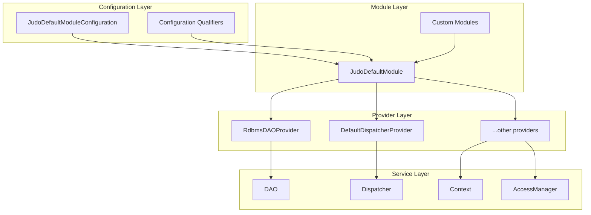
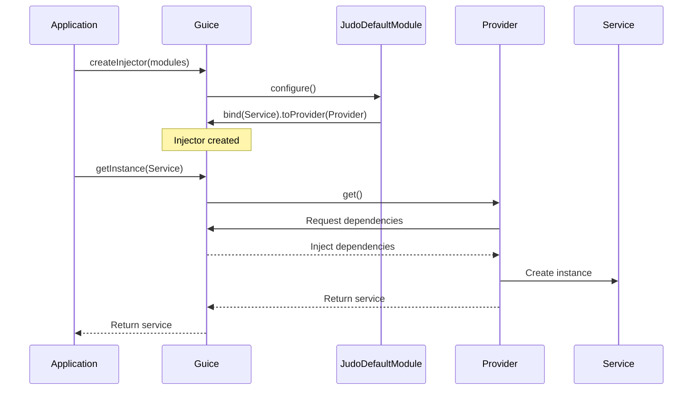

# JUDO Dependency Injection

Guide to understanding and extending the JUDO Guice dependency injection system.

## Overview

JUDO uses Google Guice for dependency injection with a layered architecture:

1. **Provider Classes**: Create complex objects with injected dependencies
2. **Configuration Qualifiers**: Type-safe configuration injection
3. **Optional Overrides**: Replace default implementations
4. **Multibinders**: Extend functionality with multiple implementations

## DI Architecture



## Provider Pattern

JUDO uses the Provider pattern extensively. Each major component has a corresponding Provider class.

### Provider Class Structure

```java
@SuppressWarnings("rawtypes")
public class RdbmsDAOProvider implements Provider<DAO> {
    
    // Dependencies are injected by Guice
    @Inject
    private AsmModel asmModel;
    
    @Inject
    private DataSource dataSource;
    
    @Inject
    private IdentifierProvider identifierProvider;
    
    // Optional configuration with qualifiers
    @Inject(optional = true)
    @JudoConfigurationQualifiers.RdbmsDaoOptimisticLockEnabled
    @Nullable
    private Boolean optimisticLockEnabled = true;
    
    @Override
    public DAO get() {
        return RdbmsDAOImpl.builder()
            .dataSource(dataSource)
            .asmModel(asmModel)
            .identifierProvider(identifierProvider)
            .optimisticLockEnabled(optimisticLockEnabled)
            .build();
    }
}
```

### Available Providers

| Provider | Creates | Package |
|----------|---------|---------|
| `RdbmsDAOProvider` | `DAO` | `guice.dao.rdbms` |
| `DefaultDispatcherProvider` | `Dispatcher` | `guice.dispatcher` |
| `DefaultActorResolverProvider` | `ActorResolver` | `guice.dispatcher` |
| `DefaultAccessManagerProvider` | `AccessManager` | `guice.accessmanager` |
| `DataTypeManagerProvider` | `DataTypeManager` | `guice.core` |
| `UUIDIdentifierProviderProvider` | `IdentifierProvider` | `guice.core` |
| `ThreadContextProvider` | `Context` | `guice.dispatcher` |
| `DefaultMetricsCollectorProvider` | `MetricsCollector` | `guice.dispatcher` |
| `DefaultPayloadValidatorProvider` | `PayloadValidator` | `guice.dispatcher` |
| `QueryFactoryProvider` | `QueryFactory` | `guice.dao.rdbms` |
| `RdbmsBuilderProvider` | `RdbmsBuilder` | `guice.dao.rdbms` |
| `RdbmsResolverProvider` | `RdbmsResolver` | `guice.dao.rdbms` |
| `SelectStatementExecutorProvider` | `SelectStatementExecutor` | `guice.dao.rdbms` |
| `ModifyStatementExecutorProvider` | `ModifyStatementExecutor` | `guice.dao.rdbms` |
| `ExtendableCoercererProvider` | `ExtendableCoercer` | `guice.core` |
| `ValidatorProviderProvider` | `ValidatorProvider` | `guice.dispatcher` |
| `OperationCallInterceptorProviderProvider` | `OperationCallInterceptorProvider` | `guice.dispatcher` |

## Configuration Qualifiers

JUDO uses custom annotations for type-safe configuration injection.

### Available Qualifiers

```java
// In JudoConfigurationQualifiers class
@JudoConfigurationQualifiers.RdbmsDaoOptimisticLockEnabled
@JudoConfigurationQualifiers.RdbmsDaoChunkSize
@JudoConfigurationQualifiers.RdbmsDaoMaximumRecursionCount
@JudoConfigurationQualifiers.DispatcherMetricsReturned
@JudoConfigurationQualifiers.DispatcherEnableDefaultValidation
@JudoConfigurationQualifiers.DispatcherTrimString
@JudoConfigurationQualifiers.DispatcherCaseInsensitiveLike
@JudoConfigurationQualifiers.IdentifierSignerSecret
@JudoConfigurationQualifiers.MetricsCollectorEnabled
@JudoConfigurationQualifiers.MetricsCollectorVerbose
@JudoConfigurationQualifiers.MetricsCollectorConsumer
@JudoConfigurationQualifiers.PayloadValidatorRequiredStringValidatorOption
@JudoConfigurationQualifiers.ThreadContextDebugThreadFork
@JudoConfigurationQualifiers.ThreadContextInheritableContext
@JudoConfigurationQualifiers.RdbmsSequenceStart
@JudoConfigurationQualifiers.RdbmsSequenceIncrement
@JudoConfigurationQualifiers.RdbmsSequenceCreateIfNotExists
@JudoConfigurationQualifiers.QueryFactoryCustomJoinDefinitions
@JudoConfigurationQualifiers.ActorResolverCheckMappedActors
```

### Using Qualifiers in Custom Code

```java
public class MyCustomService {
    
    @Inject
    @JudoConfigurationQualifiers.DispatcherEnableDefaultValidation
    private Boolean enableValidation;
    
    @Inject
    @JudoConfigurationQualifiers.RdbmsDaoChunkSize
    private Integer chunkSize;
    
    // Use the injected configuration
}
```

## Overriding Default Bindings

### Method 1: Via Configuration Builder

Pass your own instance directly:

```java
// Create custom implementation
MyCustomDAO customDao = new MyCustomDAO();

// Pass to configuration
JudoDefaultModule module = JudoDefaultModule.builder()
    .judoModelLoader(models)
    .dao(customDao)  // Override default DAO
    .build();
```

### Method 2: Via Custom Module (Higher Priority)

Create a module that installs after JudoDefaultModule:

```java
public class MyOverrideModule extends AbstractModule {
    
    @Override
    protected void configure() {
        // Override with custom implementation
        bind(AccessManager.class).to(MyCustomAccessManager.class);
    }
    
    @Provides
    @Singleton
    public IdentifierProvider provideIdentifierProvider() {
        return new MySequentialIdentifierProvider();
    }
}

// Install after JudoDefaultModule
Injector injector = Guice.createInjector(
    judoModule,
    new MyOverrideModule()  // Later modules override earlier
);
```

### Method 3: Create Custom Provider

```java
public class MyCustomDAOProvider implements Provider<DAO> {
    
    @Inject
    private AsmModel asmModel;
    
    @Inject
    private DataSource dataSource;
    
    @Override
    public DAO get() {
        return new MyCustomDAOImpl(asmModel, dataSource);
    }
}

// Register in module
public class MyModule extends AbstractModule {
    @Override
    protected void configure() {
        bind(DAO.class).toProvider(MyCustomDAOProvider.class).in(Singleton.class);
    }
}
```

## Adding Custom Bindings

### Using Multibinder for Extensions

```java
public class InterceptorModule extends AbstractModule {
    
    @Override
    protected void configure() {
        // Register multiple interceptors
        Multibinder<OperationCallInterceptor> interceptors = 
            Multibinder.newSetBinder(binder(), OperationCallInterceptor.class);
        
        interceptors.addBinding().to(AuditLogInterceptor.class);
        interceptors.addBinding().to(WebhookInterceptor.class);
        interceptors.addBinding().to(CacheInvalidationInterceptor.class);
    }
}
```

### Custom Services

```java
public class MyServicesModule extends AbstractModule {
    
    @Override
    protected void configure() {
        // Simple binding
        bind(EmailService.class).to(SmtpEmailService.class);
        
        // Singleton binding
        bind(CacheService.class).to(RedisCacheService.class).in(Singleton.class);
        
        // Named binding
        bind(String.class)
            .annotatedWith(Names.named("app.name"))
            .toInstance("MyApplication");
    }
    
    @Provides
    @Singleton
    public HttpClient provideHttpClient() {
        return HttpClient.newBuilder()
            .connectTimeout(Duration.ofSeconds(10))
            .build();
    }
}
```

## Binding Lifecycle



## Conditional Binding

### Optional Dependencies

```java
public class MyProvider implements Provider<MyService> {
    
    // Optional injection - null if not bound
    @Inject(optional = true)
    @Nullable
    private ExternalService externalService;
    
    @Override
    public MyService get() {
        if (externalService != null) {
            return new MyServiceWithExternal(externalService);
        }
        return new MyServiceStandalone();
    }
}
```

### Environment-Based Configuration

```java
public class EnvironmentModule extends AbstractModule {
    
    private final String environment;
    
    public EnvironmentModule(String environment) {
        this.environment = environment;
    }
    
    @Override
    protected void configure() {
        if ("production".equals(environment)) {
            bind(DataSource.class).toProvider(ProductionDataSourceProvider.class);
        } else {
            bind(DataSource.class).toProvider(DevelopmentDataSourceProvider.class);
        }
    }
}
```

## Testing with DI

### Mocking Dependencies

```java
public class MyServiceTest {
    
    @Test
    void testWithMocks() {
        // Create mocks
        DAO mockDao = mock(DAO.class);
        AccessManager mockAccessManager = mock(AccessManager.class);
        
        // Create injector with overrides
        Injector injector = Guice.createInjector(
            judoModule,
            new AbstractModule() {
                @Override
                protected void configure() {
                    bind(DAO.class).toInstance(mockDao);
                    bind(AccessManager.class).toInstance(mockAccessManager);
                }
            }
        );
        
        // Get service with mocked dependencies
        MyService service = injector.getInstance(MyService.class);
        
        // Test
        when(mockDao.find(any())).thenReturn(testPayload);
        service.doSomething();
        verify(mockDao).find(any());
    }
}
```

### Using JUDO TestKit

```java
@JudoTest
class IntegrationTest {
    
    @Inject
    Dispatcher dispatcher;
    
    @Inject
    DAO dao;
    
    @Test
    void testOperation() {
        // Dependencies automatically injected by TestKit
        var result = dispatcher.call("MyEntity", "myOperation", payload);
        assertThat(result).isNotNull();
    }
}
```

## Common Patterns

### Decorator Pattern

```java
public class LoggingDAODecorator implements DAO {
    
    private final DAO delegate;
    private final Logger log;
    
    public LoggingDAODecorator(DAO delegate) {
        this.delegate = delegate;
        this.log = LoggerFactory.getLogger(LoggingDAODecorator.class);
    }
    
    @Override
    public Payload create(String type, Payload payload) {
        log.info("Creating {} with {}", type, payload);
        Payload result = delegate.create(type, payload);
        log.info("Created: {}", result);
        return result;
    }
    // ... delegate other methods
}

// Bind decorator
bind(DAO.class).toProvider(() -> {
    DAO baseDao = baseProvider.get();
    return new LoggingDAODecorator(baseDao);
});
```

### Factory Pattern

```java
public interface ServiceFactory {
    MyService create(String tenantId);
}

public class ServiceFactoryImpl implements ServiceFactory {
    
    @Inject
    private Provider<DAO> daoProvider;
    
    @Override
    public MyService create(String tenantId) {
        return new MyService(daoProvider.get(), tenantId);
    }
}

// Bind factory
bind(ServiceFactory.class).to(ServiceFactoryImpl.class);
```

## See Also

- `judo-runtime:module-setup` - Module configuration guide
- `judo-runtime:create-interceptor` - Creating operation interceptors
- `judo-runtime-core-guice-testkit` - Testing utilities
- Google Guice documentation: https://github.com/google/guice

---
> Converted and distributed by [TomeVault](https://tomevault.io/claim/blackbelttechnology) — claim your Tome and manage your conversions.
<!-- tomevault:4.0:skill_md:2026-04-15 -->
