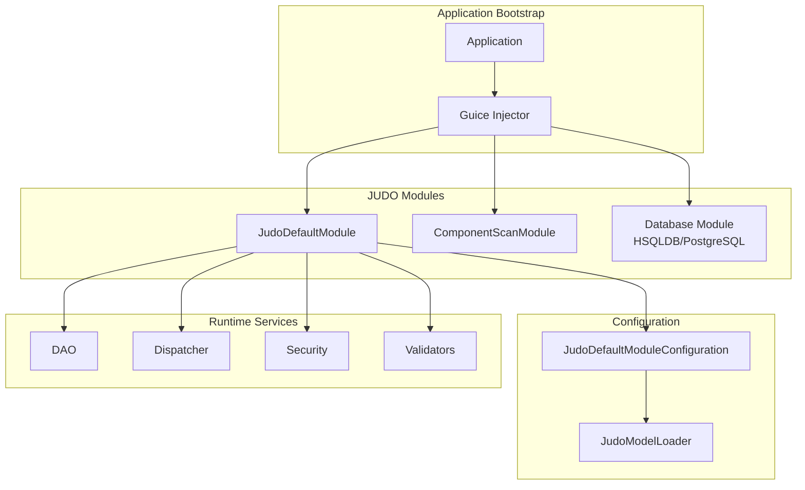
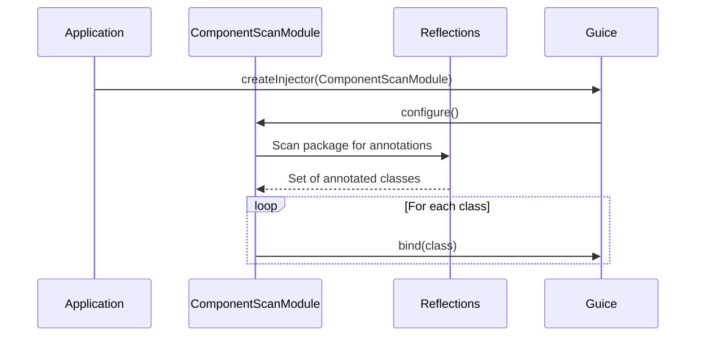

# JUDO Guice Module Setup

Guide for configuring and bootstrapping JUDO applications with Google Guice.

## Overview

The JUDO Guice integration provides a complete dependency injection setup through several key components:

- **JudoDefaultModule**: Main Guice module that wires all JUDO components
- **JudoDefaultModuleConfiguration**: Configuration options for the runtime
- **JudoModelLoader**: Loads JUDO metamodels (ASM, RDBMS, Expression, etc.)
- **ComponentScanModule**: Automatic component discovery via classpath scanning

## Architecture



## JudoModelLoader

`JudoModelLoader` is responsible for loading all JUDO metamodels required by the runtime.

### Loading from Classpath

```java
// Load models from classpath (typical for packaged applications)
JudoModelLoader models = JudoModelLoader.loadFromClassloader(
    "myapp",                    // Model name prefix
    getClass().getClassLoader(), // ClassLoader to search
    HsqldbDialect.INSTANCE,     // Database dialect
    true,                        // Validate models
    false                        // Load Keycloak model
);
```

### Loading from Directory

```java
// Load models from a file system directory
JudoModelLoader models = JudoModelLoader.loadFromDirectory(
    "myapp",                    // Model name prefix
    new File("/path/to/models"), // Directory containing model files
    PostgresqlDialect.INSTANCE, // Database dialect
    false                       // Load Keycloak model
);
```

### Loading from URI

```java
// Load models from arbitrary URI
JudoModelLoader models = JudoModelLoader.loadFromURL(
    "myapp",
    modelDirectoryUri,
    HsqldbDialect.INSTANCE,
    true,  // Validate
    true   // Load Keycloak
);
```

### Model Files Expected

The loader expects these model files in the directory/classpath:

| File Pattern | Description |
|--------------|-------------|
| `{name}-asm.model` | Abstract Syntax Model |
| `{name}-rdbms_{dialect}.model` | RDBMS Model for specific dialect |
| `{name}-measure.model` | Measurement/unit definitions |
| `{name}-expression.model` | Expression definitions |
| `{name}-liquibase_{dialect}.changelog.xml` | Database schema |
| `{name}-asm2rdbms_{dialect}.model` | ASM to RDBMS trace |
| `{name}-keycloak.model` | Keycloak configuration (optional) |

### Creating Empty Models (Testing)

```java
// Create empty models for unit testing
JudoModelLoader models = JudoModelLoader.empty();
```

## JudoDefaultModuleConfiguration

Configuration class using the builder pattern with sensible defaults.

### Key Configuration Options

| Option | Default | Description |
|--------|---------|-------------|
| `judoModelLoader` | null | Required: The loaded models |
| `bindModelHolder` | true | Bind JudoModelLoader to injector |
| `rdbmsDaoOptimisticLockEnabled` | true | Enable optimistic locking |
| `rdbmsDaoChunkSize` | 1000 | Batch operation chunk size |
| `dispatcherEnableDefaultValidation` | true | Enable payload validation |
| `dispatcherCaseInsensitiveLike` | false | Case-insensitive LIKE queries |
| `dispatcherTrimString` | false | Trim whitespace from strings |
| `metricsCollectorEnabled` | false | Enable metrics collection |
| `identifierSignerSecret` | auto-generated | Secret for signing identifiers |

### Example Configuration

```java
JudoDefaultModuleConfiguration config = JudoDefaultModuleConfiguration.builder()
    .judoModelLoader(models)
    .rdbmsDaoOptimisticLockEnabled(true)
    .rdbmsDaoChunkSize(500)
    .dispatcherEnableDefaultValidation(true)
    .dispatcherCaseInsensitiveLike(true)
    .metricsCollectorEnabled(true)
    .metricsCollectorConsumer(metrics -> log.info("Metrics: {}", metrics))
    .identifierSignerSecret("my-secure-secret-key")
    .build();
```

## JudoDefaultModule

The main Guice module that configures all JUDO runtime bindings.

### Basic Setup

```java
// Create with configuration object
JudoDefaultModule module = JudoDefaultModule.builder()
    .configuration(config)
    .build();

// Or inline with builder
JudoDefaultModule module = JudoDefaultModule.builder()
    .judoModelLoader(models)
    .rdbmsDaoOptimisticLockEnabled(true)
    .dispatcherEnableDefaultValidation(true)
    .build();
```

### Creating the Injector

```java
Injector injector = Guice.createInjector(
    module,
    new HsqldbModule(),  // Database-specific module
    new ComponentScanModule("com.myapp", Singleton.class)
);
```

### Injecting to External Object

```java
// Inject dependencies into an existing object
MyApplication app = new MyApplication();

JudoDefaultModule module = JudoDefaultModule.builder()
    .injectModulesTo(app)
    .judoModelLoader(models)
    .build();
```

## ComponentScanModule

Automatically discovers and binds classes annotated with specific annotations.

### Basic Usage

```java
// Scan for @Singleton and @Named classes
ComponentScanModule scanModule = new ComponentScanModule(
    "com.myapp.services",
    Singleton.class,
    Named.class
);

Injector injector = Guice.createInjector(
    judoModule,
    scanModule
);
```

### How It Works



### Common Use Cases

```java
// Scan for all singletons in a package
new ComponentScanModule("com.myapp", Singleton.class)

// Scan for custom annotations
new ComponentScanModule("com.myapp", 
    Service.class,      // Custom @Service annotation
    Repository.class,   // Custom @Repository annotation
    Singleton.class
)
```

## Complete Bootstrap Example

```java
public class MyApplication {
    
    public static void main(String[] args) throws Exception {
        // 1. Load models
        JudoModelLoader models = JudoModelLoader.loadFromClassloader(
            "myapp",
            MyApplication.class.getClassLoader(),
            HsqldbDialect.INSTANCE,
            true,
            false
        );
        
        // 2. Configure module
        JudoDefaultModule judoModule = JudoDefaultModule.builder()
            .judoModelLoader(models)
            .rdbmsDaoOptimisticLockEnabled(true)
            .dispatcherEnableDefaultValidation(true)
            .metricsCollectorEnabled(true)
            .build();
        
        // 3. Configure database (HSQLDB for dev)
        HsqldbModule hsqldbModule = HsqldbModule.builder()
            .databasePath("./db/myapp")
            .build();
        
        // 4. Create injector
        Injector injector = Guice.createInjector(
            judoModule,
            hsqldbModule,
            new ComponentScanModule("com.myapp", Singleton.class)
        );
        
        // 5. Get services
        Dispatcher dispatcher = injector.getInstance(Dispatcher.class);
        DAO dao = injector.getInstance(DAO.class);
        
        // Application is ready
    }
}
```

## Production Configuration

For production deployments with PostgreSQL:

```java
// PostgreSQL module
PostgresqlModule postgresModule = PostgresqlModule.builder()
    .jdbcUrl("jdbc:postgresql://localhost:5432/myapp")
    .username("myapp_user")
    .password("secure_password")
    .build();

// Production-ready configuration
JudoDefaultModule judoModule = JudoDefaultModule.builder()
    .judoModelLoader(models)
    .rdbmsDaoOptimisticLockEnabled(true)
    .rdbmsDaoChunkSize(1000)
    .dispatcherEnableDefaultValidation(true)
    .identifierSignerSecret(System.getenv("JUDO_SIGNER_SECRET"))
    .metricsCollectorEnabled(true)
    .metricsCollectorVerbose(false)
    .build();

Injector injector = Guice.createInjector(
    judoModule,
    postgresModule
);
```

## See Also

- `judo-runtime:dependency-injection` - Understanding and extending DI bindings
- `judo-runtime-core-guice-hsqldb` - HSQLDB integration module
- `judo-runtime-core-guice-postgresql` - PostgreSQL integration module
- `judo-runtime-core-guice-testkit` - Testing utilities

---
> Converted and distributed by [TomeVault](https://tomevault.io/claim/blackbelttechnology) — claim your Tome and manage your conversions.
<!-- tomevault:4.0:skill_md:2026-04-15 -->
