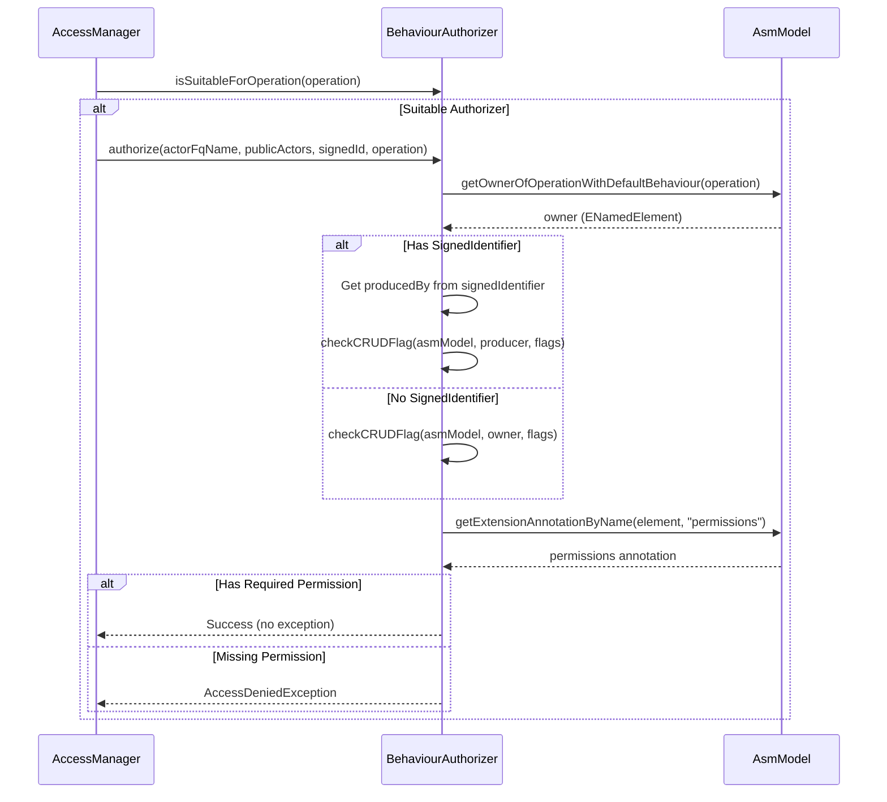
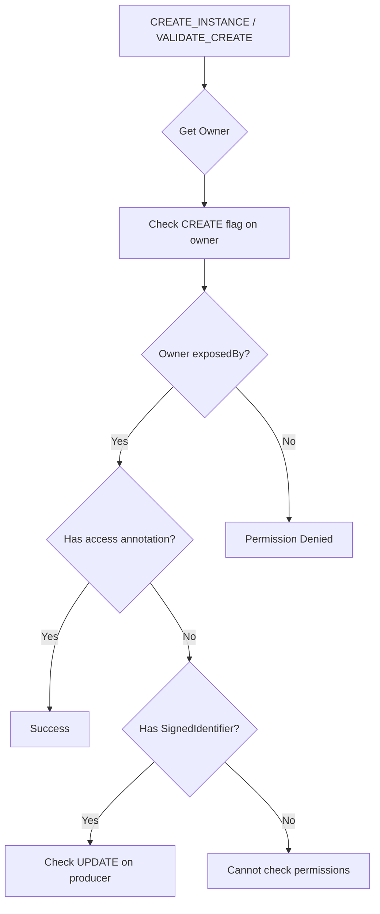
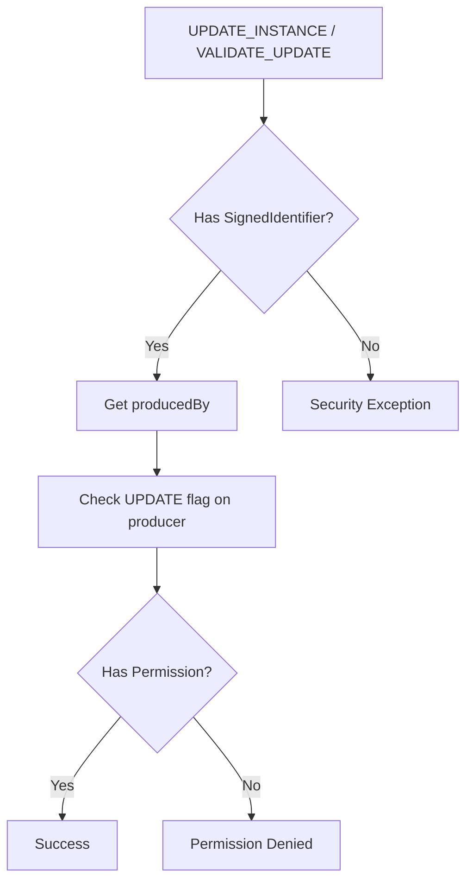
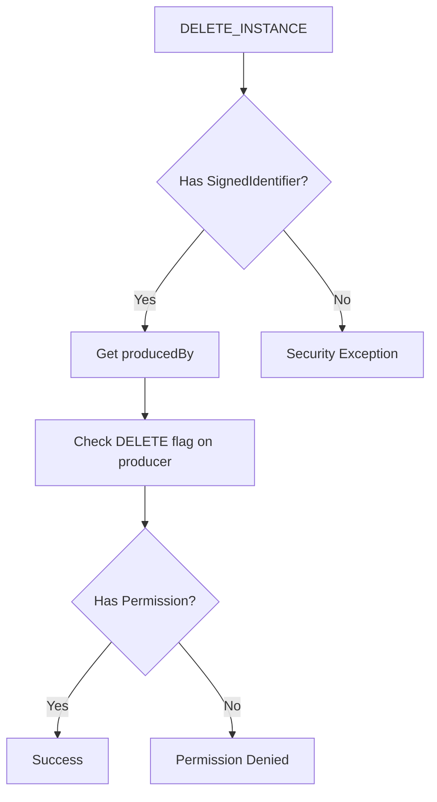
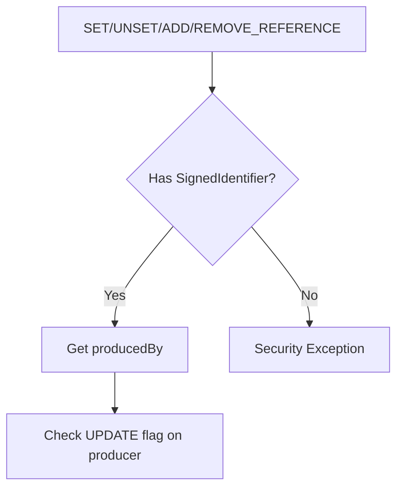
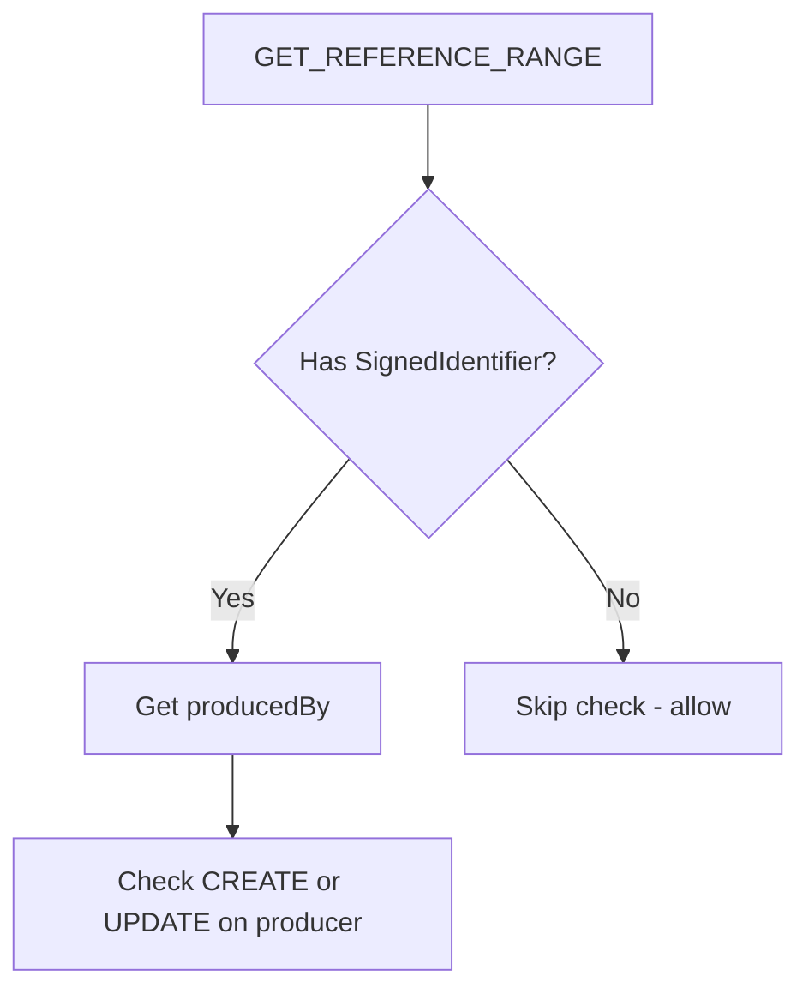
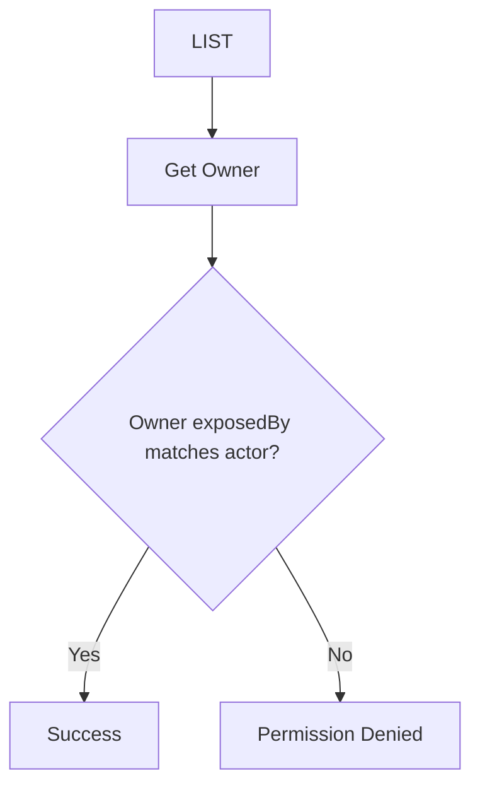
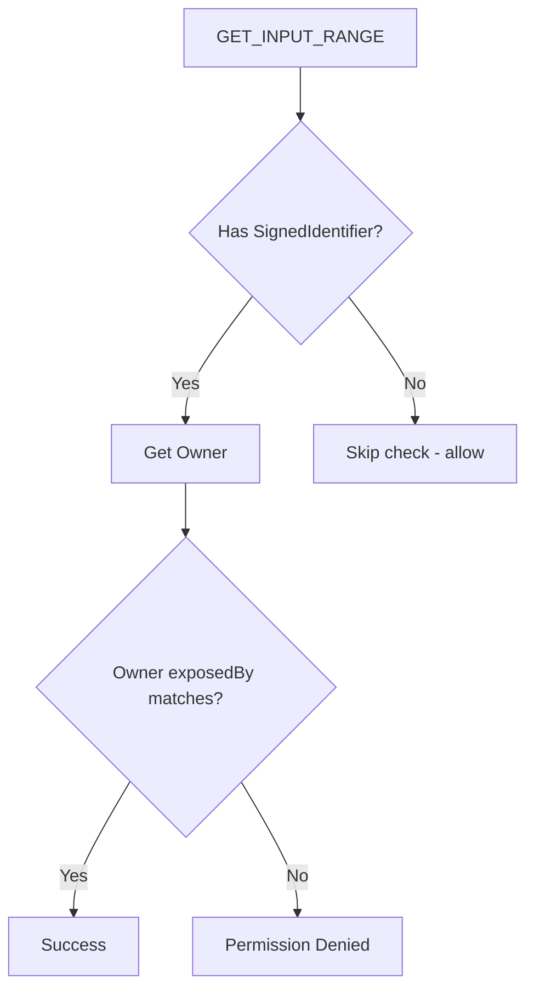
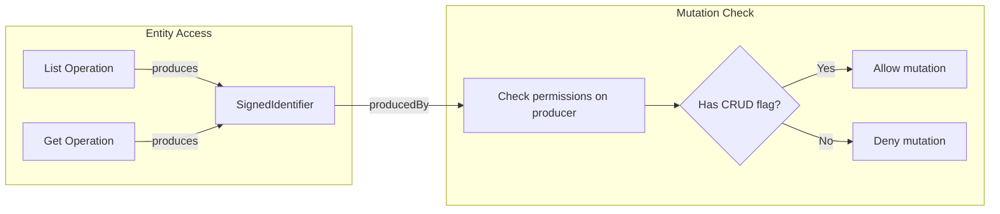

# JUDO Permission Checking Flow

Complete guide to understanding how permission checking works for CRUD operations in JUDO Runtime Core.

## Overview

JUDO uses a behaviour-based permission system where:
- Each operation type has a dedicated authorizer
- CRUD flags (create, update, delete) control mutation permissions
- SignedIdentifiers track entity provenance for bound operations
- The `permissions` annotation defines allowed operations

## Authorizer Architecture

```mermaid
classDiagram
    class BehaviourAuthorizer {
        <<abstract>>
        +isSuitableForOperation(EOperation) boolean
        +authorize(actorFqName, publicActors, signedIdentifier, operation) void
        #checkCRUDFlag(asmModel, element, flags) void
    }
    
    class CreateInstanceAuthorizer {
        -asmModel: AsmModel
        +isSuitableForOperation() CREATE_INSTANCE, VALIDATE_CREATE
        +authorize() checks CREATE flag
    }
    
    class UpdateInstanceAuthorizer {
        -asmModel: AsmModel
        +isSuitableForOperation() UPDATE_INSTANCE, VALIDATE_UPDATE
        +authorize() checks UPDATE flag on producer
    }
    
    class DeleteInstanceAuthorizer {
        -asmModel: AsmModel
        +isSuitableForOperation() DELETE_INSTANCE
        +authorize() checks DELETE flag on producer
    }
    
    class ListAuthorizer {
        -asmModel: AsmModel
        +isSuitableForOperation() LIST
        +authorize() checks exposedBy on owner
    }
    
    class SetReferenceAuthorizer {
        -asmModel: AsmModel
        +isSuitableForOperation() SET_REFERENCE
        +authorize() checks UPDATE flag on producer
    }
    
    class GetReferenceRangeAuthorizer {
        -asmModel: AsmModel
        +isSuitableForOperation() GET_REFERENCE_RANGE
        +authorize() checks CREATE or UPDATE flag
    }
    
    BehaviourAuthorizer <|-- CreateInstanceAuthorizer
    BehaviourAuthorizer <|-- UpdateInstanceAuthorizer
    BehaviourAuthorizer <|-- DeleteInstanceAuthorizer
    BehaviourAuthorizer <|-- ListAuthorizer
    BehaviourAuthorizer <|-- SetReferenceAuthorizer
    BehaviourAuthorizer <|-- GetReferenceRangeAuthorizer
```



## Permission Checking Flow



## CRUD Flag Checking

The `checkCRUDFlag` method validates permissions:

```java
void checkCRUDFlag(AsmModel asmModel, ENamedElement element, CRUDFlag... flags) {
    // Get permissions annotation from element
    Optional<EAnnotation> permissions = AsmUtils.getExtensionAnnotationByName(
        element, "permissions", false);
    
    // Check if any of the required flags are set
    if (permissions.isEmpty() || 
        Arrays.stream(flags).noneMatch(f -> 
            Boolean.parseBoolean(permissions.get().getDetails().get(f.permissionName)))) {
        
        // Permission denied - throw AccessDeniedException
        throw new AccessDeniedException(ValidationResult.builder()
            .code("PERMISSION_DENIED")
            .level(ValidationResult.Level.ERROR)
            .location(element.getName())
            .details(Map.of("MISSING_PRIVILEGES", Arrays.asList(flags)))
            .build());
    }
}
```

### CRUDFlag Enum

```java
public enum CRUDFlag {
    CREATE("create"),
    UPDATE("update"),
    DELETE("delete");
    
    private final String permissionName;
}
```

## Operation-Specific Authorizers

### CreateInstanceAuthorizer

Handles entity creation operations.



**Key Logic:**
```java
// Check CREATE permission on owner
checkCRUDFlag(asmModel, owner, CRUDFlag.CREATE);

// Check exposedBy annotation
if (!AsmUtils.annotatedAsTrue(owner, "access")) {
    // If not directly accessible, need UPDATE permission on producer
    checkCRUDFlag(asmModel, signedIdentifier.getProducedBy(), CRUDFlag.UPDATE);
}
```

### UpdateInstanceAuthorizer

Handles entity update operations.



**Key Logic:**
```java
final ETypedElement producer = signedIdentifier.getProducedBy();
if (producer == null) {
    throw new SecurityException("Unable to check permissions");
}
checkCRUDFlag(asmModel, producer, CRUDFlag.UPDATE);
```

### DeleteInstanceAuthorizer

Handles entity deletion operations.



**Key Logic:**
```java
checkCRUDFlag(asmModel, producer, CRUDFlag.DELETE);
```

### Reference Authorizers

All reference operations (SET, UNSET, ADD, REMOVE) require UPDATE permission:



### GetReferenceRangeAuthorizer

Handles range queries for references, requiring CREATE or UPDATE permission:



**Key Logic:**
```java
// Either CREATE or UPDATE allows range access
checkCRUDFlag(asmModel, producer, CRUDFlag.CREATE, CRUDFlag.UPDATE);
```

### ListAuthorizer

Handles list operations by checking exposedBy annotation:



**Key Logic:**
```java
if (AsmUtils.getExtensionAnnotationListByName(owner, "exposedBy").stream()
        .noneMatch(a -> publicActors.contains(a.getDetails().get("value")) || 
                        Objects.equals(actorFqName, a.getDetails().get("value")))) {
    throw new SecurityException("Permission denied");
}
```

### GetInputRangeAuthorizer

Handles input range queries with optional signedIdentifier:



### RefreshAuthorizer / GetTemplateAuthorizer

These authorizers perform minimal checks:

- **RefreshAuthorizer**: No permission checks (always allows)
- **GetTemplateAuthorizer**: Only validates owner exists

## SignedIdentifier

The `SignedIdentifier` tracks entity provenance:

```java
@Getter
@Builder
public class SignedIdentifier {
    @NonNull
    private final String identifier;      // Entity ID
    private final ETypedElement producedBy; // Operation/reference that produced this entity
    private final String entityType;       // Entity type name
    private final Integer version;         // Optimistic locking version
    private final Boolean immutable;       // Whether entity is immutable
}
```

### Role in Authorization



## Permission Annotations

### Model-Level Permissions

```
// ASM model permissions annotation
@permissions(create=true, update=true, delete=false)
transfer OrderItem {
    // Can create and update, but not delete
}
```

### Reference-Level Permissions

```
// Reference with update permission
@permissions(update=true)
relation items: OrderItem[];
```

## Error Details

The `AccessDeniedException` includes detailed information:

```java
throw new AccessDeniedException(ValidationResult.builder()
    .code("PERMISSION_DENIED")
    .level(ValidationResult.Level.ERROR)
    .location(element.getName())
    .details(Map.of(
        "MISSING_PRIVILEGES", Arrays.asList(CRUDFlag.CREATE, CRUDFlag.UPDATE),
        "MODEL_ELEMENT", AsmUtils.getOperationFQName(operation)
    ))
    .build());
```

## Permission Matrix

| Operation | Required Flag | Check Target | SignedId Required |
|-----------|---------------|--------------|-------------------|
| CREATE_INSTANCE | CREATE | owner | Optional |
| VALIDATE_CREATE | CREATE | owner | Optional |
| UPDATE_INSTANCE | UPDATE | producer | Yes |
| VALIDATE_UPDATE | UPDATE | producer | Yes |
| DELETE_INSTANCE | DELETE | producer | Yes |
| SET_REFERENCE | UPDATE | producer | Yes |
| UNSET_REFERENCE | UPDATE | producer | Yes |
| ADD_REFERENCE | UPDATE | producer | Yes |
| REMOVE_REFERENCE | UPDATE | producer | Yes |
| GET_REFERENCE_RANGE | CREATE or UPDATE | producer | Optional |
| GET_INPUT_RANGE | exposedBy | owner | Optional |
| LIST | exposedBy | owner | No |
| REFRESH | None | - | No |
| GET_TEMPLATE | owner exists | owner | No |

## Debugging Permission Issues

### Enable Trace Logging

```xml
<logger name="hu.blackbelt.judo.runtime.core.accessmanager.behaviours" level="TRACE"/>
```

### Common Error Scenarios

| Error | Cause | Solution |
|-------|-------|----------|
| `PERMISSION_DENIED` | Missing CRUD flag | Add required permission annotation |
| `Unable to check permissions` | Null producer in SignedIdentifier | Ensure bound operation provides SignedIdentifier |
| `No owner of operation found` | Invalid operation configuration | Check ASM model operation definition |

### Debugging Checklist

1. Verify `permissions` annotation exists on target element
2. Check that required flag (create/update/delete) is set to true
3. For bound operations, ensure SignedIdentifier is provided
4. Verify `exposedBy` annotations for list/range operations
5. Check producer element has required permissions

## See Also

- `judo-runtime-core-accessmanager-api` - API interfaces
- `/judo-runtime:access-control` - Actor and operation exposure
- `judo-runtime-core-dispatcher` - Operation dispatching
- `judo-runtime-core-dao-core` - DAO layer integration

---
> Converted and distributed by [TomeVault](https://tomevault.io/claim/blackbelttechnology) — claim your Tome and manage your conversions.
<!-- tomevault:4.0:skill_md:2026-04-15 -->
