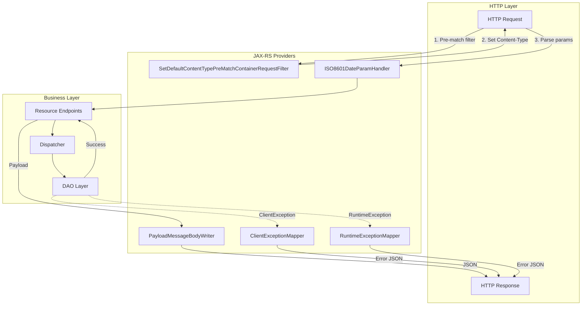
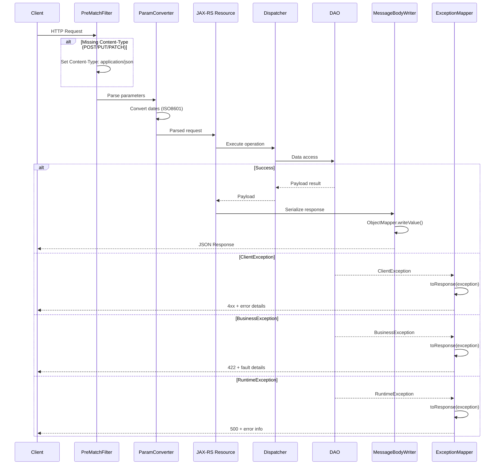
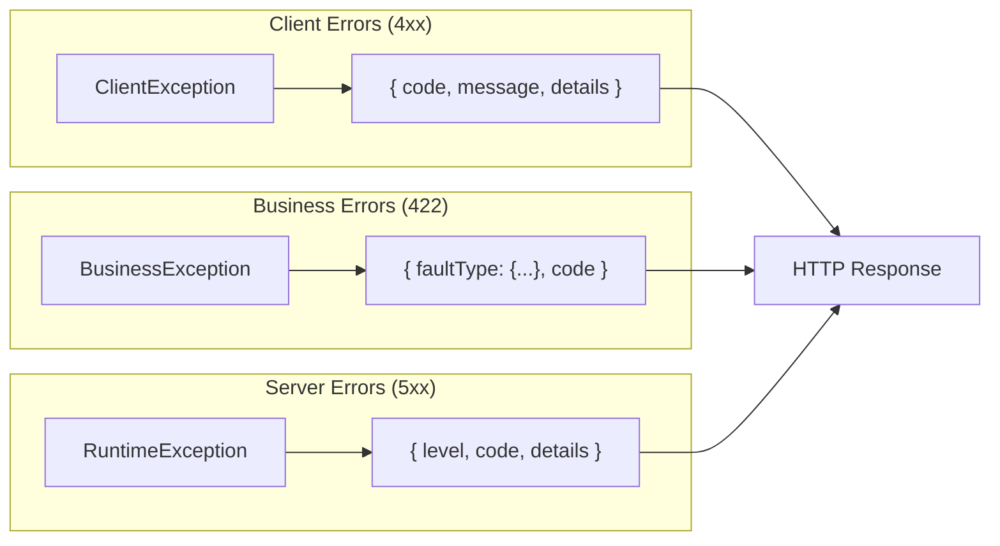

# JUDO REST Endpoints Configuration

Complete guide to configuring REST endpoints using JUDO JAX-RS providers.

## Overview

The JUDO JAX-RS module provides a collection of JAX-RS providers for building REST APIs:

- **Exception Mappers** - Convert Java exceptions to HTTP responses
- **Message Body Writers** - Serialize Payload objects to JSON
- **Param Converters** - Parse request parameters (dates, etc.)
- **Request Filters** - Pre-process incoming requests

## Architecture



## Request Processing Flow



## Provider Components

### PayloadMessageBodyWriter

Serializes `Payload` and `PayloadImpl` objects to JSON using Jackson:

```java
@Provider
@Builder
public class PayloadMessageBodyWriter implements MessageBodyWriter<PayloadImpl> {

    @Builder.Default
    private ObjectMapper objectMapper = new ObjectMapper();

    @Override
    public boolean isWriteable(Class<?> type, Type genericType, 
                               Annotation[] annotations, MediaType mediaType) {
        return type == Payload.class || type == PayloadImpl.class;
    }

    @Override
    public void writeTo(PayloadImpl payload, Class<?> type, Type genericType,
                        Annotation[] annotations, MediaType mediaType,
                        MultivaluedMap<String, Object> httpHeaders, 
                        OutputStream entityStream) throws IOException {
        OutputStreamWriter outputStreamWriter = new OutputStreamWriter(entityStream);
        objectMapper.writeValue(outputStreamWriter, payload);
    }
}
```

**Usage with Guice:**

```java
PayloadMessageBodyWriter writer = PayloadMessageBodyWriter.builder()
    .objectMapper(customObjectMapper)  // Optional custom mapper
    .build();
```

### ClientExceptionMapper

Maps `ClientException` to HTTP error responses:

```java
@Provider
public class ClientExceptionMapper implements ExceptionMapper<ClientException> {

    @Setter
    boolean logException = false;  // Enable for debugging

    @Override
    public Response toResponse(ClientException exception) {
        if (logException) {
            log.error("ClientError", exception);
        }
        return Response.status(exception.getStatusCode() != null 
                ? exception.getStatusCode() 
                : Response.Status.BAD_REQUEST.getStatusCode())
            .entity(exception.getDetails())
            .type("application/json")
            .build();
    }
}
```

**Response Format:**

```json
{
  "code": "VALIDATION_ERROR",
  "message": "Invalid input data",
  "details": { ... }
}
```

### RuntimeExceptionMapper

Handles all runtime exceptions including `BusinessException`:

```java
@Provider
@NoArgsConstructor
public class RuntimeExceptionMapper implements ExceptionMapper<RuntimeException> {

    private Boolean returnRuntimeExceptions = false;  // Include stack traces
    private Boolean includeBusinessCause = false;     // Include cause for business exceptions

    @Builder
    public RuntimeExceptionMapper(Boolean returnRuntimeExceptions, 
                                   Boolean includeBusinessCause) {
        this.returnRuntimeExceptions = Optional.ofNullable(returnRuntimeExceptions)
            .orElse(this.returnRuntimeExceptions);
        this.includeBusinessCause = Optional.ofNullable(includeBusinessCause)
            .orElse(this.includeBusinessCause);
    }
    
    // ... exception handling logic
}
```

**Exception Type Mappings:**

| Exception Type | HTTP Status | Response Structure |
|---------------|-------------|-------------------|
| `ClientErrorException` | As defined | Original response |
| `WebApplicationException` (Jackson cause) | 400 | `{"code": "INVALID_JSON"}` |
| `WebApplicationException` (other) | 500/400 | Error details |
| `BusinessException` | 422 | `{"<fault>": {...}, "code": "..."}` |
| Other `RuntimeException` | 500 | `{"code": "INTERNAL_SERVER_ERROR"}` |

**Business Exception Response:**

```json
{
  "ValidationFault": {
    "field": "email",
    "message": "Invalid email format"
  },
  "code": "VALIDATION_FAILED"
}
```

**Headers:**

- `X-Fault: <fault-type>` - Added for BusinessException responses

### ISO8601DateParamHandler

Parses date parameters in ISO8601 format:

```java
@Provider
@Consumes(MediaType.WILDCARD)
@Produces(MediaType.WILDCARD)
public class ISO8601DateParamHandler implements ParamConverterProvider {

    private static final SimpleDateFormat DEFAULT_DATE_FORMAT = 
        new SimpleDateFormat("yyyy-MM-dd");

    @Override
    public <T> ParamConverter<T> getConverter(Class<T> clazz, Type type, 
                                               Annotation[] annotations) {
        if (Date.class.equals(type)) {
            return (ParamConverter<T>) new DateParameterConverter();
        }
        return null;
    }
}
```

**Supported Format:** `yyyy-MM-dd` (e.g., `2024-01-15`)

**Usage in Resource:**

```java
@GET
@Path("/orders")
public Response getOrders(@QueryParam("fromDate") Date fromDate,
                          @QueryParam("toDate") Date toDate) {
    // Dates automatically parsed from: /orders?fromDate=2024-01-01&toDate=2024-12-31
}
```

### SetDefaultContentTypePreMatchContainerRequestFilter

Sets default `Content-Type` header for requests without one:

```java
@Provider
@PreMatching
@NoArgsConstructor
public class SetDefaultContentTypePreMatchContainerRequestFilter 
    implements ContainerRequestFilter {

    public static final String CONTENT_TYPE = "Content-Type";
    public static final String APPLICTION_JSON = "application/json";

    private String defaultRequestContentType = APPLICTION_JSON;

    @Builder
    public SetDefaultContentTypePreMatchContainerRequestFilter(
            String defaultRequestContentType) {
        this.defaultRequestContentType = Optional.ofNullable(defaultRequestContentType)
            .orElse(this.defaultRequestContentType);
    }

    @Override
    public void filter(ContainerRequestContext containerRequestContext) {
        final String method = containerRequestContext.getMethod();
        // Skip GET and DELETE (no body expected)
        if ("GET".equals(method) || "DELETE".equals(method)) {
            return;
        }
        // Set default Content-Type if missing
        if (containerRequestContext.getHeaderString(CONTENT_TYPE) == null || 
            "".equals(containerRequestContext.getHeaderString(CONTENT_TYPE).trim())) {
            containerRequestContext.getHeaders()
                .put(CONTENT_TYPE, Arrays.asList(defaultRequestContentType));
        }
    }
}
```

**Custom Default:**

```java
SetDefaultContentTypePreMatchContainerRequestFilter filter = 
    SetDefaultContentTypePreMatchContainerRequestFilter.builder()
        .defaultRequestContentType("application/xml")
        .build();
```

## Registration with JAX-RS

### Manual Registration (JAX-RS Application)

```java
@ApplicationPath("/api")
public class JudoApplication extends Application {
    
    @Override
    public Set<Object> getSingletons() {
        Set<Object> singletons = new HashSet<>();
        
        // Register providers
        singletons.add(PayloadMessageBodyWriter.builder().build());
        singletons.add(new ClientExceptionMapper());
        singletons.add(RuntimeExceptionMapper.builder()
            .returnRuntimeExceptions(true)  // Dev mode
            .includeBusinessCause(true)
            .build());
        singletons.add(new ISO8601DateParamHandler());
        singletons.add(SetDefaultContentTypePreMatchContainerRequestFilter.builder()
            .build());
        
        return singletons;
    }
}
```

### Guice Registration

```java
public class JaxRsModule extends AbstractModule {
    
    @Override
    protected void configure() {
        // Bind providers
        bind(PayloadMessageBodyWriter.class)
            .toInstance(PayloadMessageBodyWriter.builder().build());
        
        bind(ClientExceptionMapper.class)
            .toInstance(new ClientExceptionMapper());
        
        bind(RuntimeExceptionMapper.class)
            .toInstance(RuntimeExceptionMapper.builder()
                .returnRuntimeExceptions(isDevelopment())
                .build());
        
        bind(ISO8601DateParamHandler.class)
            .toInstance(new ISO8601DateParamHandler());
        
        bind(SetDefaultContentTypePreMatchContainerRequestFilter.class)
            .toInstance(SetDefaultContentTypePreMatchContainerRequestFilter.builder()
                .build());
    }
}
```

### CXF Server Configuration

```java
// With JAXRSServerFactoryBean
JAXRSServerFactoryBean factory = new JAXRSServerFactoryBean();
factory.setProviders(Arrays.asList(
    PayloadMessageBodyWriter.builder().build(),
    new ClientExceptionMapper(),
    RuntimeExceptionMapper.builder().build(),
    new ISO8601DateParamHandler(),
    SetDefaultContentTypePreMatchContainerRequestFilter.builder().build()
));
```

## Error Response Structure



## Configuration Options

### Development vs Production

```java
// Development configuration
RuntimeExceptionMapper devMapper = RuntimeExceptionMapper.builder()
    .returnRuntimeExceptions(true)   // Include stack traces
    .includeBusinessCause(true)      // Include exception cause
    .build();

// Production configuration
RuntimeExceptionMapper prodMapper = RuntimeExceptionMapper.builder()
    .returnRuntimeExceptions(false)  // Hide implementation details
    .includeBusinessCause(false)     // Minimal error info
    .build();
```

### Custom ObjectMapper

```java
ObjectMapper customMapper = new ObjectMapper()
    .registerModule(new JavaTimeModule())
    .configure(SerializationFeature.WRITE_DATES_AS_TIMESTAMPS, false)
    .configure(DeserializationFeature.FAIL_ON_UNKNOWN_PROPERTIES, false);

PayloadMessageBodyWriter writer = PayloadMessageBodyWriter.builder()
    .objectMapper(customMapper)
    .build();
```

## Debugging

### Enable Exception Logging

```java
ClientExceptionMapper mapper = new ClientExceptionMapper();
mapper.setLogException(true);  // Log all client exceptions
```

### Logging Configuration

```xml
<!-- logback.xml -->
<logger name="hu.blackbelt.judo.runtime.core.jaxrs" level="DEBUG"/>
```

### Common Issues

1. **Missing Content-Type causes 415 Unsupported Media Type**
   - Ensure `SetDefaultContentTypePreMatchContainerRequestFilter` is registered
   - Check filter is marked with `@PreMatching`

2. **Date parameters not parsed**
   - Verify date format is `yyyy-MM-dd`
   - Check `ISO8601DateParamHandler` is registered

3. **Payload not serialized**
   - Ensure `PayloadMessageBodyWriter` is registered
   - Check ObjectMapper configuration

4. **Exception details not returned**
   - Check `returnRuntimeExceptions` setting
   - Verify exception mappers are registered

## Related Modules

| Module | Description |
|--------|-------------|
| `judo-runtime-core-jaxrs-cxf` | CXF-specific interceptors (FaultInterceptor, AuthorizingInterceptor) |
| `judo-runtime-core-jaxrs-cxf-server` | CXF server bootstrap and configuration |
| `judo-runtime-core-jackson` | Jackson JSON providers and type handlers |
| `judo-runtime-core-guice-cxf` | Guice bindings for CXF |
| `judo-runtime-core-guice-jetty` | Jetty servlet container integration |

## See Also

- [Jakarta WS-RS API](https://jakarta.ee/specifications/restful-ws/)
- [Apache CXF JAX-RS](https://cxf.apache.org/docs/jax-rs.html)
- [Jackson JSON](https://github.com/FasterXML/jackson)

---
> Converted and distributed by [TomeVault](https://tomevault.io/claim/blackbelttechnology) — claim your Tome and manage your conversions.
<!-- tomevault:4.0:skill_md:2026-04-15 -->
