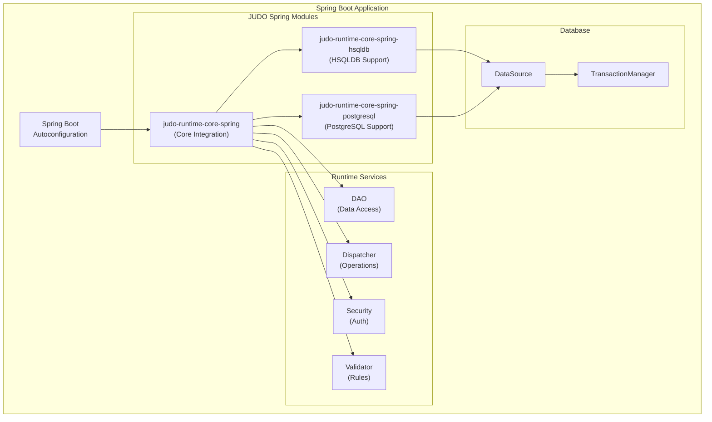
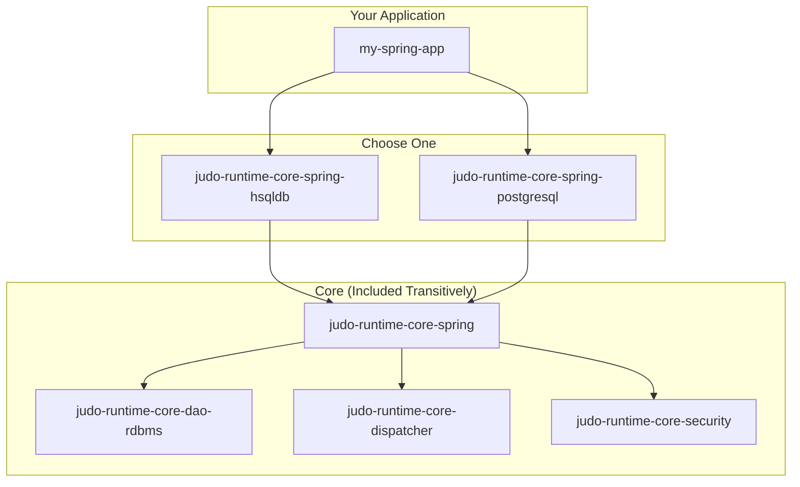
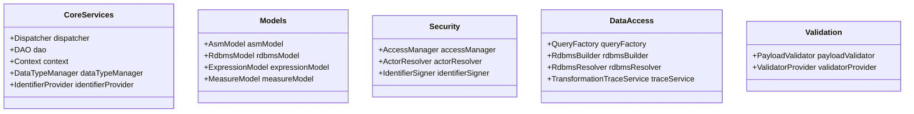
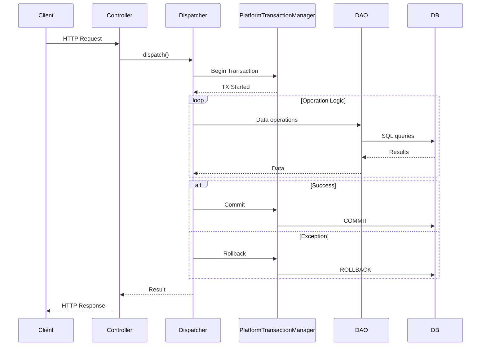

# JUDO Spring Integration Guide

Complete guide for integrating JUDO Runtime with Spring Boot applications.

## Overview

JUDO provides first-class Spring Boot support through autoconfiguration modules. This guide covers project setup, configuration, customization, and best practices for building JUDO-powered Spring applications.

## Architecture Overview



## Quick Start

### 1. Add Dependencies

**For HSQLDB (Development)**:
```xml
<dependency>
    <groupId>hu.blackbelt.judo.runtime</groupId>
    <artifactId>judo-runtime-core-spring-hsqldb</artifactId>
    <version>${judo.version}</version>
</dependency>
```

**For PostgreSQL (Production)**:
```xml
<dependency>
    <groupId>hu.blackbelt.judo.runtime</groupId>
    <artifactId>judo-runtime-core-spring-postgresql</artifactId>
    <version>${judo.version}</version>
</dependency>
```

### 2. Add Model Files

Place your JUDO model files in `src/main/resources/model/`:

```
src/main/resources/model/
    myapp-asm.model
    myapp-rdbms_hsqldb.model      (or myapp-rdbms_postgresql.model)
    myapp-expression.model
    myapp-measure.model
    myapp-liquibase_hsqldb.changelog.xml
    myapp-asm2rdbms_hsqldb.model
```

### 3. Configure Application

**application.properties**:
```properties
# Model name (optional - auto-discovered if single model)
judo.modelName=myapp

# Database (HSQLDB example)
spring.datasource.url=jdbc:hsqldb:mem:testdb
spring.datasource.username=sa
spring.datasource.password=

# Database (PostgreSQL example)
# spring.datasource.url=jdbc:postgresql://localhost:5432/myapp
# spring.datasource.username=myuser
# spring.datasource.password=mypassword
```

### 4. Create Application Class

```java
@SpringBootApplication
public class MyJudoApplication {
    public static void main(String[] args) {
        SpringApplication.run(MyJudoApplication.class, args);
    }
}
```

## Dependency Graph



## Bean Injection

### Injecting Core Services

```java
@Service
public class MyService {
    
    @Autowired
    private Dispatcher dispatcher;
    
    @Autowired
    private DAO<UUID> dao;
    
    @Autowired
    private AsmModel asmModel;
    
    @Autowired
    private Context context;
    
    public Payload executeOperation(String operationName, Payload input) {
        return dispatcher.call(operationName, input);
    }
}
```

### Available Injectable Beans



## Customization

### Custom Operation Interceptor

```java
@Component
public class AuditInterceptor implements OperationCallInterceptor {
    
    @Autowired
    private AuditService auditService;
    
    @Override
    public void preCall(OperationCallContext context) {
        auditService.logOperationStart(
            context.getOperation().getName(),
            context.getInput()
        );
    }
    
    @Override
    public void postCall(OperationCallContext context) {
        auditService.logOperationEnd(
            context.getOperation().getName(),
            context.getOutput()
        );
    }
}
```

Register the interceptor:

```java
@Configuration
public class InterceptorConfig {
    
    @Autowired
    private OperationCallInterceptorProvider provider;
    
    @Autowired
    private AuditInterceptor auditInterceptor;
    
    @PostConstruct
    public void registerInterceptors() {
        provider.getCallOperationInterceptors().add(auditInterceptor);
    }
}
```

### Custom Identifier Provider

```java
@Configuration
public class CustomIdentifierConfig {
    
    @Bean
    @Primary
    public IdentifierProvider<Long> sequenceIdentifierProvider() {
        return new SequenceIdentifierProvider();
    }
}
```

### Custom Metrics Collector

```java
@Configuration
public class MetricsConfig {
    
    @Bean
    @Primary
    public MetricsCollector prometheusMetricsCollector(Context context) {
        return DefaultMetricsCollector.builder()
            .context(context)
            .metricsConsumer(metrics -> {
                // Send to Prometheus
                prometheusRegistry.record(metrics);
            })
            .enabled(true)
            .verbose(true)
            .build();
    }
}
```

### Custom Variable Provider

```java
@Component
public class TenantVariableProvider implements EnvironmentVariableProvider {
    
    @Autowired
    private TenantService tenantService;
    
    @Override
    public Optional<Object> get(String name) {
        if ("CURRENT_TENANT".equals(name)) {
            return Optional.ofNullable(tenantService.getCurrentTenant());
        }
        return Optional.empty();
    }
}
```

Register in VariableResolver:

```java
@Configuration
public class VariableConfig {
    
    @Autowired
    private VariableResolver variableResolver;
    
    @Autowired
    private TenantVariableProvider tenantProvider;
    
    @PostConstruct
    public void registerProviders() {
        if (variableResolver instanceof DefaultVariableResolver dvr) {
            dvr.registerFunction("TENANT", tenantProvider, true);
        }
    }
}
```

## Transaction Management



Spring's `PlatformTransactionManager` is used for all database operations. JUDO automatically participates in Spring-managed transactions.

## Profile-Based Configuration

### Development Profile

**application-dev.properties**:
```properties
# HSQLDB for development
spring.datasource.url=jdbc:hsqldb:mem:devdb
spring.datasource.username=sa
spring.datasource.password=

# Debug logging
logging.level.hu.blackbelt.judo=DEBUG
```

### Production Profile

**application-prod.properties**:
```properties
# PostgreSQL for production
spring.datasource.url=jdbc:postgresql://${DB_HOST}:5432/${DB_NAME}
spring.datasource.username=${DB_USER}
spring.datasource.password=${DB_PASSWORD}

# Connection pooling
spring.datasource.hikari.maximum-pool-size=20
spring.datasource.hikari.minimum-idle=5

# Production logging
logging.level.hu.blackbelt.judo=INFO
```

### Conditional Configuration

```java
@Configuration
@Profile("!test")
public class ProductionJudoConfig {
    
    @Bean
    @Primary
    public MetricsCollector productionMetrics(Context context) {
        return DefaultMetricsCollector.builder()
            .context(context)
            .enabled(true)
            .build();
    }
}

@Configuration
@Profile("test")
public class TestJudoConfig {
    
    @Bean
    @Primary
    public MetricsCollector testMetrics(Context context) {
        return DefaultMetricsCollector.builder()
            .context(context)
            .enabled(false)
            .build();
    }
}
```

## Testing

### Unit Testing with Mocks

```java
@ExtendWith(MockitoExtension.class)
class MyServiceTest {
    
    @Mock
    private Dispatcher dispatcher;
    
    @InjectMocks
    private MyService myService;
    
    @Test
    void testOperation() {
        Payload expected = Payload.map("result", "success");
        when(dispatcher.call(eq("myOperation"), any()))
            .thenReturn(expected);
        
        Payload result = myService.doSomething();
        
        assertThat(result.get("result")).isEqualTo("success");
    }
}
```

### Integration Testing

```java
@SpringBootTest
@ActiveProfiles("test")
class MyIntegrationTest {
    
    @Autowired
    private Dispatcher dispatcher;
    
    @Autowired
    private DAO<UUID> dao;
    
    @Test
    @Transactional
    void testFullFlow() {
        // Test with real JUDO runtime
        Payload result = dispatcher.call("createEntity", 
            Payload.map("name", "Test"));
        
        assertThat(result).isNotNull();
    }
}
```

### TestContainers for PostgreSQL

```java
@SpringBootTest
@Testcontainers
class PostgreSQLIntegrationTest {
    
    @Container
    static PostgreSQLContainer<?> postgres = 
        new PostgreSQLContainer<>("postgres:15")
            .withDatabaseName("testdb");
    
    @DynamicPropertySource
    static void configureProperties(DynamicPropertyRegistry registry) {
        registry.add("spring.datasource.url", postgres::getJdbcUrl);
        registry.add("spring.datasource.username", postgres::getUsername);
        registry.add("spring.datasource.password", postgres::getPassword);
    }
    
    @Test
    void testWithRealDatabase() {
        // Test with real PostgreSQL
    }
}
```

## Best Practices

### 1. Separate Database Profiles

```xml
<!-- pom.xml -->
<profiles>
    <profile>
        <id>dev</id>
        <dependencies>
            <dependency>
                <groupId>hu.blackbelt.judo.runtime</groupId>
                <artifactId>judo-runtime-core-spring-hsqldb</artifactId>
            </dependency>
        </dependencies>
    </profile>
    <profile>
        <id>prod</id>
        <dependencies>
            <dependency>
                <groupId>hu.blackbelt.judo.runtime</groupId>
                <artifactId>judo-runtime-core-spring-postgresql</artifactId>
            </dependency>
        </dependencies>
    </profile>
</profiles>
```

### 2. Externalize Configuration

Use environment variables for sensitive data:
```properties
spring.datasource.password=${DB_PASSWORD}
judo.security.secret=${JUDO_SECRET}
```

### 3. Enable Health Checks

```java
@Component
public class JudoHealthIndicator implements HealthIndicator {
    
    @Autowired
    private DAO<?> dao;
    
    @Override
    public Health health() {
        try {
            // Simple health check
            return Health.up()
                .withDetail("dao", "available")
                .build();
        } catch (Exception e) {
            return Health.down(e).build();
        }
    }
}
```

### 4. Graceful Shutdown

```properties
# application.properties
server.shutdown=graceful
spring.lifecycle.timeout-per-shutdown-phase=30s
```

## Troubleshooting

### Bean Creation Failures

Check the order of autoconfiguration. Required beans:
1. `Dialect` (from hsqldb/postgresql module)
2. `DataSource` (Spring Boot auto-configured)
3. `JudoModelLoader` (from model configuration)

### Transaction Issues

Ensure `@Transactional` is on the correct layer:
```java
@Service
@Transactional
public class MyTransactionalService {
    // All public methods are transactional
}
```

### Context Not Available

The `ThreadContext` is thread-bound. For async operations:
```java
Context savedContext = context.snapshot();
executor.submit(() -> {
    context.restore(savedContext);
    // Now context is available
});
```

## See Also

- `/judo-runtime:autoconfiguration` - Detailed autoconfiguration internals
- `/judo-runtime:create-interceptor` - Creating custom interceptors
- `/judo-runtime:dispatcher-architecture` - Understanding the dispatcher

---
> Converted and distributed by [TomeVault](https://tomevault.io/claim/blackbelttechnology) — claim your Tome and manage your conversions.
<!-- tomevault:4.0:skill_md:2026-04-15 -->
