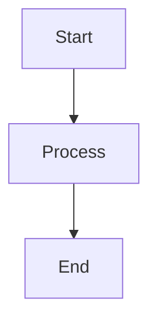

# Obsidian MOC Creator

Create comprehensive, well-structured MOC documents for knowledge organization and learning.

## Quick Start

1. **Identify depth**: beginner / intermediate / advanced / interview
2. **Generate MOC**: Use unified template with depth-based content

## Depth Levels

Choose depth based on user's goal:

| Depth            | Description                         | Modules Included                                          |
| ---------------- | ----------------------------------- | --------------------------------------------------------- |
| **beginner**     | Entry-level, focus on fundamentals  | Overview, Core Concepts, Getting Started, Basic Resources |
| **intermediate** | Balanced coverage                   | All standard modules                                      |
| **advanced**     | Comprehensive, expert-level content | All standard + Best Practices, Source Analysis            |
| **interview**    | Interview preparation focus         | All standard + Interview Q&A, Strategy                    |

**Default**: `beginner` if not specified

## MOC Design Principle

**MOC is a navigation index, not documentation.**

| Content Type       | Location     | MOC Representation |
| ------------------ | ------------ | ------------------ |
| Concept definition | Sub-document | `[[concept]]`      |
| Principle analysis | Sub-document | `[[principle]]`    |
| Code example       | Sub-document | `[[example]]`      |
| Best practice      | Sub-document | `[[practice]]`     |
| Navigation index   | MOC file     | Direct listing     |

**Each `[[link]]` points to a detailed document. MOC only organizes and navigates.**

## Version Guideline

For technical topics, use the latest stable version and document version differences.

### Version Specification

In the MOC overview section, specify the version:

```markdown
## 概述

> 技术栈/框架的简短定义

**版本**: [技术] [最新版本号]

- [版本说明]: 简要说明版本特点
```

### Version Differences

Document major version differences in a separate page:

**File**: `[topic]-版本历史.md`

```markdown
# [主题] 版本历史

## v3.x (当前版本)
- 新特性 A
- 新特性 B
- breaking change

## v2.x
- 主要变化
- 迁移指南

## v1.x
- 初始版本
```

**Include in MOC**:
```markdown
## 版本历史
- [[版本历史]] - 各版本核心区别 ⭐⭐
```

## MOC Structure

All MOCs follow this unified structure:

```
# [主题] MOC

## 概述
> 一句话定义

## 核心概念
- [[概念 A]] - 简要说明 ⭐⭐
- [[概念 B]] - 简要说明 ⭐⭐⭐

## 进阶主题
- [[高级概念]] - 简要说明 ⭐⭐
- [[底层原理]] - 简要说明 ⭐⭐⭐

## 实践项目
- [[入门项目]] - 简要说明 ⭐
- [[进阶项目]] - 简要说明 ⭐⭐

## 常见问题
- [[FAQ]] - 简要说明 ⭐⭐
- [[踩坑记录]] - 简要说明 ⭐⭐

## 学习资源
- [官方文档](url) - 简要说明
- [优质文章](url) - 简要说明

## 关联主题
- [[相关技术]] - 简要说明
- [[前置知识]] - 简要说明
- [[后置知识]] - 简要说明
```

**Link format**: `[[page name]] - description ⭐⭐⭐`
- Description: Brief 2-4 character summary
- Stars: Importance level (1-3 ⭐)

## Depth-Based Templates

Adjust module count and detail level:

### beginner (入门)

```markdown
## 概述
> 一句话定义

## 核心概念
- [[概念 A]] - 简要说明 ⭐⭐
- [[概念 B]] - 简要说明 ⭐

## 入门项目
- [[项目]] - 简要说明 ⭐

## 基础资源
- [官方文档](url) - 简要说明
```

### intermediate (中级)

```markdown
## 概述
> 一句话定义

## 核心概念
- [[概念 A]] - 简要说明 ⭐⭐
- [[概念 B]] - 简要说明 ⭐⭐

## 进阶主题
- [[高级概念]] - 简要说明 ⭐⭐
- [[底层原理]] - 简要说明 ⭐⭐

## 实践项目
- [[入门项目]] - 简要说明 ⭐
- [[进阶项目]] - 简要说明 ⭐⭐

## 常见问题
- [[FAQ]] - 简要说明 ⭐

## 学习资源
...

## 关联主题
...
```

### advanced (高级)

```markdown
## 概述
> 一句话定义

## 核心概念
- [[概念 A]] - 简要说明 ⭐⭐⭐
- [[概念 B]] - 简要说明 ⭐⭐⭐

## 进阶主题
- [[高级概念]] - 简要说明 ⭐⭐⭐
- [[底层原理]] - 简要说明 ⭐⭐⭐
- [[源码分析]] - 简要说明 ⭐⭐

## 最佳实践
- [[性能优化]] - 简要说明 ⭐⭐
- [[设计模式]] - 简要说明 ⭐⭐
- [[工程实践]] - 简要说明 ⭐

## 实践项目
- [[入门项目]] - 简要说明 ⭐
- [[进阶项目]] - 简要说明 ⭐⭐
- [[生产级项目]] - 简要说明 ⭐⭐

## 常见问题
- [[FAQ]] - 简要说明 ⭐⭐
- [[踩坑记录]] - 简要说明 ⭐⭐

## 学习资源
...

## 关联主题
...
```

### interview (面试)

**Extends advanced with interview-specific modules.**

```markdown
## 概述
> 面试重点说明

## 核心概念
- [[概念 A]] - 面试考点 ⭐⭐⭐
- [[概念 B]] - 面试考点 ⭐⭐⭐

## 进阶主题
- [[高级概念]] - 面试考点 ⭐⭐⭐
- [[底层原理]] - 面试考点 ⭐⭐⭐
- [[源码分析]] - 面试考点 ⭐⭐

## 最佳实践
- [[性能优化]] - 面试考点 ⭐⭐
- [[设计模式]] - 面试考点 ⭐⭐
- [[工程实践]] - 面试考点 ⭐

## 实践项目
- [[入门项目]] - 面试项目 ⭐
- [[进阶项目]] - 面试项目 ⭐⭐
- [[生产级项目]] - 面试项目 ⭐⭐

## 编码练习
- [[经典题目]] - 必刷 ⭐⭐⭐
- [[变形题]] - 进阶 ⭐⭐

## 常见问题
- [[FAQ]] - 高频面试题 ⭐⭐
- [[踩坑记录]] - 避坑要点 ⭐⭐
- [[场景题]] - 场景分析 ⭐⭐⭐
- [[系统设计]] - 系统设计 ⭐⭐

## 面试技巧
- 答题策略
- 沟通技巧

## 学习资源
- [[面经]] - 真实面经 ⭐⭐
- [[面试题库]] - 题库汇总 ⭐⭐

## 关联主题
...
```

## Workflow

```
MOC Creation:
- [ ] Step 1: Analyze user's request and intent
- [ ] Step 2: Determine depth level (ask if unclear)
- [ ] Step 3: Check latest stable version of the technology
- [ ] Step 4: Create directory: `10_MOC/[topic]/`
- [ ] Step 5: Generate MOC file: `[topic]-MOC.md` with version info
- [ ] Step 6: Generate version history page: `[topic]-版本历史.md`
- [ ] Step 7: Generate sub-pages with naming convention
- [ ] Step 8: Apply output format (frontmatter, wikilinks)
- [ ] Step 9: Validate quality
```

**Detailed quality checklist**: See [reference/quality-check.md](reference/quality-check.md)

## Directory Structure

All MOC and related pages must be in the same directory.

```
10_MOC/
└── [topic]/
    ├── [topic]-MOC.md          # MOC index file
    ├── [topic]-概念-A.md        # Sub-page
    ├── [topic]-概念-B.md        # Sub-page
    ├── [topic]-底层原理.md       # Sub-page
    ├── [topic]-实践项目.md      # Sub-page
    └── ...
```

**Rules**:
- MOC and all linked pages in the same directory
- MOC file name: `[topic]-MOC.md`
- Page file name: `[topic]-[title].md`

## Naming Convention

| Type            | Format                   | Example                         |
| --------------- | ------------------------ | ------------------------------- |
| Directory       | `[topic]`                | `react`, `golang`               |
| MOC file        | `[topic]-MOC.md`         | `react-MOC.md`, `golang-MOC.md` |
| Concept page    | `[topic]-概念-[name].md` | `react-概念-state.md`           |
| Principle page  | `[topic]-原理-[name].md` | `react-原理-fiber.md`           |
| Practice page   | `[topic]-实践-[name].md` | `react-实践-perf.md`            |
| FAQ page        | `[topic]-FAQ.md`         | `react-FAQ.md`                  |
| Interview page  | `[topic]-面经.md`        | `react-面经.md`                 |
| Version history | `[topic]-版本历史.md`    | `react-版本历史.md`             |

**Key principles**:
- Use Chinese for Chinese keywords (概念, 原理, 实践, FAQ, 面经)
- Use kebab-case for topic names
- Keep topic prefix consistent within directory

## Diagrams

For complex logic or concepts in sub-pages, use Mermaid diagrams:



**Guidelines**:
- Use Mermaid for architecture flows, data flows, state machines
- Place diagram after relevant H2 section header
- Keep diagrams simple and focused

## Output Format

All MOC files must follow Obsidian conventions:

- Filename: kebab-case (e.g., `react-state-management.md`)
- YAML frontmatter with `title`, `tags`, `type: moc`
- Proper wikilinks `[[page name]]`
- Consistent heading hierarchy (H1 → H2 → H3)

**Specification**: See [reference/output-format.md](reference/output-format.md)

## Quality Standards

Before finalizing, validate:

- [ ] All sections have meaningful content
- [ ] Wikilinks are correctly formatted
- [ ] No placeholder text
- [ ] Consistent terminology
- [ ] Depth matches user's level

## Tips

- **Keep it actionable**: Each node should point to real content
- **Link early**: Add `[[ ]]` links even if pages don't exist yet
- **Iterate**: MOCs evolve as knowledge grows
- **Balance**: Avoid both too sparse and too detailed

---
> Converted and distributed by [TomeVault](https://tomevault.io/claim/blackcater) — claim your Tome and manage your conversions.
<!-- tomevault:4.0:skill_md:2026-04-14 -->
