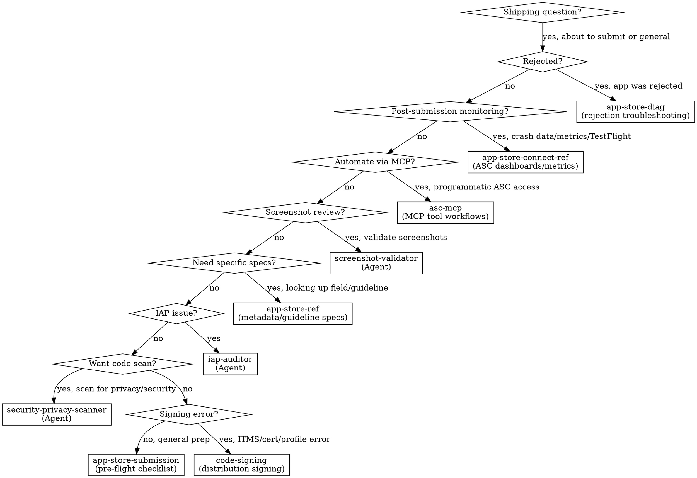

# Shipping & App Store Router

**You MUST use this skill when preparing to submit ANY app, handling App Store rejections, or working on release workflow.**

## When to Use

Use this router when you encounter:
- Preparing an app for App Store submission
- App Store rejection (any guideline)
- Metadata requirements (screenshots, descriptions, keywords)
- Privacy manifest and nutrition label questions
- Age rating and content classification
- Export compliance and encryption declarations
- EU DSA trader status
- Account deletion or Sign in with Apple requirements
- Build upload and processing issues
- App Review appeals
- WWDC25 App Store Connect changes
- First-time submission workflow

## Routing Logic

### 1. Pre-Submission Preparation → **app-store-submission**

**Triggers**:
- "How do I submit my app?"
- "What do I need before submitting?"
- Preparing for first submission
- Pre-flight checklist needed
- Screenshot requirements
- Metadata completeness check
- Encryption compliance questions
- Accessibility Nutrition Labels
- Privacy manifest requirements for submission

**Why app-store-submission**: Discipline skill with 8 anti-patterns, decision trees, and pressure scenarios. Prevents the mistakes that cause 90% of rejections.

**Invoke**: `/skill axiom-app-store-submission`

---

### 2. Metadata, Guidelines, and API Reference → **app-store-ref**

**Triggers**:
- "What fields are required in App Store Connect?"
- "What's the max length for app description?"
- Specific guideline number lookup
- Privacy manifest schema details
- Age rating tiers and questionnaire
- IAP submission metadata
- EU DSA compliance details
- Build upload methods
- WWDC25 changes to App Store Connect

**Why app-store-ref**: 10-part reference covering every metadata field, guideline, and compliance requirement with exact specifications.

**Invoke**: `/skill axiom-app-store-ref`

---

### 3. Rejection Troubleshooting → **app-store-diag**

**Triggers**:
- "My app was rejected"
- "Guideline 2.1 rejection"
- "Binary was rejected"
- Guideline 4.2 or 4.3 rejection (app too simple, web wrapper, spam, duplicate)
- Guideline 1.x rejection (objectionable content, UGC moderation, Kids category)
- How to respond to a rejection
- Writing an appeal
- Understanding rejection messages
- Third or repeated rejection
- Resolution Center communication

**Why app-store-diag**: 9 diagnostic patterns mapping rejection types to root causes and fixes, including subjective rejections (4.2/4.3, 1.x). Includes appeal writing guidance and crisis scenario for repeated rejections.

**Invoke**: `/skill axiom-app-store-diag`

---

### 4. Privacy & Security Compliance → **security-privacy-scanner** (Agent)

**Triggers**:
- "Scan my code for privacy issues before submission"
- Hardcoded API keys or secrets
- Missing privacy manifest
- Required Reason API declarations
- ATS violations

**Why security-privacy-scanner**: Autonomous agent that scans for security vulnerabilities and privacy compliance issues that cause rejections.

**Invoke**: Launch `security-privacy-scanner` agent or `/axiom:audit security`

---

### 5. IAP Review Issues → **iap-auditor** (Agent)

**Triggers**:
- IAP rejected or not working
- Missing transaction.finish()
- Missing restore purchases
- Subscription tracking issues

**Why iap-auditor**: Scans IAP code for the patterns that cause StoreKit rejections.

**Invoke**: Launch `iap-auditor` agent

---

### 6. Screenshot Validation → **screenshot-validator** (Agent)

**Triggers**:
- "Check my App Store screenshots"
- "Are my screenshots the right dimensions?"
- "Validate screenshots before submission"
- "Review my marketing screenshots"
- Screenshot content or dimension questions

**Why screenshot-validator**: Multimodal agent that visually inspects each screenshot for placeholder text, wrong dimensions, debug artifacts, broken UI, and competitor references. Catches issues that manual review misses.

**Invoke**: Launch `screenshot-validator` agent or `/axiom:audit screenshots`

---

### 7. Programmatic ASC Access → **asc-mcp**

**Triggers**:
- "Automate App Store Connect"
- "Submit build programmatically"
- "Manage TestFlight from Claude"
- "Respond to reviews via API"
- "Set up asc-mcp"
- "Distribute to TestFlight groups via MCP"
- "Create a new version without opening ASC"

**Why asc-mcp**: Workflow-focused skill teaching Claude to use asc-mcp MCP tools for release pipelines, TestFlight distribution, review management, and feedback triage — all without leaving Claude Code.

**Invoke**: `/skill axiom-asc-mcp`

---

### 8. Post-Submission Monitoring → **app-store-connect-ref**

**Triggers**:
- "How do I view crash data in App Store Connect?"
- "Where are my TestFlight crash reports?"
- "How do I read ASC metrics dashboards?"
- Post-release crash investigation
- Downloading crash logs from ASC

**Why app-store-connect-ref**: ASC navigation for crash dashboards, TestFlight feedback, performance metrics, and data export workflows.

**Invoke**: `/skill axiom-app-store-connect-ref`

---

### 9. Distribution Signing Issues → **code-signing** / **code-signing-diag**

**Triggers**:
- ITMS-90035 Invalid Signature on upload
- ITMS-90161 Invalid Provisioning Profile
- "No signing certificate found" when archiving
- Certificate expired before submission
- Archive succeeds but export/upload fails
- Profile doesn't match bundle ID
- Entitlement mismatch on upload

**Why code-signing**: Distribution signing errors are the #1 cause of upload failures. Diagnosing with CLI tools takes 5 minutes. code-signing-diag has 6 decision trees mapping ITMS errors to root causes.

**Invoke**: `/skill axiom-code-signing-diag` (troubleshooting) or `/skill axiom-code-signing` (setup)

---

## Decision Tree

Simplified:

1. App was rejected? → app-store-diag
2. Post-submission crash data/metrics/TestFlight? → app-store-connect-ref
3. Automate ASC via MCP tools? → asc-mcp
4. Validate screenshots? → screenshot-validator (Agent)
5. Need specific metadata/guideline specs? → app-store-ref
6. IAP submission issue? → iap-auditor (Agent)
7. Want pre-submission code scan? → security-privacy-scanner (Agent)
8. ITMS signing/certificate/profile error on upload? → code-signing / code-signing-diag
9. General submission preparation? → app-store-submission

## Anti-Rationalization

| Thought | Reality |
|---------|---------|
| "I'll just submit and see what happens" | 40% of rejections are Guideline 2.1 (completeness). app-store-submission catches them in 10 min. |
| "I've submitted apps before, I know the process" | Requirements change yearly. Privacy manifests, age rating tiers, EU DSA, Accessibility Nutrition Labels are all new since 2024. |
| "The rejection is wrong, I'll just resubmit" | Resubmitting without changes wastes 24-48 hours per cycle. app-store-diag finds the root cause. |
| "Privacy manifests are only for big apps" | Every app using Required Reason APIs needs a manifest since May 2024. Missing = automatic rejection. |
| "I'll add the metadata later" | Missing metadata blocks submission entirely. app-store-ref has the complete field list. |
| "It's just a bug fix, I don't need a full checklist" | Bug fix updates still need What's New text, correct screenshots, and valid build. app-store-submission covers it. |
| "I'll just eyeball the screenshots myself" | Human review misses dimension mismatches (even 1px off = rejection), subtle placeholder text, and debug indicators. A single missed issue costs 24-48 hours in resubmission. screenshot-validator catches it in 2 minutes. |
| "I'll just do it in the ASC web dashboard" | If asc-mcp is configured, MCP tools are faster for bulk operations — distributing builds, responding to reviews, creating versions. asc-mcp has the workflow. |
| "Upload failed with ITMS error, let me re-archive" | ITMS signing errors are configuration — wrong cert, expired profile, missing entitlement. Re-archiving with the same config produces the same result. code-signing-diag has the fix. |

## When NOT to Use (Conflict Resolution)

**Do NOT use axiom-shipping for these — use the correct router instead:**

| Issue | Correct Router | Why NOT axiom-shipping |
|-------|---------------|----------------------|
| Build fails before archiving | **ios-build** | Environment/build issue, not submission |
| SwiftData migration crash | **ios-data** | Schema issue, not App Store |
| Privacy manifest coding (writing the file) | **ios-build** | security-privacy-scanner handles code scanning |
| StoreKit 2 implementation (writing IAP code) | **ios-integration** | in-app-purchases / storekit-ref covers implementation |
| Performance issues found during testing | **ios-performance** | Profiling issue, not submission |
| Accessibility implementation | **ios-accessibility** | Code-level accessibility, not App Store labels |

**axiom-shipping is for the submission workflow**, not code implementation:
- Preparing metadata and compliance → axiom-shipping
- Writing the actual code → domain-specific router (ios-build, ios-data, etc.)
- App was rejected → axiom-shipping
- Code changes to fix rejection → domain-specific router, then back to axiom-shipping to verify

## Example Invocations

User: "How do I submit my app to the App Store?"
→ Invoke: `/skill axiom-app-store-submission`

User: "My app was rejected for Guideline 2.1"
→ Invoke: `/skill axiom-app-store-diag`

User: "What screenshots do I need?"
→ Invoke: `/skill axiom-app-store-ref`

User: "What fields are required in App Store Connect?"
→ Invoke: `/skill axiom-app-store-ref`

User: "How do I fill out the age rating questionnaire?"
→ Invoke: `/skill axiom-app-store-ref`

User: "Do I need an encryption compliance declaration?"
→ Invoke: `/skill axiom-app-store-submission`

User: "My app keeps getting rejected, what do I do?"
→ Invoke: `/skill axiom-app-store-diag`

User: "How do I appeal an App Store rejection?"
→ Invoke: `/skill axiom-app-store-diag`

User: "My app was rejected for Guideline 4.2 minimum functionality"
→ Invoke: `/skill axiom-app-store-diag`

User: "Rejected for being a web wrapper / duplicate app"
→ Invoke: `/skill axiom-app-store-diag`

User: "Rejection for user-generated content without moderation"
→ Invoke: `/skill axiom-app-store-diag`

User: "Kids category compliance rejection"
→ Invoke: `/skill axiom-app-store-diag`

User: "Scan my code for App Store compliance issues"
→ Invoke: `security-privacy-scanner` agent

User: "Check my IAP implementation before submission"
→ Invoke: `iap-auditor` agent

User: "Check my App Store screenshots in ~/Screenshots"
→ Invoke: `screenshot-validator` agent

User: "Are my screenshots the right dimensions?"
→ Invoke: `screenshot-validator` agent

User: "How do I find crash data in App Store Connect?"
→ Invoke: `/skill axiom-app-store-connect-ref`

User: "Where are my TestFlight crash reports in ASC?"
→ Invoke: `/skill axiom-app-store-connect-ref`

User: "What's new in App Store Connect for 2025?"
→ Invoke: `/skill axiom-app-store-ref`

User: "I need to set up DSA trader status for the EU"
→ Invoke: `/skill axiom-app-store-ref`

User: "What are Accessibility Nutrition Labels?"
→ Invoke: `/skill axiom-app-store-submission`

User: "This is my first app submission ever"
→ Invoke: `/skill axiom-app-store-submission`

User: "Submit this build to App Store programmatically"
→ Invoke: `/skill axiom-asc-mcp`

User: "Set up asc-mcp for App Store Connect"
→ Invoke: `/skill axiom-asc-mcp`

User: "Distribute build 42 to my beta testers via MCP"
→ Invoke: `/skill axiom-asc-mcp`

User: "Respond to negative App Store reviews from Claude"
→ Invoke: `/skill axiom-asc-mcp`

User: "ITMS-90035 Invalid Signature when uploading"
→ Invoke: `/skill axiom-code-signing-diag`

User: "My provisioning profile expired and I can't upload"
→ Invoke: `/skill axiom-code-signing-diag`

---
> Converted and distributed by [TomeVault](https://tomevault.io/claim/charleswiltgen) — claim your Tome and manage your conversions.
<!-- tomevault:4.0:skill_md:2026-04-11 -->
