# Accessibility

**You MUST use this skill for ANY accessibility work including VoiceOver, Dynamic Type, color contrast, WCAG compliance, and UX flow auditing.**

## Quick Reference

| Symptom / Task | Reference |
|----------------|-----------|
| VoiceOver labels, hints, navigation | See `skills/accessibility-diag.md` |
| Dynamic Type scaling violations | See `skills/accessibility-diag.md` |
| Dynamic Type on tvOS (Large Text, tvOS 27) | See `skills/accessibility-diag.md` |
| Long-form reading apps (continuous reading, Speak Screen, text navigation) | See `skills/accessibility-diag.md` |
| Captions & subtitle styling in video players (generated subtitles, style preview) | See `skills/accessibility-diag.md` |
| Custom control technique choice (adjustable, passthrough, direct touch) | See `skills/accessibility-diag.md` |
| Accessibility Nutrition Labels | See `skills/accessibility-diag.md` |
| Color contrast (WCAG AA/AAA) | See `skills/accessibility-diag.md` |
| Touch target sizes (< 44x44pt) | See `skills/accessibility-diag.md` |
| Keyboard navigation (iPadOS/macOS) | See `skills/accessibility-diag.md` |
| Reduce Motion support | See `skills/accessibility-diag.md` |
| Assistive Access (cognitive, iOS 17+) | See `skills/accessibility-diag.md` |
| Accessibility Inspector workflows | See `skills/accessibility-diag.md` |
| App Store Review preparation | See `skills/accessibility-diag.md` |
| UX dead ends, dismiss traps | See `skills/ux-flow-audit.md` |
| Buried CTAs, missing empty states | See `skills/ux-flow-audit.md` |
| Missing loading/error states | See `skills/ux-flow-audit.md` |
| Deep link dead ends | See `skills/ux-flow-audit.md` |
| Accessibility dead ends (gesture-only) | See `skills/ux-flow-audit.md` |
| watchOS-specific (VoiceOver rotor on Digital Crown, AssistiveTouch, Double Tap) | See `skills/watchos-a11y.md` |

## Cross-Suite Routes

- Full watchOS development context → See axiom-watchos
- Live accessibility validation on the simulator (set toggles, assert announcements) → `simulator-tester` agent + `xcui` — see axiom-tools (skills/xcui-ref.md)

## Decision Tree

```dot
digraph accessibility {
    start [label="Accessibility issue" shape=ellipse];
    what [label="What type?" shape=diamond];

    start -> what;
    what -> "skills/accessibility-diag.md" [label="VoiceOver/labels/hints"];
    what -> "skills/accessibility-diag.md" [label="Dynamic Type"];
    what -> "skills/accessibility-diag.md" [label="color contrast"];
    what -> "skills/accessibility-diag.md" [label="touch targets"];
    what -> "skills/accessibility-diag.md" [label="keyboard nav"];
    what -> "skills/accessibility-diag.md" [label="Reduce Motion"];
    what -> "skills/accessibility-diag.md" [label="Assistive Access"];
    what -> "skills/accessibility-diag.md" [label="custom control techniques"];
    what -> "skills/accessibility-diag.md" [label="continuous reading / text navigation"];
    what -> "skills/accessibility-diag.md" [label="captions / subtitle styling"];
    what -> "skills/accessibility-diag.md" [label="App Store prep / Nutrition Labels"];
    what -> "skills/ux-flow-audit.md" [label="UX dead end/dismiss trap"];
    what -> "skills/ux-flow-audit.md" [label="missing states"];
    what -> "skills/watchos-a11y.md" [label="watchOS VoiceOver / AssistiveTouch / Double Tap"];
    what -> "accessibility-auditor" [label="automated scan" shape=box];
}
```

1. ANY VoiceOver, Dynamic Type (including tvOS Large Text), contrast, touch target, or WCAG issue → `skills/accessibility-diag.md`
2. Assistive Access (cognitive disabilities, iOS 17+) → `skills/accessibility-diag.md`
3. App Store accessibility rejection or Nutrition Labels → `skills/accessibility-diag.md`
4. Reading app: VoiceOver stops at paragraphs/pages, Speak Screen halts → `skills/accessibility-diag.md`
5. UX dead ends, dismiss traps, buried CTAs, missing states → `skills/ux-flow-audit.md`
6. watchOS-specific accessibility (rotor on Digital Crown, AssistiveTouch, Double Tap) → `skills/watchos-a11y.md`
7. Want automated accessibility scan? → `accessibility-auditor` agent or `/axiom:audit accessibility`

## Automated Scanning

**Accessibility audit** → Launch `accessibility-auditor` agent or `/axiom:audit accessibility`
- VoiceOver labels and hints
- Dynamic Type violations
- Color contrast failures
- WCAG compliance scanning

**UX flow audit** → Launch `ux-flow-auditor` agent
- Dead-end views, dismiss traps
- Buried CTAs, missing empty/loading/error states
- Deep link dead ends, accessibility dead ends

## Critical Patterns

#### Image Accessibility

- Use `Image(decorative: "photo")` for purely decorative images — automatically hidden from VoiceOver (equivalent to `accessibilityHidden(true)` but semantically clearer)
- Use `accessibilityInputLabels()` for buttons with complex or changing labels — improves Voice Control accuracy by providing alternative labels
- Respect `accessibilityDifferentiateWithoutColor` environment value — when active, provide non-color cues (icons, patterns, labels) alongside color indicators

## Anti-Rationalization

| Thought | Reality |
|---------|---------|
| "I'll add VoiceOver labels when I'm done building" | Accessibility is foundational, not polish. accessibility-diag prevents App Store rejection. |
| "My app doesn't need accessibility" | All apps need accessibility. It's required by App Store guidelines and benefits all users. |
| "Dynamic Type just needs .scaledFont" | Dynamic Type has 7 common violations. accessibility-diag catches them all. |
| "Color contrast looks fine to me" | Visual assessment is unreliable. WCAG ratios require measurement. accessibility-diag validates. |
| "UX issues are just polish" | UX dead ends cause 1-star reviews. They're defects, not enhancements. |
| "The dismiss gesture handles it" | fullScreenCover has no dismiss gesture. That's the trap. |

## Example Invocations

User: "My button isn't being read by VoiceOver"
→ See `skills/accessibility-diag.md`

User: "How do I support Dynamic Type?"
→ See `skills/accessibility-diag.md`

User: "Check my app for accessibility issues"
→ See `skills/accessibility-diag.md`

User: "Prepare for App Store accessibility review"
→ See `skills/accessibility-diag.md`

User: "Scan my app for accessibility issues automatically"
→ Launch `accessibility-auditor` agent

User: "How do I support Assistive Access?"
→ See `skills/accessibility-diag.md`

User: "How do I prepare my tvOS app for Large Text?"
→ See `skills/accessibility-diag.md`

User: "VoiceOver stops reading at the end of each page in my book app"
→ See `skills/accessibility-diag.md`

User: "How do I let users restyle subtitles or get generated captions in my video player?"
→ See `skills/accessibility-diag.md`

User: "Check for UX dead ends and dismiss traps"
→ See `skills/ux-flow-audit.md`

User: "My fullScreenCover has no way to dismiss"
→ See `skills/ux-flow-audit.md`

User: "Are there missing empty states in my app?"
→ See `skills/ux-flow-audit.md`

---
> Source: [CharlesWiltgen/Axiom](https://github.com/CharlesWiltgen/Axiom) — distributed by [TomeVault](https://tomevault.io).
<!-- tomevault:4.0:skill_md:2026-06-30 -->
