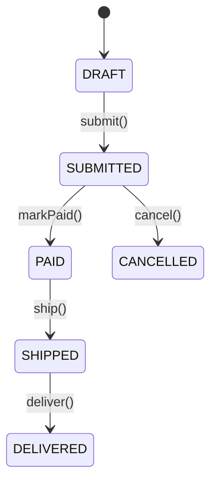

# Analyzing Domain Model

**Output:** `docs/unwind/layers/domain-model/` (folder with index.md + section files)

**Principles:** See `analysis-principles.md` - completeness, machine-readable, link to source, no commentary, incremental writes.

## Output Structure

```
docs/unwind/layers/domain-model/
├── index.md           # Overview, entity count, links to sections
├── entities.md        # All entity definitions
├── value-objects.md   # Value objects, embeddables
├── enums.md           # All enum/union types
└── validation.md      # Validation rules, constraints, state machines
```

For large codebases (20+ entities), split by aggregate/domain:
```
docs/unwind/layers/domain-model/
├── index.md
├── users-aggregate.md
├── orders-aggregate.md
└── ...
```

## Process (Incremental Writes)

**Step 1: Setup**
```bash
mkdir -p docs/unwind/layers/domain-model/
```
Write initial `index.md`:
```markdown
# Domain Model

## Sections
- [Entities](entities.md) - _pending_
- [Value Objects](value-objects.md) - _pending_
- [Enums](enums.md) - _pending_
- [Validation](validation.md) - _pending_

## Summary
_Analysis in progress..._
```

**Step 2: Analyze and write entities.md**
1. Find all entity classes
2. Include actual class definitions with annotations
3. Write `entities.md` immediately
4. Update `index.md`

**Step 3: Analyze and write value-objects.md**
1. Find embeddables, value objects
2. Write `value-objects.md` immediately
3. Update `index.md`

**Step 4: Analyze and write enums.md**
1. Find all enum/union types
2. Document all values
3. Write `enums.md` immediately
4. Update `index.md`

**Step 5: Analyze and write validation.md**
1. Extract validation logic, state machines
2. Write `validation.md` immediately
3. Update `index.md`

**Step 6: Finalize index.md**
Update with final counts and summary

## Output Format

```markdown
# Domain Model

## Entities

### User

[User.java](https://github.com/owner/repo/blob/main/src/domain/User.java)

```java
@Entity
@Table(name = "users")
public class User {
    @Id
    @GeneratedValue(strategy = GenerationType.IDENTITY)
    private Long id;

    @Column(nullable = false, unique = true)
    private String email;

    @Enumerated(EnumType.STRING)
    private UserStatus status = UserStatus.ACTIVE;

    @OneToMany(mappedBy = "user", cascade = CascadeType.ALL)
    private List<Order> orders = new ArrayList<>();

    public void suspend() {
        if (this.status == UserStatus.DELETED) {
            throw new IllegalStateException("Cannot suspend deleted user");
        }
        this.status = UserStatus.SUSPENDED;
    }
}
```

[Continue for ALL entities...]

## Value Objects

### Money

[Money.java](https://github.com/owner/repo/blob/main/src/domain/Money.java)

```java
@Embeddable
public class Money {
    private BigDecimal amount;

    @Enumerated(EnumType.STRING)
    private Currency currency;

    public Money add(Money other) {
        if (!this.currency.equals(other.currency)) {
            throw new IllegalArgumentException("Currency mismatch");
        }
        return new Money(this.amount.add(other.amount), this.currency);
    }
}
```

## Enums

### UserStatus

```java
public enum UserStatus {
    ACTIVE, SUSPENDED, DELETED
}
```

## State Machines

### Order Status Transitions



Source: [Order.java:78-95](https://github.com/owner/repo/blob/main/src/domain/Order.java#L78-L95)

## Unknowns

- [List anything unclear]
```

## Additional Requirements

### Validation Constraint Tables [MUST]

For each validation schema, create a constraint table:

```markdown
### Position Validation [MUST]

| Field | Type | Min | Max | Required | Default | Notes |
|-------|------|-----|-----|----------|---------|-------|
| name | string | 1 | 200 | yes | - | |
| fteBasis | number | 0 | 2 | yes | 1.0 | Full-time equivalent |
| capexPerc | number | 0 | 100 | yes | 0 | Percentage |
| allocation | number | 0 | 100 | yes | 100 | Percentage |

**Source:** `src/validation/positions.ts`
```

### Enum Value Documentation [MUST]

Document ALL enum/union type values:

```markdown
### Position Type Enum [MUST]

```typescript
type PositionType = 'standard' | 'acting' | 'interim' | 'vacant'
```

| Value | Description |
|-------|-------------|
| standard | Permanent position |
| acting | Temporary assignment |
| interim | Short-term coverage |
| vacant | Unfilled position |
```

### Permission Matrix [MUST]

Document role-permission mappings:

```markdown
### Permission Matrix [MUST]

| Resource | owner | admin | manager | member |
|----------|-------|-------|---------|--------|
| Organisation | manage | read | read | read |
| Employee | manage | manage | manage | read |
| Budget | manage | manage | read | - |
| Rate | manage | manage | read | - |
```

### Self-Reference Rules [MUST]

Document any self-referential constraints:
```markdown
### Relationship Constraints [MUST]

- Position cannot report to itself: `fromPositionId !== toPositionId`
- End date must be after start date: `endDate > startDate`
```

## Mandatory Tagging

**Every entity, enum, and validation rule must have a [MUST], [SHOULD], or [DON'T] tag in its heading.**

Default categorizations for domain model:
- **[MUST]**: Entities, validation rules, enums, business constraints
- **[SHOULD]**: DTOs, mappers, utility types
- **[DON'T]**: Framework-specific decorators, ORM annotations

Example:
```markdown
### User entity [MUST]
### UserStatus enum [MUST]
### EmailValidator [MUST]
### UserDTO [SHOULD]
```

See `analysis-principles.md` section 9 for full tagging rules.

## Refresh Mode

If `docs/unwind/layers/domain-model/` exists, compare current state and add `## Changes Since Last Review` section to `index.md`.

---
> Converted and distributed by [TomeVault](https://tomevault.io/claim/cliftonc) — claim your Tome and manage your conversions.
<!-- tomevault:4.0:skill_md:2026-04-11 -->
