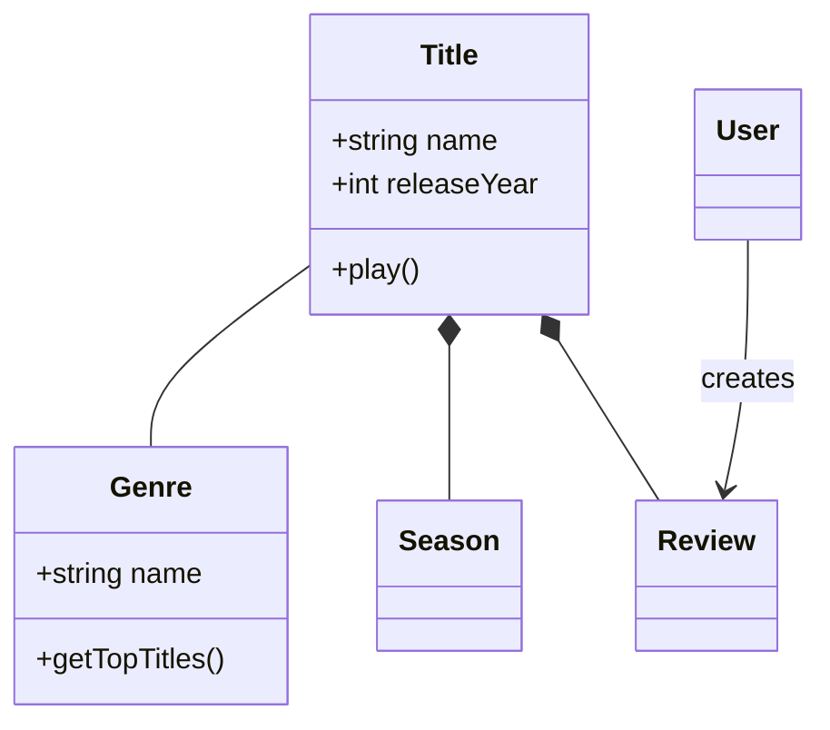
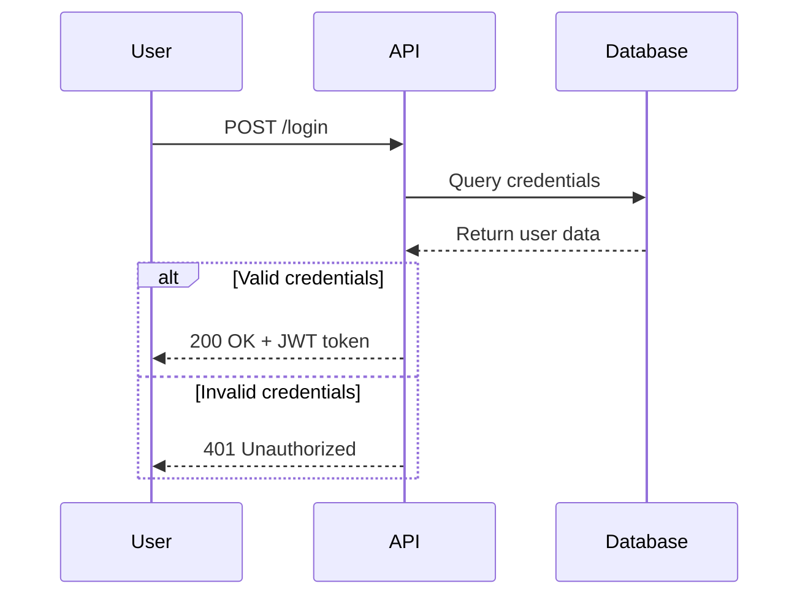
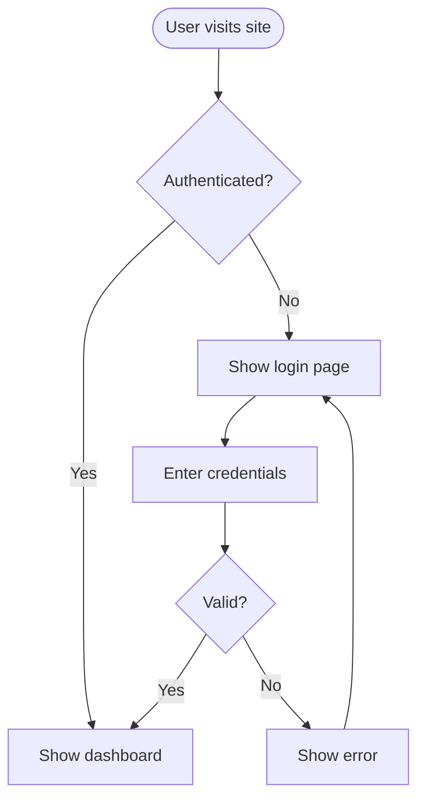
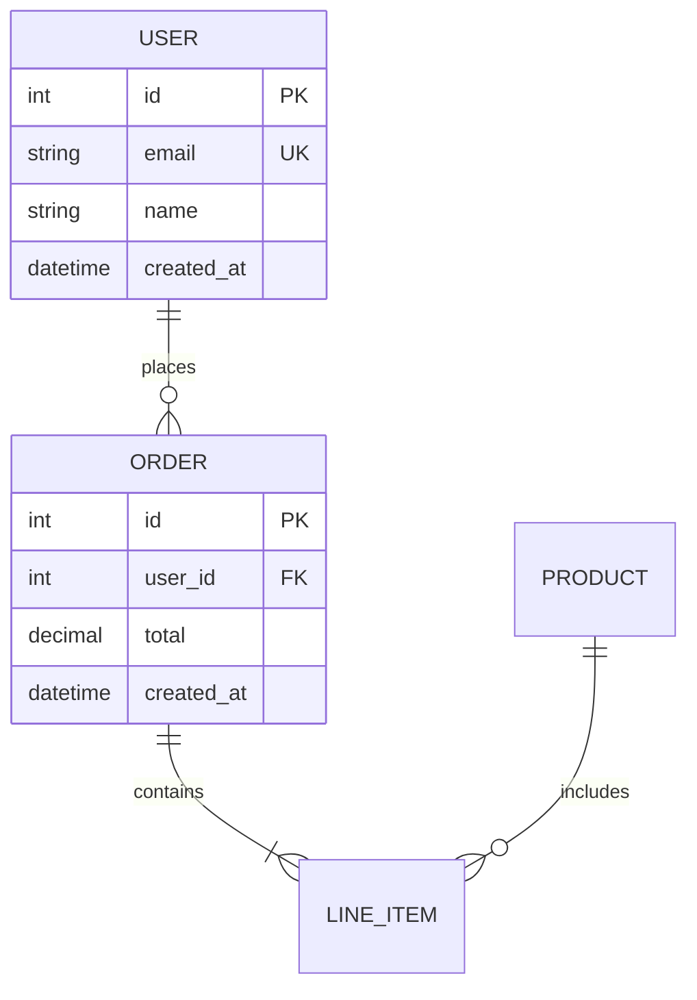
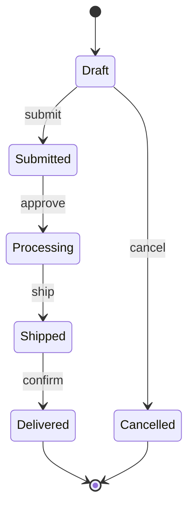
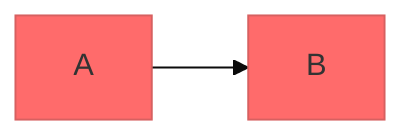

# Mermaid Diagramming

Create professional software diagrams using Mermaid's text-based syntax.

<instructions>

## Core Syntax Structure

All Mermaid diagrams follow this pattern:

```mermaid
diagramType
  definition content
```

**Key principles:**
- First line declares diagram type (e.g., `classDiagram`, `sequenceDiagram`, `flowchart`)
- Use `%%` for comments
- Whitespace aids readability; not required
- Typos break diagrams silently -- validate in Mermaid Live

## Diagram Type Selection Guide

| Type | When to use | Reference |
|------|-------------|-----------|
| Class Diagram | Domain modelling, OOP design, entity relationships | `references/class-diagrams.md` |
| Sequence Diagram | API flows, authentication, component interactions | `references/sequence-diagrams.md` |
| Flowchart | Processes, algorithms, decision trees, user journeys | `references/flowcharts-basic.md`, `references/flowcharts-advanced.md` |
| ERD | Database schemas, table relationships, data modelling | `references/erd-basic.md`, `references/erd-patterns.md` |
| C4 Diagram | Software architecture at Context, Container, Component levels | `references/c4-diagrams.md` |
| State Diagram | State machines, lifecycle states, workflow status | `references/other-diagrams.md` |
| Git Graph | Branching strategies, commit history | `references/other-diagrams.md` |
| Gantt Chart | Project timelines, scheduling, sprint planning | `references/other-diagrams.md` |
| Pie/Quadrant | Data distribution, prioritisation matrices | `references/other-diagrams.md` |

Default to **flowchart** when the user's intent is unclear. Flowcharts cover the widest range of use cases.

</instructions>

<example name="Class Diagram (Domain Model)">

### Class Diagram


</example>

<example name="Sequence Diagram (API Flow)">

### Sequence Diagram


</example>

<example name="Flowchart (User Journey)">

### Flowchart


</example>

<example name="ERD (Database Schema)">

### ERD


</example>

<example name="State Diagram (Order Lifecycle)">

### State Diagram


</example>

<references>

## Detailed References

- **[references/class-diagrams.md](references/class-diagrams.md)** - Domain modelling, relationships (association, composition, aggregation, inheritance), multiplicity, methods/properties
- **[references/sequence-diagrams.md](references/sequence-diagrams.md)** - Actors, participants, messages (sync/async), activations, loops, alt/opt/par blocks, notes
- **[references/flowcharts-basic.md](references/flowcharts-basic.md)** - Node shapes, connections, subgraphs
- **[references/flowcharts-advanced.md](references/flowcharts-advanced.md)** - Styling, comprehensive examples, patterns
- **[references/erd-basic.md](references/erd-basic.md)** - Entities, relationships, cardinality, attributes
- **[references/erd-patterns.md](references/erd-patterns.md)** - Schema examples, design patterns
- **[references/c4-diagrams.md](references/c4-diagrams.md)** - System context, container, component diagrams, boundaries
- **[references/advanced-features.md](references/advanced-features.md)** - Configuration, layout, export options
- **[references/theming.md](references/theming.md)** - Themes, colours, visual styling
- **[references/other-diagrams.md](references/other-diagrams.md)** - State diagrams, git graphs, gantt charts, pie/quadrant

</references>

<best-practices>

## Best Practices

1. **Draft core entities first** - Add 3-5 main nodes, then connect. Add attributes and detail in a second pass.
2. **Label every node and edge** - Unlabelled arrows force readers to guess the relationship.
3. **Add `%%` comments above complex sections** - Explain why, not what. Future editors read comments before syntax.
4. **Split at 15 nodes** - Diagrams with more than 15 nodes lose clarity. Break into focused views linked by a parent diagram.
5. **Store `.mmd` files next to the code they describe** - Keep diagrams and source in the same PR so they stay in sync.
6. **Set a title on every diagram** - Use the `title` keyword or a Markdown heading directly above the code block.
7. **Test in Mermaid Live before committing** - Paste the diagram into [mermaid.live](https://mermaid.live) to catch silent failures.
8. **Check colour contrast** - Verify foreground/background pairs meet WCAG AA (4.5:1 ratio). Do not rely on colour alone to convey meaning.

</best-practices>

<validation>

## Validation Loop (Required)

Every diagram passes through this generate-validate-repair cycle before output.

### Step 1: Generate
Write the diagram using strict Mermaid syntax. Apply these rules during generation:

| Rule | Wrong | Correct | Why |
|------|-------|---------|-----|
| Escape parentheses in labels | `node[Node (example)]` | `node["Node (example)"]` | Bare parentheses crash the parser |
| Quote text with special characters | `A[Price: $100]` | `A["Price: $100"]` | `$`, `%`, `&`, `<`, `>` break parsing |
| Quote the reserved word `end` | `A --> end` | `A --> End["end"]` | Unquoted `end` silently breaks diagrams |
| Use HTML entities when quotes fail | `A["alert()"]` | `A["alert&lpar;&rpar;"]` | Nested parens inside quotes still fail |
| Avoid `{}` in comments | `%% config: {dark}` | `%% config dark theme` | Curly braces in comments break parsing |
| Use unique node IDs | Reusing `A` across subgraphs | `A1`, `A2` for distinct nodes | Duplicate IDs cause silent overwrites |

### Step 2: Validate
Self-check the generated diagram against these failure patterns:

1. **Scan all node labels** for unescaped special characters: `( ) { } $ % & < > #`
2. **Check for bare `end`** used as a node name or label (not as a block closer)
3. **Verify arrow syntax** matches the diagram type (e.g., `-->` for flowchart, `->>` for sequence)
4. **Confirm diagram type keyword** is spelled correctly on line 1
5. **Check participant/actor names** for spaces (wrap in quotes if present)

If any issue is found, fix it before output. Do not ask the user to fix syntax.

### Step 3: Render verification
After outputting the diagram, recommend the user verify rendering:
- **Quick check**: paste into [Mermaid Live](https://mermaid.live)
- **CLI validation**: `npx @mermaid-js/mermaid-cli -i diagram.mmd -o test.png`
- **MCP tools**: if a Mermaid MCP server is available, use it for in-session validation

### Step 4: Repair (if rendering fails)
If the user reports a rendering failure:
1. Read the error message (if available) and identify the failing line
2. Check the syntax rules table above for the matching pattern
3. Fix and re-output the corrected diagram
4. Never output the same broken syntax twice

</validation>

<configuration>

## Configuration and Theming

Configure diagrams using frontmatter:



**Themes (default to `default`; use `base` for full colour control):**

| Theme | When to use |
|-------|-------------|
| `default` | General-purpose diagrams (recommended) |
| `forest` | Green earth tones for environmental or organic topics |
| `dark` | Dark-mode pages or presentations |
| `neutral` | Grayscale professional documentation |
| `base` | Full colour customisation via `themeVariables` |

**Layout:** Default to `dagre`. Switch to `elk` when dagre produces crossed lines on 20+ node diagrams.

**Look:** Default to `classic`. Use `handDrawn` for informal docs or whiteboard-style presentations.

## Exporting and Rendering

**Platform support:**

| Platform | Status | Notes |
|----------|--------|-------|
| GitHub README/Issues | Works | Wiki rendering broken. C4 diagrams often fail. |
| GitLab | Works | May need cache refresh after adding new diagrams. |
| VS Code | Works | Requires Markdown Mermaid extension. |
| Obsidian | Partial | Desktop works. iOS fails entirely. Pie charts render as empty boxes. |
| Azure DevOps | Works | Requires `::: mermaid` syntax, not backtick fences. |
| PDF export | Fails | Export as PNG/SVG from mermaid.live first. |

**Export commands:**
- **Online**: [Mermaid Live Editor](https://mermaid.live) with PNG/SVG export
- **CLI**: `mmdc -i input.mmd -o output.png` (install via `npm install -g @mermaid-js/mermaid-cli`)
- **Docker**: `docker run --rm -v $(pwd):/data minlag/mermaid-cli -i /data/input.mmd -o /data/output.png`

</configuration>

<pitfalls>

## Common Pitfalls

**Syntax failures (most frequent):**
- **Unescaped special characters** - Parentheses, brackets, `$`, `%` in node labels crash the parser. Always quote labels containing these characters.
- **Reserved word `end`** - Using `end` as a node name breaks diagrams silently. Wrap in quotes or rename.
- **Misspelled diagram types** - `classDiagram` not `classdiagram`. Case matters for the type keyword.
- **Wrong arrow syntax** - Each diagram type uses different arrows. Flowcharts use `-->`, sequence uses `->>`, class uses `..>`.

**Platform-specific failures:**
- **GitHub Wiki** - Mermaid rendering is broken despite documentation claiming support. Use README or Pages instead.
- **Azure DevOps** - Requires `::: mermaid` syntax, not standard backtick fences.
- **Obsidian iOS** - Mermaid fails to render entirely on iOS. Desktop works.
- **C4 diagrams on GitHub** - C4 is experimental in Mermaid. Renders in mermaid.live but often fails on GitHub.

**Structural issues:**
- **Overcomplexity** - Split diagrams with more than 15 nodes into multiple focused views.
- **Nested subgraphs** - Deep nesting fails on some platforms. Keep to 2 levels maximum.

</pitfalls>

---
> Converted and distributed by [TomeVault](https://tomevault.io/claim/costa-marcello) — claim your Tome and manage your conversions.
<!-- tomevault:4.0:skill_md:2026-04-13 -->
