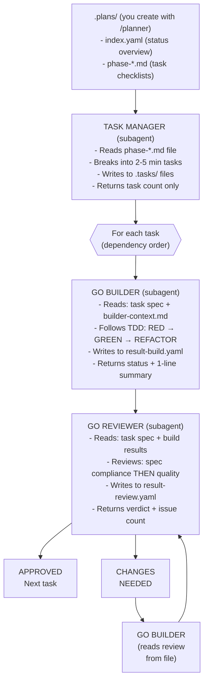

# Go Team - Coordinated Agent Workflow

## EXECUTION INSTRUCTIONS

**Follow the orchestration procedure in `references/orchestration.md`.**

**DO NOT read** `references/builder-context.md`, `references/reviewer-context.md`, or `references/examples.md`. Those are read by subagents only.

---

## Overview

The Go Team skill implements features you define. You provide the WHAT (plan phases), it handles the HOW (implementation).



### Context-Saving Design

All subagents communicate via `.tasks/` files. The orchestrator only reads
`.plans/index.yaml` for status - never source code or detailed results.
This keeps the orchestrator's context lean across many tasks and phases.

## Invocation

```bash
# Work on current phase (from index.yaml)
/go-team

# Work on a specific phase
/go-team phase=2

# Implement only a specific task (after initial planning)
/go-team task=3
```

### Running the Orchestrator on Sonnet (Recommended)

The orchestrator only reads status files and dispatches subagents - it doesn't write code.
Run your session on Sonnet to save costs while subagents use Opus for implementation:

```bash
claude --model sonnet
> /go-team
```

**Model assignments:**
- Orchestrator: Sonnet (session model)
- Task Manager: Sonnet
- Builder: Opus
- Reviewer: Opus

## Arguments

| Argument | Default | Description |
|----------|---------|-------------|
| `phase` | (current) | Specific phase number from `.plans/index.yaml` |
| `task` | (all) | Specific task number to implement (optional) |

---

## Plan Structure (.plans/)

Plans are created with `/planner` and stored in `.plans/`:

```
.plans/
├── index.yaml              # Lean status (orchestrator reads ONLY this)
├── phase-01-project-setup.md
├── phase-02-core-domain.md
└── ...
```

### index.yaml (Orchestrator reads this)

```yaml
project: "my-project"
current_phase: 2
phases:
  - id: 1
    name: "Project Setup"
    file: "phase-01-project-setup.md"
    status: completed
    progress: "4/4"
  - id: 2
    name: "Core Domain & Ports"
    file: "phase-02-core-domain.md"
    status: in_progress
    progress: "3/8"
```

### phase-*.md (Task Manager reads these)

```markdown
# Phase 2: Core Domain & Ports

## Tasks

- [x] Define `domain/command.go` (Command, CommandSpec types)
- [x] Define `domain/result.go` (ParseResult type)
- [ ] Define `ports/runner.go` (CommandRunner interface)
- [ ] Add unit tests for domain types

## Notes

- Follow hexagonal architecture
- Domain types should have no external dependencies
```

---

## Agents and Their Context

Each agent is a subagent dispatched via the Task tool. The orchestrator does NOT read these files - subagents read their own context.

| Agent | Role | Context File |
|-------|------|--------------|
| **Task Manager** | Parses phase file, explores codebase, creates task breakdown | `.plans/phase-*.md` |
| **Go Builder** | Implements tasks following TDD, hex architecture | `references/builder-context.md` |
| **Go Reviewer** | Combined review: spec compliance + code quality in one pass | `references/reviewer-context.md` |

See `references/orchestration.md` for exact dispatch templates and the coordination loop.

---

## Anti-Patterns

- Orchestrator reading source code, result files, or reference files (subagents do this)
- Orchestrator reading `.plans/phase-*.md` files (Task Manager does this)
- Orchestrator echoing or summarizing full subagent output (wastes context)
- Inlining plan content into dispatch prompts (reference by file path instead)
- Dispatching multiple builders in parallel (causes conflicts)
- Proceeding with CHANGES_NEEDED status
- Ignoring architecture violations
- Marking task complete with failing tests/lint

---

## Integration with Other Skills

- **planner**: Use `/planner` to create the `.plans/` structure before running `/go-team`
- **go-code-review**: Go Team follows a similar review pattern

---
> Converted and distributed by [TomeVault](https://tomevault.io/claim/curtbushko) — claim your Tome and manage your conversions.
<!-- tomevault:4.0:skill_md:2026-04-11 -->
