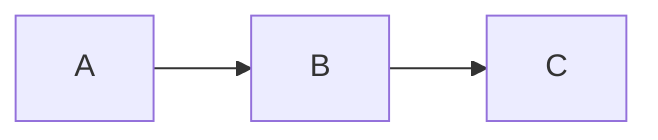

# Obsidian Spec Wiki

Create and manage specification wikis as Obsidian-compatible markdown. Feature areas capture both **what** the system does (specs) and **how** to build it (plans).

## Change Tracking (No LWW)

There is no LWW model. Specs, plans, and code are updated intentionally and together.

**Required change workflow:**
1. Open or reference a `tk` ticket (https://github.com/wedow/ticket).
2. Update the relevant feature spec/plan.
3. Update the code.
4. Add a changelog entry via `tinychange`.
5. Link the `tk` ticket and feature ID in the changelog entry or spec note.

**ADRs:** Store decisions in `docs/reference/decisions/` with Johnny Decimal IDs. Track updates like any other change.

## When to Use

- Creating new project specs or documentation
- Working with existing wikis using the open-questions format: `%% 🙋‍♂️ ... %%` / `%% 🤖 ... %%`
- User mentions "wiki", "spec", "feature", or "Obsidian"
- Need to document behavior for agent-driven code updates

## One-Shot Usage (LLM Quickstart)

When asked to use this skill, follow this sequence in a single pass:
1. Read `docs/AGENTS.md` (and `docs/handbook/README.md` if present).
2. Identify the structure: `features/` or `workstreams/` (treat workstreams as feature areas).
3. Use Johnny Decimal with two-digit decimals (`NN.NN`).
   - If the human gives you **only** an ID like `20.01` (or `2001`), treat it as a **handbook lookup**: locate and read the matching handbook doc and follow it.
4. Apply the open-questions format with `🙋‍♂️/🤖/✅` and block IDs.
5. Record changes via `tk` and `tinychange` (merge to `docs/changelog.md`).

## Wiki Discovery

Check for existing wiki in order:
1. `docs/` - Primary location
2. `docs/wiki/` - Nested variant
3. `wiki/` - Root alternative
4. `.plans/*/` - Legacy support

First match wins. **Always use `docs/` for new wikis.**

## Directory Structure

```
docs/
├── README.md              # Index with feature table (Johnny Decimal)
├── CLAUDE.md              # Symlink → AGENTS.md
├── AGENTS.md              # Actual agent instructions
├── changelog.md           # Keep a Changelog format (generated via tinychange)
├── handbook/              # Process/tooling docs (Johnny Decimal)
│   ├── 10-docs/           # Documentation workflows
│   ├── 50-testing/        # Testing workflows and verification
│   └── 80-agent-behaviour/# Agent autonomy and behaviour rules
├── plans/                 # Timestamped design/implementation plans (optional)
│   └── AGENTS.md          # Naming/quality rules for plans
├── postmortems/           # Incident postmortems and learnings
│   └── AGENTS.md          # Naming/structure rules for postmortems
├── reference/             # Architecture + research (Johnny Decimal)
│   └── decisions/         # ADRs (Johnny Decimal IDs)
├── features/              # OR workstreams/ (treat as feature areas)
│   └── NN-name/           # Johnny Decimal area (10-19, 20-29, ...)
│       ├── README.md      # Area summary + feature tables
│       ├── AGENTS.md      # Optional: area-specific agent rules
│       ├── NN.NN-spec.md  # Feature specs (what)
│       └── NN.NN-plan.md  # Implementation plans (how)
└── research/              # Oracle outputs (frozen)
```

**CLAUDE.md vs AGENTS.md convention:**
- `CLAUDE.md` = **symlink** to `AGENTS.md` (NOT a file containing `@AGENTS.md`)
- `AGENTS.md` = actual agent instructions and wiki operations

**Why symlink?** The `@filename` convention in file contents causes some tools to ignore the file entirely. A symlink ensures CLAUDE.md is always read as the actual AGENTS.md content.

**Key concepts:**
- **Feature areas** = Johnny Decimal functional areas (not temporal phases). Treat everything as a feature (product, infra, tooling, docs)
- **Specs** = behavior documents (what the system does)
- **Plans** = implementation documents (how to build it)
- **Research** = Oracle/Delphi outputs (frozen snapshots)

**Plan locations (both valid):**
- Feature-scoped plans live with the feature: `docs/features/NN-area/NN.NN-*-plan.md`
- Cross-cutting or timestamped plans live in `docs/plans/YYYY-MM-DD-HHMM-topic.md` (recommended when the plan touches many areas/files)

## Codebase AGENTS.md (Required)

Every top-level code or source folder must include an `AGENTS.md` that explains:
- The folder's purpose
- Feature area IDs it implements (link to `docs/features/`)
- Boundaries (what does NOT belong here)
- Primary entry points and tests

## Core Principles

### 1. Progressive Disclosure

Load only what's needed:

```
User asks about auth → Read features/10-core/README.md
User asks about login → Read features/10-core/10.01-auth-spec.md
User asks for overview → Read README.md only
```

Load only what each task requires.

### 2. Johnny Decimal Structure

Organize **features**, **handbook**, and **reference** docs using Johnny Decimal (johnnydecimal.com).

**Hard rules (avoid drift):**
- Use **two-digit decimals everywhere**: `NN.NN` (NOT `NN.N`, NOT `NN`, NOT `01` without `.01`).
- **Features:** folder `docs/features/NN-name/`, files `NN.NN-*-spec.md` and `NN.NN-*-plan.md`.
- **Handbook:** folder `docs/handbook/NN-area/`, files `NN.NN-topic.md`.
- **Reference:** folder `docs/reference/NN-area/`, files `NN.NN-topic.md`.

**Johnny lookup flow (common):**
- If the human says `20.01` (or `2001`) with no other context, interpret it as "open handbook section 20.01".
- Locate it by filename prefix (do not guess the topic slug):
  - `docs/handbook/**/20.01-*.md`
  - If multiple matches exist, pick the closest match by area/README context and link to the others.

Example:
```
docs/features/10-core/
├── README.md
├── 10.01-auth-spec.md
└── 10.01-auth-plan.md
```

**Example handbook/reference naming:**

```text
docs/handbook/20-git/
├── 20.01-methodic-rebase-merge.md
└── 20.04-post-merge-hygiene.md

docs/reference/01-design/
├── 01.07-game-design.md
└── 01.16-ticket-metadata-audit.md
```

**Johnny decimal drift to watch for:**
- Feature specs named `10.01` but reference docs named `01` (missing decimals) → fix reference docs to `01.NN-*`.
- Inconsistent padding (`1.01` vs `01.01`) → always pad to 2 digits.

**Migration: fixing `01`-only reference files:**
1. Create a `tk` ticket for the migration (renames touch many links).
2. Rename files to `NN.NN-topic.md` (choose an unused `.NN` in that area).
3. Update all Obsidian wiki links (`[[...]]`) that referenced the old filename/path.
4. Add `tinychange -k docs` entry for the rename.

**Migration rule:** If you rename docs for Johnny compliance, update all wiki links, record a `tk` ticket, and add a `tinychange` entry (usually `docs` kind).

**Quick audit (optional):**

```bash
# Find reference/handbook files missing an NN.NN prefix (heuristic)
rg --files docs/reference docs/handbook | rg -v "/[0-9]{2}\.[0-9]{2}-"

# Find feature docs missing an NN.NN prefix (heuristic)
rg --files docs/features | rg -v "/[0-9]{2}\.[0-9]{2}-"
```

### 3. Wiki Links Everywhere

All references use `[[wiki-links]]`. Broken links = sync signal.

```markdown
[[features/10-core/10.01-auth-spec|Login Flow]]
[[reference/architecture#auth-middleware|Auth Middleware]]
```

### 4. Task Tracking with Obsidian Comments

Track open questions using hidden comments with emoji prefixes and block references. Multi-line is allowed if it improves readability.

```markdown
%% 🙋‍♂️ Human question/task %% ^q-scope-descriptor

%% 🤖 Agent question waiting on human %% ^q-scope-question

%% ✅ Question here → Answer here %% ^q-scope-resolved
```

**CRITICAL: Separate each question with a blank line.** Obsidian treats consecutive lines as a single block; only the last block ID works.

**Format components:**
- `🙋‍♂️` = **human wrote this** → AGENTS SHOULD ACTION/ANSWER
- `🤖` = **agent wrote this** → AGENTS MUST SKIP (waiting for human)
- `✅` = **resolved** → no action needed
- `^q-{scope}-{descriptor}` = block ID for Obsidian navigation

**WHO ANSWERS WHAT:**
| Emoji | Who wrote it | Who should answer/action |
|-------|--------------|--------------------------|
| 🙋‍♂️ | Human | **Agent** (this is work for you!) |
| 🤖 | Agent | **Human** (skip this, you asked it) |
| ✅ | Resolved | **No one** |

**Conversation threading:** Questions can have inline replies. The **LAST emoji** determines whose turn:
```
%% 🤖 Should we cache? 🙋‍♂️ yes 🤖 what limit? %% ^q-cache
```
Last emoji is 🤖 → Human's turn. When `✅` → Done.

**Block ID convention:** `^q-{scope}-{descriptor}`
- `^q-auth-oauth` (auth feature, OAuth question)
- `^q-tabs-persist` (tabs feature, persistence question)

**Workflow:**
- Agent adds `🤖` question → human answers (agent skips these)
- Human answers → convert to `🙋‍♂️` (now actionable by agent) or `✅` (resolved)
- Human adds `🙋‍♂️` task → agent should action this
- Resolved format: `%% ✅ question → answer %% ^q-id`

**Linking to questions:**
```markdown
[[features/10-core/10.01-auth-spec#^q-auth-oauth|OAuth question]]
```

**Search in Obsidian:** Search for the emoji.

**Find via terminal:**
```bash
rg "🙋‍♂️" docs/                 # human tasks
rg "🤖" docs/                    # agent questions
rg "✅" docs/                    # resolved
rg "%% .*%%$" docs/              # missing block IDs (lines ending with %%)
```

**Agent responsibility:** Add block IDs to any question missing one. Generate the ID from the file's feature/spec and the question topic:
```
%% 🤖 how to handle OAuth? %%           → missing block ID
%% 🤖 how to handle OAuth? %% ^q-auth-oauth   → fixed
```

### 5. Changelog Protocol

Update `changelog.md` via `tinychange`. Do not hand-edit.

Setup (once):
```bash
tinychange init
```

Add entry (interactive):
```bash
tinychange
```

Add entry (scripted — preferred for agents):
```bash
tinychange -I new -k <fix|test|chore|security|feat|docs|refactor|perf> -m "Your change message" -a AUTHOR
```

Include the `tk` ticket ID in the message when available (e.g., "t-9cdc: Add feature X").

Merge entries into `docs/changelog.md`:
```bash
tinychange merge
```

Ensure `tinychange.toml` points to `docs/changelog.md` and uses Keep a Changelog format.

### 6. Task Tracking with tk

All non-trivial work is tracked via `tk` (https://github.com/wedow/ticket). A `tk` ticket is the execution-level unit of work.

**Small-change exemption** (all must be true): one file, 10 lines or fewer (excluding whitespace-only), and docs-only or comment/typo-only changes. Otherwise, create a ticket.

**One-liner to create + start + template a ticket:**

```bash
ID=$(tk create "Short description of work" -t task -p 1 --tags tag1,tag2 -d "Longer description") && tk start $ID && printf '\n## Goal\nWhat outcome must be achieved.\n\n## Acceptance Criteria\n- [ ] Observable completion conditions\n\n## Verification\n- [ ] Commands, checks, or manual steps\n\n## Worktree\n- .\n' >> .tickets/$ID.md
```

**Ticket body template:**

```markdown
## Goal
What outcome must be achieved.

## Scope
What is included.

## Out of Scope
What is explicitly excluded.

## Acceptance Criteria
- [ ] Observable completion conditions.

## Verification
- [ ] Commands, checks, or manual steps.

## Risks
- [ ] Risk and mitigation.

## Related Files
- `path/to/file`

## Links
- [label](url)

## Worktree
- `.` or `.worktrees/the-tree`
```

**Lifecycle:**
- `tk create` → `tk start <id>` → work → `tk close <id>` before committing
- Include ticket IDs in spec/plan headers and in `tinychange` messages
- `tk list` to see open tickets, `tk list --status closed` for closed

**Linking conventions:**
- Spec header includes related tk ticket IDs
- tinychange messages include tk ID (e.g., `t-9cdc: add salvage system`)

## Templates

### Spec File Template

```markdown
# NN.NN Spec Name

> **Feature Area:** [[../README|NN-Feature-Area-Name]]
> **Feature ID:** NN.NN
> **Ticket:** tk-000 (optional)

## Behavior

### Contract
- **Input:** description
- **Output:** description
- **Preconditions:** what must be true before
- **Postconditions:** what will be true after

### Scenarios
- When X happens → Y should occur
- When edge case → handle gracefully

## Decisions

### Assumptions
1. [Assumption] - [implication if wrong]
2. [Assumption] - [implication if wrong]

### Failure Modes
| Failure | Detection | Recovery |
|---------|-----------|----------|
| [scenario] | [how to detect] | [what to do] |

### ADR-1: Decision Title
- **Status:** Proposed | Accepted | Deprecated | Superseded
- **Context:** Why this decision was needed
- **Decision:** What we decided
- **Consequences:** What happens as a result
- **Alternatives:** What we considered and rejected

### Open Questions

%% 🤖 Question needing resolution? %% ^q-specname-topic

## Integration

### Dependencies
- [[path/to/spec|Display Name]] - what we need from it

### Consumers
- [[path/to/spec|Display Name]] - what uses us

### Diagram

```

### Plan File Template

```markdown
# NN.NN Plan Name

> **Feature Area:** [[../README|NN-Feature-Area-Name]]
> **Related Spec:** [[NN.NN-spec-name]] (optional)
> **Ticket:** tk-000 (optional)

## Goal
What this plan achieves.

## Prerequisites
- [ ] Dependency 1
- [ ] Dependency 2

## Implementation Steps

### Phase 1: [Name]
- [ ] Step 1
- [ ] Step 2

### Phase 2: [Name]
- [ ] Step 3
- [ ] Step 4

## Files to Modify
| File | Changes |
|------|---------|
| `path/to/file` | Description of changes |

## Testing Strategy
How to verify the implementation works.

## Risks & Mitigations
| Risk | Mitigation |
|------|------------|
| [What could go wrong] | [How to prevent/handle] |

## Open Questions

%% 🤖 Implementation question? %% ^q-planname-topic
```

### Bulletproof Plan Guidelines (Agent-Proof)

Plans are executed by agents that take everything literally. Ambiguity causes expensive mistakes. Use these rules to make plans unambiguous and self-checking.

**Rule 1: Naming consistency (CRITICAL)**
- Pick ONE name for each new type/table/function/file and use it everywhere.
- If you rename during planning, update the entire doc (do not leave old names around).

**Rule 2: Migration semantics (CRITICAL)**
- For any new thing that overlaps an existing thing, explicitly state one of:
  - REPLACES (old is removed)
  - EXTENDS (old stays, new adds behavior)
  - COEXISTS WITH (both exist; explain selection rules)

**Rule 3: State transitions (CRITICAL)**
- For every boolean/enum state, document ALL transitions:
  - trigger condition
  - which system/reducer executes it
  - side effects (what else changes)

**Rule 4: Ownership (CRITICAL)**
- If touching shared state (DB rows, physics-owned state, caches), state WHO OWNS IT and HOW it may be modified.
- Include a guardrail: "NEVER mutate X directly; always go through Y".

**Rule 5: Error paths (required)**
- List failure conditions and required cleanup/rollback for each.

**Rule 6: Concrete file list (required)**
- List EVERY file to create/modify/delete.
- For modified files: list the exact functions to change and what changes.

**Rule 7: Tests (required)**
- Name test cases, describe assertions, and specify file locations.

**Rule 8: Danger Dragons (required)**
- Add an explicit "how it should NOT work" section listing common mistakes.
- Include the WHY (what breaks / what incident it prevents).

**Plan checklist (before execution):**
- [ ] Terminology section exists and is consistent
- [ ] Migration semantics stated for every overlapping construct
- [ ] State transition table exists for every state field
- [ ] Error paths listed
- [ ] File list is complete
- [ ] Test cases are named
- [ ] Danger Dragons section exists

**Suggested plan add-ons (drop into any plan):**

```markdown
## Terminology
- `ThingA`: definition
- `ThingB`: definition

## Migration
- `OldThing` is REPLACED by `NewThing`.
- References to `OldThing` are updated in: `path/a`, `path/b`.

## State Transitions
| From | To | Trigger | Owner/System | Side Effects |
|------|----|---------|--------------|--------------|
| ...  | ...| ...     | ...          | ...          |

## Error Paths
| Condition | Detection | Response | Cleanup |
|----------|-----------|----------|---------|

## Danger Dragons (How it should NOT work)
- ❌ Don't do X
  - WHY: breaks Y
```

### Feature Area README Template

```markdown
# NN Feature Area Name

> Brief description of what this feature area covers.

## Goal
What this feature area achieves.

## Specs

| Spec | Description | Status |
|------|-------------|--------|
| [[NN.NN-spec-name]] | Brief description | Status |
| [[NN.NN-spec-name]] | Brief description | Status |

## Plans

| Plan | Description | Status |
|------|-------------|--------|
| [[NN.NN-plan-name]] | Implementation approach | Status |

## Shared Decisions

ADRs that apply to all specs in this feature area:
- **Decision:** Brief summary

## Integration Points

This feature area connects to:
- [[../20-other-area/README|Other Feature Area]] - how
```

### CLAUDE.md Setup (Symlink)

CLAUDE.md should be a **symlink** to AGENTS.md, not a file with content:

```bash
# From within docs/ directory
ln -s AGENTS.md CLAUDE.md
```

This ensures CLAUDE.md and AGENTS.md always have identical content. All actual instructions go in AGENTS.md.

### AGENTS.md Template

Agent instructions belong here:

```markdown
# Agent Instructions: [Project Name]

[Project-specific rules here...]

## 00.00 Johnny Lookup

If the human gives you simply an ID like `20.01` (or `2001`), treat it as a **handbook call**.

- Locate and read the matching handbook doc: `docs/handbook/**/20.01-*.md`
- Follow the instructions literally.
- If multiple matches exist, list them and pick the most relevant by context.

---

## Wiki Operations

**IMPORTANT:** When working with this wiki, use the `obsidian-plan-wiki` skill if available. It provides the full spec format and workflow patterns.

This documentation uses Obsidian vault format. Follow these patterns.

### Change Tracking (No LWW)

Specs, plans, and code are updated intentionally and together. Track changes via `tk` tickets and `tinychange` entries.

### Ticketing (tk)

All non-trivial work is tracked via `tk` (https://github.com/wedow/ticket).

**Small-change exemption** (all must be true): one file, ≤10 lines, docs-only or comment/typo-only. Otherwise, create a ticket.

Oneshot: `ID=$(tk create "Description" -t task -p 1 --tags tag1,tag2 -d "Details") && tk start $ID && printf '\n## Goal\n...\n' >> .tickets/$ID.md`

Lifecycle: `tk create` → `tk start <id>` → work → `tk close <id>` → commit.

Include ticket IDs in spec/plan headers and in `tinychange` messages.

When logging changes: `tinychange -I new -k <fix|feat|docs|refactor|...> -m "t-XXXX: message" -a AUTHOR`

### Progressive Disclosure

**Don't load everything.** Navigate in layers:

1. **Start at feature area README** - `features/NN-name/README.md`
   - Understand scope and current status
   - See which specs exist

2. **Read specific specs as needed** - `features/NN-name/NN.NN-*-spec.md`
   - Load only the spec you're implementing
   - Check "Integration" section for related specs

3. **Dive into reference docs for deep context** - `reference/` or `features/NN-name/reference/`

4. **Check research for background** - `research/topic/`

### Johnny Decimal Features

Feature areas use Johnny Decimal IDs with two-digit decimals. Specs/plans use `NN.NN-` prefixes.

### Open Questions System

See [[handbook/10-docs/10.01-open-questions-system]] for full spec.

**WHO ANSWERS WHAT:**
| Emoji | Who wrote it | Who should answer/action |
|-------|--------------|--------------------------|
| 🙋‍♂️ | Human | **Agent** (this is work for you!) |
| 🤖 | Agent | **Human** (skip this, you asked it) |
| ✅ | Resolved | **No one** |

### Updating Specs

**Before:** Read Assumptions and Failure Modes
**During:** Mark open questions resolved with `✅`, note discoveries
**After:** Update Success Criteria checkboxes, update README status

### Link Format

| Target | Format |
|--------|--------|
| Same directory | `[text](filename.md)` |
| Parent | `[text](../README.md)` |
| Cross-feature area | `[text](../20-name/README.md)` |
```

### Codebase AGENTS.md

Every top-level code or source folder must include an `AGENTS.md` that explains:
- The folder's purpose
- Feature area IDs it implements (link to `docs/features/`)
- Boundaries (what does NOT belong here)
- Primary entry points and tests

**Recommended AGENTS.md files for docs/ subfolders:**

| Path | Content |
|------|---------|
| `docs/reference/AGENTS.md` | Purpose, Johnny Decimal convention, citation rules |
| `docs/plans/AGENTS.md` | Purpose, naming convention (`YYYY-MM-DD-HHMM-topic.md`), plan quality rules |
| `docs/postmortems/AGENTS.md` | Purpose, naming convention, required sections |
| `docs/handbook/AGENTS.md` | Purpose, Johnny Decimal areas, update rules |

**Referencing postmortems from code AGENTS.md:**

When a past incident is relevant to a code folder, link the postmortem directly in that folder's AGENTS.md so agents encounter the lesson at the point of danger:

```markdown
> **Post-mortem:** [[postmortems/YYYY-MM-DD-topic]] — Brief description of what went wrong.
```

### Root README Template

```markdown
# Project Wiki

> **For Claude:** Start here. Read feature area READMEs for context, then specific specs as needed.

## Feature Areas

| # | Feature Area | Description |
|---|--------------|-------------|
| 10 | [[features/10-name/README\|Name]] | Description |

## Quick Links

- [[AGENTS]] - Rules for agents
- [[changelog]] - What changed and when
- [[handbook/README]] - Process and tooling handbook
- [[reference/architecture]] - System overview
- [[reference/decisions]] - ADRs

## Postmortems

Incident learnings (read these before repeating known mistakes):
- [[postmortems/YYYY-MM-DD-topic]] - Description

## Research

Oracle/Delphi outputs (frozen snapshots):
- [[research/topic]] - Description
```

## Workflow Patterns

### Creating a New Wiki

1. Create `docs/` directory structure
2. Write README.md with feature area table (Johnny Decimal)
3. Create AGENTS.md with actual agent instructions
4. Create CLAUDE.md as a symlink: `ln -s AGENTS.md CLAUDE.md`
5. Initialize changelog via `tinychange init`
6. Create feature area folders with README.md
7. Create `docs/plans/` with AGENTS.md (optional but recommended)
8. Create `docs/postmortems/` with AGENTS.md
9. Create `docs/handbook/` with at least `10-docs/` and `80-agent-behaviour/`
10. Add specs as needed

### Adding a Spec

1. Create `NN.NN-spec-name.md` in feature area folder
2. Add `tk` ticket in the header if applicable
3. Fill in Behavior (contract + scenarios)
4. Document Decisions (ADRs)
5. Map Integration (dependencies + consumers with wiki links)
6. Update feature area README table
7. Update changelog via CLI

### Adding a Plan

1. Create `NN.NN-plan-name.md` in feature area folder
2. Link to related spec if one exists
3. Add `tk` ticket in the header if applicable
4. Fill in Implementation Steps with checkboxes
5. List Files to Modify
6. Document Risks & Mitigations
7. Update feature area README plans table
8. Update changelog via CLI

### Research Workflow

When a `%% 🙋‍♂️ ... %%` or `%% 🤖 ... %%` comment needs research:

**Simple question:** Launch oracle agent
**Complex/uncertain:** Use Delphi (3 parallel oracles + synthesis)

Store results in `research/`, link from spec:
```markdown
%% ✅ question → see [[research/topic]] %% ^q-scope-topic
```

### Keeping Specs and Code in Sync

Specs and code are updated together. If you discover drift:
1. Open or link a `tk` ticket.
2. Decide the intended behavior (document in spec or ADR).
3. Update spec/plan and code to match that decision.
4. Add a `tinychange` entry.

### Updating Specs During Implementation

**Before:** Read the spec's Assumptions and Failure Modes.

**During implementation:**
- Add implementation notes to the spec
- Mark open questions as resolved: `%% ✅ Decided → [outcome] %%`
- Note any discovered failure modes

**After completing:**
- Update Success Criteria checkboxes
- Add commit hash if significant
- Update feature area README status if needed

## Link Format

Use relative markdown links (Obsidian-compatible):

| Target | Link Format |
|--------|-------------|
| Same directory | `[text](filename.md)` |
| Parent directory | `[text](../README.md)` |
| Subdirectory | `[text](reference/file.md)` |
| Cross-feature area | `[text](../20-context-menu/README.md)` |
| Heading anchor | `[text](file.md#section-name)` |

## When to Create New Documentation

| Situation | Action |
|-----------|--------|
| New feature area | Create new feature area directory |
| New behavior to document | Create numbered spec file (`NN.NN-spec.md`) |
| New implementation approach | Create numbered plan file (`NN.NN-plan.md`) |
| Deep technical topic | Add to `reference/` subdirectory |
| Research question | Use Oracle, save to `research/` |
| Feature-area-specific rules | Create `AGENTS.md` in feature area |
| New code/source folder | Create `AGENTS.md` in that folder |
| Agent mistake or system failure | Create postmortem in `postmortems/` |
| Recurring agent situation | Create handler in `handbook/80-agent-behaviour/` |
| Spec drifted from code | Run spec divergence audit |
| Tickets drifted from reality | Run ticket divergence audit |

## Best Practices

1. **Specs describe behavior** - What it does (contract, scenarios)
2. **Plans describe implementation** - How to build it (steps, files, risks)
3. **All references are wiki links** - Broken links signal sync issues
4. **Update changelog via CLI immediately** - Don't hand-edit
5. **One spec per feature/component** - Keep focused
6. **Research before deciding** - Use oracles for uncertain questions
7. **Optional AGENTS.md per feature area** - For scoped agent rules
8. **CLAUDE.md is a symlink** - Points to AGENTS.md via symlink

## Postmortems

When things go wrong — agent mistakes, system failures, expensive debugging loops — capture the incident so future sessions don't repeat it.

### Location and Naming

```
docs/postmortems/
├── AGENTS.md                                    # Rules for this directory
├── YYYY-MM-DD-HHMM-topic.md                    # Individual postmortems
```

**Naming:** `YYYY-MM-DD-HHMM-topic.md` (24h time, local). Example: `2026-02-01-0957-ts-refactor.md`

### Postmortem AGENTS.md

```markdown
# Agent Instructions: docs/postmortems

Purpose: incident postmortems and learnings.

Naming:
- `YYYY-MM-DD-HHMM-topic.md` (24h time, local).

Rules:
- Follow `/AGENTS.md` and `docs/AGENTS.md`.
- Include a `tk` ticket ID in the header when available.
- Cover summary, timeline, root cause, fix, and prevention.
```

### Postmortem Template

```markdown
# Post Mortem: [Title] ([Date])

## What Was Requested
What was the intended outcome.

## What Actually Happened
### Phase 1: [Name] (Good/Bad)
Chronological narrative of what occurred.

### Phase N: [Name]
Continue phases as needed.

## Root Causes
### 1. [Root Cause Title]
Explain the root cause with specifics. Include code examples showing the wrong vs right approach.

## Cost
- Compute/time spent
- Work lost or reverted
- Impact on schedule

## Lessons
1. **[Lesson title]** - Specific, actionable takeaway
2. **[Lesson title]** - Another takeaway

## Prevention
What changes to process, tooling, or rules prevent recurrence.
```

### When to Write a Postmortem

- Agent destroyed work through incorrect cleanup (deletion, revert)
- Agent bypassed existing systems (duplicated instead of reusing)
- Expensive debugging loop (>30 minutes on something avoidable)
- Feature shipped broken because verification was skipped
- Parallel agent coordination failure

### Referencing Postmortems

Link postmortems from the relevant AGENTS.md or spec to ensure agents encounter the lesson at the point of danger:

```markdown
## SpacetimeDB: Search Before You Implement (CRITICAL)

> **Post-mortem:** [[postmortems/2026-01-30-2352-npc-brain-velocity-bypass]] — Agent skipped codebase exploration, directly mutated velocity, broke physics.
```

## Agent Behaviour Rules

Define explicit behaviour expectations in the handbook. These prevent agents from defaulting to passive, task-following mode when autonomous work is needed.

### Location

```
docs/handbook/80-agent-behaviour/
├── 80.01-autonomous-work.md
├── 80.02-document-feature.md
├── 80.03-stale-trees.md          # (or other operational handlers)
```

### What Goes Here

Agent behaviour docs are **short, direct instructions** for recurring situations. They tell agents what to do without waiting for human direction.

| Doc | Purpose | Example Content |
|-----|---------|-----------------|
| `80.01-autonomous-work.md` | Set expectations for initiative | "Don't wait for permission to proceed to the next step. Complete the full unit of work." |
| `80.02-document-feature.md` | Handler: "document this" | "Document the feature in docs/, include all implementation details, ensure nothing is out of date." |
| `80.03-stale-trees.md` | Handler: worktree cleanup | "Walk through all worktrees, identify stale/unmerged/active branches, report status." |

### Writing Effective Agent Behaviour Docs

1. **Be direct.** These are orders, not suggestions.
2. **One handler per file.** Each doc covers one situation.
3. **Include the trigger.** What situation activates this instruction?
4. **Include the expected output.** What should the agent deliver?
5. **Keep them short.** 1-10 lines. If it's longer, it's a handbook entry, not a behaviour rule.

### Example: Autonomous Work

```markdown
## Autonomous
Complete the full unit of work. Do not stop at 60% because it's slow or hard.
Do not present partial results and ask if you should continue — finish the job.
```

### Example: Document Feature Handler

```markdown
Document this work/feature in `docs/` in `main`. Document it for other agents
as specifically as possible — include as many details as possible. Make sure
existing docs are not out of date.
```

## Spec and Ticket Divergence Audits

Over time, specs drift from code and tickets drift from reality. Detect and fix this.

### Spec Divergence Audit

**Trigger:** Human requests audit, or on a regular cadence (e.g., end of cycle).

**Process:**
1. Use subtask agents to explore divergence between specs in `docs/features/` and the actual codebase.
2. For each spec, check: does the code match the documented behavior?
3. If code has moved beyond the spec → update spec.
4. If spec describes behavior not yet implemented → note as planned.
5. If spec and code contradict → flag for human decision.

**Agent instruction file:**
```markdown
# docs/handbook/15-planning/15.02-spec-divergence.md

## Instructions:
- Use subtask agents to explore the current state of divergence between spec and codebase.
```

### Ticket Divergence Audit

**Trigger:** Human requests audit, or ticket count gets unwieldy.

**Process:**
1. Use subtask agents to explore the current state of tickets (`open` and `in_progress`) vs what is in the codebase.
2. If code shows work done but ticket is open → `tk close <ticket-id>`.
3. If code is in progress → mark ticket as `in_progress` with a note.
4. If ticket is indecipherable → mark `closed`.

**Agent instruction file:**
```markdown
# docs/handbook/15-planning/15.02-ticket-divergence.md

## Instructions:
- Use subtask agents to explore the current state of tickets `open` and `in-progress` vs what is in the codebase.
  - If code shows work done but ticket is open → `tk close <ticket-id>`
  - If code is in progress → mark ticket as `in-progress` with a note
  - If ticket is indecipherable → mark `closed`
```

## Video-Based NHITL Testing

When E2E tests check state labels but not actual behaviors, combine video recording with visual analysis for true verification.

### The Problem

A test can "pass" while the feature is broken. State assertions (`action === 'Engage'`) don't verify behavior (projectiles fired, damage dealt).

### The Solution: Visual Verification Loop

```
1. Run E2E test with video recording enabled
2. Test completes (pass or fail)
3. Extract frames from test-results/*.webm using video-explorer skill
4. Agent analyzes frames visually:
   - "Frame 00:03: Label shows 'Engage'"
   - "Frame 00:03-00:08: No projectiles visible"
   - "Diagnosis: State set but action not triggering"
5. Fix the actual issue (not just make the test pass)
6. Re-run and verify visually
```

### Configuration

Enable video recording in your E2E test config:

```typescript
// e2e/playwright.config.ts (or equivalent)
use: {
  video: 'on',  // Record ALL tests, not just failures
}
```

### Video Analysis Commands (video-explorer)

```bash
# Overview of test video
videx overview test-results/<test-name>/video.webm 1 480

# Zoom into specific moment
videx range test-results/<test-name>/video.webm 0:03-0:08 --fps=5

# Single frame detail
videx zoom test-results/<test-name>/video.webm 0:05
```

### What to Look For

Build a lookup table for your domain:

| Behavior | Visual Indicator |
|----------|------------------|
| Action triggered | Expected visual effect appears |
| Entity moving | Position changes across frames |
| State change | UI element updates |
| Damage/health | Progress bar changes |

### Handbook Entry Template

```markdown
# NN.NN Video-Based NHITL Testing

## Problem
E2E tests check state labels but not actual behaviors.

## Solution: Visual Verification Loop
[Flow diagram as above]

## Configuration
[Test config snippet]

## What to Look For
[Domain-specific visual indicator table]
```

### Benefits

1. **True behavior verification** — see what actually happens, not just state changes
2. **NHITL debugging** — agent watches the video, finds problems autonomously
3. **Evidence-based fixes** — know exactly what's broken before coding
4. **Regression detection** — visual diff between expected and actual behavior

## Refactors: Create + Wire + Delete + Run

Refactoring is **replacement**, not duplication. A refactor unit of work is not complete until the new code is **imported/used**, the old code is **deleted**, and the system is **verified by running**.

### The Unit of Work (Non-Negotiable)

For any extraction/move:
1. Create the new file/location (if needed)
2. Move the implementation
3. Update ALL consumers to import/use the new location (**wire it**)
4. Delete the old implementation
5. Verify (typecheck/tests/run) BEFORE moving on

### “Not Imported” Protocol

- New code with 0 incoming imports is **unfinished work**, not dead code.
- The response is to **wire it in**, not delete it.

Quick check (heuristic):

```bash
# For a new file name, verify at least one incoming import exists
rg "from .*<module>" docs/ src/ || true
```

### Parallelization Rule

- If B depends on A (B imports A), B cannot be done in parallel with A.
- Prefer **sequential** refactor steps; parallelize only truly independent modules.

### Refactor Verification (Minimum)

- Typecheck/lint/tests as applicable
- Run the app/system and verify the user-facing behavior (not only compilation)
- If you can’t run it, record that explicitly in the ticket Verification section

### Session Handoff (When Refactor Spans Sessions)

Write a short handoff note in the ticket or a plan file:
- What was created
- What was wired
- What is NOT wired yet (do not delete)
- Next steps

---
> Converted and distributed by [TomeVault](https://tomevault.io/claim/cygnusfear) — claim your Tome and manage your conversions.
<!-- tomevault:4.0:skill_md:2026-04-13 -->
