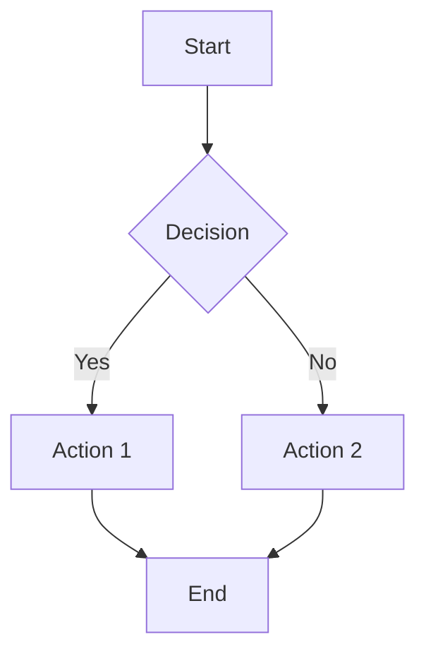
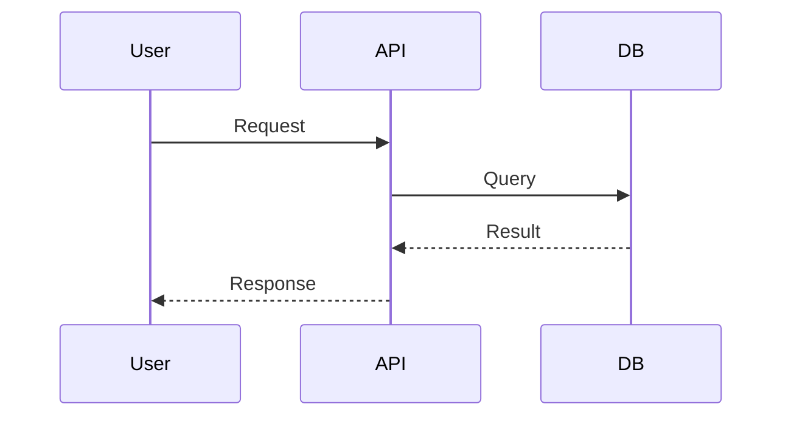
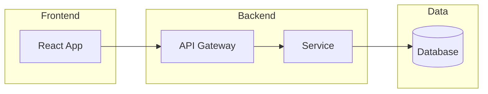

# Documentation Standards

## Core Principles

1. **Audience-First**: Write for your reader, not yourself
2. **Keep Current**: Outdated docs are worse than no docs
3. **Show, Don't Just Tell**: Use examples and diagrams
4. **Consistent Format**: Follow established patterns

## Hard Requirements (Writing)

- **No AI slop** - remove filler, keep docs concrete and task-oriented
- **No em dashes/en dashes** - use hyphens (`-`) instead

## Voice

Prefer neutral/imperative phrasing - avoid "you/your" in professional docs.
Canonical guidance: `rules/810-documentation.mdc`.

## Diataxis Quick Guide

Use one primary documentation mode per page:

- **Tutorial** - learning by doing
- **How-to guide** - task completion
- **Reference** - factual lookup
- **Explanation** - concepts and rationale

Canonical Diataxis guidance lives in `rules/810-documentation.mdc`. Keep this skill concise and link back to the rule instead of duplicating detailed standards.

## README Structure

```markdown
# Project Name

Brief description of what this project does.

## Features

- Feature 1
- Feature 2

## Installation

```bash
npm install my-project
```

## Quick Start

```javascript
import { thing } from 'my-project';
thing.doSomething();
```

## Documentation

Link to full docs.

## Contributing

Link to CONTRIBUTING.md.

## License

MIT - See LICENSE.

```

## Markdown Best Practices

### Headers
- Use `#` hierarchy (don't skip levels)
- Keep headers concise
- Use title case for headings, preserving established acronyms and product names

### Code Blocks
````markdown
```python
def hello():
    print("Hello, World!")
```

````

### Lists
```markdown
- Unordered item
- Another item
  - Nested item

1. Ordered item
2. Another item
```

### Links and References
```markdown
[Link text](https://acme.com)
[Reference link][1]

[1]: https://acme.com
```

### Tables
```markdown
| Header 1 | Header 2 |
|----------|----------|
| Cell 1   | Cell 2   |
```

## Interactive vs static diagrams

- **Static (Markdown):** Mermaid in this skill and in `rules/800-markdown.mdc`.
- **Interactive (React SPA):** `@xyflow/react` patterns, playbook, and rule **`rules/815-reactflow-diagrams.mdc`** - use skill **`skills/reactflow-architecture-diagrams/`**. See [references/static-vs-interactive.md](../reactflow-architecture-diagrams/references/static-vs-interactive.md) for a short comparison table.

## Mermaid Diagrams

### Flowchart


### Sequence Diagram


### Architecture Diagram


## Technical Writing Tips

1. **Use active voice**: "The function returns a value" not "A value is returned"
2. **Be concise**: Remove unnecessary words
3. **Define acronyms**: Spell out on first use
4. **Use present tense**: "The function adds" not "The function will add"
5. **Include examples**: Show, don't just tell

## Detailed References

- **React Flow (interactive canvases)**: See `skills/reactflow-architecture-diagrams/SKILL.md` and `rules/815-reactflow-diagrams.mdc`
- **Markdown & Mermaid**: See [references/markdown-mermaid.md](references/markdown-mermaid.md)
- **Technical Writing**: See [references/technical-writing.md](references/technical-writing.md)
- **Open Source**: See [references/open-source.md](references/open-source.md)

---
> Source: [d-padmanabhan/agent-engineering-handbook](https://github.com/d-padmanabhan/agent-engineering-handbook) — distributed by [TomeVault](https://tomevault.io).
<!-- tomevault:4.0:skill_md:2026-05-22 -->
