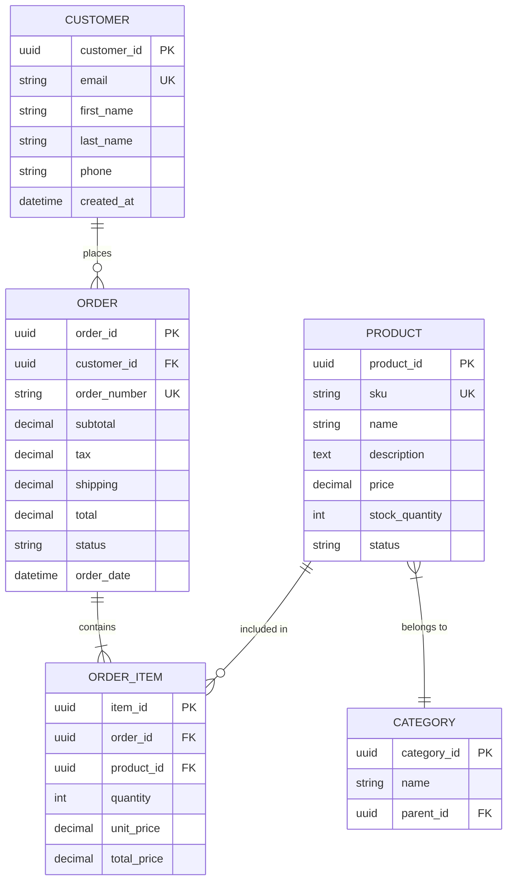
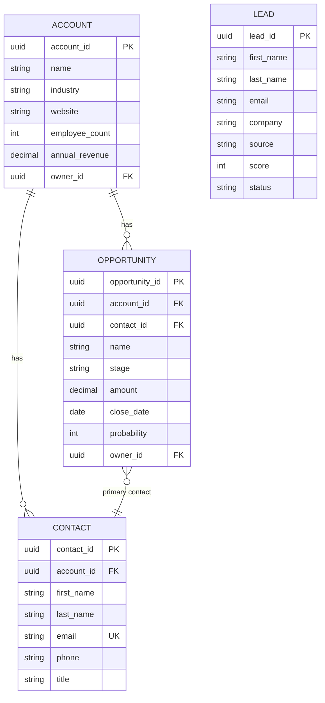

# Data Modeling Skill

## Purpose
Create clear data models that document data structures, relationships, and business rules for system design and development.

## When to Use
- Designing new database structures
- Documenting existing data for analysis
- Defining data requirements in FRS
- Integration design between systems
- Data migration planning

## Data Modeling Concepts

### Entity Relationship Diagram (ERD)

**Entities**: Objects/things we store data about (e.g., Customer, Order, Product)
**Attributes**: Properties of entities (e.g., customer_name, order_date)
**Relationships**: How entities relate to each other

### Relationship Types

**One-to-One (1:1)**
Example: User ↔ UserProfile
- One user has exactly one profile
- One profile belongs to exactly one user

**One-to-Many (1:N)**
Example: Customer → Orders
- One customer can have many orders
- One order belongs to one customer

**Many-to-Many (M:N)**
Example: Products ↔ Categories
- One product can be in many categories
- One category can have many products
- Requires junction/bridge table

### Cardinality Notation (Crow's Foot)

```
||──────|| : One and only one (1:1)
||──────<  : One-to-Many (1:N)
>──────<   : Many-to-Many (M:N)
o|──────<  : Zero or one to Many
||──────o< : One to Zero or Many
```

## ERD Examples

### E-commerce ERD (Mermaid)


### CRM ERD


## Data Dictionary

### Template
| Attribute | Data Type | Size | Required | Default | Description | Validation |
|-----------|-----------|------|----------|---------|-------------|------------|
| customer_id | UUID | - | Yes | Auto-gen | Unique identifier | UUID format |
| email | VARCHAR | 255 | Yes | - | Customer email | Valid email |
| status | ENUM | - | Yes | 'active' | Account status | active, inactive, suspended |

### Example: Order Entity
| Attribute | Type | Size | Required | Default | Description | Rules |
|-----------|------|------|----------|---------|-------------|-------|
| order_id | UUID | - | Yes | Auto | Primary key | Unique |
| order_number | VARCHAR | 20 | Yes | Generated | Display number | Format: ORD-YYYYMMDD-XXXX |
| customer_id | UUID | - | Yes | - | FK to Customer | Must exist |
| order_date | DATETIME | - | Yes | NOW() | When order placed | Cannot be future |
| status | ENUM | - | Yes | 'pending' | Order status | pending, processing, shipped, delivered, cancelled |
| subtotal | DECIMAL | 10,2 | Yes | 0.00 | Sum of items | >= 0 |
| tax | DECIMAL | 10,2 | Yes | 0.00 | Calculated tax | >= 0 |
| shipping_cost | DECIMAL | 10,2 | Yes | 0.00 | Shipping fee | >= 0 |
| total | DECIMAL | 10,2 | Yes | - | Final total | = subtotal + tax + shipping |
| shipping_address | JSON | - | Yes | - | Delivery address | Valid address |
| billing_address | JSON | - | Yes | - | Billing address | Valid address |
| notes | TEXT | - | No | NULL | Order notes | Max 2000 chars |
| created_at | DATETIME | - | Yes | NOW() | Record created | Immutable |
| updated_at | DATETIME | - | Yes | NOW() | Last modified | Auto-update |

## Normalization

### First Normal Form (1NF)
- Eliminate repeating groups
- Each cell contains single value
- Each record is unique

❌ Bad: customer_phones = "123-456, 789-012"
✅ Good: Separate phone table with customer_id FK

### Second Normal Form (2NF)
- Meet 1NF
- No partial dependencies (all non-key attributes depend on entire primary key)

### Third Normal Form (3NF)
- Meet 2NF
- No transitive dependencies (non-key attributes don't depend on other non-key attributes)

❌ Bad: Order has customer_email (depends on customer_id, not order)
✅ Good: Get customer_email via Customer table join

## Domain-Specific Data Patterns

### E-commerce
- Products with variants (SKU per variant)
- Hierarchical categories
- Shopping cart → Order transition
- Address normalization
- Price history tracking

### ERP
- Chart of Accounts structure
- Multi-company data isolation
- Master data (customer, vendor, product)
- Transaction tables with journals
- Audit trails

### CRM
- Lead → Contact → Account conversion
- Activity logging (calls, emails, meetings)
- Opportunity → Quote → Order pipeline
- Campaign → Member → Response tracking

### CDP
- Customer identity resolution
- Event/behavioral data (time-series)
- Profile attributes (unified)
- Segment membership
- Consent tracking

## Best Practices

✅ **Do**:
- Use consistent naming conventions (snake_case)
- Include audit fields (created_at, updated_at, created_by)
- Define primary keys explicitly
- Document foreign key relationships
- Include data types and constraints
- Consider soft deletes vs. hard deletes
- Plan for data growth

❌ **Don't**:
- Store calculated values (unless for performance)
- Use ambiguous names
- Skip documentation
- Ignore data validation rules
- Forget about NULL handling

## Tools

- **Figma**: Visual ERD design
- **Mermaid**: Code-based diagrams in docs
- **dbdiagram.io**: Quick ERD creation
- **Lucidchart**: Professional diagrams

## Next Steps

After data modeling:
1. Review with technical team
2. Include in FRS documentation
3. Create migration scripts
4. Plan data validation rules
5. Design API contracts based on data model

## References

- Database Normalization (1NF, 2NF, 3NF)
- Entity Relationship Modeling
- Data Dictionary Standards

---
> Converted and distributed by [TomeVault](https://tomevault.io/claim/danhvb) — claim your Tome and manage your conversions.
<!-- tomevault:4.0:skill_md:2026-04-14 -->
