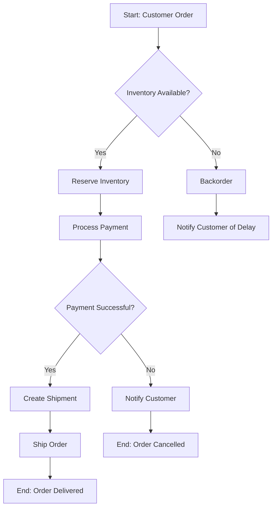
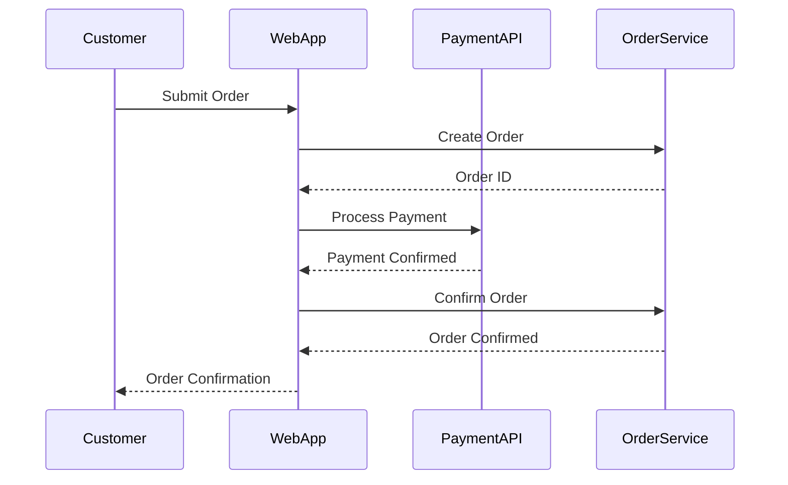
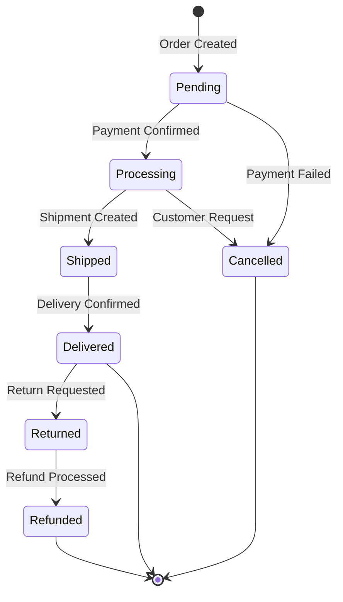

# Process Mapping Skill

## Purpose
Create clear, professional business process diagrams that visualize workflows, identify inefficiencies, and communicate processes to stakeholders and development teams.

## When to Use
- Documenting current state (As-Is) processes
- Designing future state (To-Be) processes
- Identifying process gaps and inefficiencies
- Communicating workflows to stakeholders
- System design and integration planning

## Process Mapping Types

### 1. Flowcharts
**Best for**: Simple, linear processes
**Symbols**:
- ⬭ Oval: Start/End
- ▭ Rectangle: Process/Activity
- ◇ Diamond: Decision
- ▱ Parallelogram: Input/Output
- → Arrow: Flow direction

**Example - Order Processing**:
```
Start → Receive Order → Validate Order → [Valid?]
                                           ├── Yes → Process Payment → [Paid?]
                                           │                            ├── Yes → Ship Order → End
                                           │                            └── No → Notify Customer → End
                                           └── No → Reject Order → End
```

### 2. BPMN 2.0 (Business Process Model and Notation)
**Best for**: Complex processes with multiple participants
**Key Elements**:
- **Events**: Start (○), Intermediate (◎), End (◉)
- **Activities**: Tasks (▭), Sub-processes (▭+)
- **Gateways**: Exclusive (◇×), Parallel (◇+), Inclusive (◇○)
- **Swimlanes**: Pools and lanes for different actors

**Example - Invoice Approval BPMN**:
```
Pool: Invoice Approval Process
├── Lane: Requester
│   ├── Start Event
│   ├── Task: Submit Invoice
│   └── Task: Revise Invoice (if rejected)
├── Lane: Manager
│   ├── Task: Review Invoice
│   └── Gateway: Approve? (Yes/No)
├── Lane: Finance
│   ├── Task: Process Payment
│   └── End Event: Invoice Paid
```

### 3. Swimlane Diagrams
**Best for**: Cross-functional processes showing responsibilities
**Structure**: Horizontal or vertical lanes for each role/department

**Example - Customer Support**:
```
| Customer        | Support Agent    | Technical Team   | Manager         |
|-----------------|------------------|------------------|-----------------|
| Submit Ticket   |                  |                  |                 |
|       ↓         |                  |                  |                 |
|                 | Receive & Triage |                  |                 |
|                 |       ↓          |                  |                 |
|                 | [Can Resolve?]   |                  |                 |
|                 | Yes: Resolve     |                  |                 |
|                 | No: ────────────→| Investigate      |                 |
|                 |                  |       ↓          |                 |
|                 |                  | [Need Escalation?]               |
|                 |                  | No: Fix & Return |                 |
|                 |                  | Yes: ───────────→| Approve Fix    |
|                 | Update Customer  |←─────────────────|                 |
| Receive Update  |←─────────────────|                  |                 |
```

### 4. Value Stream Mapping
**Best for**: Lean process improvement, identifying waste
**Elements**: Process steps, wait times, value-add vs. non-value-add

## Process Levels

### L0: Context Diagram
- High-level view of the entire system
- Shows external entities and interactions
- One page, executive summary level

### L1: Process Area View
- Major process areas/modules
- Shows key inputs/outputs between areas
- 5-10 major processes

### L2: Detailed Process Flow
- Step-by-step activities within a process
- Includes decisions and branches
- Shows roles responsible

### L3: Procedural Steps
- Detailed procedures/work instructions
- Screen-by-screen guidance
- Used for training/SOPs

## Mermaid Diagrams (Code-based)

### Flowchart Example


### Sequence Diagram Example


### State Diagram Example (Order Status)


## Domain-Specific Process Examples

### E-commerce: Checkout Flow
```
Start → View Cart → Enter Shipping → Select Shipping Method → 
Enter Payment → Review Order → Place Order → 
[Payment OK?] → Yes: Confirmation → End
              → No: Payment Error → Retry/Cancel
```

### ERP: Purchase-to-Pay (P2P)
```
Requisition → Approval Workflow → Purchase Order → 
Goods Receipt → Invoice Receipt → 3-Way Match → 
[Match OK?] → Yes: Payment → End
           → No: Exception Handling
```

### CRM: Lead-to-Close
```
Lead Capture → Lead Scoring → [Qualified?] → 
Yes: Create Opportunity → Discovery → Proposal → 
Negotiation → [Won?] → Yes: Close → Account Created
                     → No: Lost Analysis
```

### CDP: Data Activation Flow
```
Data Collection → Identity Resolution → Profile Unification → 
Segmentation → Audience Building → Channel Activation → 
Campaign Execution → Response Tracking → Analytics
```

## Best Practices

### Design Principles
✅ **Do**:
- Keep it simple and readable
- Use consistent notation throughout
- Include clear start and end points
- Show decision points clearly
- Document exceptions and error paths
- Use swimlanes for multi-role processes
- Add annotations for complex steps
- Version control diagrams

❌ **Don't**:
- Overcomplicate with too many details
- Mix notation styles
- Forget exception/error flows
- Skip validation with stakeholders
- Create without understanding the process first

### Validation
- Walk through with process owners
- Verify with actual users
- Test with real scenarios
- Document assumptions
- Get stakeholder sign-off

## Tools

### Figma
- Design custom process diagrams
- Use component libraries for BPMN symbols
- Share for collaboration

### Mermaid (Code-based)
- Embed in markdown documentation
- Version control friendly
- Quick diagrams in Lark/Notion

### Lucidchart/Miro
- Professional BPMN diagrams
- Real-time collaboration
- Template libraries

## Process Analysis Tips

1. **Identify bottlenecks**: Where do things slow down?
2. **Find redundancies**: What's duplicated?
3. **Spot handoff issues**: Where do things fall between cracks?
4. **Question value**: Does this step add value?
5. **Consider automation**: What can be automated?

## Next Steps

After process mapping:
1. Gap analysis (see `gap-analysis` skill)
2. Process optimization recommendations
3. Requirements for system changes
4. UAT scenarios based on process flows

## References

- BPMN 2.0 Specification (OMG)
- Value Stream Mapping (Lean)
- Business Process Mapping best practices

---
> Converted and distributed by [TomeVault](https://tomevault.io/claim/danhvb) — claim your Tome and manage your conversions.
<!-- tomevault:4.0:skill_md:2026-04-15 -->
