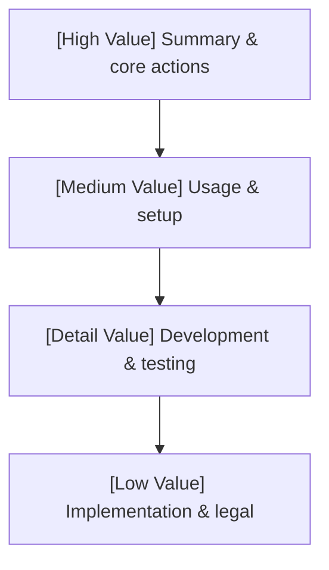

# Inverted pyramid documentation model

This skill provides editorial guidelines for structuring technical articles, README files, and documentation using the **inverted pyramid** model. It ensures you place high-value information at the beginning. This allows readers to extract value immediately, with details cascading downward.

---

## 1. Trigger conditions

Activate this skill when you:
- Structure, refactor, or write project `README.md` files.
- Draft technical user guides, API manuals, or tool instructions.
- Audit existing documentation for scannability and reading efficiency.

---

## 2. Core philosophy: Information cascading

The **inverted pyramid** structure places the most critical, high-impact, or actionable information at the top. Secondary user details, operational steps, and low-impact implementation details follow:

---

## 3. README structural sequence

For `README.md` and user-facing project guides, documents **must** follow this exact sequence:

1. **Title and high-impact summary**: A short, active hook explaining the project, the problem it solves, and its core capabilities.
2. **Prescribed actions**: Immediate, copy-paste installation or execution commands. This is the highest-value action a user can take.
3. **User documentation and usage guides**: Clear details on tools, prompts, command-line flags, and standard user workflows.
4. **Developer instructions**: How to compile locally, execute test suites, run linters, and trigger release hooks.
5. **Development documentation**: In-depth technical architecture, package structures, and internal mechanics.
6. **Legal and compliance**: Copyright notices, license specifications, and support boundaries. This is the least active piece of information.

---

## 4. Writing principles

- **Lead with action**: don't hide installation instructions behind paragraphs of architectural theory. Let the user run the tool first.
- **Vary reading depth**: Ensure the document caters to three reading styles:
  - *The scanner*: Reads the title and copies the quick-start command in seconds.
  - *The operator*: Reads the usage tables and workflow guides in minutes.
  - *The contributor*: Reads the build and architecture details in depth.
- **Sentence case headings**: Always keep headings in sentence case, prioritizing high-value nouns first.

---
> Source: [danicat/speedgrapher](https://github.com/danicat/speedgrapher) — distributed by [TomeVault](https://tomevault.io).
<!-- tomevault:4.0:skill_md:2026-06-19 -->
