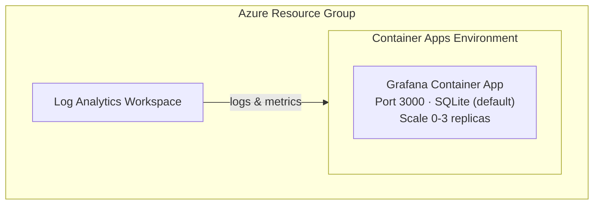

# Grafana Azure Deployment Skill

Deploy Grafana OSS to Azure Container Apps using Bicep and Azure Developer CLI (azd).

> **Reproducibility Verified**: This deployment has been tested multiple times from scratch. Deploy time: ~2 minutes.

## Overview

Grafana is an open-source observability platform for metrics, logs, and traces visualization. This skill deploys Grafana OSS (not Azure Managed Grafana) to Azure Container Apps.

## Critical: Infrastructure Generation

This skill provides Grafana-specific configuration only. Infrastructure (Bicep, azure.yaml) should be generated fresh each time by the official `azure-prepare` → `azure-validate` → `azure-deploy` pipeline. Do NOT rely on pre-existing infra code.

## Critical: Subscription Context

**ALWAYS set AZURE_SUBSCRIPTION_ID explicitly before running `azd up`:**
```bash
azd env set AZURE_SUBSCRIPTION_ID "$(az account show --query id -o tsv)"
```
Without this, azd and Azure MCP tools will fail silently or produce incomplete deployments. The `azure_deploy_app_logs` tool also requires subscription context.

## Critical: Bicep Output Naming

Bicep outputs MUST use SCREAMING_SNAKE_CASE (e.g., `GRAFANA_URL`, `GRAFANA_FQDN`) for azd to map them into environment values. Without this, `azd env get-value` returns "key not found".

## Architecture



## Quick Start (Verified)

```bash
# 1. Register providers (one-time per subscription)
az provider register --namespace Microsoft.App
az provider register --namespace Microsoft.OperationalInsights

# 2. Create environment
azd env new my-grafana-env

# 3. Set required variables
azd env set AZURE_SUBSCRIPTION_ID "$(az account show --query id -o tsv)"
azd env set AZURE_LOCATION "westus"
azd env set GRAFANA_ADMIN_PASSWORD "$(openssl rand -base64 16)"

# 4. Deploy (~2 minutes)
azd up

# 5. Access Grafana
azd env get-value GRAFANA_URL
# Login: admin / <your GRAFANA_ADMIN_PASSWORD>
```

**Deployment time breakdown:**
- Resource Group: ~4s
- Log Analytics: ~25s
- Container Apps Environment: ~38s
- Grafana Container App: ~10s
- **Total: ~2 minutes**

## Environment Variables

Grafana is configured via environment variables in the Container App:

| Variable | Description | Value |
|----------|-------------|-------|
| `GF_SECURITY_ADMIN_USER` | Admin username | From parameter |
| `GF_SECURITY_ADMIN_PASSWORD` | Admin password | From secret |
| `GF_SERVER_HTTP_PORT` | HTTP port | 3000 |
| `GF_SERVER_ROOT_URL` | Public URL | Auto-configured |
| `GF_AUTH_ANONYMOUS_ENABLED` | Anonymous access | false |

See [config/environment-variables.md](config/environment-variables.md) for full list.

## Health Probes

| Type | Path | Port | Interval |
|------|------|------|----------|
| Liveness | /api/health | 3000 | 30s |
| Readiness | /api/health | 3000 | 10s |
| Startup | /api/health | 3000 | 10s (30 failures allowed) |

## Outputs

After deployment:
- **GRAFANA_URL**: Public HTTPS URL
- **GRAFANA_FQDN**: Container App FQDN
- **GRAFANA_ADMIN_USER**: Admin username

## Verification

```bash
# Health check
curl https://<GRAFANA_FQDN>/api/health

# Admin login test
curl -u admin:YourPassword https://<GRAFANA_FQDN>/api/org
```

## Scaling

- **Min replicas**: 0 (scale to zero when idle)
- **Max replicas**: 3
- **Scaling rule**: HTTP concurrent requests (10 per replica)

## Storage Considerations

By default, Grafana uses SQLite which stores data in the container. For production:
1. Add Azure Files for persistent storage
2. Or use PostgreSQL/MySQL backend

## Tear Down

```bash
azd down --force --purge
```

**Note:** Teardown takes 3-5 minutes (Container Apps environment deletion is slow).

## Azure MCP Tools

Use these Azure MCP Server tools for Grafana deployments:

| Tool | When to Use |
|------|-------------|
| `azure_bicep_schema` | Get latest schemas for `Microsoft.App/containerApps` and `Microsoft.App/managedEnvironments` |
| `azure_deploy_architecture` | Generate Mermaid architecture diagrams for the Grafana deployment |
| `azure_deploy_plan` | Validate the deployment plan before `azd up` — use `target=ContainerApp` |
| `azure_deploy_app_logs` | Fetch container logs from Log Analytics when troubleshooting startup or 502 issues |

## Troubleshooting

See [troubleshooting.md](troubleshooting.md) for common issues and lessons learned.

---
> Converted and distributed by [TomeVault](https://tomevault.io/claim/danwahlin) — claim your Tome and manage your conversions.
<!-- tomevault:4.0:skill_md:2026-04-13 -->
