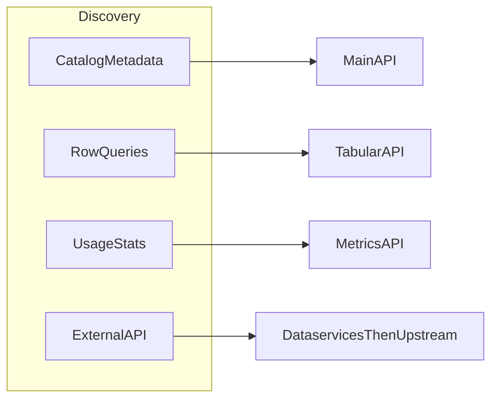

# data.gouv.fr APIs — Consolidated Reference

Three HTTP APIs (**Main**, **Metrics**, **Tabular**) plus **dataservices** (external HTTP APIs described on the platform; they used to be referenced on **api.gouv.fr** and are now **dataservices** on data.gouv.fr). This file is consumption-first: read paths and discovery; writes only when the user explicitly wants them and an API key is available.

---

## How to use this skill

- **MCP first:** If the client exposes **data.gouv.fr MCP** tools, use them for conversational catalog exploration; they orchestrate the same platform capabilities with typed tool calls. For **dataservices** in particular, **`search_dataservices`** matches the intent of `GET /dataservices/`; after a hit, load the detail record (`machine_documentation_url`, `base_api_url`, etc.) via MCP or via `GET /dataservices/{id}/` before calling the upstream API. Endpoint: `https://mcp.data.gouv.fr/mcp`. Repos: [datagouv-mcp](https://github.com/datagouv/datagouv-mcp), [datagouv-skill](https://github.com/datagouv/datagouv-skill). Tool names vary by server version—follow the host’s tool list and fall back to the HTTP endpoints in this document when MCP is missing or insufficient (dataservices: `GET https://www.data.gouv.fr/api/1/dataservices/` with `q`, filters, and `next_page`, then `GET /dataservices/{id}/`).
- **HTTP otherwise:** Use the Main, Metrics, and Tabular base URLs below. Prefer **GET** responses over assumptions: do not invent dataset or resource IDs; cite **slugs**, **UUIDs**, and **URLs** returned by the API.
- **Automation vs chat:** MCP suits interactive exploration; the **Main API** suits reproducible scripts and the full route surface.
- **Writes (atypical):** Never log or echo `X-API-KEY`. Use POST/PUT/PATCH/DELETE only with clear user intent **and** a configured key. On **401/403**, distinguish missing key from insufficient permissions; on **404**, re-check id vs slug and use search. Do not expand into full producer pipelines here.

---

## Choosing an API (intent → surface)

| User goal | Use |
|-----------|-----|
| Search or read catalog metadata, resources, orgs, reuses, discussions | **Main API** — e.g. `GET /datasets/`, `GET /datasets/{id}/`, resources under the dataset |
| Filter/sort/paginate **rows** of a CSV resource hosted for Tabular | **Tabular API** — after steps in [§3 Tabular API](#3-tabular-api) |
| Platform **usage / statistics** (models such as `dataset`, `organization`, `site`) | **Metrics API** — see Swagger for `{model}` and column filters |
| Call an **external** API (legacy catalog: api.gouv.fr; now **dataservices** on data.gouv.fr) | **Dataservices** — MCP **`search_dataservices`** or `GET /dataservices/`, then `machine_documentation_url` + `base_api_url` (steps in [§1 Main API](#1-main-api)) |

---

## Identifiers and catalog visibility

- **Technical UUID vs slug:** Both work in many paths; **prefer the UUID** from API responses for stable automation.
- **Resolve before Tabular:** Tabular `{rid}` is the resource **UUID** from `GET /datasets/{id}/` (or `.../resources/`). If you only have a slug, `GET` the dataset first and read `resources[].id`.
- **Stable resource link:** `GET /datasets/r/{id}/` redirects to the latest resource for that id.
- **Search is not “the whole web”:** `GET /datasets/` supports filters such as **`archived`**, **`deleted`**, **`private`**. Defaults may hide some records; set query params explicitly when the user needs a full picture and the key allows it.

---

## Pagination and rate limits

- Lists return `data`, `page`, `page_size`, `total`, `next_page`, `previous_page`. Follow **`next_page`** until empty instead of guessing page counts.
- Use a **reasonable `page_size`**; avoid hammering the service or downloading the entire catalog page by page without need.
- Respect **`X-RateLimit-Limit`**, **`X-RateLimit-Remaining`**, **`X-RateLimit-Reset`**: slow down or backoff when remaining is low.

---

## Demo vs production

- **Production:** `https://www.data.gouv.fr/api/1/` (and production Metrics / Tabular hosts below).
- **Demo:** `https://demo.data.gouv.fr/api/1/` — for tests only; do not present demo results as production facts unless the user asked for demo.

---

## Glossary

- **Dataset:** A catalog entry (metadata, licence, frequency, tags) grouping **resources**.
- **Resource:** A file or API link attached to a dataset (CSV, JSON, GeoJSON, etc.); each has an id used by Tabular when the file is tabular-compatible on the platform.
- **Organization / producer:** Publisher entity; datasets may belong to an organization.
- **Reuse:** A project or article that references platform datasets or dataservices.
- **Dataservice:** A documented external HTTP API (OpenAPI/Swagger often at `machine_documentation_url`) with a **`base_api_url`** for calls. Same class of APIs that were once referenced on **api.gouv.fr**; the catalog entry on the open data platform is now a **dataservice**.
- **Slug:** Human-readable id in URLs; may change; UUID is safer for scripts.

---

## Producer coaching (documentation and publication quality)

When the user asks how to **prepare, document, or legally qualify** data for publication on data.gouv.fr **without** using write APIs here, **ground** answers in the official guides (fetch pages if the client allows, otherwise give links): [Guide qualité](https://guides.data.gouv.fr/guides/guide-qualite.md), [Guide juridique](https://guides.data.gouv.fr/guides/guide-juridique.md). This skill is **not** legal advice; encourage human review for obligations and licensing.

---

## Intent routing (optional)



---

## 1. Main API

**Base URL:** `https://www.data.gouv.fr/api/1/` | Demo: `https://demo.data.gouv.fr/api/1/`

**Auth:** Read public. Write (POST/PUT/PATCH/DELETE): header `X-API-KEY`. Permissions = web (org member to edit org datasets). `private: true` for drafts. **IDs:** technical id or slug; prefer technical id. **Content:** JSON; file uploads: `multipart/form-data`. **Optional:** `X-Fields` to limit returned fields.

**Response:** Paginated lists: `data`, `page`, `page_size`, `total`, `next_page`, `previous_page`. Errors: 400, 401, 403, 404, 410, 423, 500, 502. Body: `{"message":"..."}`. Rate limits: `X-RateLimit-Limit`, `X-RateLimit-Remaining`, `X-RateLimit-Reset`.

### Datasets
| Method | Path |
|--------|------|
| GET | `/datasets/` — q, page, page_size, sort, organization, owner, tag, license, format, geozone, granularity, temporal_coverage, schema, topic, archived, deleted, private |
| POST | `/datasets/` — title, description, frequency, last_update, organization/owner, license, tags, private |
| GET/PUT/DELETE | `/datasets/{id}/` |
| GET | `/datasets/{id}/resources/` |
| POST | `/datasets/{id}/resources/` — create |
| PUT | `/datasets/{id}/resources/` — reorder (body: array) |
| GET/PUT/DELETE | `/datasets/{id}/resources/{rid}/` |
| POST | `/datasets/{id}/resources/{rid}/upload/` or `/datasets/{id}/upload/` |
| POST/DELETE | `/datasets/{id}/badges/`, `/datasets/{id}/badges/{badge_kind}/` |
| POST/DELETE | `/datasets/{id}/featured/` |
| GET/POST/DELETE | `/datasets/{id}/followers/` |
| GET | `/datasets/{id}/rdf`, `/datasets/{id}/rdf.{_format}` |
| GET/POST/... | `/datasets/community_resources/`, `.../{community}/`, `.../upload/` |
| GET | `/datasets/badges/`, `frequencies/`, `licenses/`, `resource_types/`, `extensions/`, `schemas/` |
| GET | `/datasets/suggest/`, `suggest/formats/`, `suggest/mime/` — q, size |
| GET | `/datasets/r/{rid}` — download the resource as a file |
| GET | `/datasets/recent.atom` |

### Organizations
| Method | Path |
|--------|------|
| GET/POST | `/organizations/` |
| GET/PUT/DELETE | `/organizations/{id}/` |
| POST/PUT/DELETE | `/organizations/{id}/member/{user}/` — role: admin|editor |
| GET/POST | `/organizations/{id}/membership/`, `.../accept/{id}/`, `.../refuse/{id}/` |
| GET | `/organizations/{id}/datasets/`, `reuses/`, `discussions/`, `contacts/`, `contacts/suggest/` |
| GET | `/organizations/{id}/datasets.csv`, `dataservices.csv`, `datasets-resources.csv`, `discussions.csv` |
| GET | `/organizations/{id}/catalog`, `catalog.{_format}` |
| GET/POST/DELETE | `/organizations/badges/`, `{id}/badges/`, `{id}/badges/{badge_kind}/` |
| POST/PUT | `/organizations/{id}/logo/` |
| GET | `/organizations/roles/`, `suggest/` |
| GET/POST/DELETE | `/organizations/{id}/followers/` |

### Users
| Method | Path |
|--------|------|
| GET/POST | `/users/` |
| GET/PUT/DELETE | `/users/{id}/` |
| POST | `/users/{id}/avatar/` |
| GET | `/users/{id}/contacts/` |
| GET | `/users/roles/`, `suggest/` |
| GET/POST/DELETE | `/users/{id}/followers/` |

### Me (authenticated)
| Method | Path |
|--------|------|
| GET/PUT/DELETE | `/me/` |
| DELETE/POST | `/me/apikey/` |
| POST | `/me/avatar/` |
| GET | `/me/datasets/`, `reuses/`, `metrics/`, `org_datasets/`, `org_reuses/`, `org_community_resources/`, `org_discussions/` |

### Reuses
| Method | Path |
|--------|------|
| GET/POST | `/reuses/` — q, organization, owner, tag, topic, type, dataset, featured |
| GET/PUT/DELETE | `/reuses/{id}/` |
| POST | `/reuses/{id}/datasets/`, `dataservices/` |
| GET/POST/DELETE | `/reuses/badges/`, `{id}/badges/`, `{id}/featured/` |
| POST | `/reuses/{id}/image/` |
| GET | `/reuses/topics/`, `types/`, `suggest/` |
| GET/POST/DELETE | `/reuses/{id}/followers/` |
| GET | `/reuses/recent.atom` |

### Dataservices (external APIs)

External administrative or public HTTP APIs were historically listed on **api.gouv.fr**; they are now represented as **dataservices** on data.gouv.fr (`GET /dataservices/`, object fields below).

| Method | Path |
|--------|------|
| GET/POST | `/dataservices/` — GET: q, page, page_size, organization, owner, topic, tag, access_type, featured, dataset, sort |
| GET/PATCH/DELETE | `/dataservices/{id}/` — GET returns `base_api_url`, `machine_documentation_url` (OpenAPI/Swagger spec), title, description, organization, license, etc. |
| POST | `/dataservices/{id}/datasets/` — body: [{id}] |
| DELETE | `/dataservices/{id}/datasets/{dataset}/` |
| POST/DELETE | `/dataservices/{id}/featured/` |
| GET | `/dataservices/{id}/rdf`, `rdf.{_format}` |
| GET/POST/DELETE | `/dataservices/{id}/followers/` |
| GET | `/dataservices/recent.atom` |

**Access and auth:** Each object includes **`access_type`** (and related fields such as `access_type_reason`, `authorization_request_url`). Rules are **per dataservice**, not platform-wide: follow the web page (`self_web_url`), **`business_documentation_url`**, and the upstream OpenAPI for API keys, OAuth, DataPass, or other flows.

**Rate limits:** **`rate_limiting`** and **`rate_limiting_url`** describe **producer** quotas on the external API. The Main API’s **`X-RateLimit-*`** headers apply only to **catalog** requests (`/dataservices/`, etc.), not to calls you make to `base_api_url`.

**Bulk export (metadata):** `GET /site/dataservices.csv` returns a site-wide CSV of dataservice rows for spreadsheets or scripts (same catalog as the JSON list).

**OpenAPI is authoritative:** Always fetch **`machine_documentation_url`** before calling the live API. Paths, parameters, and schemas come from that spec; if human text on the portal or this skill disagrees with the fetched OpenAPI, **trust the OpenAPI** (same principle as Metrics and Tabular Swaggers in [§References and freshness](#references-and-freshness)).

**To use a dataservice:** (1) Find it: MCP **`search_dataservices`** or `GET /dataservices/?q=term` (follow **`next_page`** until done). (2) GET `/dataservices/{id}/` (or the MCP equivalent) for `machine_documentation_url` and `base_api_url`. (3) Fetch `machine_documentation_url` for the OpenAPI spec. (4) Call **`base_api_url`** per that spec.

### Contacts, Harvest, Discussions, Notifications
| Method | Path |
|--------|------|
| POST | `/contacts/` — name, email, role |
| GET | `/contacts/roles/` |
| GET/PUT/DELETE | `/contacts/{id}/` |
| GET/POST | `/harvest/sources/` |
| GET/PUT/DELETE | `/harvest/source/{id}/` |
| GET | `/harvest/source/{id}/jobs/`, `/harvest/job/{ident}/` |
| POST | `/harvest/source/{id}/run/` |
| POST/DELETE | `/harvest/source/{id}/schedule/` |
| GET/POST | `/harvest/source/{id}/preview/`, `/harvest/source/preview/` |
| POST | `/harvest/source/{id}/validate/` |
| GET | `/harvest/backends/` |
| GET/POST/PUT/DELETE | `/discussions/`, `discussions/{id}/` |
| POST | `/discussions/{id}/` — comment, close (body) |
| PUT/DELETE | `/discussions/{id}/comments/{idx}/` |
| DELETE | `/discussions/{id}/comments/{idx}/spam/`, `discussions/{id}/spam/` |
| GET | `/notifications/` |
| POST | `/notifications/{id}/read/` |

### Posts, Pages, Reports, Transfer, Activity, Site, Spatial, Tags
| Method | Path |
|--------|------|
| GET/POST | `/posts/` — name, content, body_type, kind, datasets, reuses |
| GET/PUT/DELETE | `/posts/{id}/` |
| POST/PUT | `/posts/{id}/image/` |
| POST/DELETE | `/posts/{id}/publish/` |
| GET | `/posts/recent.atom` |
| GET/POST | `/pages/` |
| GET/PUT | `/pages/{id}/` |
| GET/POST | `/reports/` — reason (explicit_content|illegal_content|others|personal_data|security|spam), subject, message |
| GET | `/reports/reasons/` |
| GET/PATCH | `/reports/{id}/` |
| GET/POST | `/transfer/`, `transfer/{id}/` — subject, recipient, comment; response: accept\|refuse |
| GET | `/activity/` — user, organization, related_to |
| GET/PATCH | `/site/` |
| GET | `/site/catalog`, `catalog.{_format}`, `context.jsonld`, `data.{_format}` |
| GET | `/site/datasets.csv`, `dataservices.csv`, `reuses.csv`, `organizations.csv`, `resources.csv`, `harvests.csv`, `tags.csv` |
| GET | `/access_type/reason_categories/` |
| GET | `/avatars/{identifier}/{size}/` |
| GET | `/spatial/granularities/`, `levels/`, `coverage/{level}/`, `zone/{id}/`, `zone/{id}/datasets/`, `zones/{ids}/`, `zones/suggest/` |
| GET | `/tags/suggest/` |
| GET | `/spam/` |
| GET | `/proconnect/auth`, `login/`, `logout`, `logout_oauth` |
| GET/POST | `/workers/jobs/` |
| GET/PUT/DELETE | `/workers/jobs/{id}/` |
| GET | `/workers/jobs/schedulables/`, `workers/tasks/{id}/` |

---

## 2. Metrics API

**Base URL:** `https://metric-api.data.gouv.fr` | Swagger: https://metric-api.data.gouv.fr/api/doc

| Method | Path | Description |
|--------|------|-------------|
| GET | `/api/{model}/data/` | Paginated metrics rows (JSON). Params: page, page_size, column__sort, column__exact, column__contains, column__less, column__greater |
| GET | `/api/{model}/data/csv/` | Metrics **export** for `{model}` as CSV (same column filters as JSON where applicable; **not** the Tabular API resource CSV format) |
| GET | `/health/` | Health check |

`{model}` = table name (e.g. site, organization, dataset). See Swagger for models and columns.

---

## 3. Tabular API

**Base URL:** `https://tabular-api.data.gouv.fr` | Swagger: https://tabular-api.data.gouv.fr/api/doc | Per-resource: `GET /api/resources/{rid}/swagger/`

`{rid}` = resource UUID from main API (dataset's resources).

**Tabular data workflow (use in order):**

1. `GET /api/resources/{rid}/` — confirm the resource is exposed and get links.
2. `GET /api/resources/{rid}/profile/` — column types, stats, indexes.
3. `GET /api/resources/{rid}/swagger/` — allowed query params and operators per column (read before complex filters).
4. `GET /api/resources/{rid}/data/` — `page` and `page_size` (max **50**). For aggregations, check `/api/aggregation-exceptions/` first (only listed resources/columns may support groupby/count/sum, etc.).

| Method | Path | Description |
|--------|------|-------------|
| GET | `/api/resources/{rid}/` | Metadata, links to profile/data/swagger |
| GET | `/api/resources/{rid}/profile/` | Column types, formats, stats, indexes |
| GET | `/api/resources/{rid}/swagger/` | OpenAPI for data endpoint (columns, operators) |
| GET | `/api/aggregation-exceptions/` | Resource UUIDs allowed for aggregation |
| GET | `/api/resources/{rid}/data/` | Filter, sort, paginate (page, page_size max 50) |
| GET | `/api/resources/{rid}/data/csv/` | Stream CSV |
| GET | `/api/resources/{rid}/data/json/` | Stream JSON |
| GET | `/health/` | Health check |

**Data params:** `columns=col1,col2` | Filter: `column__exact`, `__differs`, `__isnull`, `__isnotnull`, `__contains`, `__notcontains`, `__in`, `__notin`, `__less`, `__greater`, `__strictly_less`, `__strictly_greater` | Sort: `column__sort=asc|desc` | Aggregation (allowed resources, indexed cols): `column__groupby`, `__count`, `__avg`, `__min`, `__max`, `__sum`. JSON columns: only isnull/isnotnull.

---

## Quick examples

```python
import requests

BASE = "https://www.data.gouv.fr/api/1"

# 1) Search catalog, then open first hit
r = requests.get(f"{BASE}/datasets/", params={"q": "transport", "page_size": 5}).json()
first = r["data"][0]
ds = requests.get(f"{BASE}/datasets/{first['id']}/").json()

# 2) Pick a CSV resource UUID, then Tabular profile + data (use any resource id exposed by Tabular)
csvs = [res for res in ds["resources"] if res.get("format", "").lower() == "csv"]
rid = csvs[0]["id"] if csvs else ds["resources"][0]["id"]
requests.get(f"https://tabular-api.data.gouv.fr/api/resources/{rid}/profile/").json()
requests.get(
    f"https://tabular-api.data.gouv.fr/api/resources/{rid}/data/",
    params={"page": 1, "page_size": 20},
).json()

# 3) Direct file download (when you need the raw file, not row filtering)
url = next(res["url"] for res in ds["resources"] if res["id"] == rid)
requests.get(url, stream=True)
```

```python
# Metrics API — paginated dataset metrics (models/columns in Swagger)
requests.get(
    "https://metric-api.data.gouv.fr/api/dataset/data/",
    params={"page": 1, "page_size": 20},
).json()
```

**Python client:** https://github.com/etalab/datagouv-client-python

---

## References and freshness

- **Main API Swagger (authoritative paths):** https://www.data.gouv.fr/api/1/swagger.json  
- **Metrics / Tabular:** use their Swaggers linked above. If a path or parameter disagrees with this file, **trust the live Swagger**.
- **API guide (human, technical):** [Prise en main](https://guides.data.gouv.fr/api-de-data.gouv.fr/prise-en-main.md), [Référence API](https://guides.data.gouv.fr/api-de-data.gouv.fr/reference.md), [Télécharger le catalogue](https://guides.data.gouv.fr/api-de-data.gouv.fr/telecharger-le-catalogue-de-donnees-de-data.gouv.fr.md), [SPARQL](https://guides.data.gouv.fr/api-de-data.gouv.fr/acceder-au-catalogue-via-sparql.md).

For sharing with humans, dataset pages on `www.data.gouv.fr` use slugs from API fields; **metadata and ids** should still come from **GET** responses.

---
> Source: [datagouv/datagouv-skill](https://github.com/datagouv/datagouv-skill) — distributed by [TomeVault](https://tomevault.io).
<!-- tomevault:4.0:skill_md:2026-06-17 -->
