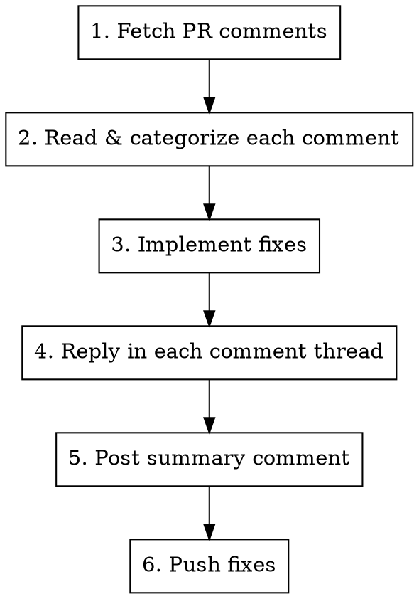

# Resolve Code Review

Read code review feedback on a pull request, resolve each item, reply in comment threads, and post a summary comment. Follows the PR conventions in CLAUDE.md.

**Complementary skill:** `superpowers:receiving-code-review` — use it alongside this one to ensure technical rigor when evaluating feedback.

## Usage

```
/resolve-code-review [PR_NUMBER]
```

If no PR number is provided, detect from the current branch with `gh pr view --json number -q .number`.

## Process



### 1. Fetch PR Comments

Detect the repo owner/name from the current git remote (do not hardcode).

> **Permission compatibility:** Always run `gh` commands as standalone statements — never chain with `&&` or wrap in `$()` variable assignments in the same Bash call. Claude Code's shell-aware permission matching evaluates each part of a chain independently, so `REPO=$(gh repo view ...) && echo "$REPO"` won't match a `Bash(gh repo view *)` permission even though the `gh` command itself would. Instead, run the `gh` command alone and capture the tool result.

```bash
gh repo view --json nameWithOwner -q .nameWithOwner
```

Store the result as `REPO` for subsequent commands.

Fetch review context:

```bash
gh pr view <PR> --repo ${REPO} --comments
gh pr diff <PR> --repo ${REPO}
```

**Fetch ALL inline comments with pagination** (default `per_page` is 30 — PRs with many review rounds will have more):

```bash
gh api "repos/${REPO}/pulls/<PR>/comments?per_page=100" \
  --jq '[.[] | {id, in_reply_to_id, line, path, body, created_at, pull_request_review_id, user: .user.login}]'
```

If the response has 100 items, there may be more pages. Use `--paginate` to get all:

```bash
gh api "repos/${REPO}/pulls/<PR>/comments" --paginate \
  --jq '[.[] | {id, in_reply_to_id, line, path, body, created_at, pull_request_review_id, user: .user.login}]'
```

**Find unreplied comments** using two separate queries with positive-match selectors only.

> **zsh compatibility:** Never use `!=` in jq expressions passed via `--jq` — zsh interprets `!` as history expansion and the command will fail. Always use positive `==` selectors in separate queries instead.

```bash
# Step 1: Get all original Gemini comments (not replies)
gh api "repos/${REPO}/pulls/<PR>/comments?per_page=100" \
  --jq '[.[] | select(.in_reply_to_id == null) | select(.user.login == "gemini-code-assist[bot]") | {id, path, created_at, body_preview: (.body[0:120])}]'

# Step 2: Get IDs already replied to by dshaevel
gh api "repos/${REPO}/pulls/<PR>/comments?per_page=100" \
  --jq '[.[] | select(.in_reply_to_id > 0) | select(.user.login == "dshaevel") | .in_reply_to_id]'

# Step 3: Compare — any ID in Step 1 not in Step 2 is unreplied
```

To fetch the **full body** of specific unreplied comments by ID:

```bash
gh api "repos/${REPO}/pulls/<PR>/comments?per_page=100" \
  --jq '[.[] | select(.id == 12345 or .id == 67890) | {id, path, line, body}]'
```

Alternatively, fetch comments for the **latest review** specifically:

```bash
# Get the latest gemini review ID and summary
gh api "repos/${REPO}/pulls/<PR>/reviews" \
  --jq '[.[] | select(.user.login == "gemini-code-assist[bot]")] | last | {id, body, state}'

# Fetch only that review's inline comments
REVIEW_ID=<id-from-above>
gh api "repos/${REPO}/pulls/<PR>/reviews/${REVIEW_ID}/comments" \
  --jq '[.[] | {id, line, path, body, created_at}]'
```

If the review has a top-level summary comment (gemini-code-assist often posts one), read it first to understand the overall assessment.

### 2. Read and Categorize

For each review comment:
- **Read the file and surrounding code** to understand context before deciding
- **Determine severity** from the reviewer's language (critical, high, medium, low)
- **Decide resolution:** fix or decline

**Rules:**
- CRITICAL and HIGH: **Must fix**
- MEDIUM: Evaluate — fix if reasonable, decline with technical reasoning if not
- LOW: Fix if trivial, decline if YAGNI

### 3. Implement Fixes

For each item being fixed:
1. Read the relevant file
2. Make the change
3. Commit with a descriptive message (conventional commits format)

Group related fixes into a single commit when they address the same concern.

### 4. Reply to Each Comment Thread

Reply **in the comment thread** (not top-level). Every reply MUST:
- Start with `@gemini-code-assist` (required for notification)
- Explain what was fixed and how (if fixed)
- Provide technical reasoning (if declining)

```bash
gh api repos/${REPO}/pulls/<PR>/comments/<COMMENT_ID>/replies \
  -f body="@gemini-code-assist Fixed. Changed X to Y."
```

### 5. Post Summary Comment

After all items are resolved, post a top-level PR comment:

```bash
gh pr comment <PR> --body "$(cat <<'EOF'
@gemini-code-assist Review addressed:

| # | Feedback | Resolution |
|---|----------|------------|
| 1 | Issue X | Fixed in <commit> - Description of fix |
| 2 | Issue Y | Declined - Technical reasoning |
EOF
)"
```

**Resolution column format:** Include both the **commit reference** AND a **brief summary**.

### 6. Push

Push fixes to the PR branch so the reviewer can verify.

```bash
git push
```

---
> Converted and distributed by [TomeVault](https://tomevault.io/claim/davidshaevel-dot-com) — claim your Tome and manage your conversions.
<!-- tomevault:4.0:skill_md:2026-04-15 -->
