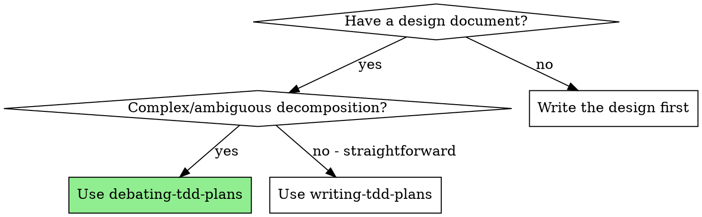

# Debating TDD Plans

## Overview

Transform a complex design document into a TDD implementation plan through structured debate among 4 specialized agents. A moderator orchestrates rounds of research, presentation, and adversarial challenge, then synthesizes the consensus into a plan.

**Core principle:** When a design has multiple valid decompositions, adversarial debate produces better plans than single-agent judgment. The debate surfaces hidden dependencies, testing gaps, and architectural tradeoffs that one agent would miss.

**Output:** Identical to writing-tdd-plans format — directly executable by executing-tdd-plans.

**Announce at start:** "I'm using the debating-tdd-plans skill to create the implementation plan through team debate."

## When to Use



**Signals for complex designs:**
- Multiple valid ways to decompose features
- Unclear dependency graph between components
- Architectural tradeoffs without obvious winners
- Large surface area with potential hidden interactions
- Design touching unfamiliar codebase areas

**When NOT to use:** Simple designs with clear feature boundaries → use writing-tdd-plans directly.

## Panelist Roles

| Role | Focus | Key Questions |
|------|-------|---------------|
| **Decomposer** | Feature decomposition, granularity (both splitting AND consolidating), Task 0, PR boundaries, parallel safety | What's the right granularity? Would merging related sub-features into one cohesive triplet be cleaner than splitting? Only split when a feature has genuinely independent test/implementation concerns. What shared infrastructure needs Task 0? Do any "independent" features modify overlapping files (must serialize or extract to Task 0)? Are there deferred items that define PR boundaries? |
| **Test Strategist** | Test coverage, integration-first testing, requirement verification, testing behavior not implementation, UI rendering tests, **mock boundary tracking**, **integration test prerequisites**, **UI test infrastructure** | What does each feature need tested? Can it be tested with real services via fixtures/testcontainers? Are mocks truly unavoidable? When mocks are needed, mock at the boundary your code consumes (SDK interface, not HTTP beneath it). Do tests verify behavior, not implementation details? Do UI features have component rendering tests, not just state/store tests? **During research: CHECK whether component test packages exist** (search for bUnit in .csproj, @testing-library/react in package.json). If MISSING → Task 0 must install it. Not a reason to exclude UI deliverables. Build a Mock Boundary Table with **one row per feature** — not just features with `Mock<>`. UI features tested at store/state level hide untested backend connections (hub methods, API calls). **For each real-service integration test: does the project have the infrastructure to run it?** Flag missing packages (testcontainers, docker-compose), missing container definitions, missing fixtures/seed data as Task 0 prerequisites. |
| **Devil's Advocate** | Challenge everything, alternative decompositions, **challenge over-decomposition**, gaps, PR scope, **design completeness**, **user journey tracing** | What's wrong with this plan? **Is the decomposition too granular?** Would fewer, coarser triplets work better? Features that share the same model/module/concern should usually be ONE triplet, not multiple. **Does the plan deliver ALL user-facing functionality from the design?** A backend with no UI to access it is incomplete. **Trace each user-facing flow end-to-end** — what does the user see, click, and get back? Every step needs a plan deliverable. What features were missed? What assumptions are wrong? Are deferred items properly excluded? |
| **Codebase Guardian** | Side effects, hidden dependencies, dead code, DRY, file overlap, **DI wiring and pipeline hookup**, **UI design system identification** | What existing code is affected? Hidden couplings? Dead code to remove? Are we duplicating logic? Do proposed parallel features modify overlapping files? **For each new service/decorator: is there a task that registers it in DI and applies it to the pipeline? A decorator that exists but isn't wired is dead code.** **If the design includes UI features:** What CSS/design system exists? What styling patterns do existing components follow (CSS variables, themes, component conventions)? New UI components must reference these — document the design system location and key patterns so the plan can require visual consistency. |

## The Process

```dot
digraph process {
    rankdir=TB;

    "Read design document" [shape=box];
    "Create team + discussion log" [shape=box];
    "Spawn 4 panelists" [shape=box];

    subgraph cluster_research {
        label="Phase 1: Research (parallel)";
        "Panelists explore codebase through their lens" [shape=box];
        "Each appends findings to log" [shape=box];
        "Each messages moderator: done" [shape=box];
    }

    "All done with research?" [shape=diamond];

    subgraph cluster_present {
        label="Phase 2: Present (parallel)";
        "Broadcast: start presenting" [shape=box];
        "Read others' research, write proposals to log" [shape=box];
        "Each messages moderator: done" [shape=box, label="Each messages moderator: done presenting"];
    }

    "All presented?" [shape=diamond];

    subgraph cluster_debate {
        label="Phase 3: Debate (peer-to-peer)";
        "Broadcast: start debating" [shape=box];
        "Challenge each other via SendMessage + log" [shape=box];
        "Each messages moderator: done" [shape=box, label="Each messages moderator: done debating"];
    }

    "All done debating?" [shape=diamond];
    "Convergence?" [shape=diamond];
    "Optional extra round" [shape=box];

    subgraph cluster_synthesis {
        label="Phase 4: Synthesis";
        "Read full discussion log" [shape=box];
        "Enumerate PRs (1 or more)" [shape=box];
        "For each PR: write complete plan" [shape=box];
        "All PRs have plan folders?" [shape=diamond];
        "Shutdown team" [shape=box];
    }

    "Read design document" -> "Create team + discussion log";
    "Create team + discussion log" -> "Spawn 4 panelists";
    "Spawn 4 panelists" -> "Panelists explore codebase through their lens";
    "Panelists explore codebase through their lens" -> "Each appends findings to log";
    "Each appends findings to log" -> "Each messages moderator: done";
    "Each messages moderator: done" -> "All done with research?";

    "All done with research?" -> "Broadcast: start presenting" [label="yes"];

    "Broadcast: start presenting" -> "Read others' research, write proposals to log";
    "Read others' research, write proposals to log" -> "Each messages moderator: done presenting";
    "Each messages moderator: done presenting" -> "All presented?";

    "All presented?" -> "Broadcast: start debating" [label="yes"];

    "Broadcast: start debating" -> "Challenge each other via SendMessage + log";
    "Challenge each other via SendMessage + log" -> "Each messages moderator: done debating";
    "Each messages moderator: done debating" -> "All done debating?";

    "All done debating?" -> "Convergence?" [label="yes"];
    "Convergence?" -> "Read full discussion log" [label="yes"];
    "Convergence?" -> "Optional extra round" [label="no"];
    "Optional extra round" -> "Read full discussion log";

    "Read full discussion log" -> "Enumerate PRs (1 or more)";
    "Enumerate PRs (1 or more)" -> "For each PR: write complete plan";
    "For each PR: write complete plan" -> "All PRs have plan folders?";
    "All PRs have plan folders?" -> "Shutdown team" [label="yes — count matches"];
    "All PRs have plan folders?" -> "For each PR: write complete plan" [label="no — write missing"];
}
```



## Phase 0: Setup

1. Read the design document thoroughly. **Scan for PR scope signals:** look for phrases like "deferred to PR 2", "phase 2", "out of scope for initial PR", "future work", or any indication that the design spans multiple PRs or delivery phases. Note these for the panelists.
2. Create the discussion log directory and file:

```bash
mkdir -p temp/discussions
```

**Log location:** `temp/discussions/debating-{ISO-date}-{HHmmss}.md` (timestamp ensures uniqueness across runs)

**Log template:**

```markdown
# Discussion Log: {design document title}

**Team:** debating-tdd-plans
**Started:** {ISO timestamp}
**Participants:** Decomposer, Test Strategist, Devil's Advocate, Codebase Guardian
**Design Document:** {path/to/design.md}
**Question:** How should this design be decomposed into TDD triplets?
**PR Scope Signals Found:** {list any "deferred to PR 2", "phase 2", "future work" etc. found in design doc, or "None detected"}

---

## Round 0: Research

---

## Round 1: Present

---

## Round 2: Debate

---

## Consensus
```

3. Create the team with a unique name:

```
TeamCreate: team_name="debating-{short-topic}", description="Debating TDD plan for {design title}"
```

Use a short topic slug (e.g., "debating-auth-system") to avoid name conflicts across runs.

4. Spawn all 4 panelists via Task tool with the team name from step 3. Use the prompt template from `./panelist-prompt.md`, filling in:
   - Role name and focus areas
   - Design document path
   - Discussion log file path
   - Names of all other panelists

**Subagent type:** general-purpose (panelists need Read, Glob, Grep, Edit, SendMessage)

## Phase 1: Research (parallel)

All panelists work simultaneously. Each:
1. Reads the design document
2. Explores the codebase through their specialized lens
3. Appends signed findings to the log under "## Round 0: Research"
4. Messages the moderator: "Done with research"

**Message signing format:**

```markdown
### [Decomposer] - Round 0 - {HH:MM:SS}

{research findings with file references}

---
```

Panelists use Edit to append before the next section marker (`## Round 1: Present`). If an Edit fails due to concurrent write, re-read the file and retry.

Moderator waits until all 4 panelists report done.

## Phase 2: Present (parallel)

Moderator broadcasts: "Read each other's research in the discussion log at {path}. Write your analysis/proposal under Round 1: Present. Message me when done."

Each panelist:
1. Reads the full discussion log to see all research
2. Writes their proposal through their lens (feature list, test strategy, risks, codebase impact)
3. Messages moderator: "Done presenting"

Moderator waits until all 4 report done.

## Phase 3: Debate (peer-to-peer)

Moderator broadcasts: "Challenge each other's proposals. Use SendMessage for direct challenges. Log all challenges and responses under Round 2: Debate. Each panelist must challenge at least one other panelist's position. Message me when done."

**Debate rules:**
- **Challenge, don't agree** — attempt to disprove before accepting
- **Evidence required** — reference specific files, lines, or design requirements
- **Minimum one challenge per panelist** — every panelist must challenge at least one position
- **Testing doesn't dictate architecture** — reject arguments that change the design's technology choices (SDK vs raw API, library vs roll-your-own) because it's "easier to test." The test strategy adapts to the architecture, not the reverse.
- **Log everything** — append challenges AND responses to the discussion log

Moderator waits until all 4 report done, then reads the log to assess convergence. If major disagreements remain, run one more debate round (maximum 3 rounds total). If consensus is reached in Round 2, skip Round 3 and proceed directly to synthesis.

**Important:** "Done debating" means STOP — panelists must not continue exchanging messages after reporting done. If panelists continue chatting, broadcast: "All panelists have reported done. Stop exchanging messages. Moving to synthesis."

## Phase 4: Synthesis

Moderator reads the full discussion log and:

**Override rule (CRITICAL):** MANDATORY checks in synthesis CANNOT be downgraded by debate consensus. If the debate recommends softening a mandatory requirement (e.g., changing "required" to "strongly recommended" or "optional"), the synthesizer MUST apply the mandatory check as written and note the disagreement in the plan. Debates have a structural bias toward practical compromises that weaken test coverage — mandatory checks exist precisely to resist this pressure. A well-reasoned argument for skipping a rendering test, dropping a side-effect test, or deferring UI infrastructure is exactly the kind of consensus that produces incomplete deliverables. Apply the check, note the disagreement.

**Consolidation check (MANDATORY):** Before writing any plan, review the proposed triplet count. Debates have a structural bias toward splitting — 4 agents discussing naturally find more sub-divisions. Ask: "Would merging related sub-features into fewer triplets produce a cleaner plan?" Merge when sub-features share the same model, module, or test fixture and can't be tested independently in a meaningful way. A CRUD feature is usually 1 triplet, not 4.

**Detail-level check (MANDATORY):** Before writing each task, verify the spec includes concrete types, function signatures with parameter and return types, specific error conditions with error types, and concrete test input/output values — not just behavioral summaries. The plan locks down design decisions; the executor makes implementation decisions. If a task says "create UserService with CRUD" or "write tests for the auth endpoint" without specifying signatures, types, and error conditions, it's too abstract — the executor will have to make design decisions that should have been made during debate.

**Completeness check (MANDATORY):** Compare the plan's deliverables against the design document's features. Every user-facing deliverable in the design (UI components, API endpoints, settings pages) must appear in the plan as either: (a) a triplet in the current plan, or (b) an explicit item in a separate numbered PR with justification. A deliverable excluded because "no test infrastructure exists" is not a valid exclusion — establishing test infrastructure is a Task 0 concern. A plan that builds backend plumbing (hub methods, OAuth endpoints, token stores) without the UI component that makes them accessible to users is incomplete.

**Integration completeness check (MANDATORY):** The integration triplet's Mock Boundary Table must have **one row per feature** — not just features that use `Mock<>`. For each feature, ask: "What real connection does this feature's unit tests NOT exercise?" UI features tested at the store/state level are the most commonly missed: store effects call hub/API methods that are never tested against a running backend, and the component file itself may not exist because only state tests were written. The integration triplet must depend on ALL features (including UI features), not just backend features. If the debate's integration discussion was backend-only, expand it.

**Integration test prerequisites check (MANDATORY):** For each row in the Mock Boundary Table where the integration test uses real services (databases, message brokers, caches, containers) instead of mocks — verify the plan includes a task that installs and configures the required infrastructure. Check: (1) Are required packages installed (testcontainers library, docker-compose, test SDKs)? (2) Do container/fixture definitions exist (docker-compose.yml, testcontainer configs, migration scripts)? (3) Is seed data or factory setup provided? If any prerequisite is missing and no Task 0 or feature task creates it, add it now. An integration test that assumes infrastructure exists but no plan task creates it will fail at execution time.

**UI test infrastructure check (MANDATORY):** If the design includes ANY UI component, verify the project has component rendering test packages. **How to check:** The Test Strategist should have identified this during research — check the discussion log for their "Component test infrastructure: PRESENT/MISSING" finding. **If the log is silent on UI test infrastructure and the design includes UI components, independently search project files now** (e.g., `bunit` in .csproj, `@testing-library/react` in package.json) — do not assume present because the log doesn't mention it. If the package is NOT installed: (1) Task 0 MUST install it and create a test project/scaffold, (2) every UI feature's RED task MUST include at least one component rendering test (not just store/state tests). Without rendering test infrastructure, agents cannot write rendering tests → fall back to store/state-only tests → GREEN never creates the component → UI deliverable silently dropped. This is the #1 cause of incomplete UI plans. A plan with UI features but no rendering test infrastructure in Task 0 is a plan bug.

**Side-effect handler test check (MANDATORY):** If any feature includes side-effect handlers (Fluxor effects, Redux thunks/sagas, MobX reactions, or any handler that performs external operations like JS interop, HTTP calls, hub/WebSocket methods), verify each handler has a dedicated unit test in the RED task — independent of any component rendering test. Store/state tests verify reducers; component rendering tests CAN exercise effects but may be skipped. A standalone effect unit test (mock the external dependency, dispatch the triggering action, assert the effect called the dependency) ensures the effect's behavior is tested regardless of whether component tests exist. Without this, GREEN creates the effect file as a stub to satisfy "file exists" while YAGNI prevents implementing behavior no test requires.

1. Identifies areas of consensus across all panelists
2. Resolves remaining disagreements using evidence from the log
3. **Enumerates PRs (MANDATORY before writing any plan):**
   - Re-read the design document for: "deferred to PR 2", "phase 2 scope", "future work", "out of scope for initial PR", or any phased delivery language
   - Check the discussion log "PR Scope Signals" header and panelist findings for additional PR boundary recommendations
   - **Write a numbered PR list** with features belonging to each. The number defines execution order and maps to folder prefixes. Example:
     ```
     PR 1 (core auth): login, signup, session management
     PR 2 (admin dashboard): user admin, audit logs
     ```
     → produces folders: `docs/plans/01-myapp-core-auth/`, `docs/plans/02-myapp-admin-dashboard/`
   - Append the numbered PR list to the "## Consensus" section of the log
   - **This list is your contract.** Every PR in this list MUST get its own complete plan before shutdown.
4. **For EACH PR in the numbered list from step 3, repeat steps 4a–4c:**
   - **4a.** Write a complete TDD plan for THIS PR following the **Plan Output Format** section below:
     - Header with goal, architecture, tech stack, design doc path
     - Task 0 (scaffolding) if identified by panelists
     - Triplets (RED/GREEN/REVIEW) for each feature **in THIS PR** — with detailed specs, verification, and commit per task
     - Integration triplet
     - Dependency graph
     - Execution instructions
   - **4b.** Save to `docs/plans/{NN}-{plan-name}-{pr-descriptor}/` subfolder, where `{NN}` is the zero-padded PR number from the list (01, 02, ...)
   - **4c. Check:** Re-read your numbered PR list from step 3. Have you written plans for ALL PRs? If NO → return to 4a for the next PR. If YES → proceed to step 5.
5. **Always use multi-file format** regardless of plan size (overrides the size-based rule in plan-format.md):

   ```
   docs/plans/{plan-name}/
     README.md                    # Header, dependency graph, file index, execution instructions
     task-0-scaffolding.md        # Task 0 (if present)
     feature-1-{name}.md          # Triplet 1: RED/GREEN/REVIEW
     feature-2-{name}.md          # Triplet 2: RED/GREEN/REVIEW
     ...
     integration.md               # Integration triplet
   ```

   Each feature file contains the complete triplet (N.1 RED, N.2 GREEN, N.3 REVIEW). The README.md contains the plan header, file index table, dependency graph, and execution instructions.
   - **Multiple PRs:** Each PR gets its own numbered subfolder: `docs/plans/{NN}-{plan-name}-{pr-descriptor}/` where `{NN}` is the zero-padded PR number (01, 02, ...). This ensures `ls` sorts folders in execution order.
6. **Verify all plans exist (MANDATORY before shutdown):** Run `ls docs/plans/` and confirm: (a) the number of plan folders matches the number of PRs from step 3, and (b) each folder is prefixed with its PR number (01-, 02-, ...). If any PR is missing a plan, **write it now** — do NOT skip it. This is the single most common failure mode of this skill.
7. Broadcasts "Synthesis complete, shutting down" to give panelists notice
8. Sends `shutdown_request` to each panelist individually

**The plan output is identical to writing-tdd-plans** — compatible with executing-tdd-plans.

**Multiple PRs — CRITICAL:** Each PR gets its own **complete, self-contained, numbered plan folder** (e.g., `01-app-core-auth/`, `02-app-admin-dashboard/`), independently executable by executing-tdd-plans **in numerical order**. A single plan that internally references "PR 1" and "PR 2" sections is NOT acceptable. The numbered PR list from step 3 is your contract — every PR in that list MUST have a numbered plan folder before you shut down the team. **Verify with `ls docs/plans/` in step 6 — folders must be numbered and count must match PR count.** Common triggers for multi-PR plans:
- Design says "deferred to PR 2" or "phase 2 scope" for any feature
- Panelists recommend splitting for cleaner review, independent deployability, or risk isolation
- Design has clearly separable deliverables (e.g., backend API vs frontend UI)

## Plan Output Format

**REQUIRED:** During synthesis, read `../writing-tdd-plans/plan-format.md` (relative to this skill's directory) for the complete plan output format. It defines triplet templates, required fields, commit patterns, detail level, and execution instructions.

**Critical reminders** (full spec in the shared file):
- Every task ends with a git commit (incremental progress)
- Tasks must include detailed specs (what to build, what to test), exact file paths, verification commands — but NOT full implementation code
- A plan that summarizes what to do instead of specifying what to build is too short

## Round Coordination Protocol

Rounds are coordinated via messages:

| Event | Who | Action |
|-------|-----|--------|
| Panelist finishes a round | Panelist → Moderator | `SendMessage type "message"`: "Done with {round name}" |
| All panelists done | Moderator → All | `SendMessage type "broadcast"`: "Start {next round}" with instructions |
| Debate not converging | Moderator → All | Broadcast: "One more debate round focusing on {specific disagreement}" |
| Consensus in Round 2 | Moderator | Skip Round 3, proceed to synthesis |
| All rounds complete | Moderator | Reads log, synthesizes, writes plan |
| Plan written | Moderator → All | Broadcast "synthesis complete", then `shutdown_request` to each |
| Panelists chat after "done" | Moderator → All | Broadcast "stop exchanging messages, moving to synthesis" |

## Common Mistakes

| Mistake | Fix |
|---------|-----|
| Skipping the debate round | Debate is the core value — never skip Phase 3 |
| Moderator joining the debate | Moderator observes and synthesizes, doesn't argue |
| Panelists agreeing without challenging | Mandate minimum one challenge per panelist |
| Not reading others' research before presenting | Present round requires reading the full log first |
| Spawning panelists without log path | Every panelist prompt MUST include the log file path |
| Not waiting for all panelists | Wait for all 4 "done" messages before advancing rounds |
| Output differs from writing-tdd-plans format | Plan must be identical format for executing-tdd-plans compatibility |
| Plan tasks are vague summaries | Each task must include detailed specs (test cases, behaviors, constraints), exact file paths, verification command, and commit — but NOT pre-written code |
| Plan tasks describe behaviors abstractly without concrete types, signatures, or error conditions | Every RED task needs concrete input values and expected outputs in the test cases table. Every GREEN task needs typed function signatures, error handling tables, and behavioral rules. "Create UserService with CRUD" is not a spec — it's a summary. |
| No commit messages in plan tasks | Every task ends with a commit — this enables incremental progress tracking |
| Using Explore-type for panelists | Panelists need Edit for the log — use general-purpose |
| Panelists continue chatting after "done" | Broadcast "stop exchanging messages" — "done" means STOP |
| Panelists recommend changing the design's technology choices for testing convenience (e.g., "drop the SDK and use raw HTTP because HTTP-level mocking is easier") | Testing strategy adapts to architecture, not vice versa. The Test Strategist's job is to figure out how to test the chosen architecture — not to change it. If the design specifies a library or SDK, build the test strategy around it — don't replace it because a different approach is "easier to mock." |
| Design mentions "PR 2" / deferred items but only one plan is written | The moderator MUST enumerate all PRs BEFORE writing any plan, then write a complete plan for EACH PR, then verify all numbered plan folders exist before shutdown. Writing one plan and moving on is the #1 failure mode. |
| Plan folders not numbered | Multi-PR folders MUST be prefixed with zero-padded PR number (01-, 02-, ...) to indicate execution order. |
| Wrote plan for PR 1, then proceeded to shutdown without writing PR 2's plan | After writing each plan, check: "Have I written plans for ALL PRs in my numbered list?" If not, write the next one. The verification step (step 6) catches this. |
| Writing a single-file plan instead of multi-file | Always use `docs/plans/` subfolder format — even for small plans with ≤3 features |
| Marking features as parallel without checking file overlap | Parallel subagents sharing a file cause merge conflicts — Codebase Guardian and Decomposer must flag overlapping files |
| Over-decomposing into trivially small triplets | Debates bias toward splitting — 4 agents find more sub-divisions. During synthesis, consolidate: features sharing the same model/module/fixture should usually be ONE triplet. A CRUD feature is 1 triplet, not 4. |
| Excluding UI deliverables because no component test infrastructure exists | If the design requires a UI component, establishing test infrastructure (bUnit, React Testing Library) is a Task 0 concern — not a reason to defer the deliverable. The plan must include the component or explicitly create a separate numbered PR for it. A backend with no UI to access it is incomplete. |
| UI test infrastructure discussed but not captured in Task 0 | The Test Strategist flags "no bUnit" during research, but synthesis writes Task 0 without bUnit installation. The UI test infrastructure check (MANDATORY) in synthesis catches this — verify Task 0 installs the package and creates a test scaffold. A plan with UI features but no rendering test infrastructure in Task 0 is a plan bug. |
| Debate consensus overrides a MANDATORY synthesis check (e.g., "bUnit is new to this codebase, make it recommended not required") | Debates produce well-reasoned practical compromises that predictably weaken test coverage. MANDATORY checks exist to override these arguments — they encode lessons from past failures. Apply the check as written, note the disagreement in the plan. Never downgrade MUST to "strongly recommended." |
| Side-effect handlers (effects, sagas, thunks) have no dedicated test because component rendering tests were expected to cover them | Component rendering tests may be skipped (friction, zero precedent). Effects that call JS interop, APIs, or hub methods MUST have standalone unit tests independent of component tests. A store test proves the action dispatches; only an effect unit test proves the side effect fires. Without this, GREEN creates a stub effect file — "file exists" passes the checklist but delivers no functionality. |
| Producing UI features without design system reference | If the codebase has an existing CSS/design system, the Codebase Guardian MUST identify it during research (location, CSS variables, component styling patterns). The plan's GREEN task must require visual consistency. A UI component with HTML class names but no CSS rules is not a deliverable — it's a placeholder. |
| Integration tests assume infrastructure that doesn't exist | If the Mock Boundary Table says "test against real PostgreSQL via testcontainers" but no task installs testcontainers or creates container definitions, the integration test is unrunnable. The Test Strategist must flag missing prerequisites during debate; the synthesis must capture them in Task 0. |
| Forgetting to shut down the team | Broadcast notice, then shutdown_request each panelist |

## Red Flags

**Never:**
- Skip Phase 3 (Debate) — it's the core value of this skill
- Let the moderator make plan decisions without consulting the log
- Allow panelists to skip log entries (every finding must be logged)
- Produce a plan without the triplet structure (RED/GREEN/REVIEW)
- Skip spawning any of the 4 panelist roles
- Run more than 3 debate rounds (diminishing returns — synthesize what you have)
- Proceed with the plan if a panelist hasn't participated in all rounds
- Produce tasks that describe what to do instead of specifying exactly what to build
- Omit commit messages from tasks — every RED/GREEN/REVIEW task must commit
- Write one plan when the design document or debate mentions deferred items / multiple PRs — each PR needs its own complete plan file. **This is the #1 failure mode: writing PR 1's plan and proceeding to shutdown without writing PR 2's plan.**
- Skip the PR enumeration step in synthesis — this is MANDATORY before writing any plan
- Skip the verification step (step 6) — you MUST `ls docs/plans/` and confirm folder count matches PR count before shutdown
- Accept over-decomposition from the debate without consolidating — debates structurally bias toward splitting. Features sharing the same model/module/concern should usually be ONE triplet. If the plan has 10+ triplets, seriously question whether consolidation is needed.
- Let testing convenience override architectural decisions — "easier to mock" is not a valid argument to change the design's technology choices. The Test Strategist proposes how to test the chosen architecture, not how to change it.
- Exclude a design deliverable because "no test infrastructure exists for it" — establishing test infrastructure is a valid Task 0 item. If you can't TDD a required component, add the tooling so you CAN; don't silently drop the deliverable.
- Downgrade a MANDATORY synthesis check because the debate produced a "well-reasoned consensus" against it — mandatory checks exist to override exactly this dynamic. Apply the check, note the disagreement.
- Write a plan where side-effect handlers (effects, sagas, thunks) have no dedicated unit test — relying solely on component rendering tests to exercise effects is fragile because those tests may be skipped.

## Integration

**Input from:** brainstorming (creates the design document)
**Output to:** executing-tdd-plans (executes the plan this skill produces)
**Alternative to:** writing-tdd-plans (for simpler designs where debate isn't needed)

---
> Converted and distributed by [TomeVault](https://tomevault.io/claim/dethon) — claim your Tome and manage your conversions.
<!-- tomevault:4.0:skill_md:2026-04-13 -->
