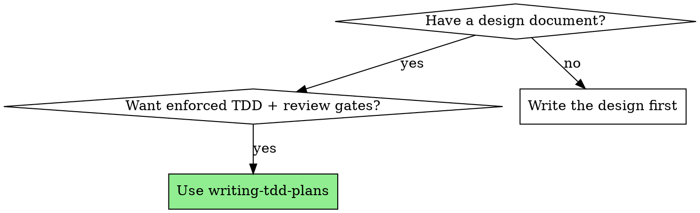
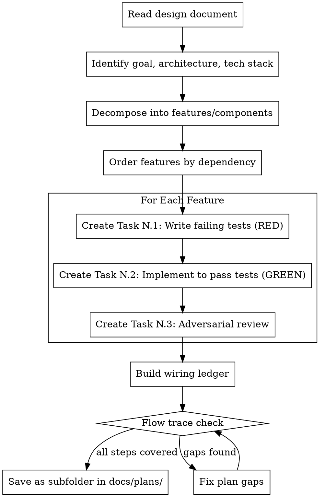

# Writing TDD Plans

## Overview

Transform a design document into an implementation plan where every feature gets three tasks: write failing tests, implement to pass them, adversarial review. Plans are structured for subagent execution — each task is self-contained with full context.

**Core principle:** TDD and review are enforced at the plan level, not left to executor discipline. The plan structure makes skipping tests or reviews impossible because they are separate, tracked tasks.

**Announce at start:** "I'm using the writing-tdd-plans skill to create the implementation plan from the design document."

## When to Use

## The Process

## Plan Output Format

**REQUIRED:** Read `./plan-format.md` before writing any plan. It defines the exact task structure, required fields, commit patterns, and detail level.

Key points (see `plan-format.md` for full templates):
- Every feature gets three tasks: RED (tests) → GREEN (implementation) → REVIEW (adversarial)
- Every task ends with a git commit (incremental progress)
- Tasks must include detailed specifications (what to build, what to test, acceptance criteria), exact file paths, verification commands, and verbatim design requirements — but NOT full implementation code
- **The plan locks down design decisions; the executor makes implementation decisions.** If the executor needs to decide function signatures, data types, error conditions, or API contracts — the plan wasn't detailed enough. RED tasks need concrete input values and expected outputs. GREEN tasks need typed signatures, error handling tables, and behavioral rules.
- A plan that summarizes what to do instead of specifying what to build is too short

## Decomposition Guidelines

**The plan MUST cover the ENTIRE design document.** Every feature, component, endpoint, UI element, and infrastructure piece described in the design MUST appear as a triplet in the plan. The plan's job is to decompose and order ALL work — not to decide what fits in a PR. Scope decisions (what ships in which PR) are made AFTER the plan exists, not during planning. A plan that omits sections of the design is incomplete.

**Coverage check (MANDATORY):** Before writing any triplets, list every top-level section/component/layer from the design document. After writing the plan, verify each item on that list maps to at least one triplet. If any item is missing, the plan is incomplete — add the missing triplets before saving.

**Read the design document carefully and identify:**

1. **Independent features** — Can be implemented in any order. Their triplets can potentially run in parallel (different subagents working on non-overlapping files).

2. **Dependent features** — Feature B needs Feature A. Order triplets: A.1 → A.2 → A.3 → B.1 → B.2 → B.3.

3. **Shared infrastructure** — If multiple features need the same base (database setup, config, types), create a Task 0 for scaffolding, then triplets for each feature.

4. **Mock boundaries** — When a feature will be tested with mocks (e.g., mocking `IProvider` to test a service that depends on it), that mock boundary represents a real connection that feature tests will NOT verify. List every mock boundary — these become mandatory integration test targets in the integration triplet. See plan-format.md "Integration Triplet" for the Mock Boundary Table format.

5. **Integration test prerequisites (MANDATORY)** — For each mock boundary where the integration triplet will use real services instead of mocks, check: does the project already have the infrastructure to run those real services in tests? If not, Task 0 must install packages (testcontainers, docker-compose), create container/fixture definitions, and provide seed data. An integration test that references testcontainers without a task to install the package is a plan bug.

6. **UI test infrastructure (MANDATORY)** — If the design includes ANY UI component, check whether the project has component rendering test packages (bUnit for Blazor, React Testing Library for React, Vue Test Utils for Vue). Search project files for package references. If not installed, Task 0 MUST install the package and create a minimal test scaffold. Without this, RED tasks cannot write rendering tests, agents fall back to store/state-only tests, and GREEN never creates the component.

6b. **Visual design foundation (MANDATORY for new apps)** — If the design document includes a Visual Design section (color palette, typography, spacing, component style), Task 0 MUST bootstrap a design system: CSS variables/design tokens, base styles, and any chosen CSS framework configuration. If the design document does NOT include visual design decisions, flag this as a gap — the brainstorming phase should have captured visual direction. For existing apps, identify and document the existing design patterns that UI tasks should follow (reference specific styled components by name). Without a visual design foundation, each feature subagent invents its own visual style, producing an incoherent UI.

7. **DI registration tracking (MANDATORY)** — For each new class the plan creates, trace its constructor dependencies across the plan. Every dependency must be registered in the correct host's DI container by some task. Build a running ledger: Task 0 registers X, Feature 2 registers Y. If a class takes `TimeProvider`, `IHttpClientFactory`, or any framework type not auto-registered — a task must register it. If a service is registered in one host (e.g., Agent) but needed in another (e.g., MCP server, Blazor WASM) — the plan must register it in each host separately. Cross-host DI is the #1 source of "works in unit tests, crashes at startup" errors.

### Parallel Execution Safety (MANDATORY)

Independent triplets execute as parallel subagents sharing the same workspace. Two agents editing the same file simultaneously cause merge conflicts, build failures, and spurious test failures.

**Before marking features as independent, analyze file scope overlap:**

1. List the files each feature will create or modify (from the design doc, or by exploring the codebase if the design doesn't list files)
2. If two features modify ANY overlapping files, they are NOT independent — serialize them into different dependency layers
3. Common overlap sources: shared type definitions, barrel exports (index files), config files, utility modules, shared middleware

**Resolution options when overlap is found:**

- **Extract to Task 0:** Move shared file changes into scaffolding (pre-create types, export stubs, config entries). This makes features independent again by eliminating overlap.
- **Serialize:** Place overlapping features in different dependency layers. Feature A runs first, Feature B depends on Feature A's REVIEW completing.

**Prefer Task 0 extraction** when the shared changes are small and mechanical (type additions, re-exports). **Prefer serialization** when the shared file changes are substantial or depend on each feature's implementation.

**Granularity:** Each triplet should be 5-15 minutes of work. If a feature is too large, split it into sub-features, each with its own triplet.

**Dependency graph:** Include a visual dependency graph at the end of the plan showing which triplets can run in parallel and which are sequential. The graph must reflect both logical dependencies AND file-scope overlap — two features are parallel only if they have zero file overlap.

**Build wiring ledger (MANDATORY):** After writing ALL triplets, build the wiring ledger (see plan-format.md "Wiring Ledger"). For every DI registration, route, layout change, and pipeline hookup in the plan, add a ledger entry with the task that creates it. Cross-reference: every ledger entry should have a corresponding wiring test in a RED task. Save as `wiring-ledger.md` in the plan directory.

**Flow trace check (MANDATORY):** After building the wiring ledger, trace each user-facing flow from the design end-to-end through the plan. For each step in the flow (user sees X → clicks Y → gets Z), identify which task creates or modifies the code for that step. A step with no corresponding task is a plan gap — add the missing task before saving. **Save the trace as `flow-trace.md`** in the plan directory (see plan-format.md "Flow Trace Artifact") — the executor reads this to verify wiring between layers. Common gaps this catches:
- UI components created but never wired into a layout or page (no task adds the component to the app's navigation or main page)
- Interfaces created in Task 0 but no task creates the real implementation class (DI can't resolve the service at runtime)
- Backend services with no UI making them accessible to users
- Constructor dependencies with no DI registration — trace each new class's constructor: can the DI container build it? Every parameter must map to a registered service in the correct host.
- Web endpoint parameters with no binding source attribute — will the framework infer `[FromBody]` on a GET endpoint?

## Common Rationalizations

| Excuse | Reality |
|--------|---------|
| "I'll combine tests and implementation for speed" | Separate tasks enforce TDD. Combined tasks let you write tests-after. |
| "Tests pass, no need for review" | Tests only cover what you thought of. Adversarial review finds what you didn't. |
| "No bugs found, looks good" | Bug-free ≠ correct. Does it actually do what the requirements ask? Review requirements compliance, not just code quality. |
| "Review is overkill for this simple feature" | Simple features have subtle edge cases. Review takes 5 minutes. |
| "I'll write the tests in the implementation task" | That's tests-after with extra steps. The test task must exist separately. |
| "The design is clear enough, I don't need to quote requirements" | Reviewers need verbatim requirements to catch misinterpretations. |
| "Subagents are slow, I'll execute tasks myself" | Fresh subagent context prevents cross-task contamination and shortcuts. |
| "These features are logically independent, so they can run in parallel" | Logical independence ≠ file independence. Check for shared files before marking as parallel. |
| "Store/action tests cover the UI feature" | Store tests verify state logic, not that the component exists or renders. The GREEN step (YAGNI) won't create a component no test requires. Add a rendering test that imports and renders the component. If no rendering test infrastructure exists, establishing it (bUnit, React Testing Library) is a Task 0 item — not a reason to exclude the component. |
| "No bUnit/RTL installed, so we can't write rendering tests" | Missing test infrastructure is a Task 0 prerequisite, not a reason to drop rendering tests. Task 0 MUST install the package and create a test scaffold. Check project files during decomposition (point 6) — don't discover this at RED task time. |
| "CSS/styling is beyond what tests require (YAGNI)" | Tests verify behavior, not appearance — but unstyled HTML is not a deliverable. The GREEN step must style UI components following the visual design direction (from the design document) or matching the codebase's existing visual patterns. YAGNI applies to features, not to basic visual quality. A component with CSS class names that have no CSS rules is a broken deliverable. |
| "Visual design is subjective, we can't test for it" | Correct — tests can't verify visual quality. That's why the REVIEW task must assess it. Visual acceptance criteria in the plan give the reviewer concrete expectations to evaluate against. A review that only checks "CSS rules exist" misses whether the UI is actually usable and appealing. |
| "The design doc doesn't specify colors/fonts, so we'll use defaults" | Missing visual direction is a gap in the design document, not a license to skip visual quality. Flag it as a brainstorming gap and establish a visual foundation in Task 0. Browser defaults produce an unusable UI. |
| "The executor can figure out the types/signatures" | The executor has only the task spec, not the design doc or debate log. If the plan says "create UserService with CRUD operations", 10 executors produce 10 different APIs. Specify signatures, types, error conditions — lock down design decisions. |
| "The integration triplet will catch wiring issues" | Only if the integration task SPECIFICALLY tests wiring. A vague "test features together" integration task won't catch missing DI registrations, unapplied decorators, or stub implementations. Build the Mock Boundary Table (see plan-format.md). |
| "Integration tests will use real services" (but no task installs the infrastructure) | Integration tests need runnable infrastructure. If the plan says "test against real PostgreSQL via testcontainers" but no Task 0 installs testcontainers or creates container definitions, the test is unrunnable at execution time. Prerequisites must be explicit plan tasks. |
| "This design is too large for one PR — I'll split into PR 01 and PR 02" | The plan covers the ENTIRE design. Scope decisions (what ships in which PR) happen AFTER the plan exists, not during planning. A plan that omits sections of the design is incomplete — even if you intend to "plan the rest later." Plan everything, then let the executor or user decide PR boundaries. |
| "I'll defer the UI/auth/infrastructure to a separate plan" | Deferring = omitting. If the design describes it, the plan must include it. The plan is a decomposition of the design, not a subset. |
| "The coverage check passed, so the plan is complete" | Coverage maps design sections to triplets. It doesn't verify that every step in a user flow has a task. A component can have a triplet but never be wired into the layout. An interface can exist in Task 0 but have no implementation class. The flow trace catches what the coverage check misses. |
| "Wiring will be implemented because it's in the Files section" | GREEN subagents prioritize making tests pass. Without wiring tests in RED, there's no test-driven reason to implement wiring changes — they get skipped. Every "Modify" file needs a corresponding wiring test. |
| "The flow trace is in my head, I verified it" | A mental trace is lost after planning. Save it as flow-trace.md — the executor needs it to verify wiring between layers. If it's not written down, it doesn't exist. |
| "The wiring ledger is redundant with the DI registration table" | The DI table is per-task. The ledger is cross-task — it shows WHO registers WHAT across the entire plan. The executor uses it to verify wiring after each layer, not just within a single task. |
| "Unit tests pass, so the DI wiring is correct" | Unit tests mock DI containers. A class can pass all unit tests while its real DI container can't resolve it — because a transitive dependency (like `TimeProvider`) was never registered. Every GREEN task must include a DI registration table. |
| "The framework infers parameter binding correctly" | Minimal API, MVC, and other frameworks have inference rules that surprise. A GET endpoint with an unattributed complex parameter is inferred as `[FromBody]` and throws `InvalidOperationException`. GREEN tasks for web endpoints must specify binding sources explicitly. |
| "The executor can figure out DI registrations" | The executor has only the task spec. If the plan says "create `TokenInjector(ITokenStore, TimeProvider)`" but doesn't say "register `TimeProvider.System` in DI", the executor creates the class, unit tests pass (mocked), and the app crashes at startup. DI registrations are design decisions — lock them down. |

## Red Flags

**Never:**
- Merge test and implementation into one task ("write tests and implement")
- Skip the adversarial review ("tests pass, move on")
- Make the review non-adversarial ("looks good" without trying to break it)
- Treat review as only bug-finding — requirements verification is equally important
- Create implementation tasks without preceding test tasks
- Allow a feature to have only 2 of the 3 triplet tasks
- Write vague test tasks ("add tests for feature X") — tests must list specific test cases with scenarios and expected behavior
- Write vague review tasks — review criteria must list specific design requirements
- Write review tasks that skip the adversarial testing mindset (reviewer must actively try to break it)
- Put design requirements in the plan header only — each triplet needs its OWN requirements
- Write only state management/DI tests for a feature whose primary deliverable is a UI component — the GREEN step will produce only state/DI code, never the component itself. At least one test must render the component. If no component test infrastructure exists (no bUnit, no React Testing Library), that's a Task 0 prerequisite — not a reason to drop the component from the plan.
- Create UI components with CSS class names that have no corresponding CSS rules — the component renders as unstyled HTML. The GREEN task must include styling that matches the codebase's existing design system.
- Mark features as parallel without checking for file overlap — shared types, barrel exports, config files cause build conflicts between parallel agents
- Write a vague integration triplet ("test features together") without a Mock Boundary Table — every mock used in feature tests is a real connection that must be verified in integration. No table = no assurance the wiring works.
- Write integration tests that require infrastructure the project doesn't have (testcontainers, docker-compose, test databases) without a Task 0 that installs and configures it — the executor will hit missing-package errors on the first test run.
- Omit features from the plan because "they'll be in a separate PR" — the plan covers the ENTIRE design document. Every section, every component, every endpoint. PR scope decisions happen after planning, not during.
- Add a "Scope" section to the README that excludes parts of the design — if you're tempted to write "deferred to PR 02," the plan is incomplete.
- Save the plan without running the flow trace check — trace every user-facing flow through the plan's tasks before saving. A component with a triplet but no layout wiring, or an interface with no implementation task, is a plan gap.
- Save the plan without flow-trace.md and wiring-ledger.md — these are mandatory artifacts, not optional. The executor reads them to verify wiring between layers.
- Write RED tasks with "Modify" files in GREEN but no wiring tests — if GREEN must modify a file (DI registration, route, layout), RED must include a test that fails without that modification. Otherwise GREEN has no test-driven reason to implement it.
- Specify a constructor dependency in a GREEN task without stating whether it's registered in DI — every constructor parameter must map to a DI registration. If the plan doesn't say who registers it, nobody will.
- Create web endpoint handler signatures without specifying parameter binding attributes — ASP.NET Minimal API, Spring, Express parameter inference silently breaks when it guesses wrong. Always specify `[FromQuery]`, `[FromServices]`, `[FromBody]`, etc.
- Let the GREEN executor introduce new interfaces or abstractions not in the plan — YAGNI means don't create `IFooHubService` when the plan says to inject `IChatConnectionService`. New abstractions = new DI registrations the plan didn't account for = runtime crashes.
- Write UI feature plans for a new app without a visual design foundation in Task 0 — each subagent invents its own colors, spacing, and typography, producing a visually incoherent app. Task 0 must bootstrap design tokens from the design document's visual direction.
- Write GREEN tasks for UI features that say "match existing visual patterns" when there ARE no existing patterns — for new apps, GREEN tasks must reference the design system established in Task 0 and include visual acceptance criteria describing the expected look and feel.
- Write REVIEW tasks for UI features that only check "CSS rules exist" — the reviewer must assess visual quality: hierarchy, spacing, color harmony, consistency with the design direction, and overall polish. If possible, take a screenshot of the rendered component and evaluate it visually.

**The triplet is atomic:** If you can't write all three tasks for a feature, the feature needs to be decomposed further.

---
> Converted and distributed by [TomeVault](https://tomevault.io/claim/dethon) — claim your Tome and manage your conversions.
<!-- tomevault:4.0:skill_md:2026-04-13 -->
