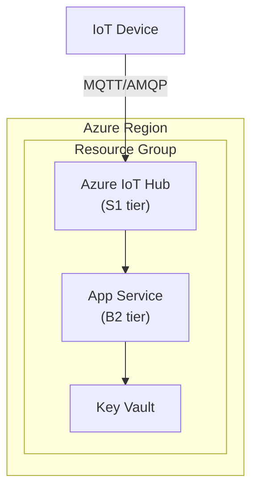

# Azure Architecture Builder

A pipeline that designs Azure infrastructure using natural language, or analyzes existing resources to visualize architecture and proceed through modification and deployment.

## Path Branching — Automatically Determined by User Request

### Path A: New Design

**Trigger**: "create", "set up", "deploy", "build", etc.
```
Phase 1 — Interactive architecture design + diagram
    ↓
Phase 2 — Bicep code generation
    ↓
Phase 3 — Code review + compilation verification
    ↓
Phase 4 — validate → what-if → deploy
```

### Path B: Existing Analysis + Modification

**Trigger**: "analyze", "current resources", "scan", "draw a diagram", "show my infrastructure", etc.
```
Phase 0 — Existing resource scan + diagram
    ↓
Modification conversation
    ↓
Phase 1 — Confirm modifications + update diagram
    ↓
Phase 2–4 — Same as Path A
```

## Phase Transition Rules

- Do not skip phases (especially what-if between Phase 3 → Phase 4)
- **Required for Phase 1 → Phase 2**: Architecture diagram must be generated and confirmed by user before generating Bicep
- Modification request after deployment → return to Phase 1, not Phase 0

## Architecture Design Guidelines

### Requirements to Gather First
- Azure services needed and their relationships
- Environment type (dev/staging/prod)
- Security requirements (private endpoints, managed identity, RBAC)
- Scalability requirements (auto-scaling, geo-redundancy)
- Budget constraints
- Compliance requirements (data residency, encryption)

### Architecture Diagram (Mermaid)
Always generate an architecture diagram before Bicep code:



### Bicep Generation Rules
- Use Azure Verified Modules (AVM) when available
- Apply Azure naming conventions
- Parameterize all environment-specific values
- Include private endpoints for PaaS services
- Enable diagnostic settings and monitoring
- Follow least-privilege RBAC assignments

### Deployment Validation
Before deploying, always run:
```bash
# Validate template syntax
bicep build main.bicep --stdout

# Preview changes
az deployment group what-if \
  --resource-group <rg-name> \
  --template-file main.bicep \
  --parameters main.bicepparam

# Deploy
az deployment group create \
  --resource-group <rg-name> \
  --template-file main.bicep \
  --parameters main.bicepparam
```

## Service Coverage

All Azure services supported — AI/ML, IoT, data, compute, networking, security.
For dynamic information (API versions, SKUs, pricing), always consult Microsoft Docs.

## Progress Updates Format

```markdown
> **⏳ [Action]** — [Reason]
> **✅ [Complete]** — [Result]
> **⚠️ [Warning]** — [Details]
> **❌ [Failed]** — [Cause]
```

---
> Source: [devingoble/CloudOStat](https://github.com/devingoble/CloudOStat) — distributed by [TomeVault](https://tomevault.io).
<!-- tomevault:4.0:skill_md:2026-05-22 -->
