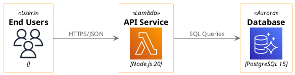
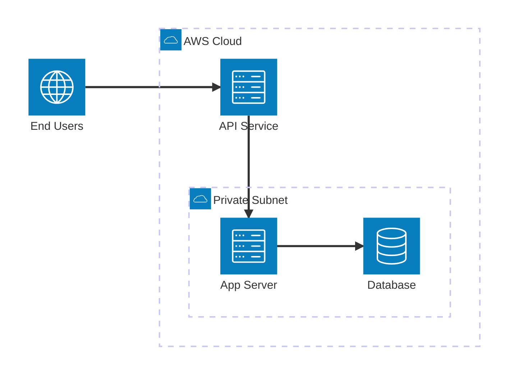
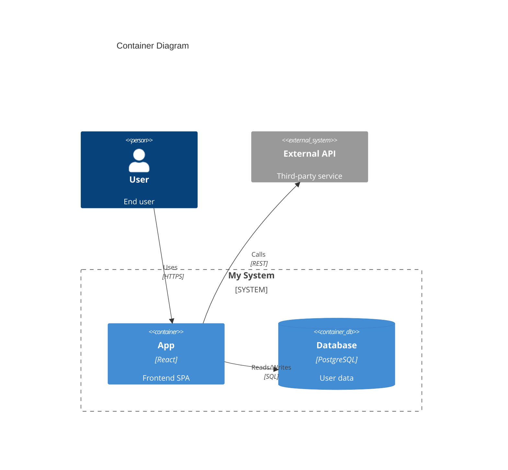

```mermaid
architecture-beta
    group vpc(logos:aws)[AWS Cloud]
    service users(internet)[End Users]
    service apigw(logos:aws-api-gateway)[API Gateway] in vpc
    service lambda(logos:aws-lambda)[Lambda] in vpc
    service db(logos:aws-aurora)[Aurora DB] in vpc

    users:R --> L:apigw
    apigw:R --> L:lambda
    lambda:R --> L:db
```

# Architecture Documentation

## Overview

Generates in-depth technical architecture documentation from codebases. Produces engineer-focused documentation with system diagrams, data flow analysis, component deep dives, and architectural decision rationale.

**Core principle:** Depth over breadth. Technical rigor over high-level summaries.

## When to Use

- User provides a codebase and asks for architecture documentation
- User requests system design documentation
- User needs technical documentation for handoff or onboarding
- User asks to document architectural decisions
- User needs diagrams showing system structure and data flow

## Workflow Checklist

Copy this checklist and check off items as you complete them:

```
Architecture Documentation Progress:
- [ ] Phase 1: Codebase exploration (structure, entry points, dependencies)
- [ ] Phase 2: Components identified (services, modules, databases)
- [ ] Phase 3: Data flow traced (request lifecycle, transformations)
- [ ] Phase 4: Business context extracted (README, comments, code)
- [ ] Phase 5: Documentation generated following structure below
- [ ] Phase 6: Diagrams created (PlantUML via Kroki, Mermaid, and/or Eraser syntax)
- [ ] Phase 7: Engineering analysis complete (all "why" questions answered)
- [ ] Phase 8: Quality validation passed
```

## Document Structure

Follow this structure (see example-output.pdf for full reference):

### Required Sections

1. **Abstract**
   - Formal research paper abstract after table of contents
   - Delineates system purpose, architecture approach, key technologies
   - Written in formal tone

2. **Context & Scope**
   - Business goals, stakeholders
   - System context diagram (PlantUML via Kroki)

3. **Architecture Constraints & Principles**
   - Why this approach? Immutable rules

4. **High-Level Architecture**
   - Container diagram showing major components
   - Data flow walkthrough with transformations (Input → Output at each stage)

5. **Component Deep Dives**
   - **Component Responsibility Matrix:** Table summarizing all components (see template below)
   - **Individual Component Sections** (repeat for each component):
     - **Purpose:** One sentence
     - **Implementation Details:** Stack, algorithms, dependencies (with WHY chosen)
     - **Engineering Analysis:** Trade-offs, configuration rationale, edge cases
     - Component diagram if complex

6. **Cross-Cutting Concerns**
   - Observability (logging, metrics, tracing)
   - Failure modes & recovery
   - Deployment & infrastructure

7. **Decision Log (ADRs)**
   - Major decisions with context and consequences

### Optional Appendices

**Appendix A: Technology Stack Summary**
- Table organized by category (Backend, AI/ML, Data Storage, Infrastructure, etc.)
- Columns: Technology | Version | Purpose | Architectural Layer
- Quick reference for all technologies used

**Appendix B: API Endpoint Reference**
- Complete endpoint documentation
- For each endpoint: Method, Path, Auth requirements, Request/Response schemas
- Include streaming event types if applicable
- Error response codes and formats

**Template format:**
```markdown
## 4. Component Deep Dives

### Component Responsibility Matrix

| Component | Primary Responsibility | Key Dependencies | Input/Output | Failure Modes | Recovery Strategies |
|-----------|----------------------|------------------|--------------|---------------|--------------------|
| [Name] | What it does (1 sentence) | Services/DBs it needs | What goes in → What comes out | How it breaks | How it recovers |
| [Name] | ... | ... | ... | ... | ... |

### 4.1 [Component Name]
[PlantUML diagram of internal logic]

**Purpose:** One sentence summary.

**Implementation Details (The "How"):**
- **Stack:** Technologies used
- **Key Algorithms:** How does it work?
- **Dependencies:** Libraries/services with citation (why chosen over alternatives)

**Engineering Analysis (The "Why"):**
- **Trade-offs:** Why this approach? What was rejected and why?
- **Configuration:** Why these specific settings? (timeouts, limits, buffer sizes)
- **State Management:** Stateless or stateful? Where persisted? How consistent?
- **Edge Cases:** What errors are handled? Retry logic? Failure modes?
```

## Workflow

### Phase 1: Codebase Exploration

**Determine documentation type first:**

- **Creating brand new documentation?** → Follow complete workflow below
- **Updating existing documentation?** → Read existing docs first, update changed sections only, validate updates

**For new documentation:**

1. **Understand project structure:**
   - Read package.json, requirements.txt, go.mod, Cargo.toml (dependency files)
   - Identify main entry points (main.py, index.js, main.go, etc.)
   - Map out directory structure

2. **Identify components:**
   - Find services, modules, packages
   - Identify databases, message queues, external APIs
   - Map dependencies between components

3. **Analyze data flow:**
   - Trace request lifecycle from entry to response
   - Document transformations at each stage
   - Capture exact payload examples when possible

### Phase 2: Documentation Generation

1. **Abstract:**
   - Write formal research paper abstract
   - Delineate system purpose, architectural approach, key technologies
   - Example: "This document delineates the architectural design of [System Name], a cloud-native platform engineered to [purpose]. Leveraging [technologies], the system [key approach] to deliver [outcomes]. The architecture adheres to the C4 model, decomposing abstractions from high-level system context to granular component implementation."

2. **Business Context:**
   - Extract from README, comments, or infer from code
   - Identify stakeholders (who uses this?)

3. **System Context Diagram:**
   - Create diagram using PlantUML/Kroki (see kroki-syntax.md), Mermaid (see mermaid-syntax.md), or Eraser (see eraser-syntax.md)
   - Show: system as a box, external actors (users, services, databases), connections

4. **High-Level Architecture:**
   - Create C4 Container diagram showing major components
   - Document data flow with concrete example ("hero scenario")
   - Show transformations: Input → Output at each stage

5. **Component Deep Dives:**
   - **Create Component Responsibility Matrix first:**
     - Table with columns: Component | Primary Responsibility | Key Dependencies | Input/Output | Failure Modes | Recovery Strategies
     - One row per major component
     - Provides quick reference for all components before detailed sections
   - For each major component:
     - Purpose (one sentence)
     - Implementation details (stack, algorithms, dependencies)
     - Engineering analysis (WHY this way, trade-offs, configuration rationale)
     - Create component-level diagram if complex

6. **Cross-Cutting Concerns:**
   - Document observability approach
   - Identify failure modes from code (error handling, retries)
   - Extract deployment configuration

7. **Decision Log:**
   - Document WHY decisions were made
   - Include context and consequences

7. **Optional Appendices (if applicable):**
   - **Technology Stack Summary:** Extract all technologies from dependency files and component details; organize by category
   - **API Endpoint Reference:** Document public/internal APIs with request/response schemas from code

### Phase 3: Diagram Generation

Three diagram engines are available. Choose based on needs:

**Option A: PlantUML via Kroki (default)** — Free, self-hostable, 25+ diagram engines, 900+ AWS cloud icons in stdlib.

**Option B: Mermaid** — GitHub/GitLab native rendering, dedicated `architecture-beta` diagram type, C4 support, Iconify icon ecosystem.

**Option C: Eraser** — Concise syntax, visual styling (watercolor, bold), requires API key.

#### PlantUML/Kroki Diagrams

Generate PlantUML code using cloud icon macros (see kroki-syntax.md and icon-reference.md):

````

````

**Kroki endpoints:**
- **PlantUML with cloud icons:** `POST https://kroki.io/plantuml/svg`
- **C4 model diagrams:** `POST https://kroki.io/c4plantuml/svg`

#### Mermaid Diagrams

Generate Mermaid diagrams using the `architecture-beta` type for cloud topology or C4 types for system modeling (see mermaid-syntax.md and mermaid-icon-reference.md):

**Architecture diagram (built-in icons — works on GitHub/GitLab natively):**

````

````

**Architecture diagram (with registered Iconify icons — requires local rendering):**

````

````

**C4 container diagram:**

````

````

**Mermaid rendering:** Use `render-kroki-diagrams.js` (routes to `/mermaid/` endpoint) or render natively on GitHub/GitLab. For full Iconify icon support, use Mermaid CLI (`mmdc`) or browser rendering with `registerIconPacks()`.

**Platform note:** GitHub and GitLab render Mermaid natively but only support the 5 built-in icons (`cloud`, `database`, `disk`, `internet`, `server`). For branded cloud icons, render locally and embed as images.

#### Eraser Diagrams

Generate Eraser diagram code (see eraser-syntax.md):

````
```eraser
// System Context
colorMode bold
direction right

Users [icon: users, label: "End Users"]
API [icon: aws-lambda, label: "API Service"]
Database [icon: aws-rds, label: "PostgreSQL 15"]

Users > API: HTTPS/JSON
API > Database: SQL Queries
```
````

**Eraser rendering:** Requires `ERASER_API_KEY` env var. Use `render-eraser-diagrams.js`.

#### Reference Materials

**PlantUML/Kroki:**
- **kroki-syntax.md** - PlantUML syntax, Kroki API, C4 model macros
- **icon-reference.md** - Cloud icon catalog (AWS 900+, Azure 400+, GCP, K8s macros)
- **diagram-examples.md** - Real-world examples with complete PlantUML code

**Mermaid:**
- **mermaid-syntax.md** - Architecture diagram syntax, C4 types, flowchart icon shapes, rendering options
- **mermaid-icon-reference.md** - Iconify icon packs (logos, FA, MDI), AWS/Azure/GCP icon names, registration API
- **mermaid-diagram-examples.md** - 13 real-world examples (architecture, C4, flowchart with cloud icons)

**Eraser:**
- **eraser-syntax.md** - Eraser syntax reference (nodes, groups, connections, properties)
- **eraser-icon-reference.md** - Eraser icon catalog (AWS 700+, GCP 500+, Azure 400+, K8s, tech logos)
- **eraser-diagram-examples.md** - 13 production Eraser diagram examples (Azure AI RAG system)

## Engineering Analysis Requirements

For each component, answer ALL these questions with specifics (not vague statements):

### Trade-offs
- What alternatives were considered?
- Why was this approach chosen over alternatives?
- What are the downsides of this choice?

### Configuration
- Why these specific values? (timeouts, limits, buffer sizes)
- What happens if misconfigured?
- How were these values determined? (SLAs, benchmarks, constraints)

### State Management
- Stateless or stateful?
- Where is state persisted?
- How is consistency maintained?
- What happens on restart?

### Edge Cases
- What errors are explicitly handled?
- What retry logic exists?
- What are the failure modes?
- How does the system recover?

## Documentation Quality Validation

After generating documentation, validate immediately using this checklist:

### 1. Structural Validation
- [ ] All required sections present (Context, Constraints, Architecture, Components, Cross-Cutting, Decisions)
- [ ] Component Responsibility Matrix table present at start of Component Deep Dives section
- [ ] Matrix includes all major components with all required columns (Component, Primary Responsibility, Key Dependencies, Input/Output, Failure Modes, Recovery Strategies)
- [ ] Each component has Purpose, Implementation Details, Engineering Analysis
- [ ] Data flow walkthrough includes Input → Output transformations
- [ ] Diagrams use correct syntax (PlantUML verified against kroki-syntax.md, Mermaid against mermaid-syntax.md, or Eraser against eraser-syntax.md)
- [ ] PlantUML blocks wrapped in `@startuml`/`@enduml` within ```plantuml fences; Mermaid blocks in ```mermaid fences; Eraser blocks in ```eraser fences

### 2. Depth Validation (Critical)
- [ ] Every technical decision has "why" explanation (not just "what")
- [ ] Trade-offs documented (what alternatives were rejected and why)
- [ ] Configuration values justified (why these specific settings, how determined)
- [ ] Failure modes documented (what breaks, how system recovers)
- [ ] Concrete examples included (real payloads, actual code snippets, exact transformations)
- [ ] Library choices explained (why this library over alternatives, with specifics)

### 3. Diagram Validation
- [ ] Icons match actual technologies (checked against icon-reference.md)
- [ ] Connections labeled with what flows (data format, protocol)
- [ ] Groups show logical boundaries (VPCs, subnets, services)
- [ ] Direction set appropriately (`left to right direction` / `top to bottom direction`)

### 4. Example Quality Check
- [ ] Payload examples show exact JSON/data structures
- [ ] Transformations show before AND after
- [ ] Code snippets include file paths (e.g., "in auth.py:42")
- [ ] No vague terms ("handles requests", "processes data")

**If validation fails:**
1. Note each gap with specific section reference
2. Add missing content
3. Run validation checklist again
4. Only finalize when all checks pass

## Good vs. Bad Examples

### Bad Example - Vague and Shallow

```markdown
### API Gateway

**Purpose:** Handles API requests.

**Implementation:**
- Uses FastAPI
- Routes requests to backend services

**Why:** It's fast and easy to use.
```

**Problems:** No WHY for library choice, no trade-offs, no configuration rationale, no edge cases, generic statements.

### Good Example - Component Responsibility Matrix

```markdown
### Component Responsibility Matrix

| Component | Primary Responsibility | Key Dependencies | Input/Output | Failure Modes | Recovery Strategies |
|-----------|----------------------|------------------|--------------|---------------|--------------------|
| **Query Router** | Routes user queries to specialized agents via LLM intent classification | Azure OpenAI (gpt-5-mini) | User query (string) → Agent selection + args (JSON) | LLM fails to select tool, API timeout, non-English input | Fall back to default agent; log exceptions to App Insights; reject non-English with fixed response |
| **PostgreSQL DB** | Persistent storage for user profiles, query history, embeddings | PostGIS extension, pgvector | SQL queries → Result sets | Connection pool exhaustion, deadlocks, disk full | Auto-reconnect with exponential backoff; query timeout (30s); read replicas for queries |
| **Redis Cache** | Session state, rate limiting, hot data caching | None (standalone) | Key-value GET/SET → Cached data or miss | Cache miss, eviction, connection failure | Graceful degradation to DB; 5-minute TTL; connection retry (3x with backoff) |
```

**What makes this good:** Concise summary of each component's role, dependencies, data flow, failure scenarios, and recovery—providing quick reference before detailed sections.

### Good Example - Detailed Component Section

```markdown
### Query Router (stream.py)

**Purpose:** Routes user queries to appropriate specialized agent based on query intent.

**Implementation Details:**
- **Stack:** Python 3.11, FastAPI, AsyncAzureOpenAI v1.x
- **Key Algorithm:** LLM-based intent classification via function calling
- **Dependencies:**
  - `openai==1.x`: Official SDK with native async streaming; type-safe; actively maintained. Chosen over `langchain` for direct control and lower overhead.
  - `httpx==0.x`: Required for custom timeout configuration; `trust_env=False` prevents proxy interference

**Engineering Analysis:**
- **Trade-offs:**
  - LLM-based router vs keyword regex: Regex is 10x faster but brittle and fails on paraphrased queries. LLM handles ambiguity and phrasing variations with 95%+ accuracy vs 60% for regex in testing.
  - Model Selection (gpt-5-mini): Classification is simpler than generation. Mini model offers 10x cost reduction ($0.15 vs $1.50 per 1M tokens) and lower latency (~200ms vs ~800ms) compared to gpt-4o, without sacrificing routing accuracy (both achieved 96% in our test set).

- **Configuration:**
  - `timeout_keep_alive=300s`: LLM responses can take 30-60s for complex queries; 5-minute keep-alive prevents client disconnect during long-running requests. Determined from p95 latency metrics showing 45s max.
  - `httpx.Timeout(read=30.0)`: 30s read timeout balances allowing slow responses and failing fast on stalled connections. Based on upstream SLA of 25s + 5s buffer.
  - `max_retries=0`: Streaming responses cannot be retried mid-stream; client must handle retry. Retrying would cause duplicate partial responses.

- **State Management:** Stateless component; all routing decisions made per-request from query content alone. No session state persisted.

- **Edge Cases:**
  - No Tool Selection: If LLM fails to select tool (< 0.1% of requests), system falls back to direct response with default agent.
  - Execution Exceptions: All tool exceptions caught, logged with full traceback to Application Insights, and returned to user via friendly SSE error message (HTTP 200 with error type in stream).
  - Non-English Input: Intercepted immediately via Router LLM system prompt ("Only process English queries"). Returns fixed fallback response without further LLM calls, preventing unnecessary inference costs for unsupported languages.
```

**What makes this good:** Specific numbers, alternatives considered, trade-off analysis, configuration rationale linked to requirements, concrete failure scenarios.

## Depth Focus Areas

Prioritize technical depth in:

1. **Data Transformations** - Show exact Input → Output at each stage
2. **Library Choices** - Document WHY chosen (performance numbers, features, alternatives rejected)
3. **Configuration Rationale** - Explain WHY each value (link to SLAs, benchmarks, constraints)
4. **Failure Handling** - Document retry logic, fallbacks, circuit breakers with specific thresholds
5. **Performance Decisions** - Buffer sizes, connection pools, cache strategies with justification
6. **Security Measures** - Auth, encryption, validation, rate limiting with rationale

## Writing Style: Research Paper Tone

**Adopt formal language throughout:**

**Formal Vocabulary:**
- "sends" → "transmits"
- "uses" → "employs/utilizes"
- "shows" → "depicts/delineates/illustrates"
- "allows" → "permits/enables"
- "handles" → "accommodates/addresses"
- "creates" → "instantiates"
- "needs" → "requires"
- "gets" → "retrieves"
- Expand all contractions ("doesn't" → "does not")

**Diagram Presentation:**
- Remove "What It Shows" bullet lists (diagrams are self-explanatory)
- Figure labels: Use `**Figure X: Title**` only (no descriptive subtitle)
- Remove explicit "How It Works:" headers - numbered explanations flow naturally after figure
- Use numerals (1, 2, 3) instead of "Step 1", "Step 2", "Step 3"

**Trade-offs Format:**
- Write trade-offs in **prose format** with detailed examples and specific numbers
- Each trade-off: decision → alternatives considered → rationale with metrics
- Example: "gpt-4o for code generation over gpt-5-mini. Code generation requires stronger reasoning capabilities. gpt-4o demonstrates significantly better performance on code-related tasks, justifying the higher token cost ($X vs $Y per 1M tokens)."
- Keep Configuration Rationale and External Libraries as **tables** (not prose)

**Header Usage:**
- Use headers sparingly
- Prefer numbered lists for processes
- Keep content concise and flowing

## Common Mistakes to Avoid

**Don't:**
- Write high-level summaries without technical details
- Skip the "why" behind decisions
- Generate generic diagrams without real component names
- Document WHAT without explaining WHY
- Use vague or informal language ("handles requests", "processes data", "improves performance")
- Include time-sensitive information ("If doing this before August 2025...")
- Mix terminology (don't alternate "API endpoint", "URL", "route", "path" - pick one)
- Use "Step" terminology or "How It Works:" headers
- Format trade-offs as tables
- Add "What It Shows" sections to diagrams

**Do:**
- Include concrete examples (exact payloads, actual code snippets with line numbers)
- Write trade-offs in prose with specific numbers and alternatives considered
- Use formal language throughout
- Use real component names, library versions, specific technologies
- Document failure scenarios and recovery mechanisms
- Show data transformations with before/after examples
- Justify every configuration value
- Use consistent terminology throughout
- Let diagram explanations flow naturally with numbered points

## Reference Materials

This skill includes comprehensive reference materials:

**PlantUML/Kroki:**
- **kroki-syntax.md** - Complete PlantUML syntax reference, Kroki API usage, C4 model macros, cloud icon includes
- **icon-reference.md** - Cloud icon catalog (AWS 900+, Azure 400+, GCP, K8s with exact macro signatures)
- **diagram-examples.md** - 10 real-world diagram examples with complete PlantUML code

**Mermaid:**
- **mermaid-syntax.md** - Architecture diagram (`architecture-beta`), C4 types, flowchart icon shapes, rendering options, platform limitations
- **mermaid-icon-reference.md** - Iconify icon packs (logos, FA, MDI, etc.), AWS/Azure/GCP/K8s icon names, registration API, custom icon packs
- **mermaid-diagram-examples.md** - 13 real-world examples (AWS/Azure/GCP architecture, C4 context/container/deployment, flowchart with icons, multi-region HA)

**Eraser:**
- **eraser-syntax.md** - Eraser diagram-as-code syntax, properties, connections, layout, patterns
- **eraser-icon-reference.md** - Eraser icon catalog (AWS 700+, GCP 500+, Azure 400+, K8s, tech logos)
- **eraser-diagram-examples.md** - 7 real-world Eraser diagram examples with tips and patterns

**Shared:**
- **example-output.pdf** - Gold standard example of expected documentation quality

**When generating diagrams, reference these files to:**
- Find correct cloud icon macros and include paths (use icon-reference.md, mermaid-icon-reference.md, or eraser-icon-reference.md)
- Learn PlantUML syntax for groups, connections, C4 model, styling (use kroki-syntax.md)
- Learn Mermaid syntax for architecture diagrams, C4 model, icon shapes (use mermaid-syntax.md)
- Learn Eraser syntax for nodes, groups, connections, styling (use eraser-syntax.md)
- See real-world patterns and examples (use diagram-examples.md, mermaid-diagram-examples.md, or eraser-diagram-examples.md)

## Diagram Rendering

After generating documentation, render diagrams with the appropriate script:

### Kroki (PlantUML + Mermaid diagrams)

```bash
# Render all PlantUML and Mermaid diagrams from a markdown file
./render-kroki-diagrams.js Architecture.md --format svg

# Replace code blocks with image references
./render-kroki-diagrams.js Architecture.md --format svg --replace

# Use self-hosted Kroki
./render-kroki-diagrams.js Architecture.md --base-url http://localhost:8000
```

The script auto-detects diagram types: C4 PlantUML routes to `/c4plantuml/`, regular PlantUML to `/plantuml/`, and Mermaid to `/mermaid/`.

**Note:** Kroki's Mermaid rendering requires docker-compose with the `kroki-mermaid` companion container when self-hosting. The public Kroki instance supports Mermaid out of the box.

### Eraser (Eraser diagrams)

```bash
# Render all Eraser diagrams (requires ERASER_API_KEY env var)
./render-eraser-diagrams.js Architecture.md --format svg

# Replace code blocks with image references
./render-eraser-diagrams.js Architecture.md --format svg --replace

# Use explicit API key
./render-eraser-diagrams.js Architecture.md --api-key YOUR_KEY
```

Without an API key, the script saves raw `.eraser` files for manual rendering.

## Optional Appendices Templates

### Appendix A: Technology Stack Summary

```markdown
## Appendix A: Technology Stack Summary

| Category | Technology | Version | Purpose | Layer |
|----------|-----------|---------|---------|-------|
| **Backend** | FastAPI | 0.104.x | HTTP framework, async routing | Application |
| **AI/ML** | Azure OpenAI | gpt-4o, gpt-5-mini | LLM inference, intent classification | AI Service |
| **Data Storage** | PostgreSQL | 15.x | Persistent storage, user profiles | Data |
| **Observability** | Application Insights | Latest | APM, distributed tracing | Infrastructure |
```

### Appendix B: API Endpoint Reference

```markdown
## Appendix B: API Endpoint Reference

### POST /api/chat

**Purpose:** Stream chat responses with agent routing

**Authentication:** Bearer JWT (HS256)

**Request:**
```json
{
  "query": "What is the status of order #12345?",
  "user_id": "user_abc123"
}
```

**Response:** Server-Sent Events (SSE)

**Event Types:**
- `agent_selected`: `{"agent": "order_lookup", "args": {...}}`
- `content_delta`: `{"delta": "The order status is..."}`
- `done`: `{"finish_reason": "stop"}`

**Error Responses:**
- `401 Unauthorized`: Invalid/missing JWT
- `429 Too Many Requests`: Rate limit exceeded
```

## Output Format

Generate a single markdown file with:
- All sections from the template structure
- PlantUML diagram code blocks (wrapped in `@startuml`/`@enduml` within ```plantuml fences)
- Cloud icon macros matching actual technologies (AWS/Azure/GCP icons from icon-reference.md)
- Inline code examples where relevant (with file paths and line numbers)
- Tables for configuration rationale, trade-offs analysis
- Concrete examples throughout
- Exact payload transformations showing before/after
- Optional appendices if system has APIs or uses multiple technologies

## Final Checklist

Before finalizing documentation:

- [ ] All 8 checklist phases completed
- [ ] All validation checks passed
- [ ] Every component has detailed engineering analysis
- [ ] All diagrams use correct syntax (PlantUML with cloud icon macros, Mermaid with architecture-beta/C4/flowchart, or Eraser with proper properties)
- [ ] No vague statements (all specifics with numbers, examples)
- [ ] Consistent terminology used throughout
- [ ] Trade-offs explained for major decisions
- [ ] Configuration values justified
- [ ] Failure modes documented
- [ ] Real examples included (payloads, code with line numbers)

---
> Converted and distributed by [TomeVault](https://tomevault.io/claim/dha201) — claim your Tome and manage your conversions.
<!-- tomevault:4.0:skill_md:2026-04-14 -->
