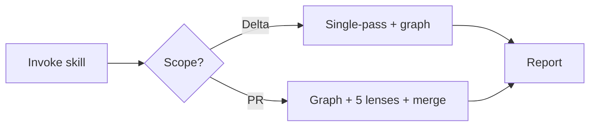

# Code Review

> **Canonical:** [`references/tool-chain.md`](references/tool-chain.md) (graph → gbrain → Read)
> **Persona:** [`agents/code-reviewer.md`](agents/code-reviewer.md)
> **Motivation:** Reading files inline costs 8–49× more tokens than blast-radius mapping. This skill enforces graph-first review for every host.

---

## Purpose

Token-efficient, high-signal code review: map impact with **code-review-graph**, resolve symbols with **gbrain**, read only confirmed files, then judge with a **confidence-gated** reviewer persona (≥ 80 only).

---

## Persona (summary)

Senior code reviewer — see full contract in [`agents/code-reviewer.md`](agents/code-reviewer.md):

- Plan / guideline alignment, real bugs, architecture fit, proportional test/doc notes
- **Confidence ≥ 80** only; Critical (90–100), Important (80–89)
- Strengths briefly, then issues; **Ready to merge?** Yes | No | With fixes
- Minimize false positives; no out-of-scope refactors

---

## Non-negotiable chain

```
1. code-review-graph  →  blast-radius / detect_changes_tool / review context
2. gbrain             →  code-def, code-refs, search (LESSONS / decisions)
3. Read               →  only graph-confirmed files
```

Never skip step 1 on multi-file tasks. Never whole-repo `Read` before graph.

---

## Mode router

| Choose | When |
|--------|------|
| **Delta** | Uncommitted changes, small diff, pre-commit, "review my changes", &lt; ~10 files and no PR context |
| **PR** | `gh pr`, branch vs main, explicit PR review, large diff, or user asks for thorough / multi-lens review |



- **Delta:** one reviewer pass after Phases A–C ([`output-format.md`](references/output-format.md)).
- **PR:** Phases A–C, then fan-out per [`review-lenses-pr.md`](references/review-lenses-pr.md) + [`orchestration-dispatch.md`](references/orchestration-dispatch.md).

---

## Phase A — Graph (code-review-graph MCP)

**Server:** `OpenClaw/.mcp.json` — `uvx code-review-graph serve` (Python 3.13+).

Full tool matrix: [`references/mcp-tools-crg.md`](references/mcp-tools-crg.md).

| Tool | When |
|------|------|
| `list_graph_stats_tool` | Stale / empty graph check |
| `detect_changes_tool` | Start of any diff review |
| `semantic_search_nodes_tool` | Unknown symbol or entry point |
| `query_graph_tool` | callers, callees, imports, tests |
| `get_impact_radius_tool` | Refactor / merge risk |
| `get_affected_flows_tool` | Broken execution paths |
| `get_review_context_tool` | Snippets before full Read |
| `get_architecture_overview_tool` | Unfamiliar area |
| `refactor_tool` | Rename / dead-code planning only |

**MCP names:** `code-review-graph` serve (v2.3.3+) registers tools with a `*_tool` suffix. Prose elsewhere may shorten (e.g. `list_graph_stats_tool` → same handler as `list_graph_stats_tool`).

**Embeddings:** CRG + gbrain share **bge-m3** (1024-dim). Toggle: `scripts/crg-embed-mode` · [`references/crg-embed-mode.md`](references/crg-embed-mode.md).

Slash commands (Claude Code): `/code-review-graph:review-delta`, `review-pr`, `build-graph`. **Cursor:** use MCP tools directly.

---

## Graph Initialization & Repair (fresh clone / 0-node / disk error)

`setup-embeddings` wires the env config but **cannot** call MCP tools — the graph must be seeded interactively inside Claude Code.

### Check first

```
list_graph_stats_tool(repo_root=<path>)
```

| Result | Action |
|--------|--------|
| `nodes > 0`, `embeddings_count > 0` | Graph is healthy — skip to Phase A |
| `nodes > 0`, `embeddings_count = 0` | Embeddings missing → run Step 2 only |
| `nodes = 0` | Never built or wiped → run Steps 1 + 2 |
| `disk I/O error` | Corrupted `graph.db` → delete it, then run Steps 1 + 2 |

### Step 1 — Build graph (all 3 repos independently)

```
build_or_update_graph_tool(
  repo_root = "<repo_path>",   # orama-system / AlphaClaw / Perpetua-Tools
  full_rebuild = True,
  postprocess = "full"
)
```

Expected output per repo (ballpark):
- **orama-system**: ~160 files, ~1 461 nodes, ~10 151 edges, 12 communities
- **AlphaClaw**: ~464 files, ~3 730 nodes, ~43 638 edges, 14 communities
- **Perpetua-Tools**: ~103 files, ~1 151 nodes, ~8 099 edges, 12 communities

### Step 2 — Embed with bge-m3 (must match gbrain's model)

```
embed_graph_tool(
  repo_root = "<repo_path>",
  provider = "openai",   # OpenAI-compat shim → Ollama
  model = "bge-m3"
)
```

**Prerequisite:** Ollama running at `localhost:11434` with `bge-m3` pulled.
If Ollama is down, omit the call — CRG falls back to FTS-only keyword search.

### Fix: corrupted graph.db

```bash
rm "<repo_path>/.code-review-graph/graph.db"
# then run Steps 1 + 2 above
```

### Fix: gbrain sync blocked

```bash
# Acknowledge YAML / embedding failures and continue
gbrain sync --source <source-id> --skip-failed
```

Check `~/.gbrain/sync-failures.jsonl` to see which files failed and why.
Old failures with `"acknowledged": true` are harmless.

### Red flag: 0 nodes after install

`setup-embeddings` ran but no one called `build_or_update_graph_tool`. Add a
reminder to your first-session checklist: **after** `setup-embeddings`, call the
build + embed tools once per repo before starting any review work.

### Fix: MCP disconnected, or refreshing from the CLI (two live gotchas)

The graph tools above run *inside* Claude Code via MCP. When the `code-review-graph`
MCP shows **disconnected**, drive the `uvx` CLI directly — but mind two traps that
bit us live (2026-06-13):

1. **Cold-start timeout = the usual disconnect cause.** The first
   `uvx code-review-graph serve` of a session downloads tree-sitter-language-pack
   (~74 packages, ~31 MiB) and can blow past the MCP handshake window, so the harness
   marks it disconnected. Pre-warm the cache once, then reconnect:
   ```bash
   uvx code-review-graph --help    # one-time download; warms the uvx cache
   # then in Claude Code:  /mcp  → reconnect code-review-graph  (warm = connects fast)
   ```

2. **CLI `embed` defaults to `local` (NOT the unified provider).**
   `uvx code-review-graph embed` defaults to `--provider local` (sentence-transformers,
   not installed → hard error). You MUST pass the provider for the bge-m3 vector space.
   Full CLI refresh after a big change (mirrors the MCP build+embed path):
   ```bash
   export CRG_OPENAI_API_KEY=ollama CRG_OPENAI_BASE_URL=http://localhost:11434/v1 \
          CRG_OPENAI_MODEL=bge-m3 CRG_OPENAI_DIMENSION=1024 CRG_ACCEPT_CLOUD_EGRESS=1
   uvx code-review-graph update                                  # incremental re-parse
   uvx code-review-graph embed --provider openai --model bge-m3  # NEVER omit --provider
   uvx code-review-graph postprocess                             # flows / communities / FTS
   uvx code-review-graph status                                  # confirm nodes + embeddings
   ```
   `embed_graph_tool(provider="openai")` already does this over MCP — the `--provider`
   flag is only needed on the CLI path, where `local` is the unfortunate default.

3. **Semantic search is MCP-only — fall back to gbrain.** `semantic_search_nodes_tool`,
   `query_graph_tool`, `get_impact_radius_tool`, `get_review_context_tool` exist **only**
   over MCP — there is **no `uvx` CLI equivalent** (the CLI does build/update/embed/status,
   not search). So any skill that calls them **fails outright when the MCP is disconnected**.
   When you can't reconnect immediately, use **gbrain** for the semantic lane — it shares the
   **same bge-m3 vector space**, so results are directly comparable:
   - "where is X handled / find by meaning" → `gbrain search "<terms>"` · `gbrain query "<q>"`
   - "where is symbol Y" · "what calls Y" → `gbrain code-def Y` · `gbrain code-callers Y`
   Reconnect CRG (`/mcp`) when you specifically need graph-native blast-radius
   (`get_impact_radius`, flows, communities) that gbrain doesn't model. Never block a review
   on a dead MCP — degrade to gbrain + FTS and say so in the report.

---

## Phase B — Gbrain

After blast-radius identifies symbols:

```bash
gbrain code-def <symbol>
gbrain code-refs <symbol>
gbrain code-callers <symbol>
gbrain code-callees <symbol>
gbrain search "<intent>"
gbrain search "<terms>" --source gstack-brain-<user>   # cross-session memory
```

Worktree pinned via `.gbrain-source` — no `--source` when cwd is in repo.

**Architecture?** → `docs/2026-05-14--UNIFIED-ABSORPTION-PLAN.md` (link section; do not restate).
**HITL?** → `docs/HUMAN-IN-LOOP-ACCOUNTABILITY.md`

---

## Phase C — Context before Read

1. Call `get_review_context_tool` for changed + impacted files from Phase A.
2. Build **assigned file list** (delta: diff + impact; PR: diff ∪ blast radius).
3. `Read` only those files — do not re-read if already in context.

---

## Phase D — Review

### Delta (single-pass)

1. Load persona: [`agents/code-reviewer.md`](agents/code-reviewer.md)
2. Apply coding profile rules: [`profiles/CLAUDE.coding.md`](profiles/CLAUDE.coding.md)
3. Default scope: `git diff` or `detect_changes_tool` output
4. Score issues; drop &lt; 80

### PR (multi-lens)

1. Complete Phases A–C; build assigned file list + CLAUDE.md paths (root + per touched dir).
2. Probe orchestration ([`orchestration-dispatch.md`](references/orchestration-dispatch.md)):
   - OmniRoute → ai-cli-mcp → Cursor `Task` → sequential
3. Run five lenses ([`review-lenses-pr.md`](references/review-lenses-pr.md))
4. Merge, dedupe, confidence filter (≥ 80)

**Workers:** use [`agents/code-reviewer.md`](agents/code-reviewer.md) + lens prompt. **No commits** from workers.

**Codex boundary:** workers must **not** execute `SKILL.md` under `skills/gstack` or gstack global skills as procedures.

---

## Phase E — Report

Template and rubric: [`references/output-format.md`](references/output-format.md).

Minimum fields: scope, strengths (short), Critical / Important lists with `file:line`, verdict.

---

## Red flags (skill violation)

- `Read` / `Grep` on many files before `detect_changes_tool` or blast-radius
- Skipping `get_review_context_tool` then reading full files
- `gbrain search` skipped in favor of reading `LESSONS.md` inline
- Architecture from memory without doc link
- "Let me scan the whole repo" without graph
- Nitpicks reported as Critical
- PR fan-out for a two-file local delta
- Workers committing or following gstack SKILL.md

---

## Profiles (drop-ins)

| Profile | Use |
|---------|-----|
| [`profiles/CLAUDE.coding.md`](profiles/CLAUDE.coding.md) | Review, debug, refactor tone |
| [`profiles/CLAUDE.agents.md`](profiles/CLAUDE.agents.md) | Multi-agent pipelines |
| [`profiles/J-drona23-v5/`](profiles/J-drona23-v5/) | Default agentic coding (builder + workflow rules) |

---

## References

| Doc | Content |
|-----|---------|
| [`references/mcp-tools-crg.md`](references/mcp-tools-crg.md) | Full CRG MCP matrix + sequences |
| [`references/output-format.md`](references/output-format.md) | Confidence rubric + report template |
| [`references/review-lenses-pr.md`](references/review-lenses-pr.md) | Five PR lenses + prompts |
| [`references/orchestration-dispatch.md`](references/orchestration-dispatch.md) | OmniRoute / ai-cli / Task probe |
| [`references/agent-matrix.md`](references/agent-matrix.md) | Per-host invocation |
| [`references/crg-embed-mode.md`](references/crg-embed-mode.md) | Embedding toggle |
| [`references/pressure-test-notes.md`](references/pressure-test-notes.md) | Expected graph-first behavior |
| [`agents/code-reviewer.md`](agents/code-reviewer.md) | Subagent / worker persona |

---

## Related skills

- Mother: [`bin/orama-system/SKILL.md`](../../SKILL.md) (OmniRoute probe, search policy)
- E2E bootstrap: [`docs/how-to/first-run-and-code-review.md`](../../../docs/how-to/first-run-and-code-review.md) — fresh machine → first-run → MCP → graph → this skill
- First-run: [`skills/first-run-setup/SKILL.md`](../first-run-setup/SKILL.md) · [`references/first-run-install.md`](../../references/first-run-install.md)
- MCP stack: [`bin/orama-system/mcp-install/SKILL.md`](../../mcp-install/SKILL.md)
- Orchestration: [`~/.claude/skills/mcp-orchestration/SKILL.md`](~/.claude/skills/mcp-orchestration/SKILL.md)

---
> Source: [diazMelgarejo/orama-system](https://github.com/diazMelgarejo/orama-system) — distributed by [TomeVault](https://tomevault.io).
<!-- tomevault:4.0:skill_md:2026-06-16 -->
