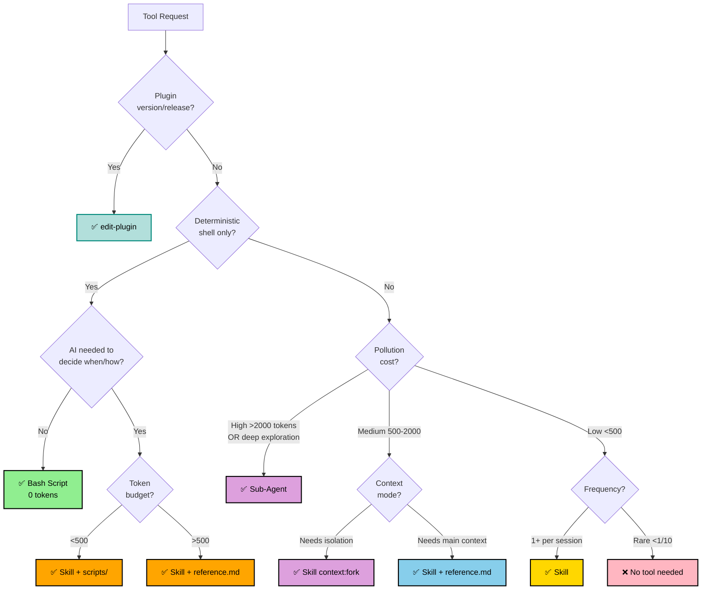

# Edit Tool — Unified Skill/Agent/Script Editor

## Triage

**CRITICAL**: Always triage first, then act.

1. **Analyze request** against decision tree
2. **Explain decision** to user: `✅ [TYPE] because: pollution cost (~X tokens × Yfreq), context mode (main|fork), key factor`
3. **Branch to guide** or provide direct guidance

**Default**: All skills are dual-invocable (both `/name` and model auto-invoke). `disable-model-invocation: true` is opt-out for rare edge cases.

## Modifying Existing Tools

1. Locate and read existing file (SKILL.md or agent .md)
2. **Enumerate functional outputs** — every behavior/capability = **preservation contract**
3. Make **surgical edits** using Edit tool (not Write/overwrite)
4. **Regression check**: verify each output from step 2 is retained
5. Update description if changing triggers
6. Validate: YAML valid, triggers clear, instructions actionable

## Creating New Tools

💡 **Before creating:** consider running `/search-skill` to discover existing solutions.

1. Ask for details if missing: purpose, triggers, tools needed
2. Determine type via triage decision tree above
3. Use `pick-model` skill for model selection
4. Branch to appropriate guide:

| Type | Guide | Location |
|------|-------|----------|
| **Skill** | `references/skill-guide.md` | `skills/name/SKILL.md` |
| **Agent** | `references/agent-guide.md` | `.claude/agents/name.md` or plugin `agents/` |
| **Plugin** | `edit-plugin` skill | `plugin.json` + `marketplace.json` |
| **Bash** | Direct guidance (scripts/, chmod +x) | Project scripts dir |

**Skill frontmatter** (quick ref — see `references/skill-guide.md` for full spec):
- `name` — lowercase-hyphens
- `description` — triggers + use cases (max 1024 chars)
- `context` — `main` (default) | `fork`
- `model` — `opus` | `sonnet` | `haiku`
- `allowed-tools`, `argument-hint`, `hooks` — optional

**Agent frontmatter** (quick ref — see `references/agent-guide.md` for full spec):
- `name`, `description` — required
- `tools` / `disallowedTools` — allowlist or denylist
- `model` — `opus` | `sonnet` | `haiku` | `inherit` (default)
- `permissionMode`, `maxTurns`, `skills`, `mcpServers`, `memory`, `hooks`, `background`, `isolation` — optional

## MANDATORY Validation (CREATE only)

**STOP** — answer YES/NO before proceeding:

| Question | Skill | Agent |
|----------|-------|-------|
| Q1: Pollution cost acceptable? (<500 tokens × freq for skill) | Required | N/A (isolated) |
| Q2: SKILL.md <500 tokens (with reference.md for overflow)? | Required | N/A |
| Q3: Specific capability, not a workflow bundle? | Required | Required |
| Q3a: Requires multi-step AI reasoning with isolation? | N/A | Required (any YES → agent) |

**Skill: ANY NO → STOP.** Recommend alternative (fork, agent, direct request).
**Agent: ALL NO on Q3a → STOP.** Recommend skill or bash script instead.

## Key Principles

- **Preserve function**: MODIFY must not remove capabilities unless explicitly requested
- **<500 tokens** ideal for SKILL.md; use progressive disclosure for overflow
- **Single responsibility**: One focused purpose per tool
- **Token-efficient**: Tables, bullets, Mermaid over prose
- **Context-aware**: Main for quick tasks, fork for research, agent for deep exploration

## Parallelization

| Operation | Guidance |
|-----------|----------|
| ✅ Read-only | Parallelize freely |
| ⚠️ Writes (independent files) | Sequential OR Plan Mode first |
| ❌ Destructive / >3 files | Plan Mode MANDATORY |

See `references/frameworks.md` for edge cases, conversion guide, and extended examples.

---
> Converted and distributed by [TomeVault](https://tomevault.io/claim/digital-stoic-org) — claim your Tome and manage your conversions.
<!-- tomevault:4.0:skill_md:2026-04-13 -->
