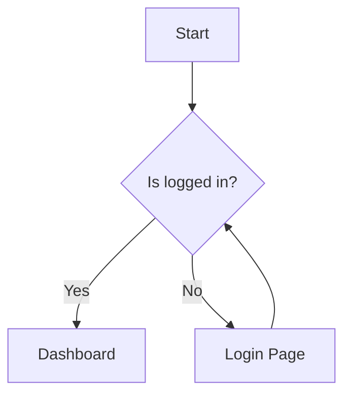
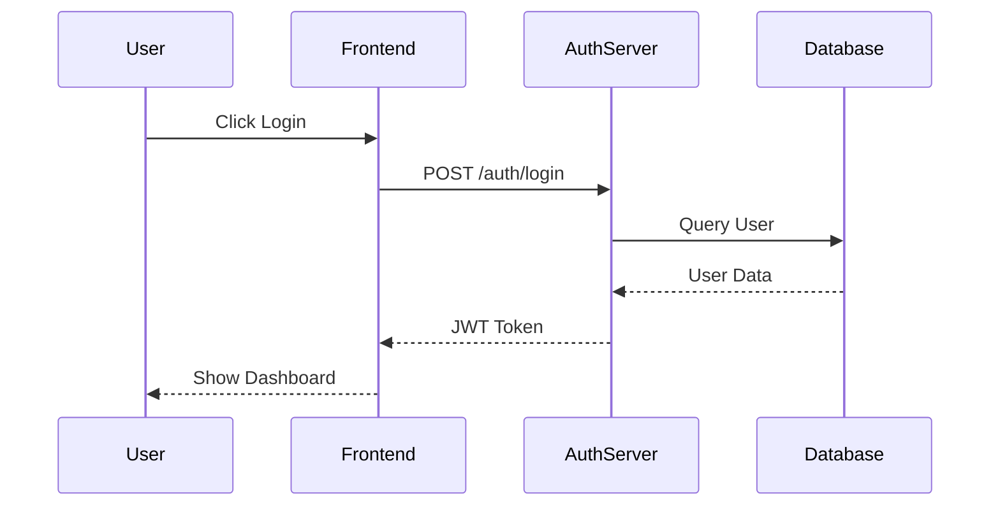
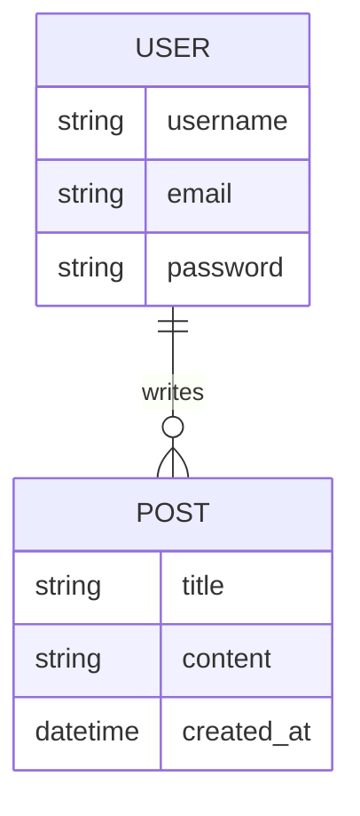
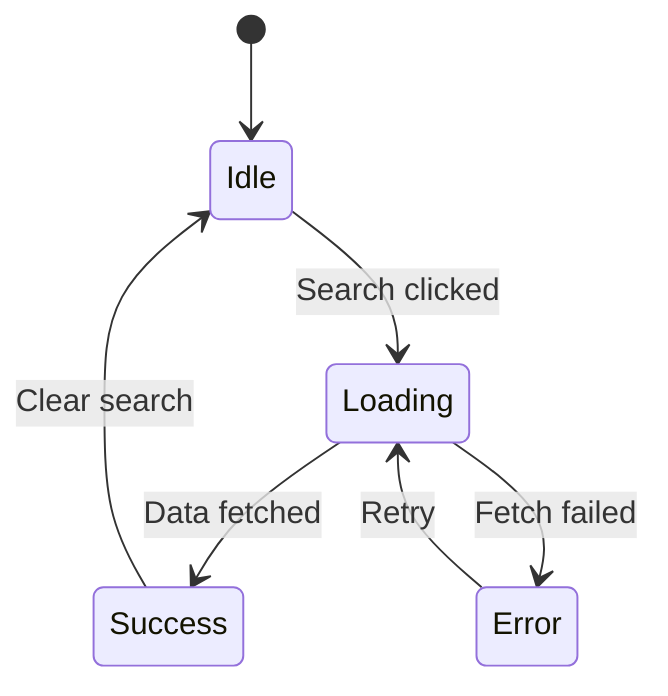

# Skill: Diagramming with Mermaid.js

## Purpose
To create complex diagrams (flowcharts, sequence diagrams, gantt charts, etc.) directly within Markdown files using a simple, text-based syntax. This ensures documentation and diagrams stay in sync with the code and are easily versionable via Git.

## When to Use
- When documenting system architecture, data flows, or complex logic
- When explaining authentication sequences (OAuth2, JWT)
- When defining project timelines or state machines
- To avoid using external binary image files for diagrams that change frequently

## Procedure

### 1. Basic Flowchart Syntax
Flowcharts represent processes or workflows.

### 2. Sequence Diagrams
Perfect for showing interactions between different services or components over time.

### 3. Entity Relationship (ER) Diagrams
Useful for documenting database schemas.

### 4. State Diagrams
Best for documenting complex UI states or business logic transitions.

## Best Practices
- **Keep it Simple**: Don't try to fit too much information into a single diagram. Break complex systems into multiple smaller diagrams.
- **Direction Matters**: Use `TD` (Top-Down) or `LR` (Left-to-Right) consistently based on what makes the flow easier to read.
- **Use meaningful labels**: Instead of `A --> B`, use `Start --> Process`.
- **Git Versioning**: Since Mermaid is text, you can see exact changes in diagrams during code reviews (diffs). Always prefer Mermaid over embedded screenshots of diagrams.

---
> Source: [Ditto190/crispy-nextjs-turborepo-monorepo](https://github.com/Ditto190/crispy-nextjs-turborepo-monorepo) — distributed by [TomeVault](https://tomevault.io).
<!-- tomevault:4.0:skill_md:2026-05-22 -->
