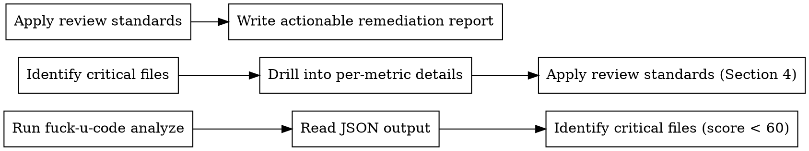

# fuck-u-code Code Quality Analysis & Review

## Prerequisites

Install fuck-u-code globally before using this skill:

```bash
npm install -g eff-u-code
```

Verify installation:

```bash
fuck-u-code --version
```

Requires Node.js >= 18.0.0.

## Overview

Run `fuck-u-code analyze` to obtain quantitative code quality metrics across 7 dimensions (11 metrics), then interpret results and provide actionable refactoring recommendations based on the standards defined in this skill.

The tool produces a 0-100 overall score and per-file scores. Higher = better quality. The skill teaches you how to interpret every metric, judge severity, and prescribe specific fixes.

## Workflow



### Step 1: Run Analysis

```bash
# Basic analysis
fuck-u-code analyze . -f json -o /tmp/fuc-report.json

# Verbose with top 20 worst files
fuck-u-code analyze . -v -t 20 -f json -o /tmp/fuc-report.json

# Exclude generated/test files
fuck-u-code analyze . -e "**/*.test.ts" -e "**/generated/**" -f json -o /tmp/fuc-report.json
```

Read the JSON output file to get structured data.

### Step 2: Identify Problem Areas

From the JSON report, extract:

- **overallScore**: Project-wide score (0-100). Weighted average by code line count.
- **aggregatedMetrics**: Per-metric averages, medians, min/max across all files.
- **files[]**: Per-file results, sorted by score ascending (worst first).

Focus on files with score < 60 (the "shit mountain" zone).

### Step 3: Drill into Metrics

For each problem file, examine the `metrics[]` array. Each metric has:

| Field | Meaning |
|-------|---------|
| `name` | Metric identifier (see Section 3) |
| `category` | Dimension group (complexity/size/duplication/structure/error/documentation/naming) |
| `normalizedScore` | 0-100, higher = better |
| `severity` | `info` / `warning` / `error` / `critical` |
| `details` | Human-readable summary |
| `locations[]` | Specific line/function-level issue locations |

Prioritize metrics with `severity` >= `error`.

### Step 4: Write Remediation Report

Follow the output format in Section 5.

## Scoring System

The overall score is a weighted average across 7 categories. The default weights are calibrated to industry research (SonarQube, NASA, Microsoft studies on defect correlation):

| Category | Weight | Rationale |
|----------|--------|-----------|
| Complexity | 32% | Strongest correlation with defects (0.7-0.8 Pearson) |
| Duplication | 20% | Direct maintenance cost multiplier |
| Size | 18% | Code volume and function granularity |
| Structure | 12% | File organization and coupling |
| Error Handling | 8% | Robustness and reliability |
| Documentation | 5% | Long-term maintainability |
| Naming | 5% | Readability and convention compliance |

## Metrics Reference (11 Metrics)

Each metric uses a 4-tier threshold system: **excellent / good / acceptable / poor**. Thresholds are language-specific. See `references/thresholds.md` for the full per-language table.

### 3.1 Complexity Metrics (weight: 32% total, split 3 ways)

#### cyclomatic_complexity (CC)

**Formula:** CC = 1 + decision points (if/for/while/case/catch/&&/||/ternary)

Measures the number of independent execution paths through code. High CC means more test cases needed and higher defect probability.

**Generic thresholds** (most languages):
| Level | CC Range | Score |
|-------|----------|-------|
| Excellent | ≤ 5 | 100 |
| Good | 6-10 | 80-100 |
| Acceptable | 11-15 | 50-80 |
| Poor | > 15 | 0-50 |

**Common patterns & fixes:**
- Long if-else chains → Replace with strategy pattern, lookup table, or polymorphism
- Nested conditionals → Extract guard clauses, flatten with early returns
- God functions (CC > 20) → Decompose into single-responsibility functions

#### cognitive_complexity

**Formula:** CC + nestingDepth × 2 (approximation)

Measures how difficult code is to *understand*. Unlike cyclomatic, it penalizes nesting exponentially.

**Generic thresholds:**
| Level | Range | Score |
|-------|-------|-------|
| Excellent | ≤ 7 | 100 |
| Good | 8-15 | 80-100 |
| Acceptable | 16-25 | 45-80 |
| Poor | > 25 | 0-45 |

**Common patterns & fixes:**
- Deep nesting (depth > 4) → Invert conditions, extract methods, use Optional/Result types
- Break in linear flow (continue/break/goto) → Restructure loops, use filter/map operations
- Recursive calls without memoization → Add caching or convert to iterative approach

#### nesting_depth

Maximum control-flow nesting level within a function.

**Generic thresholds:**
| Level | Depth | Score |
|-------|-------|-------|
| Excellent | ≤ 3 | 100 |
| Good | 4 | 80-100 |
| Acceptable | 5 | 45-80 |
| Poor | > 5 | 0-45 |

**Common patterns & fixes:**
- Callback hell / pyramid of doom → Use async/await or Promise chains
- Nested if-for-if → Extract inner logic to named helper functions
- Deep switch-in-loop → Use lookup tables or dispatch maps

### 3.2 Duplication Metrics (weight: 20%)

#### code_duplication

Detects duplicate code by analyzing control flow signatures (sequence of if/for/while/return/assignment patterns).

| Level | Duplication % | Score |
|-------|--------------|-------|
| Excellent | ≤ 5% | 100 |
| Good | 5-10% | 80-100 |
| Acceptable | 10-20% | 45-80 |
| Poor | > 20% | 0-45 |

**Common patterns & fixes:**
- Copy-pasted functions with minor variations → Extract parameterized utility
- Similar CRUD operations → Create generic repository/service layer
- Repeated validation logic → Centralize into validator module
- Boilerplate in multiple files → Use code generation or decorators

### 3.3 Size Metrics (weight: 18% total, split 3 ways)

#### function_length

Lines of code per function. Both average and max are considered (50/50 weight).

**Generic thresholds:**
| Level | Lines | Score |
|-------|-------|-------|
| Excellent | ≤ 50 | 100 |
| Good | 51-100 | 85-100 |
| Acceptable | 101-200 | 50-85 |
| Poor | > 200 | 0-50 |

**Common patterns & fixes:**
- Functions > 100 lines → Identify distinct responsibilities, extract each into its own function
- Functions > 300 lines → Likely a "god method" — decompose into a coordinator + workers
- Long setup + action + teardown → Extract each phase

#### file_length

Code lines (excluding blanks and comments) per file.

**Generic thresholds:**
| Level | Code Lines | Score |
|-------|-----------|-------|
| Excellent | ≤ 300 | 100 |
| Good | 301-500 | 85-100 |
| Acceptable | 501-1000 | 50-85 |
| Poor | > 1000 | 0-50 |

**Common patterns & fixes:**
- Files > 500 lines → Likely multiple responsibilities; split into focused modules
- Files > 1000 lines → Urgent; split by feature/domain boundary
- Mixed concerns (API + business logic + data) → Apply layered architecture

#### parameter_count

Maximum parameter count per function.

**Generic thresholds:**
| Level | Params | Score |
|-------|--------|-------|
| Excellent | ≤ 3 | 100 |
| Good | 4-5 | 85-100 |
| Acceptable | 6-7 | 50-85 |
| Poor | > 7 | 0-50 |

**Common patterns & fixes:**
- 4+ related parameters → Group into a typed options/config object
- 6+ parameters → Use builder pattern or parameter object destructuring
- Boolean flag parameters → Split into separate named functions or use enum

### 3.4 Structure Metrics (weight: 12%)

#### structure_analysis

Composite score: nesting quality (60%) + file organization (25%) + import coupling (15%).

Detects: deep nesting (>5 critical, >3 warning), oversized files (>1000 lines), too many functions per file (>50), excessive imports (>20), circular dependencies.

**Common patterns & fixes:**
- Too many functions in one file → Group into submodules by responsibility
- Circular dependencies → Introduce interface/abstraction layer to break the cycle
- > 20 imports → Module is doing too much; split responsibilities
- God file with 50+ functions → Decompose into domain-specific modules

### 3.5 Error Handling Metrics (weight: 8%)

#### error_handling

Percentage of error-prone API calls (I/O, network, parse, database) without proper error handling.

| Level | Unhandled % | Score |
|-------|------------|-------|
| Excellent | ≤ 5% | 100 |
| Good | 5-15% | 80-100 |
| Acceptable | 15-30% | 45-80 |
| Poor | > 30% | 0-45 |

Detects: bare calls without assignment/return, ignored errors (`_ = ...`), calls outside try-catch.

**Common patterns & fixes:**
- Bare API call without catch → Wrap in try-catch or .catch() handler
- Ignored return values → Handle error explicitly or document intentional ignore
- Missing error boundary in async code → Add try-catch around await calls
- Error swallowed in catch block → Log or propagate; never silently ignore

### 3.6 Documentation Metrics (weight: 5%)

#### comment_ratio

Ratio of comment lines to code lines. Optimal range is 10-25%.

| Level | Ratio % | Score |
|-------|---------|-------|
| Optimal | 10-25% | 100 |
| Acceptable | 5-10% or 25-40% | 60-100 |
| Poor | < 5% or > 40% | 0-60 |

**Common patterns & fixes:**
- < 5% → Add JSDoc/docstrings to public APIs and complex logic
- > 40% → Likely over-commenting trivial code; remove comments that restate the code
- Commented-out code → Delete it; use version control instead
- Missing module-level docs → Add file header describing module purpose

### 3.7 Naming Metrics (weight: 5%)

#### naming_convention

Compliance rate with language-specific naming conventions.

| Level | Compliance | Score |
|-------|-----------|-------|
| Excellent | ≥ 90% | 90-100 |
| Good | 70-90% | 70-90 |
| Acceptable | 50-70% | 50-70 |
| Poor | < 50% | 0-50 |

**Language-specific rules:**
| Language | Functions | Classes |
|----------|-----------|---------|
| Go | PascalCase/camelCase | PascalCase |
| JS/TS | camelCase/PascalCase | PascalCase |
| Python | snake_case | PascalCase |
| Java | camelCase | PascalCase |
| Rust | snake_case | PascalCase |
| C# | PascalCase | PascalCase |
| Ruby | snake_case | PascalCase |
| PHP | camelCase/snake_case | PascalCase |
| Swift | camelCase | PascalCase |
| Shell | snake_case | — |
| C/C++ | snake_case/camelCase | PascalCase |
| Lua | camelCase/snake_case | — |

**Common patterns & fixes:**
- Inconsistent naming style within file → Apply project-wide linter/formatter
- Abbreviations / single-letter names → Rename to descriptive identifiers
- Mixed conventions → Pick one convention per identifier type, apply consistently

## Review Standards & Remediation

When writing remediation recommendations, follow these principles extracted from the project's AI review system:

### Priority Order

Performance bottlenecks > Security vulnerabilities > Maintainability risks > Code style

### Quality Rules for Recommendations

1. **Be specific and executable.** Not "optimize code structure" but "Extract lines 45-67 into `calculateMetrics(data)` returning `MetricResult[]`."
2. **Anchor to evidence.** Every recommendation must reference a specific metric value and location from the analysis output.
3. **Be concise.** Each recommendation ≤ 30 words. No pleasantries or filler.
4. **Respect language idioms.** Refactoring suggestions must use the actual syntax and idioms of the target language.

### How to Triage

From the JSON output, for each problem file:

1. Sort metrics by severity (critical > error > warning)
2. Within same severity, sort by weight (complexity 32% > duplication 20% > size 18% > ...)
3. For each flagged metric, check `locations[]` for exact function names and line numbers
4. Write fix targeting the highest-severity, highest-weight issue first

### Remediation Templates

For each metric category, prescriptions follow this pattern:

**Complexity issues:**
> Function `processOrder` (L 45-189) has cyclomatic complexity 24. **Fix:** Extract validation logic (L 48-82) into `validateOrderInput(input): ValidationResult`, extract calculation (L 90-150) into `calculateOrderTotal(items, discounts): number`.

**Duplication issues:**
> 3 functions (`getUser`, `getOrder`, `getProduct`) share identical fetch-and-parse patterns. **Fix:** Create `fetchResource<T>(endpoint: string): Promise<T>` and call it from each.

**Size issues:**
> `handleSubmit` (L 120-380) is 260 lines with 8 parameters. **Fix:** Extract into `SubmitCoordinator` class with `validate()`, `transform()`, `submit()` methods. Pass `SubmitConfig` object instead of 8 params.

**Structure issues:**
> `utils.ts` has 52 functions and 24 imports. **Fix:** Split into `utils/string.ts`, `utils/date.ts`, `utils/validation.ts` by domain.

**Error handling issues:**
> `readFile` call at L 67 has no try-catch. **Fix:** Wrap in try-catch, return `Result<Content, ReadError>`.

**Documentation issues:**
> Comment ratio 2.1% — `parseAST()` (L 30-95) has no docstring despite handling 4 edge cases. **Fix:** Add JSDoc documenting input format, edge cases, and return type.

**Naming issues:**
> Function `fn` (L 23) and `calc2` (L 45) violate camelCase convention. **Fix:** Rename to `calculateDiscount` and `computeTaxRate`.

## Output Format

Use exactly this Markdown structure for the review report. Each section is required.

```markdown
# Code Quality Review

## Summary
One sentence identifying the root cause of the most critical issue. Explain why it matters, do not repeat metric numbers.

## Overall Assessment
| Metric | Score |
|--------|-------|
| Overall | XX/100 |
| Files Analyzed | N |
| Critical Issues | N |

## Key Issues (sorted by severity)
For each issue:
- **`FunctionName` (L start-end)**: Root cause description + concrete fix suggestion

## Refactoring Plan
Numbered list of actionable steps. Each step ≤ 30 words, directly executable.

1. [Specific action with file, function, and line reference]
2. [Next specific action]

## Security Concerns
List any security concerns with affected code location + fix, or state "No security issues found."
```

## Quick Reference

| Command | Purpose |
|---------|---------|
| `fuck-u-code analyze .` | Analyze current directory |
| `fuck-u-code analyze . -f json -o report.json` | JSON output to file |
| `fuck-u-code analyze . -v -t 20` | Verbose, top 20 worst files |
| `fuck-u-code analyze . -e "**/*.test.ts"` | Exclude patterns |
| `fuck-u-code analyze . -l zh` | Chinese output |

| Score Range | Level | Action |
|-------------|-------|--------|
| 90-100 | Clean | Ship it |
| 75-89 | Mild | Minor fixes recommended |
| 60-74 | Moderate | Refactoring needed before merge |
| 40-59 | Bad | Significant cleanup required |
| 0-39 | Disaster | Rewrite recommended |

| Severity | Meaning |
|----------|---------|
| info | No issues detected |
| warning | Minor issues, should address |
| error | Significant issues, needs attention |
| critical | Must fix before shipping |

## Common Mistakes

- **Only looking at overall score.** A project-level 80 can hide individual files scoring 20. Always check per-file breakdown.
- **Ignoring weight differences.** A naming issue (5% weight) is far less impactful than a complexity issue (32% weight). Prioritize by weight × severity.
- **Vague recommendations.** "Refactor this function" is not actionable. Specify what to extract, from which lines, into what name.
- **Skipping locations[].** The `locations` array contains exact line numbers and function names. Always use them in recommendations.
- **Forgetting language-specific thresholds.** Python allows deeper nesting than Go. Ruby functions should be shorter than Java methods. Check `references/thresholds.md` before judging.

---
> Source: [Done-0/fuck-u-code](https://github.com/Done-0/fuck-u-code) — distributed by [TomeVault](https://tomevault.io).
<!-- tomevault:4.0:skill_md:2026-06-25 -->
